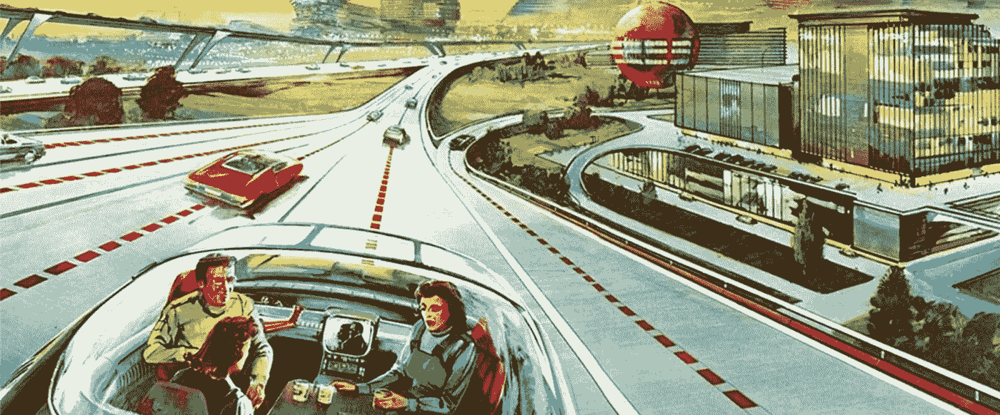

# 自驾:谁决定谁死？

> 原文：<https://medium.com/hackernoon/self-driving-who-decides-who-will-die-cffbed89c357>

这是 2025 年。一个女人在出门前吃了最后一口吐司和一大口橙汁。她滑入她的自动驾驶汽车，并告诉它前往办公室。这位女商人坐了下来，当汽车驶入街道时，她瞥了一眼平板电脑上的早间新闻。绿灯——汽车穿过十字路口。就在这时，一个球弹到了马路上，一个小孩冲进车流中去捡球——可惜太迟了。汽车的车载电脑很快计算出即将发生碰撞。有两种结果。汽车可以试着减速，但会撞到并撞死孩子。或者汽车可以突然转向以避开孩子，但会撞上中间带并撞死乘客。车该怎么办？救买车的女人还是无辜的孩子？

你会怎么做？

 [## 道德机器

### 公众参与和讨论人类对机器做出的道德决策的观点的平台

moralmachine.mit.edu](http://moralmachine.mit.edu/) 

欢迎来到无人驾驶汽车伦理。

但是汽车不会真的做出选择；它会按照算法的指示去做。真正的*选择将在算法设计的几年前做出。真正的选择是现在。我们是决定谁拥有决定谁生谁死的权力的人。*

如果你需要证明这是现在的一个选择，福特最近报道说，到 2021 年，它将拥有完全自动驾驶的汽车[。自去年](http://media.ford.com/content/fordmedia/fna/us/en/news/2016/08/16/ford-targets-fully-autonomous-vehicle-for-ride-sharing-in-2021.html)*以来，特斯拉一直在销售拥有完全自主所需硬件的汽车。*

*但是，对于大多数消费者来说，完全自动驾驶汽车还需要几年时间，今天的新闻故事集中在无人驾驶未来将创造的积极方面:[更少的事故](http://thehill.com/policy/transportation/316300-study-says-driverless-cars-could-save-us-300b-a-year)，[重塑我们的城市](http://www.curbed.com/2016/2/25/11114222/how-driverless-cars-can-reshape-our-cities)，以及[节省保险成本](http://www.insidecounsel.com/2017/01/23/us-insurance-market-braces-for-a-seismic-shift-due)。*

*虽然这些只是[自动驾驶](https://hackernoon.com/tagged/self-driving) [技术](https://hackernoon.com/tagged/technology)将带来巨大影响的几个例子，但新闻报道往往会忽略潜在的负面外部性。消费者、媒体和企业都难辞其咎——美好未来的图像比处理必要的实际问题更畅销。生活也是如此。唯一的问题是这些实用性中的一个——一个伦理算法——很可能会杀了你。*

*开发自动驾驶的公司是在没有消费者投入的情况下决定“实用性”的人。让我们强调一下:*

> *私有公司目前正在决定自动驾驶汽车将允许谁生存和选择杀戮。*

*事实上，这已经在更普遍的人工智能领域发生了。超过 2000 名人工智能研究领域的杰出学术和商业领袖签署了 [Asilomar 人工智能原则](http://futureoflife.org/ai-principles/)。甚至还有一个关于道德和价值观的部分。但是谁来决定遵循什么样的伦理体系呢？这实际上影响了我们的生活能力。根据福特的计算，我们只有不到 5 年的时间了。现在是决定谁将创造无人驾驶汽车伦理的时候了。是有利润动机的商业，有政治动机的政府，还是我们的实际生活受到威胁的更大的社会？最终，政府和企业将实施这一计划，但我们可以强迫进行透明和诚实的对话，让人们听到我们的声音。*

*这是公共道德的一个拐点。*

*从宏观的角度来看，这是我们选择我们想要的社会道德准则的机会，写下来让所有人看到。迄今为止，个人、企业和政府都受到道德观念的指导，但它们并不透明。当我插队的时候，你不知道我用什么道德准则来证明这一点。但是当一辆车选择杀死它的乘客时，我们都会知道它使用了什么道德准则。一旦编写完成，软件将决定汽车在不可避免的致命事故中如何反应。这些代码行将遵循道德原则。不管是通过有意的对话还是保持沉默，我们都会同意这一原则。*

*这一代人处在一个独特的时代，可以在全社会范围内讨论我们希望生活在什么样的伦理原则之下。这些将首次被硬编码到我们的产品和服务中。这些将影响汽车如何决定拯救哪些生命，但更重要的是，它们将指导和决定社会如何发展其他技术的道德指南针。伦理辩论需要大胆突破学术界的藩篱，进入口语世界。*

*现在，我们可以选择参与这一变革时刻，或者让其他人——政府和企业——为我们做这件事。我们会选择什么？*

*点击这里关注马修·比金斯或者 T2 的 LinkedIn 了解更多*

********

> *[黑客中午](http://bit.ly/Hackernoon)是黑客如何开始他们的下午。我们是 [@AMI](http://bit.ly/atAMIatAMI) 家庭的一员。我们现在[接受投稿](http://bit.ly/hackernoonsubmission)并乐意[讨论广告&赞助](mailto:partners@amipublications.com)机会。*
> 
> *如果你喜欢这个故事，我们推荐你阅读我们的[最新科技故事](http://bit.ly/hackernoonlatestt)和[趋势科技故事](https://hackernoon.com/trending)。直到下一次，不要把世界的现实想当然！*

**