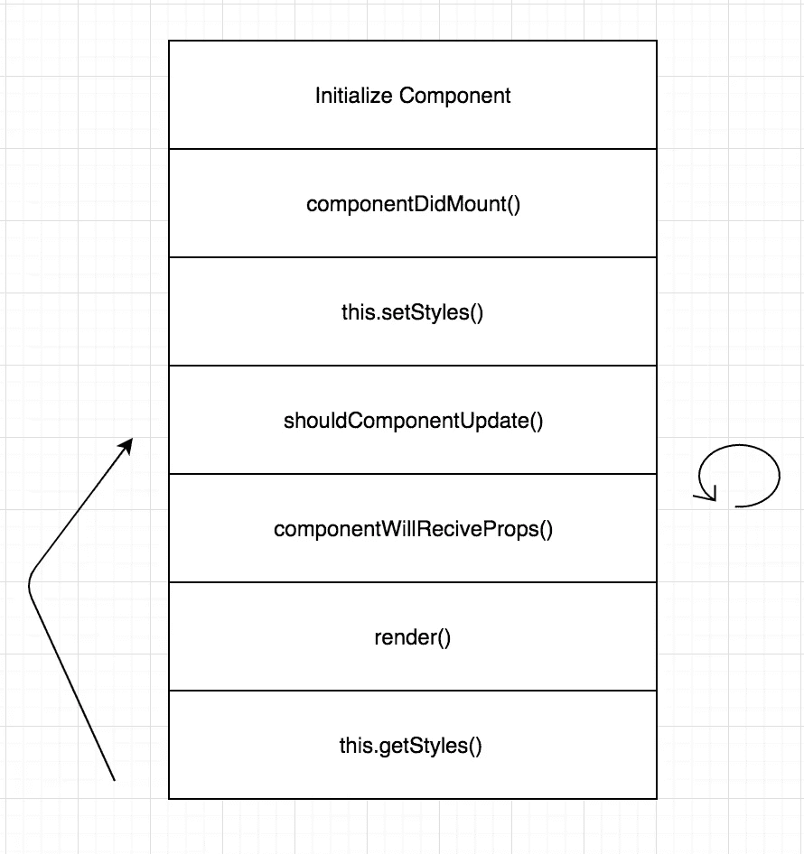

# 自定位反应元件

> 原文：<https://medium.com/hackernoon/self-positioning-react-components-7e5d99e9349f>

非常感谢[文档](https://medium.com/u/10e7d71b6655#shouldcomponentupdate)中的任何状态发生变化，则返回 true。因为我们也从容器组件中获取数据作为道具，所以我们也需要检查道具更新。**注意:**像`nextStep`和`currentStep`一样，整个教程都有全球调度和数据。这不是每个用例的要求，只是我们正在解决的一个用例。

下一个`componentWillRecieveProps`在一个安装的组件接收新的道具([文档](https://facebook.github.io/react/docs/react-component.html#componentwillreceiveprops))之前被触发。使用`replaceState`而不是`setState`清除状态并将组件设置为不显示。这也是一个非常具体和深思熟虑的用例，闪烁问题。

# 有一个闪烁问题

可怕的闪烁！这是如此微妙，但它使我们的团队抽搐。在初始加载时有一个闪光，当转换教程提示时，它会在应该出现的地方前一个渲染步骤出现。

**闪光灯闪烁:**这就是`-9999`位置的由来。如果没有给我们的组件定位，只需确保它完全离开页面。

**挂起闪烁:**每次我们得到新的道具时，组件会将我们的显示设置为 false，并在转换过程中将组件从 DOM 中完全移除。如果你查看`componentWillRecieveProps`、`setStyles`和`getStyles`，你会看到如何移除和添加组件的参考，其中`display`设置为假或真。

# 渲染

这个函数将获取我们动态生成的样式，在样式`props`中调用。**注意:** `_.getClassNameFromObject`是我们自己的自定义函数，它将创建一个我们可以添加到组件类样式的字符串。我们不打算深究这个函数，因为它超出了本文的范围。但是，如果你感兴趣，请在帖子底部留下评论，我会尽力回答你的问题。

这是我们的组件生命周期、getters、setters 和 render 方法的图表。

# 整个组件

# 等等，还有更多！

我们还提出了一个有趣的解决方案，以避免在整个应用程序中添加组件。如果您需要像教程一样向应用程序添加一系列组件，这将非常有用。

在`setStyles`中，我们查询特定步骤的 DOM，而不是多次包含组件。容器组件呈现组件一次，然后在每次步骤改变时，我们寻找不同的步骤类来呈现教程组件。

# 这是所有的乡亲

希望这能帮助那些在 React 应用程序中需要这种动态定位功能的人。