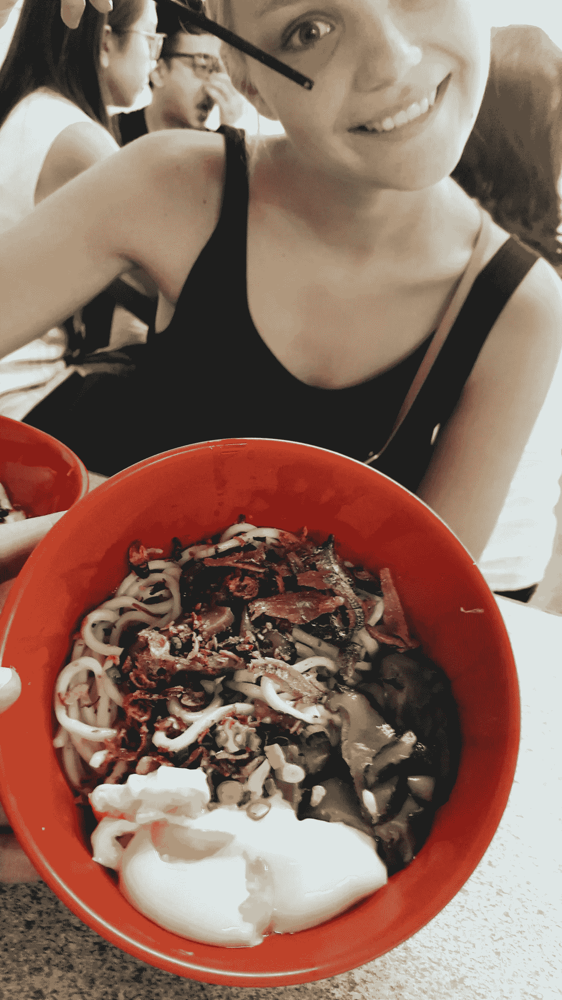

# 卖你的辣椒面——生意做对了

> 原文：<https://medium.com/hackernoon/sell-your-chilli-noodles-business-done-the-right-way-7fdb33c5c147>

## 健健餐厅给我们的商业成功经验。

大约两周前，我有幸去了吉隆坡的健健餐厅，品尝了他们菜单上唯一的一道菜。香辣锅我。你在上面看到的盘子。

作为一个求知欲很强的学习者，我从来没有关掉过我的商业头脑，我总是在分析可能的方法，把别人做得好的东西融入到我自己的实践中。

走在吉隆坡的一条主要街道后面，你会觉得自己“走错了地方”，这是情有可原的。事实上，你将会发现一块宝石。

周围都是当地人，没有白人(除了我们)，相对较小的约 50 个座位挤满了人。这不是在午餐或任何特殊时刻。卡住了。

从他们的定价，到他们的精神，到客户服务，有很多东西我们可以从健健学习。

## 1 —做一件事，并把它做好

我写了很多关于激光聚焦的东西。做一些事情，变得不可思议，并且不改变你的关注点。如在 [**8760 小时–54**](/the-growth-school/8760-hours-54-47ad1f59e390#.wh1ap4xza)**。人们说做 500 个小时的两件事，总共 1000 个小时，把它们结合起来，然后成为世界上最好的。**

**这是一个不断演变的陈词滥调。我们经常听到这种说法。但它仍然没有被注意到，人们仍然试图成为 10 种不同类型的人(想想 youtuber 艺术家/文案/商人/营销人员)。也许这真的是你。**

**在健健他们供应一道菜。他们做得非常好。它的每一个部分都做得非常完美。简单的想法和概念:**

*   **面条**
*   **辣椒**
*   **蘑菇**
*   **凤尾鱼**
*   **蛋**

**在各个领域都出类拔萃。寻找最好的供应商，他们是每种原料的专家。自己采购。完美地准备每一个。把这么简单的一道菜做成很棒的东西。**

**整个业务变得基于产品、基于价值和卓越。**

## **2-定价和价值**

**我经常在网上看到“三倍于你的价格，就这么做”的概念。主要是课程创建者试图告诉你，你应该以每月 3000 美元的价格出售你已掌握基本知识的服务。他们会加入一些热门的想法，比如基于价值的定价。**

**这不是做这件事的正确方法。虽然这可能对某些人有用，但从长远来看，竞争对手能够每周、每月销售，提供恒定的价值。没有人觉得被宰了，没有人不知所措，所有人都赢了。**

**在健健，他们的盘子卖 1.8 美元。他们只卖这个。这大约是当地所有其他地方价格的两倍，但大约是标准连锁餐馆价格的一半。**

**这是最佳时机。传统观念似乎倾向于向人们推销 2000 美元的课程。因为你只需要吸引 5 个人，你就已经赚了$10k！！!'现在花 2000 美元买我的课程，我会告诉你怎么做！！！。**

**嗯，是的。**

**数量，中等价位，以价值为后盾。扩大用户群，扩大产品规模，大家都赢，你赚钱。太棒了。**

## **3-“比较”**

**我喜欢谈论和写关于比赛的东西。更详细的内容，你可以在这里看到[‘爱成长&顾客快乐？向暴徒学习。](/the-growth-school/love-growth-customer-happiness-learn-from-the-mob-bf42bc3416d#.404ysbfdz)**

**对于懒人来说，补偿就是顾客的快乐。它走了额外的一小步，为你的顾客提供一些对你来说成本很低的东西。**

**在这种情况下，健健免费插件。比如他们的特色汤，免费水，很棒的客户服务。**

**这些产品对他们来说都相对便宜，但通常其他竞争对手会尝试追加销售。这很烦人，但它确实发生了。**

**这是小事。**

**我希望那是令人愉快的。如果是，给它一个❤，这样其他人就可以找到它。**

**当你在这里的时候: [***我正在 8760 创建一个个人成长社区。来加入，网络和拍摄狗屎。***](https://www.facebook.com/groups/8760club/)**

************

> **[黑客中午](http://bit.ly/Hackernoon)是黑客如何开始他们的下午。我们是 [@AMI](http://bit.ly/atAMIatAMI) 家庭的一员。我们现在[接受投稿](http://bit.ly/hackernoonsubmission)并乐意[讨论广告&赞助](mailto:partners@amipublications.com)机会。**
> 
> **如果你喜欢这个故事，我们推荐你阅读我们的[最新科技故事](http://bit.ly/hackernoonlatestt)和[趋势科技故事](https://hackernoon.com/trending)。直到下一次，不要把世界的现实想当然！**

****