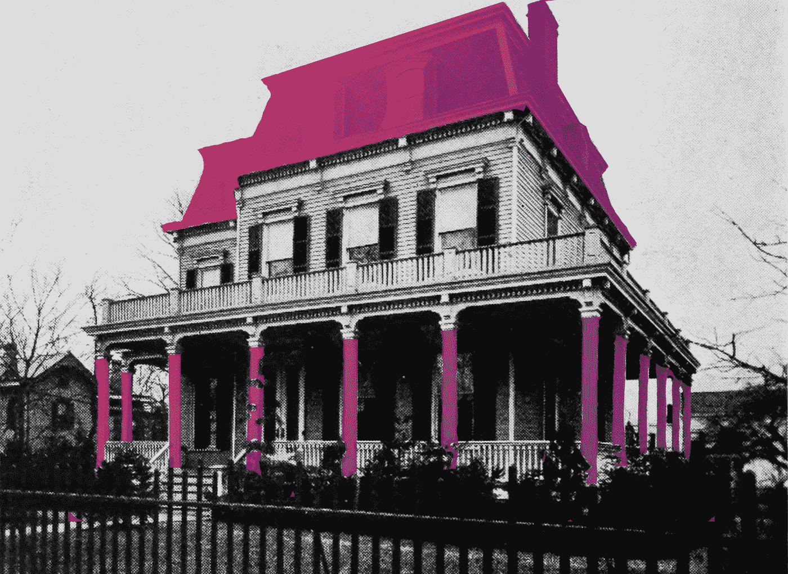
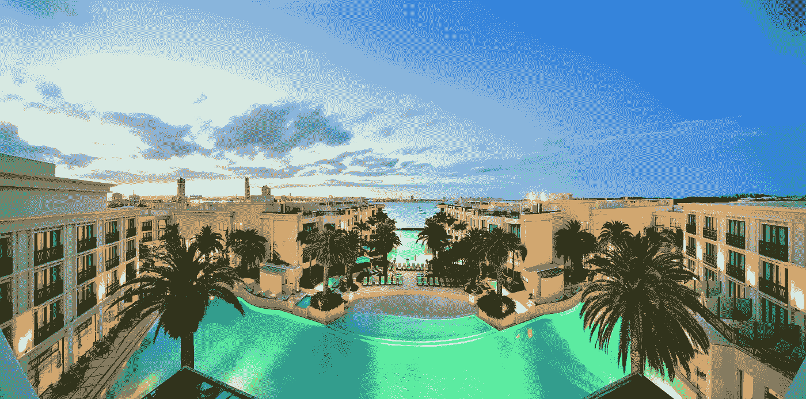
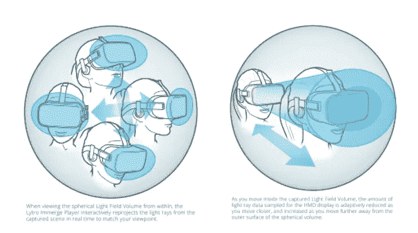
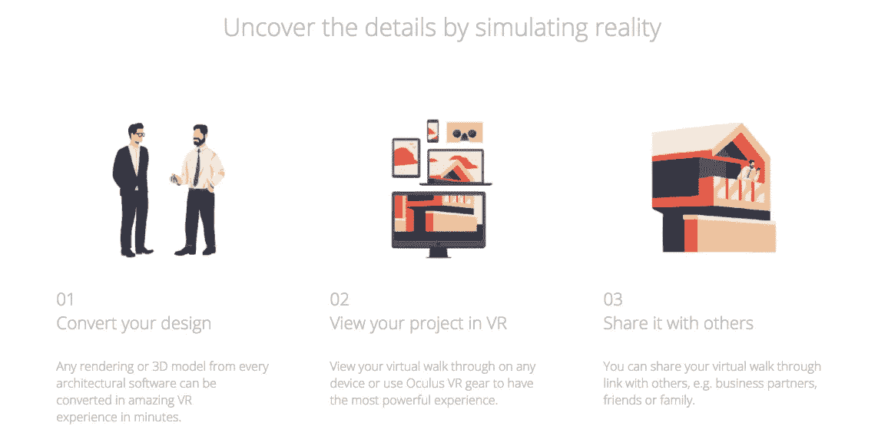
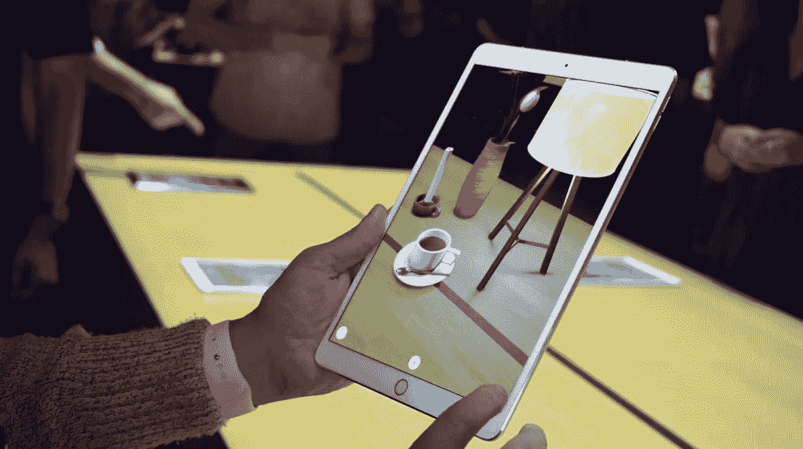
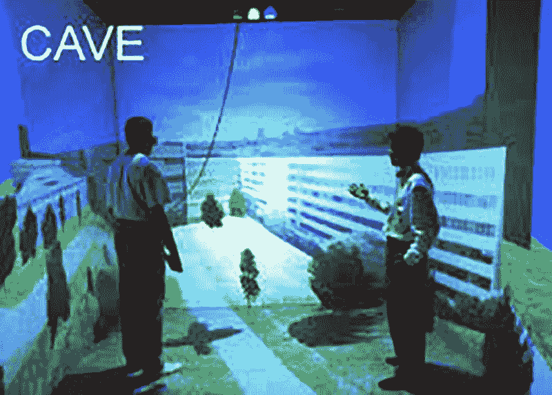

# 实际上是在销售世界

> 原文：<https://medium.com/hackernoon/selling-the-world-virtually-911228913ede>

空间计算开始慢慢走向成熟。随着技术发展到更复杂同时也更稳定的程度，新的可能性领域开始出现并成长。从一开始，狂热的爱好者就看到了在空间计算的帮助下改革房地产行业的希望，但直到现在，真正的解决方案才开始变得可行。

增强现实放映室。虚拟现实漫游。混合现实改造。这些只是房产买卖行为将开始一场巨大转变的一些潜在方式。**我们收集了五个不同的利用空间计算改造房地产的项目**——此外，我们还分析了我们认为它们会有多成功。

## #1.360°漫游

360°漫游的想法并不新鲜，但直到最近，技术还将这些“预览”局限于平面体验。你可以在电脑上看到一个家，在一个空间里跑来跑去，使用和谷歌地图让我们探索世界一样的拖放技术。由于头戴式显示器，这些 360°漫游现在更加身临其境，因为 360°摄像机已经变得如此便宜和易于使用，每个房地产经纪人都可以也应该在他们的房源中添加 360°漫游。

由于入门成本如此之低，360°漫游仍然是一个明智的起点，但这项技术正迅速被掩盖。没有真正的沉浸感，因为你的视角被限制在相机最初放置的地方；观众没有自由四处走动，把自己放在角落里，或者从摄像机没有捕捉到的任何角度体验房间。我们怀疑这项技术能否存活五年以上，尽管目前替代选择的硬件成本将使其得以维持。

## #2.光场体积捕获

说到替代选项——我们有点痴迷于 Hammer & Tusk 的光场体积捕捉，但很难不痴迷。这些相机以 6 个自由度捕捉 360°视频，这意味着它们可以以照片级的细节再现一个位置，然后让一个人在那个空间漫步。虽然使用这种技术制作视频仍处于“需要克服许多障碍”的阵营中，但好消息是静止图像已经准备好了它们的主流亮相。

有很多公司都在研究这种硬件，但据我们所知，没有一家公司专门致力于将其应用于房地产。这是一个开放的竞技场。

## #3.[虚拟世界中的建筑](http://froont.com/aic/vividly-fix#3blockhow_it_works)

接触消费者是房地产的一个重要组成部分，但首先创造建筑又如何呢？如果你曾经见过有人煞费苦心地手绘 400 棵小假树放在一个建筑模型的外面，你就知道这个学科充满了混乱。进入像生动这样的软件，它可以让你创建实物大小的三维房地产模型。

浏览您的作品，与同事或客户分享，甚至从传统建筑软件转换现有的 3D 模型。世界是你的！

## #4.重塑未来

好吧，你买了一栋房子，但是现在你想看看用花岗岩台面代替大理石会是什么样子；或者你想推倒厨房的那面墙，创造一个通道。如果那是你想象的未来，你并不孤单！进入这个领域的人太多了，很难只说出一两个人。

[由于苹果的 ARKit，宜家](https://www.macrumors.com/2017/06/19/ikea-plans-furniture-app-arkit/)将进行改造，这将提高宜家多年来测试过的先前产品的质量和易用性。

[Cadsoft](https://www.cadsoft.com/) 是一家不那么专有的公司；无论你使用哪家建筑公司，或者你从哪里得到你的固定装置，Cadsoft 都会创建 3D 效果图，并提供给你在耳机或电脑上观看。虚拟现实观看避免了现实主义的移动优先问题，但增加了需要正确硬件的头痛，这可以通过计算机模型的备份计划来解决。

这项技术的好处是，你不必试图想象改造后的样子；不利的一面是，你仍然需要一些想象力来把这些数字作品变成他们生活的替代品。

## #5.[山洞](https://en.wikipedia.org/wiki/Cave_automatic_virtual_environment)

这项技术目前在技术上还没有用于房地产，但它在未来的用例中有巨大的潜力。CAVE 是一个开源软件系统，配有投影仪硬件，主要存在于大学研究环境中。

想象一下它有一个现代全息甲板——一个大房间，它的墙壁实际上是背投屏幕或平板显示器。墙壁上的图像由洞穴内的人的运动控制，当房间随着用户真实地移动时，允许一种真实的沉浸感。

房地产的应用令人难以置信。想象一下，去你的房地产经纪人的办公室，而不是开车绕着城市去看 30 场演出，你可以走进洞穴，从那里看到每一个家庭。你会在预先拍摄好的环境中走来走去，检查布局，甚至窥视橱柜！只要有摄像机捕捉到它，你就能看到它。

这项技术的优势在于“传送”因素，以及让多人同时体验虚拟环境的能力。缺点是你仍然被限制在四面墙和一个小空间里，所以像上下楼梯这样的事情永远不会感觉完全真实。此外，这些设置需要动作捕捉技术和头戴式显示器，因此舒适性和设置将是商业环境中的一个问题。

学术机构并不是唯一致力于此类技术的机构。我们也看到了商业应用。

*原由雷恩汉德曼为***所写。**