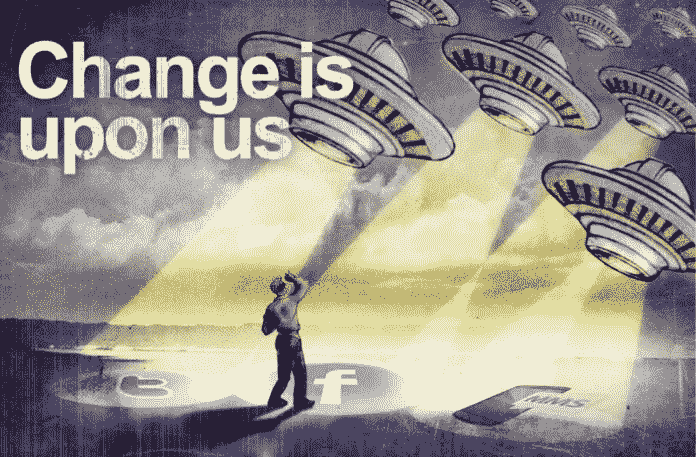

# 语义网已死，人工智能万岁！！！

> 原文：<https://medium.com/hackernoon/semantic-web-is-dead-long-live-the-ai-2a5ea0cf6423>

上周，我不得不提交一篇关于语义网现状的小论文。在那之前，我不认为我真的听到过任何人谈论它，尽管有一整堂课我都在研究它。演示结束后，我决定写一点关于它的东西。

简单介绍一下，web 可以分为三个阶段:

Web 1.0 是一切开始的地方。来自欧洲粒子物理研究所的第一个版本可能是整整一代人最伟大的发明。但是一开始你只能**看到**以文档形式呈现给你的内容(用众所周知的 HTML)。

但这还不够。

随着 AJAX 和 RSS 等技术的引入，我们实际上可以 ***与网络*** 互动。随之而来的是论坛、社交网络、维基百科等等。

Web 2.0 即将到来。

## Web 3.0

但是一些最伟大的思想家并不想就此止步。他们想要一个不仅能展示信息，还能理解信息的网站。如果你有时间，可以看看下面蒂姆·伯纳斯·李的视频(你知道，是来自欧洲粒子物理研究所深处，创造了这个网络的策划者)。

他提出的想法很棒。通过链接所有的数据，你可以把网络带到一个全新的水平。你可以很容易地看到所有信息的来源，更重要的是，计算机实际上可以理解我们所看到的。

语义网的主要思想是，用一种不仅我们可以理解，而且计算机也可以理解的方式来编写网络。

为了实现它，出现了 RDF、OWL、SPARQL 等语言，或者最近来自 facebook 的 Open Graph 协议。

当我写这些技术的时候，我很快质疑为什么我没有听到更多关于它的信息？我所看到的资源甚至看起来都没有太多更新，至少对于那些被认为是下一个网络的东西来说。3.0 版本。

然后我看了 Google IO 2017(Google 举办的年度会议，展示 Android 和其他风险投资的热点和新品)，看到了一些不同的东西。他们不是主要谈论 Android，而是几乎专门谈论人工智能。

## 我们真正要去的地方

我们没有重写网络让计算机能够理解，而是让计算机变得更聪明，慢慢地让它们获得知识。这是一个很大的不同，因为它汇集了来自世界各地的信息，并了解其含义。这就是 Web 3.0 的全部内容。大玩家已经决定联合努力，推出神经网络、Word2Vecs、贝叶斯网络和许多其他工具，以便计算机可以学习。

这使得语义网远远落在了后面。

我只是开始了解如何从简单的数据集中挖掘知识，但我可以肯定地说 [AI](https://hackernoon.com/tagged/ai) 即将到来。非常辛苦。

谷歌将自己定位为一家人工智能公司(见他们在[谷歌翻译](https://blog.google/products/translate/found-translation-more-accurate-fluent-sentences-google-translate/)上的工作)，英伟达专注于人工智能的 GPU，微软和脸书也在朝这个方向前进。

## 结论

语义网是一个伟大的想法，现在仍然如此。但我看不到它的未来。它需要进化，并将其想法与人工智能相结合。链接数据，而不需要完全重写我们已经拥有的数据。

如果你想了解更多关于人工智能的信息，你可以阅读以下内容:

*   [数学烂就学 AI](https://hackernoon.com/learning-ai-if-you-suck-at-math-8bdfb4b79037)

如果您是一名开发人员，并且想了解更多信息，我建议您学习本课程:

*   [机器学习工程师纳米学位](https://www.udacity.com/course/machine-learning-engineer-nanodegree--nd009)

## 奖金

祝你过得愉快。-)

> [黑客中午](http://bit.ly/Hackernoon)是黑客如何开始他们的下午。我们是 [@AMI](http://bit.ly/atAMIatAMI) 家庭的一员。我们现在[接受投稿](http://bit.ly/hackernoonsubmission)并乐意[讨论广告&赞助](mailto:partners@amipublications.com)机会。
> 
> 如果你喜欢这个故事，我们推荐你阅读我们的[最新科技故事](http://bit.ly/hackernoonlatestt)和[趋势科技故事](https://hackernoon.com/trending)。直到下一次，不要把世界的现实想当然！

