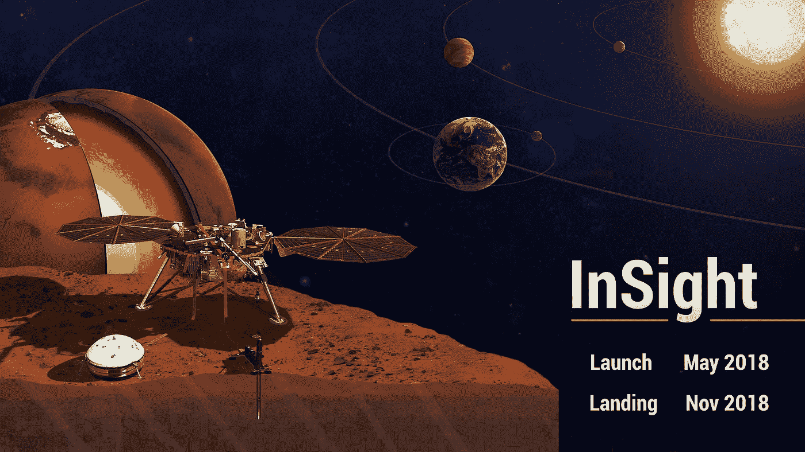
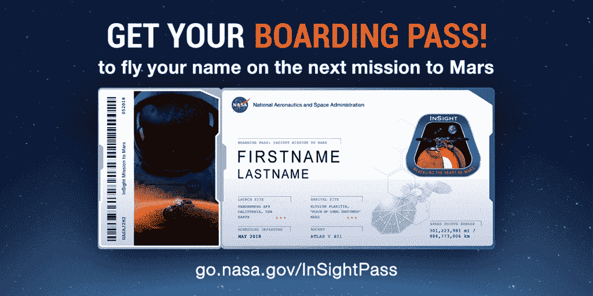
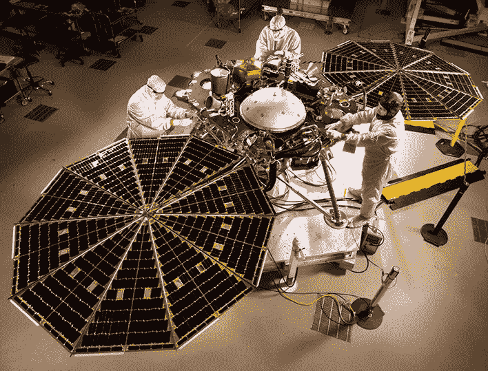

# 把你的名字送到火星去！获得美国宇航局的登机牌

> 原文：<https://medium.com/hackernoon/send-your-name-to-mars-get-a-nasa-boarding-pass-332f0b76ab4>

## 在 11 月 1 日之前，你必须让你的名字登上美国国家航空航天局的洞察号着陆器送往火星

NASA.gov

虽然我不指望能踏上火星，但我至少能让我的名字被送到那里——这要感谢美国国家航空航天局的那些好人！

通过预订登机牌，你的名字将被蚀刻在一个微芯片上，并被放置在美国宇航局的 InSight 着陆器上。

> [现在就去拿登机牌](http://go.nasa.gov/InSightPass)！2017 年 11 月 1 日之前。

就像我们的地球航空一样，你可以赚取常客积分，这些积分反映了你个人参与[美国宇航局的火星探索](https://www.nasa.gov/feature/jpl/another-chance-to-put-your-name-on-mars)。这些积分是通过多次任务和几十年积累起来的。虽然您可能无法将积分转换成火星里程，但作为火星常客，您至少可以获得一些炫耀的权利。

go.nasa.gov/InSightPass

# 任务

InSight 任务的目的是通过调查火星的内部结构和过程，探索包括地球在内的岩石行星的演化形成。很酷吧。

一旦飞船着陆，它将放下一系列传感器来测量:

*   火星地震
*   流星来袭
*   总地震能量

此外，该航天器将部署一个自锤击热探测器，它将比以往任何任务都更深入火星。

# 任务日期

*   **发布机会开启**:2018 年 5 月 5 日
*   **登陆:**2018 年 11 月 26 日
*   **地面作业** : 728 天/ 708 土壤

> 点击了解更多关于任务[的信息](https://www.nasa.gov/press-release/nasa-targets-may-2018-launch-of-mars-insight-mission)

NASA Insight | NASA.gov

# 为什么这很酷？

你可能认为把你的名字跨栏发送到数百万英里外的太空并不酷(如果你这样认为…我质疑你实际上认为什么是酷…)。

空间对我们来说是一种奇妙的感觉。这是一种神秘的东西，却激发了我们的求知欲和冒险精神。越多的人能够兴奋起来并参与到 NASA 的任务中，我们就越能激发年轻一代去拥抱他们的好奇心和对科学的热爱。