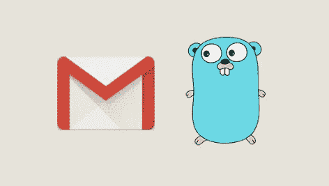
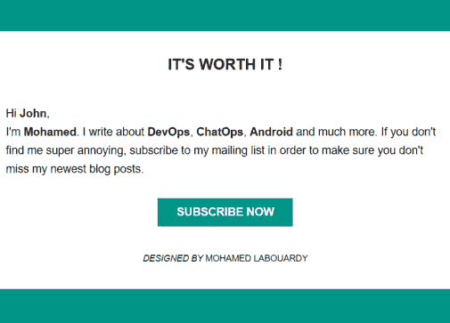
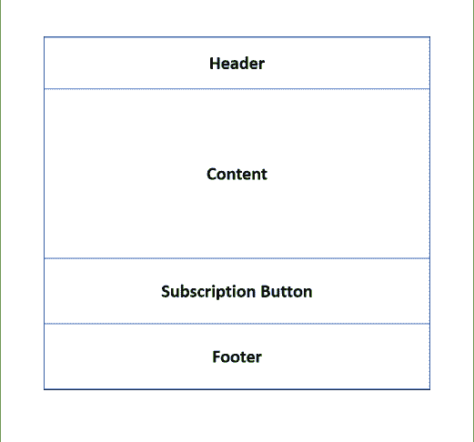
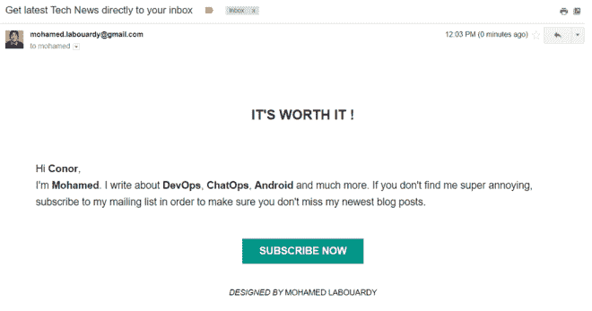
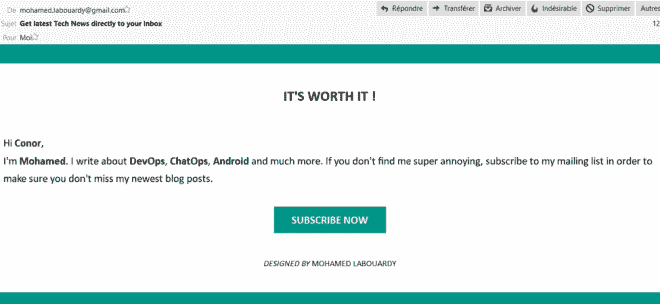
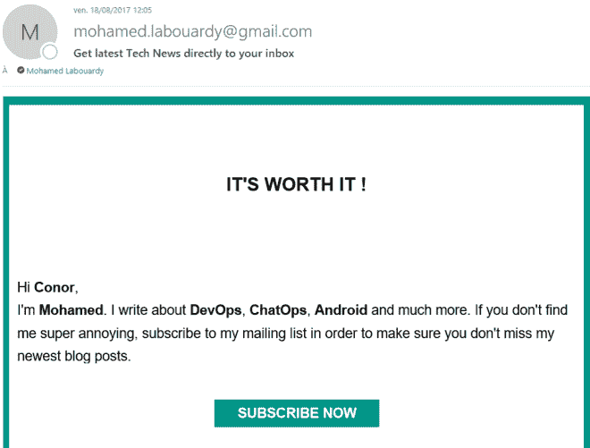
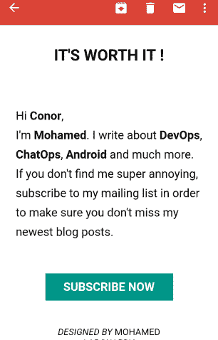

# 使用 Go 发送 HTML 电子邮件

> 原文：<https://medium.com/hackernoon/sending-html-email-using-go-c464d03a26a6>

在这个快速教程中，我将向你展示如何使用标准的 **Go** 库发送 **HTML** 电子邮件。在本教程结束时，您将能够发送一封简讯电子邮件，如下所示:

在我开始之前，这个演示中使用的所有代码都可以在我的 [**Github**](https://github.com/mlabouardy/go-html-email) 上找到。

**1 — HTML 模板**

编写电子邮件模板是让开发人员热泪盈眶的任务之一，因为电子邮件客户端之间的 HTML/CSS 呈现存在巨大差异。**电子邮件客户端**呈现 HTML 的方式与**浏览器**不同。创建 HTML 电子邮件模板时，CSS 属性如*浮动*、*背景图片*甚至*边距*都不应该是你的词汇表的一部分。那么，如何创建一个漂亮的 HTML 电子邮件模板呢？

回想一下 1999 年，这意味着*表格*、*单元格边距*、*单元格间距*、*列跨度*。所有那些你以为已经抛在脑后的糟糕的事情现在都成了你最亲密的朋友。

根据我的经验，HTML 邮件代码变得非常复杂，非常快。所以最好保持简单，从一个计划开始:

因此，我们将从 100%宽度和白色背景的包装表开始。我使用了*单元格填充*和*单元格间距* HTML 属性。把它们想象成使用*边距*和*填充* CSS 属性:

注意:表中有 4 行:

*   一个在顶部用于**集管**
*   中间一个为**主要内容**
*   一个用于**订阅按钮**
*   一个在底部用于**页脚**

现在，我们可以开始一节一节地编写新闻稿了:

**1.1 —标题**

标题非常简单，只有一列，一行中间有一段文字:

**1.2 —内容**

我们的内容部分非常简单，它只是一个段落，所以编码非常简单:

注意:{{。在发送电子邮件之前，**模板引擎**解析 HTML 模板时，username }}部分将被替换为收件人姓名。

**1.3 —订阅按钮**

现在最困难的部分来了，**按钮元素**在大多数邮件客户端都不支持，因此，我们必须使用*表格*和*表格单元格*:

注意:我们使用的是*背景颜色*而不是*背景* CSS 属性。这是因为 HTML 值在电子邮件客户端比 CSS 属性更受支持。

这只是在电子邮件中实现按钮的一种方式。诚然，它在每个客户端看起来并不总是一样的，但 web 也不总是完美的。我更喜欢这样，因为这样更简单，而且不需要使用**图像资源**或 [**VML**](https://www.emailonacid.com/blog/article/email-development/emailology_vector_markup_language_and_backgrounds)

**1.4 —页脚**

页脚只是重复我们已经在页眉部分做过的事情。

注意:不要忘记添加**元标签**:

视口:

它曾经告诉浏览器，你的电子邮件是有响应的，可以适应平板电脑和智能手机这样的小屏幕。

字符集:

为了在各种电子邮件客户端之间保持字符编码，这一点很重要。

主布局现在已经完成:

**2 —编码部分**

**2.2 —邮件程序**

它负责解析 HTML 模板并发送电子邮件

**2.3 —邮件程序配置**

负责将配置文件映射成一个 **Config** 对象

配置文件中有 **SMTP 服务器**的信息:

> server="smtp.gmail.com "
> 
> 端口=587
> 
> email= "您的电子邮件地址"
> 
> password= "电子邮件密码"

注意:上面的代码使用一个外部库来解析配置文件，所以一定要通过键入以下命令来获取它:

> 去找 github.com/BurntSushi/toml

**2.4 —主要应用**

它用邮件主题和接收者电子邮件创建一个新请求，然后调用 **Send** 方法:

**3 —测试**

有许多客户端需要测试，也有许多测试它们的方法，让我们来看看几组**电子邮件客户端**:

**3.1 —雅虎**

**3.2 — Gmail**

**3.3 — Mozilla 雷鸟**

**3.4 —微软 Outlook**

**3.5 —安卓电子邮件(5.0)**

所以你可以注意到上面我们创建的模板也是有响应的。