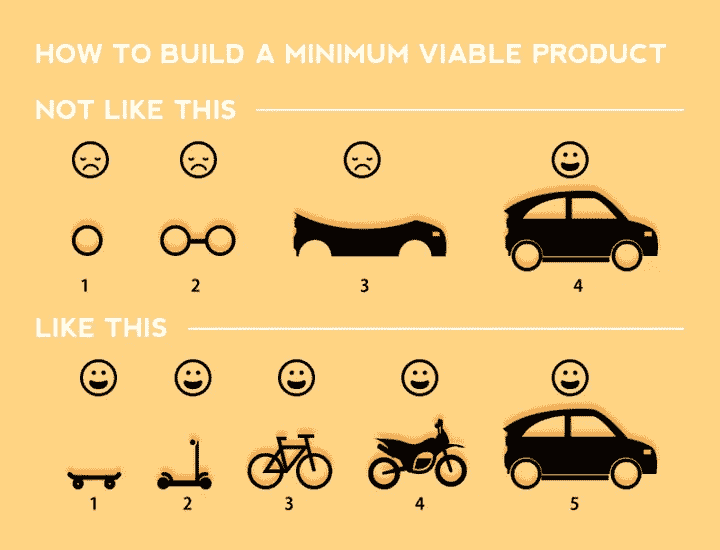
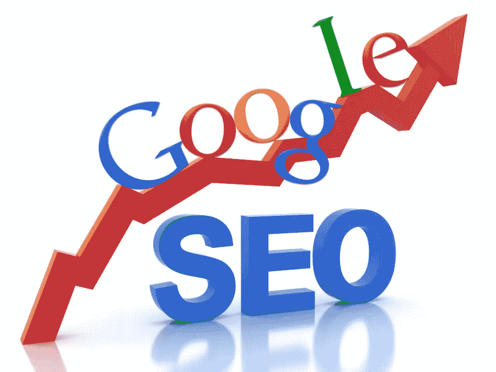

# 开发者的 SEO:到达谷歌首页而不被垃圾邮件

> 原文：<https://medium.com/hackernoon/seo-for-developers-reaching-the-front-page-of-google-without-being-spammy-78f581d538aa>

## 我如何在三个月内让我的 SaaS 应用程序出现在谷歌的首页，以及为什么它比我想象的要容易得多。

这里有一个对许多个体开发者创始人/企业家来说很熟悉的故事。

首先，你会有一个很棒的想法。

然后——如果你一直在阅读创业建议——你会在做任何事情之前尝试验证这个想法。也许你做一个登陆页面，试着收集邮件。也许你会做一些冷接触，尝试与客户交谈。无论哪种方式，最终你决定你的想法足够好去追求，你决定进入下一个阶段。

所以你建立一个 MVP(最小可行产品)。

这需要一些时间，但是很有趣，也很值得。你进入心流状态，并从中获得很多乐趣。你在巡航！

If you do build an MVP this is a great diagram to keep in mind

当你的 MVP 准备好了，是时候把它公布于众了，所以你在[产品搜索](http://producthunt.com/)和[独立黑客](https://www.indiehackers.com/)上宣布。你试试看能否在[黑客新闻](http://news.ycombinator.com/)和 [Reddit](http://reddit.com/) 上获得关注。你会得到一个巨大的流量峰值，一些积极的投入，甚至可能有一些注册或销售。你太兴奋了！

然后会发生什么？

好吧，如果你的产品是 99%的不能神奇地迅速传播的产品，那么 ***不是全部*** 。你会没有新的地方可以张贴。你的流量会慢慢减少。你将停止获得新的注册。世界将继续前进。即使人们真的喜欢你的产品，也几乎不可能获得稳定的流量和使用。

这是为什么呢？那是因为你没有*可再生的有机 reach* 。也就是说，这是一种不需要你付出任何努力就能持续接触到人们的方式。问题是产品搜索和黑客新闻上的人不会去那里使用你的产品。他们在那里闲逛，看看当天的风味是什么，然后继续他们的生活。那些真正的用户，真正的顾客，很难有机地获得。

他们在哪里发现事物？很明显，和你在同一个地方:谷歌。可能还有一些 Bing 上的怪人。但答案大多是“通过搜索”。这时，你意识到你需要解决大家都在谈论的这个 [SEO](https://www.google.com/search?q=what+is+seo) (搜索引擎优化)问题。这也是许多开发者放弃的地方，因为 SEO 看起来令人生畏并且很难。

这篇文章的其余部分旨在让你相信这不是真的。六个月前，我对 SEO 一无所知，我的小 SaaS(软件即服务)应用程序[可打印的位置卡模板](https://www.placecard.me/)现在出现在谷歌的首页，搜索各种相关关键词。我就是这样做的。

Up, up and away! ([source](http://hostmedia.com/seo/))

# 每个人都需要知道的关于搜索引擎优化的最低要求

这不是一个全面的 SEO 指南，但是你需要了解绝对的基础知识来理解我的策略。这些我几乎都是从 [Moz 的优秀 SEO 初学者指南](https://moz.com/beginners-guide-to-seo)中学到的，我推荐所有投资 SEO 的人读一读。

但这是 TL。据我所知，博士。

*你的搜索排名将是一个复杂的公式，包含以下变量:*

1.  你站点的**域权限**。谷歌认为你的网站有多“重要”,主要取决于链接到它的其他网站的数量、多样性和权威性。
2.  您内容的**页面权限**。同样的事情，但不是整个网站，一个特定的页面。
3.  你的内容的**相关性**。这由页面上的内容以及链接到该页面的链接的文本来确定。
4.  你的内容的质量。这取决于人们如何与你的网站互动。你因解决了他们的问题/回答了他们的问题而获得分数(取决于他们在访问你之后是否回到搜索结果页面)。

因此，基本上建立搜索引擎优化你需要做以下几点:

1.  **从优质产品开始。如果你的产品实际上并不比其他选择更好，那么在关注 SEO 之前，先把它做得更好。在谷歌上搜索引擎优化一颗钻石上面的屎是非常困难的。**
2.  **让你的内容相关**。通过添加大量与你想要排名的术语相关的文本/内容。谷歌将查看页面标题，描述和标题最多，所以一定要把重点放在这些。不要做得太过分，因为你可能会因为所谓的“[关键词填充](https://support.google.com/webmasters/answer/66358?hl=en)”而受到处罚。
3.  从不同的地方获得大量相关的反向链接。你需要其他网站链接到你的网站，并使用你想要排名的文本。这将对你的域名权威、页面权威以及这些关键词的相关性产生重大影响。

如果你是一个开发者，我假设你能搞清楚 1 和 2。这是反向链接，通常会绊倒人。你如何让其他域名链接到你的网站？这难道不会涉及到一些讨厌的事情吗，比如发邮件给其他博主/网站所有者，让他们通过邪恶的链接交易/交换协议链接到你的网站上？

令人惊讶的答案是*不一定。*

然而，让我们先弄清楚一件事。

# 你将不得不写

**这个策略很大程度上依赖于写作**。如果你不喜欢写作，你可以雇人为你写作，但最重要的是，你需要创作你拥有的内容*。不知道如何生成没有内容的链接。这或许可以做到，但可能会让你陷入更麻烦的网络/链接交换领域。*

但是，如果你像我一样，你不是特别想建立关系网或链接交易(也不介意写作)，那么继续读下去。

# 你的搜索引擎优化策略

好了，这是我们的 SEO 策略。

1.  写一些有用或有趣的东西
2.  偷偷放一个链接到你的网站，里面有一些你想要排名的文本
3.  在内容平台上发布。

## 写一些有趣的东西

在之前，我已经[写了一些关于这个的东西，但是这是你自己的地方。但是，你的秘密武器是**你不用写任何和你的产品**相关的东西。只写一些你热爱的、你认为其他人会从中获得价值的东西。对于开发者创始人来说，编码/技术是一个很好的选择。我大多选择写](https://writingcooperative.com/the-secret-formula-for-getting-traction-from-your-writing-fd2faab96eba)[我在创业中的自我教育](http://www.coryzue.com/writing/)(包括这篇文章)。

*一个小的旁注/警告——写一些与你的产品相关的东西* ***是*** *非常有价值的(特别是作为一种形式的* [*内容营销*](https://en.wikipedia.org/wiki/Content_marketing) *)并且确实可以帮助 SEO——但是它不是* ***必需的*** *，特别是对于获取反向链接。*

## 偷偷进入链接

你有没有注意到，在这篇文章的第一部分，我有一个链接，链接到我的 SaaS 产品，上面写着“可打印的位置卡模板”?你可能有。但是，即使你这样做了，它是否明显降低了你对这篇文章的体验？我想不会。现在我刚刚得到了一个我正在研究的搜索词的反向链接。

偷偷放入链接比你想象的要容易得多——当所有这些都失败时，你可以在页脚加入一些“关于作者”的注释，就像我在这个完全不相关的博客上所做的一样:

When it’s hard to sneak in a link you can always include it in your bio.

## 出版

让别人发布你的内容听起来很吓人，但实际上比你想象的要简单得多。

让出版变得容易的秘密原则是我所说的内容平台的*共生*。这是一个花哨的名字，但它的意思是，你的激励措施和内容出版商的激励措施往往高度一致。你想让他们发布你的内容，他们想和他们的读者分享内容。所以每个人的动机完全一致。共生是一个伟大的世界！

In this analogy, the writers are the enterprising clownfish and the publishers are the home-providing anemones. ([source](https://asknature.org/strategy/intricate-relationship-allows-the-other-to-flourish/))

事实上，除了《纽约时报》、Techcrunch 或《连线》之外，大多数内容平台都在积极为自己的网站寻找优质内容，只要质量好、内容相关，他们很乐意从陌生人那里获取文章。你所需要做的只是做一点点研究，找到与你选择要写的内容相关的内容。

我花了大部分精力的内容平台是一个非常具体的平台:*[*媒体*](/) *出版*。尽管同样的原则适用于任何内容发布者。*

# *两个需要快速理解的概念*

*在谈论更多的媒体出版物之前，我需要快速解释两个与 SEO 相关的概念。*

## *什么是 rel=nofollow，为什么需要关心？*

*第一个是关于链接元数据，特别是一个名为 [nofollow](https://en.wikipedia.org/wiki/Nofollow) 的属性。Nofollow 是一个可以附加到任何链接标签上的属性，其作用是向搜索引擎表明该链接不应该计入 SEO。它们被一些平台(包括维基百科和 Medium)自动添加到所有链接中——通常是为了防止 SEO 垃圾邮件制造者。*

*不幸的是，如果它们被添加到你的内容中，那么你的反向链接基本上是没有价值的。哦！*

## *什么是规范链接，为什么需要关注？*

*第二个概念是[规范链接](https://en.wikipedia.org/wiki/Canonical_link_element)。这些是用来防止互联网上的重复内容(这可能会严重损害您的搜索引擎优化)。基本上这是一个页面说“我是另一个页面的副本”的方式，然后链接到副本实际上提高了原始页面的搜索引擎优化，而不是副本。*

*你的内容的规范链接应该只帮助你的搜索引擎优化。*

# *中型和 SEO*

*好了，现在我们理解了 nofollow 和 canonical 链接，我们可以谈谈 SEO 和媒体出版物了。以下是基本细节:*

1.  *如果你*从别处导入*一个故事到 Medium，这个故事的规范链接将被设置到你导入的地方。*
2.  *你在 medium.com 上的内容中的所有其他链接(直接发布在媒体或没有自定义域名的出版物上)都将被打上 nofollow 标签。*
3.  *然而，在出版物上发布的任何链接都有自己的域名(大多数都有),而**没有**被禁止。*

***所以，为了让 Medium 为你的 SEO 带来好处，你应该要么从你想 SEO 的地方输入你的故事，在有自己领域的出版物上发表，要么(理想情况下)两者兼而有之。***

# *一些实用资源*

*这里有一些其他的实用技巧和资源来帮助你。*

*这个[出版物排行榜](https://toppub.xyz/)是寻找相关媒体出版物的绝佳资源。大多数出版物在其网站上或通过谷歌有新的提交说明。*

*正如我已经提到的,[Moz SEO 初学者指南](https://moz.com/beginners-guide-to-seo)是花几个小时了解 SEO 基础知识的好方法。*

*Moz 在他们的网站上还有一些其他优秀的工具，包括一个优秀的[关键词浏览器](https://moz.com/explorer)，它会指导你搜索什么关键词，还有一个[站点浏览器](https://moz.com/researchtools/ose/)，它会帮助你查看你的站点的域名权限(并与竞争对手进行比较)。*

*谷歌也有很棒的工具，包括[搜索控制台](https://www.google.com/webmasters/)，它会告诉你人们是如何在谷歌上找到你的网站的，还有[关键词规划器](https://adwords.google.com/home/tools/keyword-planner/)，它会提供任何关键词的粗略搜索统计。*

*我听说 Bing 也有一个[关键词研究工具](https://www.bing.com/toolbox/keywords)，但是实际上*你为什么要用 Bing 呢？！？**

# *玩长线游戏*

*最后，只要记住 SEO 是一个漫长而缓慢的游戏。你*不会*看到一夜之间的结果，但是随着时间的推移，这个策略会有回报，而且当它实现的时候会非常有趣和有回报。没有什么可以替代你网站稳定的搜索流量，而且(至少对我来说)实现这一点真的没有你想象的那么难。这是我在过去 60 天遵循这个策略的点击统计。*

**

*我 60 多天前就开始了，但过了这么久才真正开始看到回报。*

*祝你好运！*

**最初发表于*[*【www.coryzue.com】*](http://www.coryzue.com/writing/seo-for-developers/)*。**