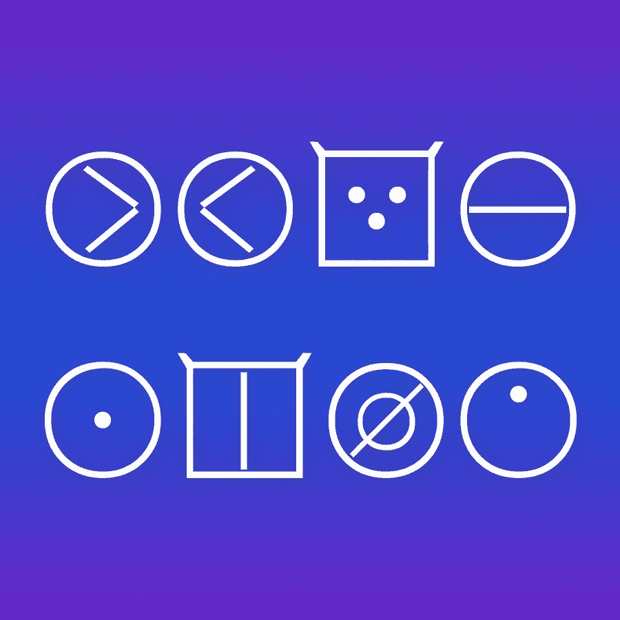
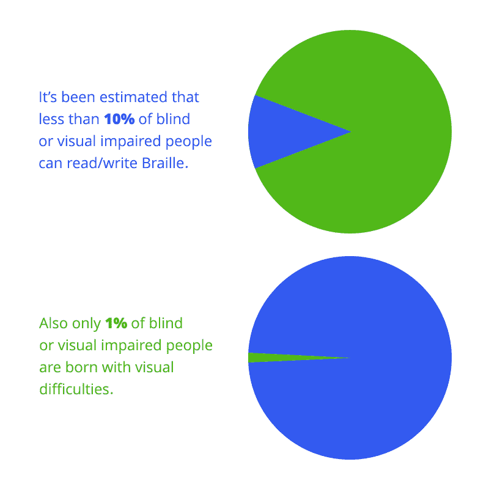
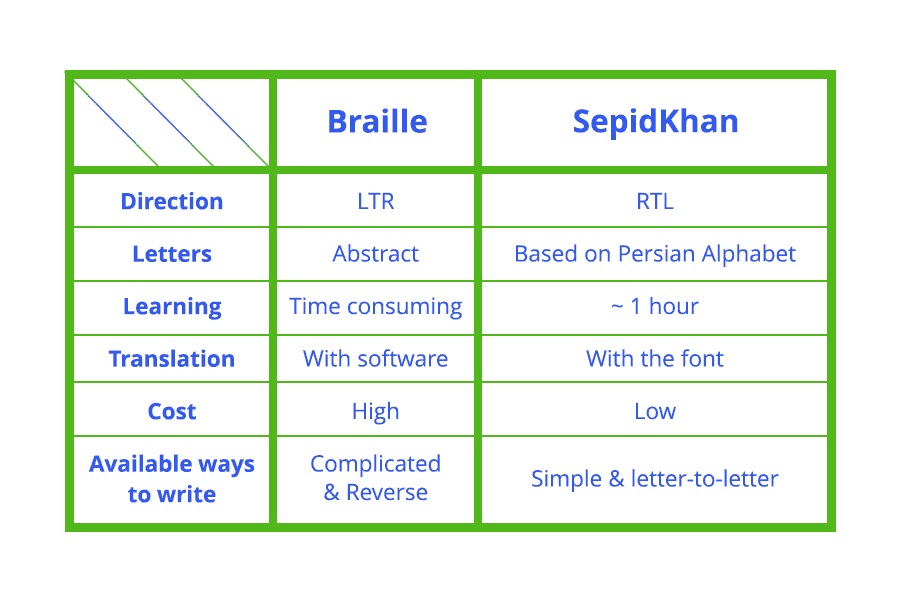
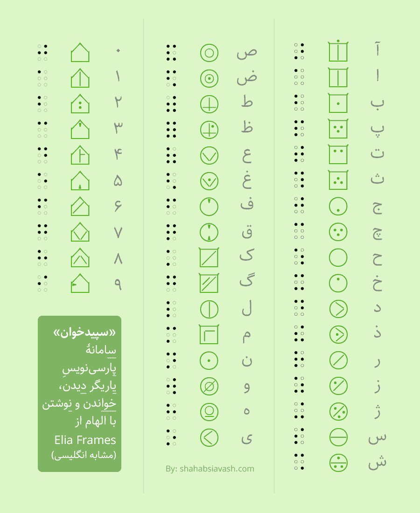

# SepidKhan:波斯/阿拉伯盲文的替代文字

> 原文：<https://medium.com/hackernoon/sepidkhan-an-alternate-for-persian-arabic-braille-868df663beda>

在看到波斯盲文的复杂性和 Elia Life Technology 为英文(拉丁文)盲文设计的伟大创意后，我决定为他们的作品做一个波斯版本。我已经联系了 Elia Life 的首席执行官，并发送了一些信息、练习曲和其他材料，所以也许我们可以将一个波斯版本的 Elia 带入生活。你看到我做了什么吗？:)

此外，我正试图在伊朗与唯一的波斯盲文报纸(伊朗 e Sepid)和一些慈善机构合作。如果你也对此发表评论，我将不胜感激。

## **但为什么是候补呢？**

你可能会惊讶地听到，我们甚至在考虑创造一种盲文的替代品。为什么要这样做？所有盲人或视力受损的人都在使用盲文，一切都很好。不对！

盲文已经有 200 年的历史了，事实上我很惊讶地发现没有人对此做些什么。我是说一些严肃的事情。

回到第一段。实际上，据估计**只有 10%** 或更少的盲人可以使用盲文！为什么？因为很辛苦。盲文是基于一些随机的点，没有任何顺序或意义。所以一个盲人应该把它们都背下来，每次都在脑子里翻译(或音译)。对波斯人来说更糟，因为它是落后的。

另一个有趣的统计数据是，在所有盲人或视障人士中，只有 1%是天生完美人。为什么这很重要？因为他们中大约 99%的人已经看过他们的母语字母表至少一次。因此，如果我们有一种类似于原始字母表的文字，他们学习起来会比盲文容易得多。

## 他们做到了！

Elia Life [Technology](https://hackernoon.com/tagged/technology) 经过多年的研究和分析做到了这一点。字母是以拉丁字母为基础的。他们使用了一种叫做**框架**的东西，让盲人更容易识别字母。

只有 3 个框架:圆形，方形和房子形状。他们已经在这里一字不差地解释过了。

所以我从这里开始。我设计过非草书的波斯字体，之前我在这里讨论过这些字体，所以我认为这是我应该做的事情，只要有百分之一的可能性，有一天它会被使用。

我在原始字母表的基础上最小化了波斯字母，用框架作为帮助。你可以在下面的图片中看到这些字母和它们的对等物:

## **圆点！**

**一半的波斯字母都有圆点**。点在波斯字母表中非常重要，因为与拉丁语不同，我们有一些完全相同的字母组，唯一将它们彼此分开的是它们的点。波斯字母可能有一个、两个或三个点。

所以我想我们可以在“框架”的帮助下，将字母之间的点最小化。

我们不仅通过使字母看起来相似来保存相似的字母组，而且使**学习体验**更容易，因为你可以学习ب，也可以阅读پ、ت和ث.

## 优势:

我把这个新剧本命名为“**塞皮得汗**”。使用 SepidKhan 的其他优势是它是 **RTL** ，这使得翻译和音译更快更容易。

下一件事是盲人和他们的朋友和家人之间的关系。人们不能阅读盲文，甚至 90%的盲人不能使用盲文，但这种新的脚本可以在不到一个小时内学会，两个人都可以阅读它。

你可以看到使用这样的文字代替盲文的其他好处:

## **字体还是翻译器？**

盲文不能作为字体使用。(我认为这是可能的，只要他们不通过添加分数和缩写使它变得更加困难……还记得那 10%吗？)因此，即使一名盲文研究者、教师、作者……想要用盲文(尤其是波斯语)写一些字母，他们也必须使用图形或盲文翻译器。

**但是 SepidKhan 是一个脚本和一个字体**。因为它不是具有不同语法或词汇的不同语言，它可以通过改变标准波斯语文本的字体来进行翻译，每个人都可以用它来写作，而不需要使用软件/硬件。人们可以想到数百本书或文章，只需点击一下就可以转换成盲人友好的脚本。

> **重要提示:**没有必要永远扔掉盲文！所有 10%会使用盲文的人肯定会使用它。我不认为帮助盲人阅读和书写的解决方案应该总是一件事，并且不可避免地使用 Unicode 盲文模式或一些当前的硬件/软件。

现在是 21 世纪，盲文是 19 世纪发明的！同样有很多脚本和字体，为什么盲人不能有 2 个脚本(字母组)？

最后，为了编写这个新的脚本，Elia 小组推出了一个触摸打印机和触觉显示器。我希望如果波斯语/阿拉伯语版本最终完成，波斯人和阿拉伯人也可以使用。

那么你觉得 Elia frames 和 SepidKhan 怎么样？

## 国家白手杖日(10 月 15 日)更新:我已经发布了一个开源文件的字体。 [**此处获取 SepidKhan。**](https://shahabsiavash.com/wp-content/uploads/2018/10/SepidKhan-Font.zip)

## 在这里阅读这篇波斯文[。](https://shahabsiavash.com/?p=2973)

