# 美国的九月:创业、西雅图和 7 个经验教训

> 原文：<https://medium.com/hackernoon/september-in-the-states-startups-seattle-and-7-lessons-learned-6af62097215a>

2017 年春天，我收到消息，我被选为 100 名年轻的跨大西洋创新领袖之一！

[跨大西洋青年创新领袖计划(YTILI)](https://share.america.gov/ytili/) 是美国国务院与美国德国马歇尔基金会合作设立的一项奖学金。它的重点是为全欧洲的年轻专业人士发展创业技能和增加经济机会。

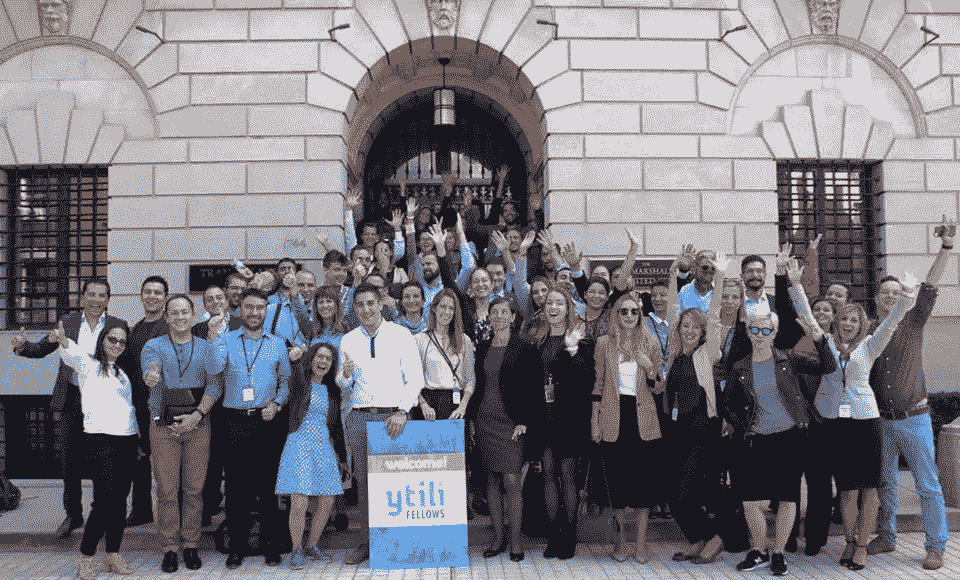

[YTILI](https://www.facebook.com/YTILInetwork/) 为年轻的企业家和创新者提供他们发展专业活动和项目所需的工具、网络和资源。YTILI 也是一个建立跨大西洋创新者网络的工具，这些创新者可以为加强跨大西洋关系的商业生态系统和政策对话的持续增长做出贡献。

2017 年夏天，我收到了关于我正式职位的信息——华盛顿州西雅图。我对探索创业生态系统和*他是星巴克、亚马逊、微软、创业周末的“家”…* 感到无比兴奋，特别是自从《我的创业故事》于 2014 年 9 月在马其顿首都斯科普里开播以来，一年半之后，通过 [#SwissEP](https://www.facebook.com/search/posts/?q=%23SwissEP) 我有机会与创业周末的联合创始人之一 Franck Nouyrigat 在马其顿会面并一起工作了两周，现在我将在家乡城市“生活”超现实的…然而超级令人兴奋。

一旦我安排好了所有的日期和去华盛顿、DC 和西雅图的初步日程，我就开始计划 9 月份在美国的行程，包括 11 次航班，5 个城市(旧金山；拉斯维加斯和洛杉矶补充)，许多商业会议，网络活动和今年最大的技术会议:TechCrunch Disrupt 在旧金山！

## 2017 年 9 月:在首都华盛顿 DC 开始我的美国之旅

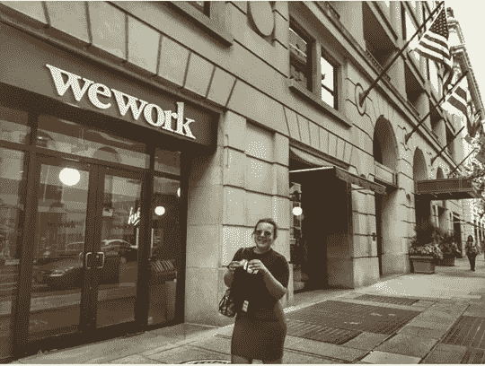

在首都的 72 小时，让我有机会与来自欧洲的 50 名鼓舞人心的年轻专业人士会面和联系，并建立长期的友谊和潜在的合作。参观了国务院，在那里我们对美国政府支持企业家和贸易的政策和项目有了更好的了解。

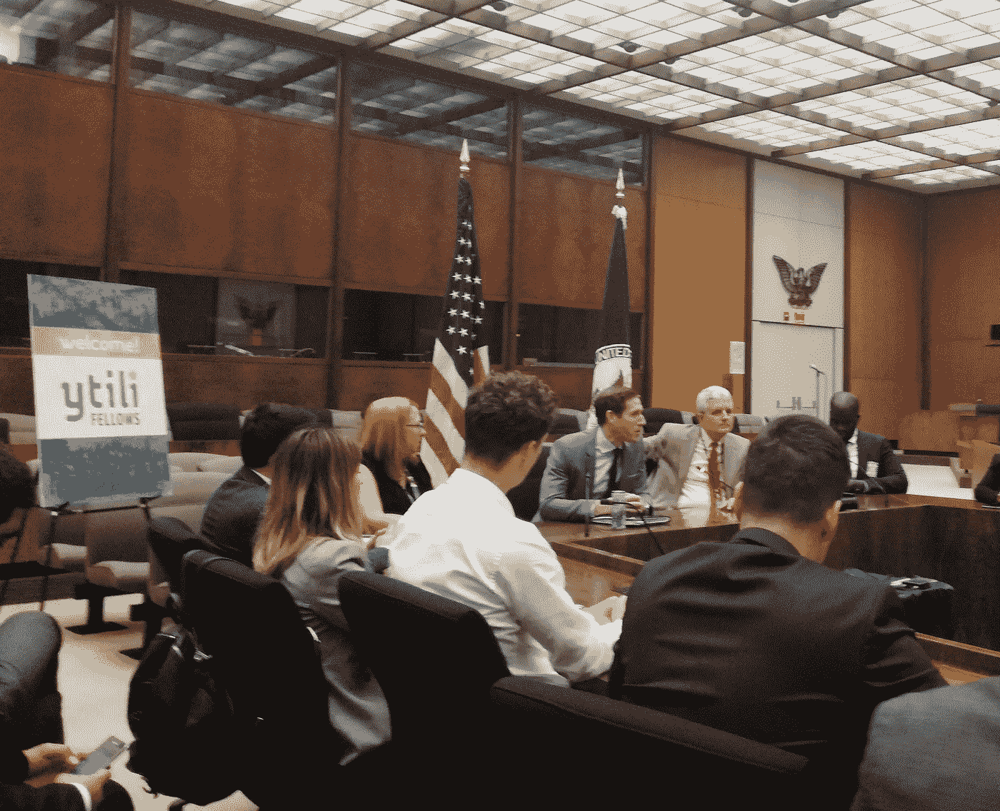

在德国马歇尔基金会期间，我们组织了各种重要主题的研讨会:建立关系、了解美国的企业家精神、开发和完善推介平台。我们紧凑的议程还包括探索首都，文化活动，如在国家体育场体验棒球比赛，并在 WeWork 白宫大楼参加与美国创新者的小组讨论，随后是与外交界和创业生态系统的交流活动。

# 西雅图，我的创业公司“隐藏的宝石”

幸运的是，为期两周的专业实习(作为驻校企业家)是在 [UW 社区实验室](https://comotion.uw.edu/)进行的:这是一个致力于扩大 UW 社区的经济和社会影响的合作创新中心，被安排在美国最具创新性的公立大学&中，创业公司数量排名第七。

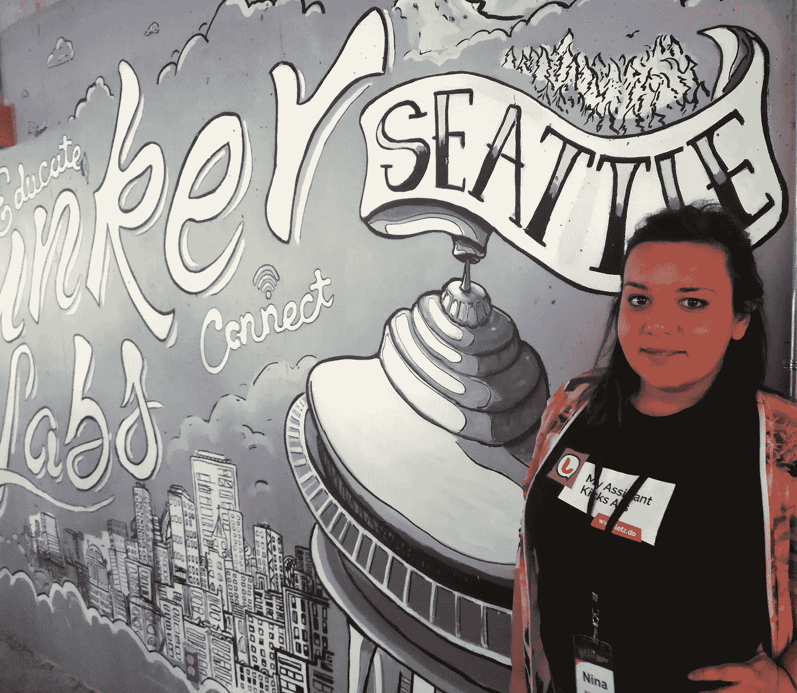

在这两周里，对于我们七个在西雅图的人来说，YTILI 准备的最初议程已经被商业会议、与生态系统不同关键人物的单独会议和网络活动填满了，比如女性在技术和创新峰会上。我们没有预料到的是，通过我们在到达前安排的额外会议，我们会得到如此大的响应。我在西雅图期间经历的最令人惊讶的事情之一是创业生态系统的开放、善良和协作。

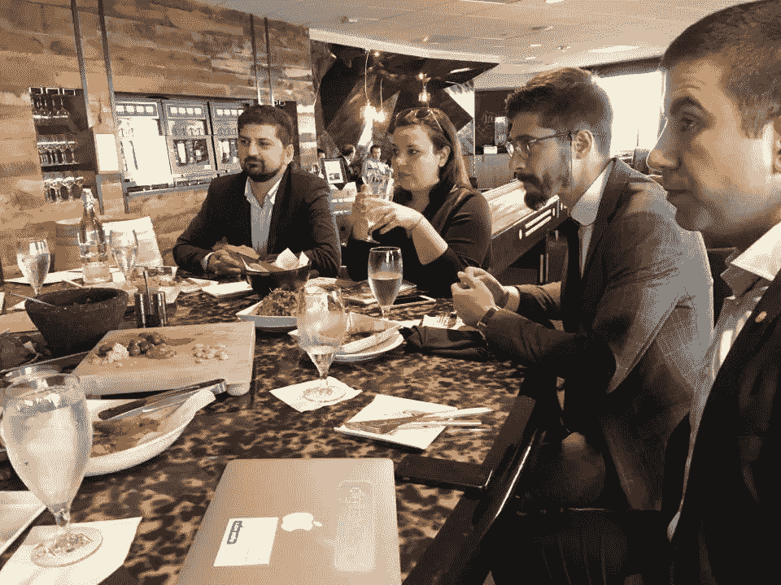

我们都有幸拥有最鼓舞人心、最成功的女企业家作为导师。从我们见到[轮廓风险投资集团](http://outlinesventure.com/)的基金经理[吉莉安·穆西格](https://www.linkedin.com/in/gillianmuessig/)的那一刻起，75 街的 Columbia Tower Club 就成了我们非正式的工作场所。在这里，我们将与 Gillian 和她的合作者会面，讨论业务发展、讲故事和推销会议、销售和营销，以及集思广益和规划跨大西洋合作的下一步…

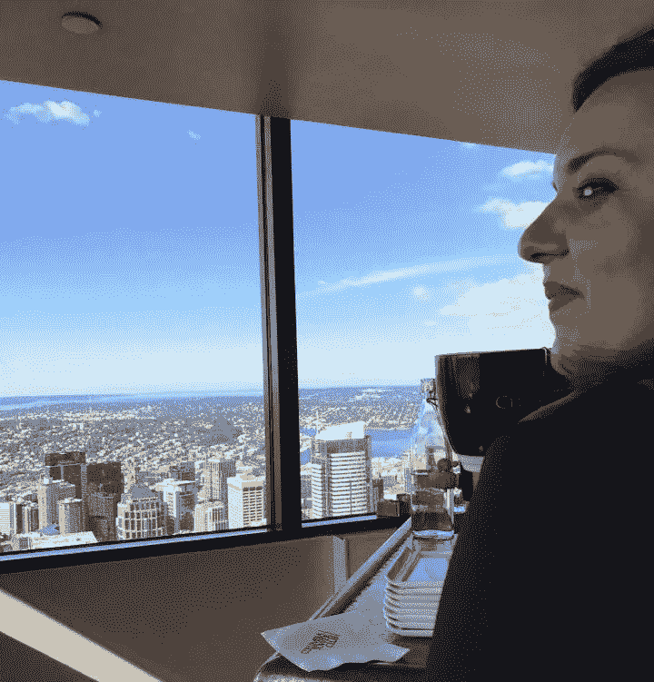

整个旅程是一次学习经历，将支持我们企业的成长和发展。如果我详细描述每一天，我绝对可以写一整本书，在西雅图的经历的关键是，我在这个城市遇到的每一个人和我去的每一个地方，都让我觉得我有归属感，好像我是一个真正的西雅图人。

# 今年九月在美国学到的七课

**#1 人——无论你去哪里，都与人有关**

从我记事起，我就一直是个旅行者，而不是游客。特别是自从三年前我的创业之旅开始以来，我去欧洲不同城市的旅行增加了，现在又去了美国。看到一个由当地人引导的城市，通过社区领导者的网络体验一个创业社区。对我来说，敞开心扉去结识新朋友、喝杯咖啡是关键，这样才能从旅行中获得最大收获，并建立一个专业的个人网络。但最重要的是在全世界建立友谊。

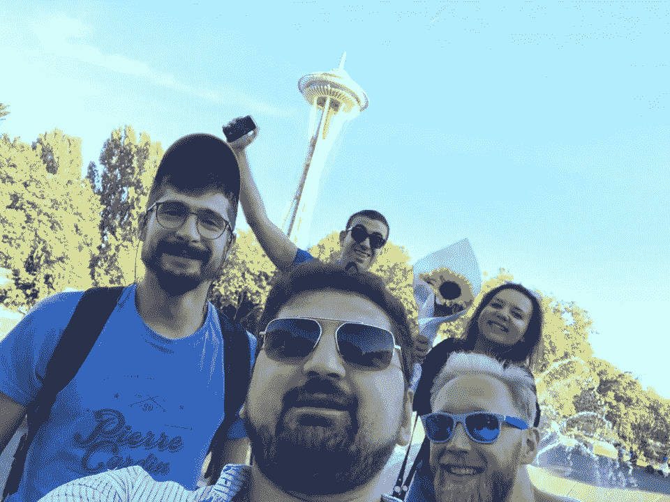

在西雅图，和我的六个同事一起度过的时光是我逗留期间的亮点。作为小组中唯一的女性，我受宠若惊，因为我每天都和年轻的专业人士和绅士们在一起。然而，这也是一个挑战，因为我非正式地扮演了“小组协调员”的角色。我很感谢遇见 GMF 和 YTILI 团队，感谢 YTILI 让我找到了新的朋友和合作者 Ivan Jelushich(克罗地亚)；[伊万·韦列塞斯](https://www.linkedin.com/in/dr-ivan-veresies-72859a54/)(塞浦路斯)；[托马什·瓦克劳斯基](https://www.linkedin.com/in/tomasz-wac%C5%82awski-05103965/)(波兰)；扬科·帕夫洛维奇(塞尔维亚)；马蒂亚斯·瓦诺尼(瑞士)；穆拉特·埃德米尔(土耳其/英国)。我们一起计划的事情正在进行中，我期待着下周在我的家乡斯科普里接待我的四位同事，作为我们的第一次重聚！

**#2 讲故事是关键**

在过去的几年里，我一直关注并仍在学习和发展的是我的讲故事技巧。总是有新的东西要学，我们在中东欧分享故事的方式和在美国掌握讲故事的方式是不同的。当涉及到你的业务时，你如何编排和分享你的故事；而你想从中获得什么(新客户、合作伙伴、投资人)，是必须掌握的东西。即使你有世界上最好的产品/服务，如果你不能正确地讲故事，激发情绪和行动，你很可能会失去动力。

**#3** **我们生活的奇怪时代，要求建造桥梁**

2016 年夏天，我和斯坦福大学的一位校友联系上了，他是一个探索巴尔干半岛创业生态系统的团队。我们喝了杯咖啡，几天后我们在一次会议上再次见面，我们承诺保持联系。几天后，我们再次会面，试图在马其顿的斯特鲁加组织一个名为 [BalkanChangeMakers WKND](https://startupselfie.wordpress.com/2016/08/31/startupselfie-w-balkanchangemakers/) 的社区活动。我们设法在不到三周的时间里做到了这一点，召集了来自 7 个巴尔干国家的创业社区领袖，度过了一个工作周末。在她启程回国之前，我问 [**玛里琳·哈里斯**](https://www.linkedin.com/in/mnharris523/) (我现在一个即将到来的项目的商业伙伴)她下一步打算做什么。她回答说:“我要回家收拾行李，我要搬到西雅图，在那里开始我在微软的新工作。你一定要来看看”

“当然”——我说，即使在我最疯狂的梦想中，我也不会想到一年后这将成为现实！

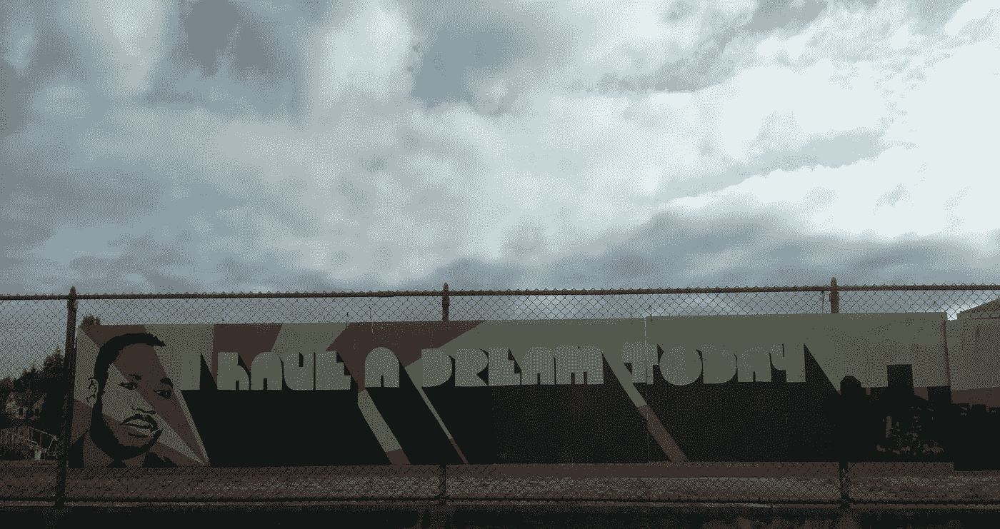

从我发现我的主办城市是西雅图的那一刻起，直到我在那里住了一整天，我在斯科普里喝咖啡时随机遇到的那个女孩，是一个超级东道主。她为我组织了一个欢迎来到西雅图的聚会，邀请了她所有的朋友、同事和我的同事。她把我和她在生态系统中认识的每一个人联系起来，不仅是在西雅图，还在旧金山(在那里感谢她的(现在是我们的)朋友 Pablo ，[我们更多地了解了谷歌和 Android 操作系统，并参观了谷歌总部](https://startupselfie.wordpress.com/2017/12/01/silicon-valley-and-techcrunch-disrupt-san-francisco/))和洛杉矶，成为最棒的朋友，把整个经历带到了另一个层次，确保我度过了最好的时光，让我有宾至如归的感觉，尽管我离家 10 000 公里。

**#4 发现我的 USP(独特卖点)**

在我们在 DC 华盛顿州的一次培训中，GMF 研究员[vide esha bckle](https://www.linkedin.com/in/videeshakunkulagunta/)与我们分享了成为或了解超级连接者的重要性，以及我们每个人都必须找到自己的 USP。

我在西雅图逗留期间，与同事们进行了一次讨论，确定了我是我们小组的超级联系人。我已经意识到了这一点，通过积极参与巴尔干和整个欧洲的创业生态系统，我建立了很多友谊。

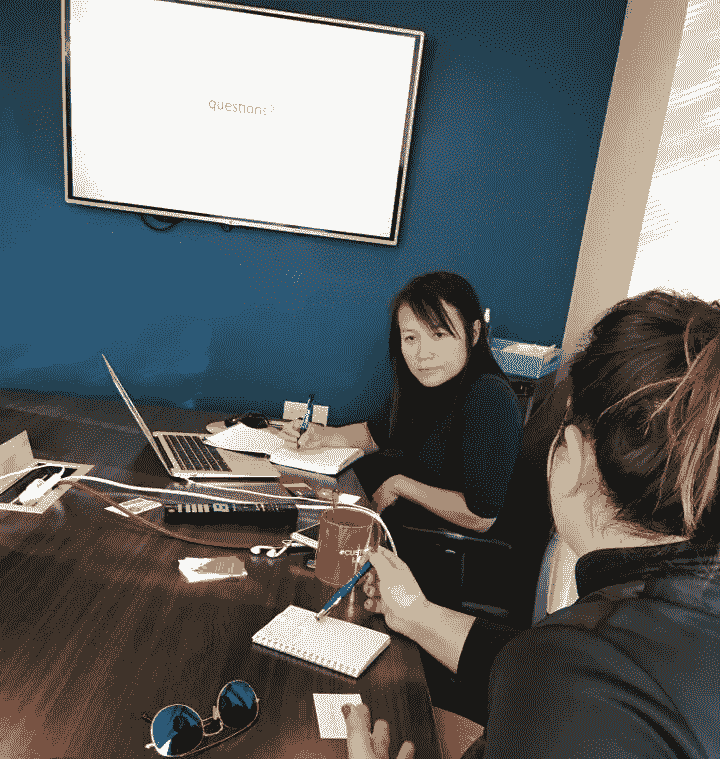

我在与我的导师的会谈中所学到的一些东西，她强调了一个直接的反馈，当机会出现时，我总是准备好了(准备充分)。努力工作和总是为机会敞开大门，教会了我如何为许多情况做好准备。这是当我知道什么是我的 UPS。你知道你的吗？

**#5 对新机遇保持警惕和开放**

就在我们从华盛顿飞往西雅图之前，我们一行人讨论了我们在西雅图期间如何会见[杰夫·贝索斯](https://www.forbes.com/profile/jeff-bezos/))

然而，对我们大多数人来说，能够见到创新部门的人并参观亚马逊总部是非常重要的。我们制定了战略并委派了谁做什么的责任，所以我们可以实现它。

在飞机上坐在我旁边的是一个友好的女孩，我们随意地开始了交谈。原来，坐在我旁边的女孩是[卡洛琳·斯潘塞，](https://www.linkedin.com/in/carolynnspencer/)亚马逊的营销经理，她答应在自己的日程表上安排一个时间段带我们参观。我们都与她相处得很好，她动用了所有的关系将我们与合适的人联系起来，这样我们中的一些人就可以推销商业机会。经验教训:分享一杯饮料，与陌生人交谈，这可能会成为朋友，为新的机会敞开大门！

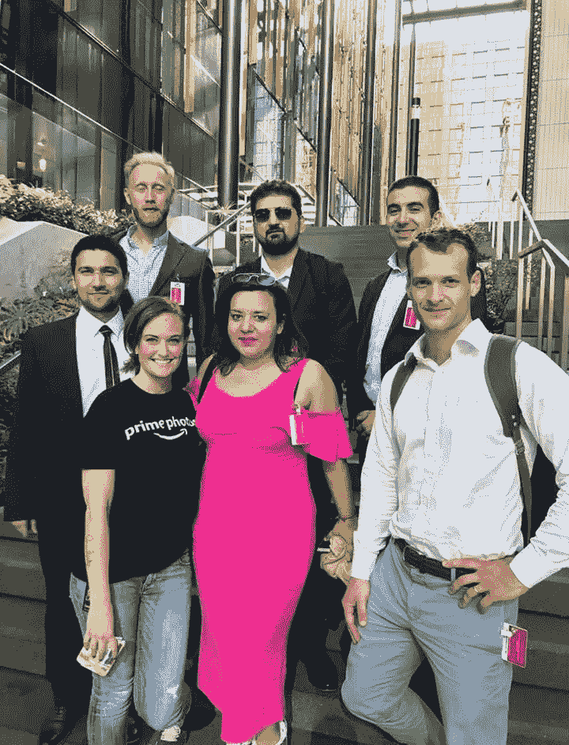

**#6 与合适的合作伙伴在美国做生意很容易(更容易)**

无论你的业务是什么，如果你的目标市场是美国市场(而你和你的团队在欧洲)，找到合适的合作伙伴是关键。最大的挑战是做研究，与一个与你有共同愿景的合作伙伴建立关系，并愿意为你的产品/服务的成功推广与你一样努力。经验教训:有了适量的支持和(人员)合作伙伴，无论市场规模有多大，实现您的目标都是不可避免的！

**# 7 Stay you&always be representin’(新的‘保持饥饿，保持愚蠢’)**

你独特的自我是最重要的！确保每天都学习新的东西，认识新的人，在职业发展的同时个人也得到发展。软技能是永远不能也不会被取代的东西，即使机器人、人工智能和虚拟现实接管了它！

我明白了，无论我在旅途中遇到谁，我都会展现自己。个人品牌是我在美国目睹的另一件非常重要的事情。我学到的另一件重要的事情是在工作场所的自尊。有些东西是无法教会的，但我们只是在旅途中学会的。

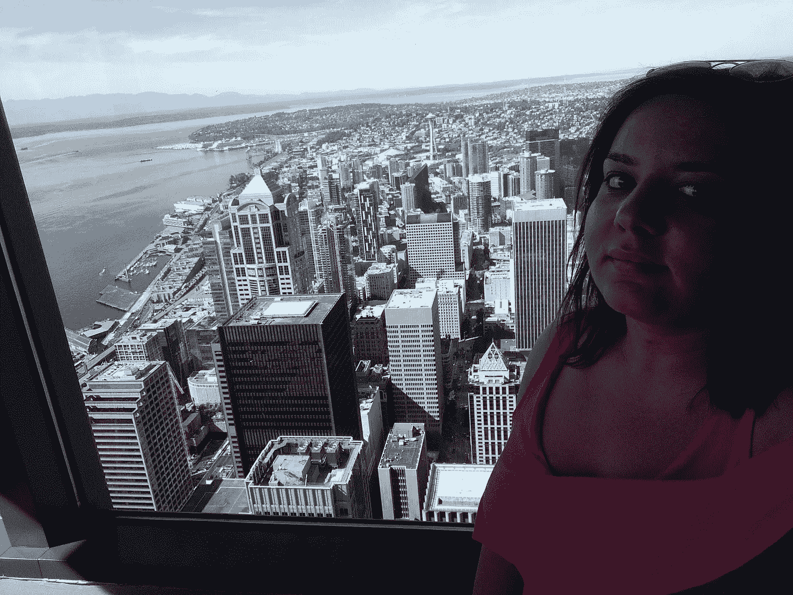

当你知道如何最好地展示自己时，你就可以为他人辩护，就像我在美国的旅程中所做的那样。

> 我的人生格言可能是这里的关键:永远敞开心扉去结识新朋友，花时间和陌生人喝杯咖啡，分享经验，分享机会。旅程可以带你到宏伟的地方和里程碑！

我设法结识新朋友，建立友谊、伙伴关系，联系人们，然后在我去的每个城市，与每个新的个人/潜在用户/客户、投资者和 TC Disrupt 的风险投资基金一起倡导 [Letz](http://letz.do/) 。[在马其顿推广由 Startup Macedonia 开发的小册子](https://startupselfie.wordpress.com/2017/12/01/launch-in-macedonia-swissep-entrepreneur-in-residence-program-promoted-in-the-us/)和我们的 [#SwissEP 企业家常驻](http://www.eir-europe.com/)计划，这将使我们能够加强我们已经建成的跨大西洋桥梁。

干杯

&签出:

[**硅谷和 TechCrunch 扰乱旧金山**](https://startupselfie.wordpress.com/2017/12/01/silicon-valley-and-techcrunch-disrupt-san-francisco/)

[**在马其顿推出，瑞士驻马其顿企业家项目在美国推广**](https://startupselfie.wordpress.com/2017/12/01/launch-in-macedonia-swissep-entrepreneur-in-residence-program-promoted-in-the-us/)