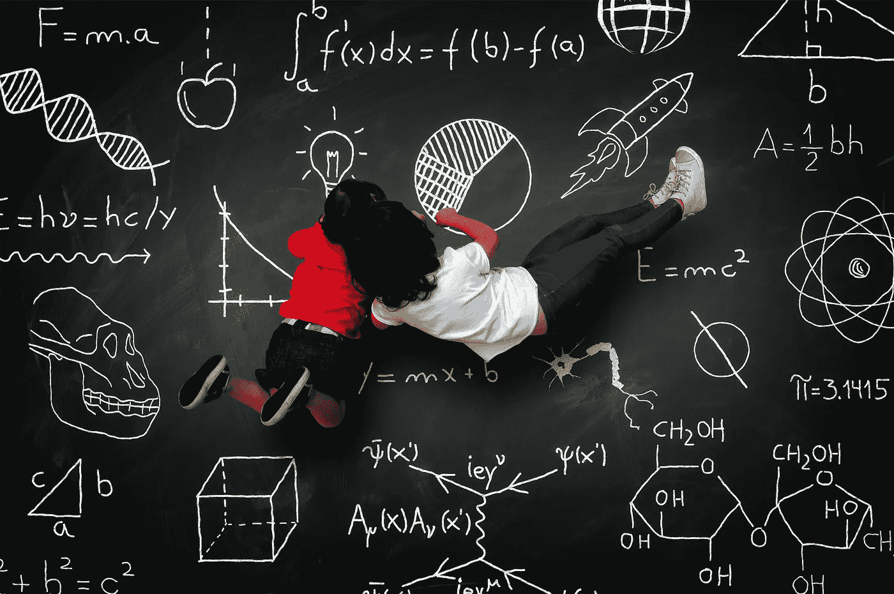

# 系列:如何通过理解敏捷背后的理论来充分利用敏捷

> 原文：<https://medium.com/hackernoon/series-how-to-get-the-most-from-agile-by-understanding-the-theories-behind-it-979d40b2b6ea>

敏捷的力量在于它利用人类行为作为实现目标的手段。通过理解人类行为背后的理论，你可以更好地利用它们，充分利用敏捷。这篇文章将包含一个我在那个标题下写的所有文章的合并链接。

> “给我六个小时砍树，我会用前四个小时磨利斧头。”—亚伯拉罕·林肯

[第 1 条——学习和激励](https://www.linkedin.com/pulse/how-get-most-from-agile-understanding-theories-behind-david-o-brien)

Image: Jack Moreh

将 Kolb 的经验[学习](https://hackernoon.com/tagged/learning)周期(ELC)与 Scrum Sprint
联系起来，将内在动机理论与敏捷实践联系起来

[文章# 2——Scrum 仪式](https://www.linkedin.com/pulse/how-get-most-from-scrum-ceremonies-understanding-theories-o-brien?published=t)

将众多相关的理论、法律和观察与 Scrum 仪式联系起来；

*   每日 Scrum(站立)会议
*   规划仪式
*   冲刺评审/演示会议
*   冲刺回顾会*。*

[文章# 3——Scrum 角色](https://www.linkedin.com/pulse/how-get-most-from-scrum-roles-understanding-theories-behind-o-brien/)

Image source: Jone Cummings, bsnscb.com

*将相关的心理学、商业&管理理论应用于组织行为和以下角色*:

*   高级管理
*   产品所有者
*   Scrum 大师
*   团队

[第 4 条——Scrum Backlog](https://www.linkedin.com/pulse/how-get-most-from-scrum-backlog-understanding-theories-david-o-brien)

Xopher Wallace — Man holding lights

*将众多相关的理论、法律和观察结果与 Scrum Backlog 联系起来；*

*   积压本身
*   用户故事

这就结束了我对敏捷背后的基本理论的探索和分析，特别强调了 Scrum。随着时间的推移，我确信我会发现这个系列并不是详尽的，但是我希望你已经喜欢阅读/略读其中的一些，并且可能在这个过程中学到了一些东西。

> [黑客中午](http://bit.ly/Hackernoon)是黑客如何开始他们的下午。我们是 [@AMI](http://bit.ly/atAMIatAMI) 家庭的一员。我们现在[接受投稿](http://bit.ly/hackernoonsubmission)，并乐意[讨论广告&赞助](mailto:partners@amipublications.com)机会。
> 
> 如果你喜欢这个故事，我们推荐你阅读我们的[最新科技故事](http://bit.ly/hackernoonlatestt)和[趋势科技故事](https://hackernoon.com/trending)。直到下一次，不要把世界的现实想当然！

