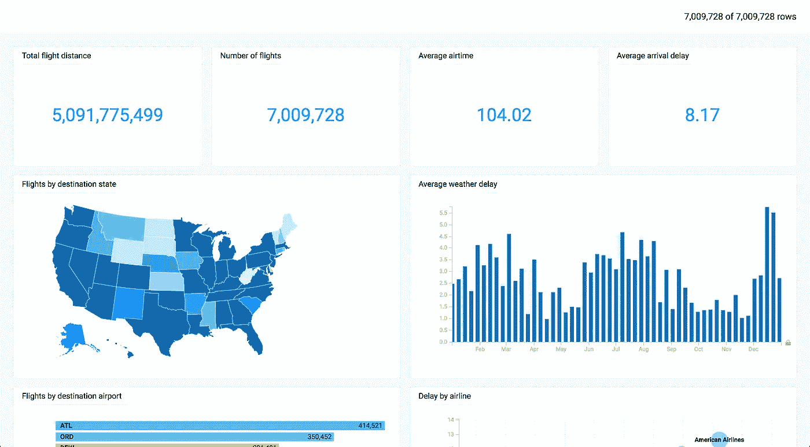
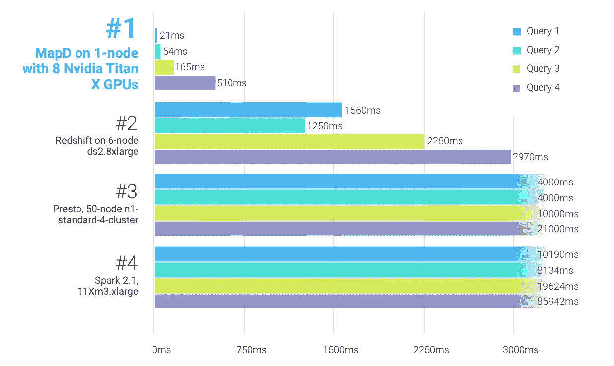
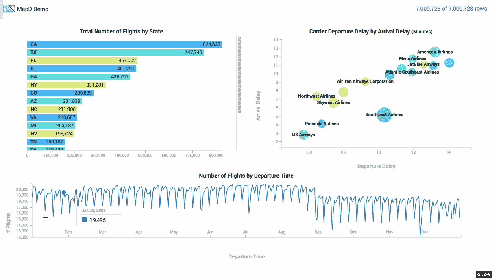
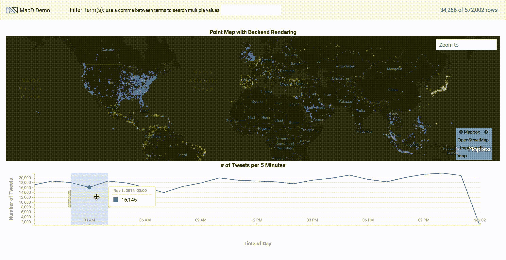

# 认真对待大数据可视化？考虑使用 MapD。

> 原文：<https://medium.com/hackernoon/serious-about-big-data-visualization-consider-using-mapd-7a5d0ddd77d7>

去年夏天，MapD 开源了他们的技术，并向所有人开放。那时，我和我在 Dimebox 的同事们正在为一个潜在的大客户做 POV，我们必须给他们留下深刻印象。我们的数据分析能力已经很先进了，但由于它在客户端工作，所以无法处理大量数据。我们决定跳上 MapD-train，到目前为止结果相当惊人。



My example dashboard can be found on: [https://github.com/luukgruijs/mapd-examples](https://github.com/luukgruijs/mapd-examples)

MapD 是一个 GPU 数据库平台。它由几个独立的软件包组成，这些软件包一起工作。这些是:

*   [MapD](https://hackernoon.com/tagged/mapd) Core:一个内存中的列存储 SQL 关系数据库，它是为运行在 GPU 上而从头设计的。
*   MapD 制图:使用 d3.js 渲染的 crossfilter 构建的维度制图
*   MapD cross filter:[JavaScript](https://hackernoon.com/tagged/javascript)库，用于在浏览器中探索大型多元数据集。基于[交叉滤波器](http://crossfilter.github.io/crossfilter/)。
*   MapD Connector:一个 JavaScript 库，用于连接到 MapD GPU 数据库并运行查询。

将它们结合在一起，你就有了一个几乎可以即时可视化数十亿条数据记录的平台。

# GPU 数据库

MapD 平台和许多其他数据可视化平台之间的最大区别是 MapD 运行在 GPU 数据库上。当对大量数据执行重复操作时，GPU 数据库比传统的 CPU 数据库提供了显著的改进。这是因为 GPU 可以有数千个内核，而 CPU 通常只有几个。通过这种方式，GPU 可以处理大量并发流，而 CPU 只能处理少量流。

[Mark Litwintschik](http://tech.marksblogg.com/benchmarks.html) 用 11 亿条记录的出租车数据集进行了基准测试。结果如下:



Image from [https://www.mapd.com](https://www.mapd.com/)

```
**Query 1:** SELECT cab_type, count() FROM trips GROUP BY cab_type;**Query 2:** SELECT passenger_count, avg(total_amount) FROM trips GROUP BY passenger_count;**Query 3:** SELECT passenger_count, extract(year from pickup_datetime) AS pickup_year, count() FROM trips GROUP BY passenger_count, pickup_year;**Query 4:** SELECT passenger_count, extract(year from pickup_datetime) AS pickup_year, cast(trip_distance as int) AS distance, count(*) AS the_count FROM trips GROUP BY passenger_count, pickup_year, distance ORDER BY pickup_year, the_count desc;
```

**系统配置**

*   *MapD* : 1 台机器(16 个内核，512 GB RAM，2 个 1TB SSD，8 个 Nvidia Pascal Titan X GPUs)
*   *红移* : 6 台机器(36 个内核，244 GB 内存，16TB 硬盘，AWS ds2.8xlarge)
*   *转眼间* : 50 台机器(4 个内核，15 GB 内存，100GB 固态硬盘，GCP n1-标准-4)
*   *Spark* : 11 台机器(4 个内核，15 GB 内存，2 个 40GB 存储，AWS m3.xlarge)

如您所见，MapD 只能在一台机器上运行，但是比其他选项快 10 到 100 倍。很棒，不是吗？

# 可视化数据

对于作为前端开发人员的我来说，这显然是最令人兴奋的部分。如前所述，我们 Dimebox 首先使用了客户端解决方案。这个解决方案是由 [dc.js](https://dc-js.github.io/dc.js/) 和[交叉滤波器](http://square.github.io/crossfilter/)组合而成的。这些库非常棒，但是因为它们运行在客户端，所以可以显示的数据量是有限的。有了 MapD，这个问题就解决了。当使用 Mapd 制图和 MapD 交叉过滤器时，您拥有相同的库，但能够显示数十亿条数据记录。可能性是无限的，以下是一些例子:



Because of crossfilter all graphs are linked



You can also crossfilter while drawing on a map

尤其是地图示例非常棒，但是您可能会更经常地看到一些“正常”的图形。支持的图表有:

*   条形图
*   泡泡图
*   行图表
*   圆形分格统计图表
*   折线图
*   计数图表
*   数字图表
*   地理坐标图

一些图表仍然存在一些问题，他们正在努力改善这些问题并添加新的问题。然而，结合上面的图表，你已经可以做出一些非常强大的仪表板。我还创建了一个包含所有这些图表的示例仪表板。你可以在我的 github 个人资料中找到这个:【https://github.com/luukgruijs/mapd-examples[。这也是一个很好的参考，如果你想开始使用上面的图表。](https://github.com/luukgruijs/mapd-examples)

# 这一切看起来很有希望

是的，但是也有一些地方确实可以改进或者应该解决:

首先，文档不是很丰富。很多图都没有例子，所以如果你是 dc.js 的新手，就有点瞎猜了。另外，关于如何在你现有的 API 中利用 MapD，还没有真正的书面指导方针。你当然可以问问自己提供这些是否是他们的工作，但我认为这可能有助于更广泛的采用，从而有助于更多的开源贡献。幸运的是，有[https://community.mapd.com/](https://community.mapd.com/)在那里你可以提问，通常你会在适当的时间内得到高质量的回答。

其次，数据库还不支持更新和删除查询。他们说他们正在研究这个。然而，这意味着在当前的可能性下，您必须清除整个数据库并重新插入新数据，或者您必须处理部分重复的数据。

第三，默认情况下，MapD 容易受到 SQL 注入的攻击。因为查询是从浏览器发送到服务器的。您可以拦截请求，并随意扩展或更改查询。您需要在您的服务器上创建一些逻辑来解决这个问题，并防止糟糕的事情发生。

第四，MapD 还没有在 NPM 上发布他们的软件包。当然，你仍然可以从他们的 github 直接获得它，但是 NPM 软件包会使它更容易安装到现有的项目中。

最后但同样重要的是，GPU 实例相对昂贵。虽然这当然不是 MapD 的问题，但是值得一提。例如，如果您有多个客户端，并且需要运行多个 GPU 实例，那么成本可能会非常高。亚马逊上最便宜的 GPU 实例每月花费 700 美元。虽然你总是不得不这样看待成本，但我们只能说，你可能无法将 MapD 用于一个有趣的数据丰富的爱好项目。

# 结论

对我来说，MapD 无疑是目前最令人兴奋的技术之一。但这并不适合所有人。要在现有产品中使用 MapD，您必须对前端的 d3、dc 和交叉滤波器有所了解。你也应该有一些知识，使一切安全，并抛光到你需要的后端。我希望下个月这个项目能收到更多的捐款。我已经开始在 Mapd 制图项目中做出一些贡献，并计划做更多。激动人心的时刻！

感谢阅读。如果你喜欢这篇文章，请点击拍手按钮。有反馈吗？让我知道。也查看我的其他文章:

*   [https://hacker noon . com/validating-reactive-forms-with-default-and-custom-form-field-validators-in-angular-5586 DC 51 C4 AE](https://hackernoon.com/validating-reactive-forms-with-default-and-custom-form-field-validators-in-angular-5586dc51c4ae)
*   [https://hacker noon . com/manage-your-observable-subscriptions-in-angular-help-of-rx-js-f 574 b 590 a5cb](https://hackernoon.com/manage-your-observable-subscriptions-in-angular-with-help-of-rx-js-f574b590a5cb)
*   [https://hacker noon . com/understanding-creating-and-subscribe-observables-in-angular-426 DBF 0 b 04 a 3](https://hackernoon.com/understanding-creating-and-subscribing-to-observables-in-angular-426dbf0b04a3)
*   [https://hacker noon . com/managing-large-s-CSS-projects-using-the-inverted-triangle-architecture-3c 03 e 4 B1 e 6 df](https://hackernoon.com/managing-large-s-css-projects-using-the-inverted-triangle-architecture-3c03e4b1e6df)
*   [https://hacker noon . com/understanding-map-filter-and-reduce-in-JavaScript-5 df 1c 7 eee 464](https://hackernoon.com/understanding-map-filter-and-reduce-in-javascript-5df1c7eee464)

*关注我上* [*中*](/@luukgruijs) *或* [*推特*](https://twitter.com/luukgruijs) *让我们连接上*[*LinkedIn*](https://www.linkedin.com/in/luukgruijs/)