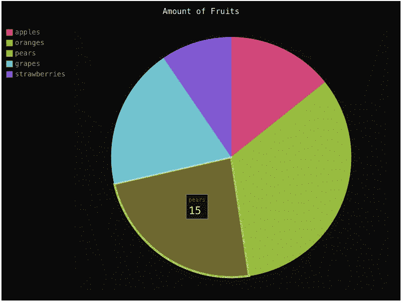

# Django 中服务器渲染的图表

> 原文：<https://medium.com/hackernoon/server-rendered-charts-in-django-2604f903389d>

比方说，您正在构建一个基于 Django 的 web 应用程序，并且您有一些想要可视化的数据。你是怎么做到的？最流行的选择是选择一个前端图表库，让后端将数据集(通过 API 或直接传递给模板)发送到前端，并在浏览器中呈现图表。这种方法允许前端完成大部分繁重的工作，从而减轻服务器的压力。

但是……如果你不想处理 [Javascript](https://hackernoon.com/tagged/javascript) 呢？如果你选择的库需要一个商业使用的许可(例如 Highcharts，Amcharts，等等)。)?如果你只是需要一些快速的东西呢？

进入另一种方法:在后端呈现图表，并将呈现的 HTML/SVG 插入模板。没有 Javascript，一切都在 [Python](https://hackernoon.com/tagged/python) 中，不需要对图表进行前端维护。我将向你展示如何用 [Pygal](http://pygal.org/en/stable/) 来做这件事。

Pygal 支持[许多不同类型的图表](http://pygal.org/en/stable/documentation/types/index.html)(甚至[地图](http://pygal.org/en/stable/documentation/types/maps/index.html)！)，以及强大的[配置系统](http://pygal.org/en/stable/documentation/configuration/chart.html)和内置的[样式](http://pygal.org/en/stable/documentation/builtin_styles.html)(这里不需要摆弄 JS/CSS)。它还可以让您以多种不同的方式输出图表。

## 首先，让我们安装 Pygal:

`$ pip install pygal`

我将跳过 Django 项目的设置，并假设您已经有了一个项目，或者您知道如何让它运行。我们将需要一些数据来处理，所以我将用模拟数据创建一个模型:

现在，有趣的部分来了——让一切正常运转只需要三个步骤:

## 1.创建 Pygal 图表

我喜欢将图表和视图分开——图表生成和任何数据查询都不应该出现在视图中。在你的应用目录下创建一个新文件(与你的`models.py`、`views.py`等相同)。)命名为`charts.py`，并将所有与图表相关的逻辑放在这里，就像这样:

## 2.生成图表的 SVG 并将其传递给模板上下文

## 3.将其包含在模板中

图表的 SVG 现在可以通过`{{ cht_fruits|safe }}`获得。这里需要`[safe](https://docs.djangoproject.com/en/1.11/ref/templates/builtins/#safe)`过滤器；否则 Django 会逃离 SVG。如果您希望工具提示起作用，您必须包含 Pygal tooltips JS 文件:

``

## 这是渲染图:

Rendered Chart