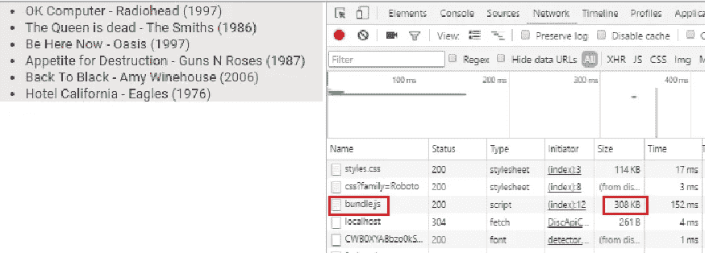
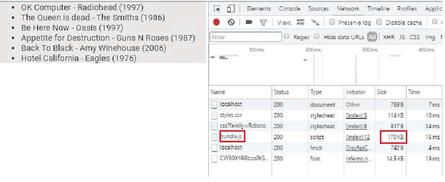

# 服务器端渲染和 Redux:从 React 到 Inferno

> 原文：<https://medium.com/hackernoon/server-side-rendering-and-redux-from-react-to-inferno-96af029bdbcc>

React 是新的 Javascript 趋势的主要参与者。它的基于开源组件的环境使得 web 开发变得更加容易和愉快。

有了它的概念，我们能够在老伙伴 JS 上创建强大的网络[应用](https://hackernoon.com/tagged/apps)。

然而，它也有一些缺点，其中之一与应用程序的大小有关(库本身重 45 kb)。开发新的轻量级库的新趋势已经到来，随之而来的是地狱:【https://www.infernojs.org/】T4

最酷的是:“地狱”是一种反应。所以，如果你喜欢使用 React，Inferno 对你来说绝对不是一个大问题。

在这一页中，我将展示这一点，用 React 编写了一个服务器端渲染的小示例；同样的例子也是用 Inferno 写的。

我也在用 Redux，即使我这里不是真的需要，我用它只是为了好玩:)

该代码由一个虚拟页面组成，该页面显示了从后端 API 检索到的音乐专辑列表。完整的代码(在 React 和 Inferno 中)，以及后端服务器，可以在这里找到:[**https://github.com/morris-ribs/server-side-rendering**](https://github.com/morris-ribs/server-side-rendering)

让我们讨论三个部分:服务器呈现、入口点和组件。

该代码基于[http://redux.js.org/docs/recipes/ServerRendering.html](http://redux.js.org/docs/recipes/ServerRendering.html)

## **服务器渲染**

**在入口点中，我们添加了在服务器端呈现应用程序的代码，并将其发送到客户端。**

**下面是 React 的代码:**

```
// server.js**import React from 'react';
import { renderToString } from 'react-dom/server';
import {Provider} from 'react-redux';
import { match, RouterContext } from 'react-router';**
import express from 'express';
import routes from '../src/routes';
import configureStore from '../src/store/configureStore';
import {getDataSuccess} from '../src/actions/discActions';
import {fetchData} from '../src/api/DiscApiClient'; ...
const port = 9800;
const app = express();// This is fired every time the server side receives a request
app.use(handleRender);function handleRender(req, res) {
 ** match({ routes, location: req.url }, (error, redirectLocation, renderProps) =>** {
    if (error) {
      res.status(500).send(error.message);
    } else if (redirectLocation) {
      res.redirect(302, redirectLocation.pathname + redirectLocation.search);
    } else if (renderProps) {fetchData().then(discs => {
        // Compile an initial state
        let preloadedState = {};

        // Create a new Redux store instance
        const store = configureStore(preloadedState);
        store.dispatch(getDataSuccess(discs));// You can also check renderProps.components or renderProps.routes for
        // your "not found" component or route respectively, and send a 404 as
        // below, if you're using a catch-all route.
       ** const html = renderToString(<Provider store={store}><RouterContext {...renderProps} /></Provider>);**// Grab the initial state from our Redux store
        const finalState = store.getState();// Send the rendered page back to the client
        res.status(200).send(renderFullPage(html, finalState));      
      }).catch(error => { 
          res.status(500).send(error.message);
      });
    } else {
      res.status(404).send('Not found');
    }
  });
}// the contents to be rendered on server-side
function renderFullPage(html, preloadedState) {
 return `
    <!DOCTYPE html>
      <html lang="en">
        <head>
          <title>Discs Test</title>
            <meta name="viewport" content="width=device-width, initial-scale=1">
            <meta charset="utf-8">
            <meta http-equiv="X-UA-Compatible" content="IE=edge">
            <link href="[https://fonts.googleapis.com/css?family=Roboto](https://fonts.googleapis.com/css?family=Roboto)" rel="stylesheet">
        </head>
        <body>
          <div id="app">${html}</div>
          <script>
            // WARNING: See the following for Security isues with this approach:
            // [http://redux.js.org/docs/recipes/ServerRendering.html#security-considerations](http://redux.js.org/docs/recipes/ServerRendering.html#security-considerations)
            window.__PRELOADED_STATE__ = ${JSON.stringify(preloadedState)}
          </script>
          <script src="/bundle.js"></script>
        </body>
      </html>
      `;
}// listen in the port 9800
app.listen(port, function(err) {
  if (err) {
    console.log(err);
  } else {
    open(`[http://localhost:${port}`](http://localhost:${port}`));
  }
});
```

**而现在，Inferno 中的代码(使用***Inferno-server***，***Inferno-router***和***Inferno-redux***)。**

**这里主要的区别是，我们调用 ***match*** 函数，从中获取 *renderProps* 对象，然后在我们的***router context***中使用它:**

```
// server.js**import Inferno from 'inferno';**
**import { renderToString } from 'inferno-server';
import {Provider} from 'inferno-redux';
import { match, RouterContext } from 'inferno-router';**
import routes from '../src/routes';
import configureStore from '../src/store/configureStore';
import {getDataSuccess} from '../src/actions/discActions';
import {fetchDara} from '../src/api/DiscApiClient';const port = 9800;
const app = express();// This is fired every time the server side receives a request
app.use(handleRender);function handleRender(req, res) {
  **const renderProps = match(routes, req.originalUrl);**
  if (renderProps.redirect) {
    res.redirect(renderProps.redirect);
  } else if (renderProps) {

    fetchData().then(discs => {
      // Compile an initial state
      let preloadedState = {};

      // Create a new Redux store instance
      const store = configureStore(preloadedState);
      store.dispatch(getDataSuccess(discs));

      // You can also check renderProps.components or renderProps.routes for
      // your "not found" component or route respectively, and send a 404 as
      // below, if you're using a catch-all route.
      **const html = renderToString(<Provider store={store}><RouterContext {...renderProps} /></Provider>);**// Grab the initial state from our Redux store
      const finalState = store.getState();// Send the rendered page back to the client
      res.status(200).send(renderFullPage(html, finalState));   
    }).catch(error => { 
        res.status(500).send(error.message);
    });
  } else {
    res.status(404).send('Not found');
  }
}**// Exactly like in React!** 
function renderFullPage(html, preloadedState) {
 return `
    <!DOCTYPE html>
      <html lang="en">
        <head>
          <title>Discs Test</title>
            <meta name="viewport" content="width=device-width, initial-scale=1">
            <meta charset="utf-8">
            <meta http-equiv="X-UA-Compatible" content="IE=edge">
            <link href="[https://fonts.googleapis.com/css?family=Roboto](https://fonts.googleapis.com/css?family=Roboto)" rel="stylesheet">
        </head>
        <body>
          <div id="app">${html}</div>
          <script>
            // WARNING: See the following for Security isues with this approach:
            // [http://redux.js.org/docs/recipes/ServerRendering.html#security-considerations](http://redux.js.org/docs/recipes/ServerRendering.html#security-considerations)
            window.__PRELOADED_STATE__ = ${JSON.stringify(preloadedState)}
          </script>
          <script src="/bundle.js"></script>
        </body>
      </html>
      `;
}**// Exactly like in React!**
app.listen(port, function(err) {
  if (err) {
    console.log(err);
  } else {
    open(`[http://localhost:${port}`](http://localhost:${port}`));
  }
});
```

****入口点****

**这是我们将要设置 Redux 存储和提供程序的地方**

**在反应过来的时候，是这样的:**

```
// src/index.js**import React from 'react';
import {render} from 'react-dom';
import {Provider} from 'react-redux';
import {Router, browserHistory} from 'react-router';**
import configureStore from './store/configureStore';
import routes from './routes';
import {loadData} from './actions/discActions';// Grab the state from a global variable injected into the server-generated HTML
const preloadedState = window.__PRELOADED_STATE__;const store = configureStore(preloadedState);
store.dispatch(loadDiscs());render(
    **<Provider store={store}>
        <Router history={browserHistory} routes={routes} />
    </Provider>**,
    document.getElementById('app')
);
```

**在 Inferno 中，我们将进行一些更改，例如传递路由器中的主要组件:**

```
// src/index.js**import Inferno from 'inferno';
import configureStore from './store/configureStore';
import { createBrowserHistory } from 'history';
import {Provider} from 'inferno-redux';
import {Router, Route, IndexRoute} from 'inferno-router';**
import {loadData} from './actions/discActions';
import App from './components/App';
import DiscPage from './components/disc/DiscPage';// in Inferno, we need to create the browser history from another library
**const browserHistory = createBrowserHistory();**// Grab the state from a global variable injected into the server-generated HTML
const preloadedState = window.__PRELOADED_STATE__;const store = configureStore(preloadedState);
store.dispatch(loadData());// the main App component goes as a param to Router
// The component page goes into the 
**Inferno**.render(
    **<Provider store={store}>
        <Router history={browserHistory} component={ App }>
                <IndexRoute component={DiscPage} />
        </Router>
    </Provider>**,
    document.getElementById('app')
);
```

****相册显示组件****

**最后，该组件表示页面上相册列表的显示。**

**在《反应》中，我这样写道:**

```
**// App.js**// This component handles the App template used on every page
**import React, {PropTypes} from 'react';**class App extends **React.Component** {
    render() {
        return(
            <div>
                {this.props.children}
            </div>
        );
    }
}App.propTypes = {
    children: PropTypes.object.isRequired
};export default App;**// DiscPage.js**
import {connect} from 'react-redux';
import Disc from './DiscComponent';/* eslint-disable no-console */
class DiscPage extends **React.**Component {
    constructor(props, context) {
        super(props, context);this.state = {
          discs: Object.assign({}, this.props.discs)
        };
    }

    render() {
        const discsToDisplay = (this.props.discs.albums) ? this.props.discs.albums : [];
        return (
            <div>
                <Disc discs={discsToDisplay} />
            </div>
        );
    }
}**DiscPage.propTypes = {
    discs: PropTypes.object.isRequired
};**function mapStateToProps(state) {
    return {        
        discs: state.discs
    };
}const connectedStateAndProps = connect(mapStateToProps);export default connectedStateAndProps(DiscPage);**// DiscComponent.js**
class DiscComponent extends **React.**Component {
    constructor(props, context) {
        super(props, context);
    }render() {
        return ( 
            <div>
                <ul> 
                    {this.props.discs.map(disc => 
                        <li key={disc.id}>{disc.title} - {disc.artist} ({disc.year})</li>
                    )} 
                </ul>             
            </div>
        );
    }
}**DiscComponent.propTypes = {
    discs: PropTypes.array.isRequired
};**export default DiscComponent;
```

**在地狱里。你可以看到我们不需要声明组件的正确类型。**

**除此之外， ***组件*** 类进来另一个库，**魔族-组件**:**

```
**// App.js**
// This component handles the App template used on every page
**import Inferno from 'inferno';
import Component from 'inferno-component';**class App extends **Component** {
    render() {
        return(
            <div>
                { this.props.children }
            </div>
        );
    }
}export default App;**// DiscPage.js**
import Disc from './DiscComponent';
**import {connect} from 'inferno-redux';**class DiscPage extends **Component** {
 render() {
  const discsToDisplay = (this.props.discs.albums) ? this.props.discs.albums : [];
        return (
            <div>
                <Disc discs={discsToDisplay} />
            </div>
        );
 }
}function mapStateToProps(state) {
    return {        
        discs: state.discs
    };
}// with **inferno-redux**, we can connect components to the immutable store just like in React
const connectedStateAndProps = connect(mapStateToProps);export default connectedStateAndProps(DiscPage);**// DiscComponent.js - just like in React**
class DiscComponent extends **Component** {
    constructor(props, context) {
  super(props, context);
 }render() {        
        return ( 
            <div>
                <ul> 
                    {this.props.discs.map(disc => 
                        <li key={disc.id}>{disc.title} - {disc.artist} ({disc.year})</li>
                    )} 
                </ul>             
            </div>
        );
    }
}export default DiscComponent;
```

****现在我们比较一下尺寸****

**如你所见，使用服务器端渲染和 Redux 编写应用程序与 React 和 Inferno 没有太大区别。**

**因此，让我们看看这两个库之间捆绑的 JS 的大小是否真的有差异，以及路由、redux 和服务器渲染的相应大小。(**注意:我用的是 React** 的 15.0.2 版本)**

**React(版本 15.0.2): 308 Kb**

****

**inferno(1.0 版):170 Kb**

****

# ****结论****

**Inferno 带来了一个强大而轻便的库，对于习惯于在 React 中工作的开发人员来说非常友好。**

**它带来了 React 生态系统的所有优点，并有可能使用其最先进的功能。对于轻量级的基于 web 组件的 app 来说确实是个不错的选择(重量只有 7 kb)。**

**React 团队已经在努力利用库的大小并提高性能。当它来的时候，真的很值得看一看。**

**两个库上有趣的链接(以及更多！):**

1.  **[反应](https://facebook.github.io/react/)**
2.  **[地狱](https://www.infernojs.org/)**
3.  **[Inferno 功能前端简介——副作用和路由](/javascript-inside/introduction-to-functional-front-ends-with-inferno-side-effects-and-routing-a8b226c47b0f#.p987v04m9)**
4.  **[React 和 Redux 单页面应用资源](/@sapegin/react-and-redux-single-page-applications-resources-22cd859b0c1d#.7rfim853s)**

**[](http://bit.ly/HackernoonFB)****[](https://goo.gl/k7XYbx)****[](https://goo.gl/4ofytp)**

> **黑客中午是黑客如何开始他们的下午。我们是这个家庭的一员。我们现在[接受投稿](http://bit.ly/hackernoonsubmission)并乐意[讨论广告&赞助](mailto:partners@amipublications.com)机会。**
> 
> **如果你喜欢这个故事，我们推荐你阅读我们的[最新科技故事](http://bit.ly/hackernoonlatestt)和[趋势科技故事](https://hackernoon.com/trending)。直到下一次，不要把世界的现实想当然！**

****