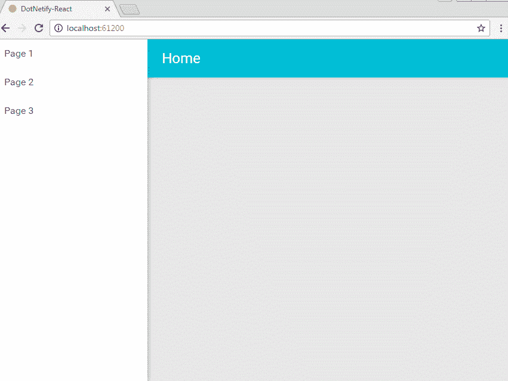

# 使用 React 和的深层链接的服务器端呈现。网络核心

> 原文：<https://medium.com/hackernoon/server-side-rendering-of-deep-links-with-react-and-net-core-882830ca663>

*关于使用 dotNetify-React 做 React app 跨平台通用/同构路由。NET Core 后端——没什么大惊小怪的。*

> **(2020 年 5 月 24 日):自最初发布以来，技术和代码已经进行了重大更新。** [**最新最棒的**](https://github.com/dsuryd/dotNetify/tree/master/Demo/React/LazyLoadRouting) **请看这个 github 回购。**

几周前，我发布了 dotNetify-React 的[测试版，这是一个开源项目，它使得在. NET 核心后端开发](https://hackernoon.com/react-net-core-signalr-amazing-ea0a83e4357e) [React](https://hackernoon.com/tagged/react) 应用变得非常简单。它附带了一个可选特性，即在后端的 C#视图模型中声明 SPA 路由，这是为了那些希望保持其客户端组件没有路由问题的人。

只要您将服务器设置为对于任何页面请求总是返回首页，这个客户端路由器就可以很好地处理深层链接。路由器将遍历路径以动态加载组件并解析嵌套路由，直到路径被完全路由。

然而，正如许多人指出的那样，客户端路由有一些缺点，比如更长的初始加载时间，没有内容的闪烁，以及对 SEO 不友好。然而，有了 React，通用渲染有望消除这些问题，所以我急切地想知道它是否可以集成到这个路由器中，并且仍然保持简单易用。

但是首先，让我先来概述一下客户端路由器是如何工作的。

# 客户端路由

在 dotNetify 中，React 根组件与用普通 C#编写的后端视图模型配对。如果我们从一个有到组件`Page1`的路由的`Index`组件和一个普通的 HTML 文件`Page2`开始，下面是这些路由在视图模型中的定义:

路由 API 在[项目的网站](http://dotnetify.net/react/routing)中有记录，所以我不会在这里详述，但本质上路由信息是在类实例化期间构建的，被序列化，并作为 React 组件初始状态的一部分发送到客户端。下面是`Index`组件的样子:

React 组件连接到后端后，路由状态将成为组件状态的一部分，并用于呈现`RouteLink`组件，这些组件只是锚标签的薄包装。当用户通过单击链接进行导航时，路由器在后台工作，从服务器加载组件(如果尚未捆绑)或 HTML 文件，将其挂载到目标 DOM 节点，并更新浏览器历史状态，以便浏览器的后退和前进按钮也能工作。

我们可以继续在与`Page1`相关联的视图模型中定义嵌套路由。路由器支持像`/Page1(/:itemId)`这样的模式，并且有机制将匹配的 URL 传递给视图模型，这样它就可以生成正确的视图。如前所述，只要服务器为每个页面请求返回首页`index.html`，路由器就可以处理这些嵌套路由形成的深层链接。

现在让我们来看看如何将服务器端路由添加到这个组合中。

# 服务器端路由

假设客户端路由必须从根开始，一路向下呈现深层链接，那么从初始页面交付到最终页面呈现给用户之间总会有一个时间差。因此，主要目标是通过将初始页面作为最终页面来消除延迟，完全由服务器呈现并随客户端脚本一起发送，然后客户端脚本将无缝地接管使用客户端路由进行其余的交互。

另一个目标是使它对代码库的干扰最小化；我们不需要对 React 组件进行大量的修改，也不需要对它们施加太多的限制，就能让它们支持服务器渲染。因为否则，它很可能会挫败[通用/同构渲染](/capital-one-developers/why-everyone-is-talking-about-isomorphic-universal-javascript-and-why-it-matters-38c07c87905)的目的。

立即出现了几个问题:

*   如何在 ASP.NET 核心服务器上渲染我们的 React 应用？
*   如何获取渲染 app 所必需的初始状态？
*   如何设置服务器匹配客户端渲染环境？
*   如何包含通常由客户端路由器异步加载的嵌套组件？
*   如何向组件提供初始状态？
*   如何防止 React 在客户端再次渲染所有内容？

## ASP.NET 核心上的 Javascript 渲染

如果不是微软今年早些时候发布的一组名为 [JavascriptServices](https://blogs.msdn.microsoft.com/webdev/2017/02/14/building-single-page-applications-on-asp-net-core-with-javascriptservices/) 的库，找到一种在. NET 服务器上呈现 [Javascript](https://hackernoon.com/tagged/javascript) 的方法将会是一个大问题。其中一个名为`NodeServices`的库为任何。NET 代码在 Node.js 实例上运行任意 Javascript。正是我们需要的！

有了适当的方法，我们可以创建一个 Javascript 文件，命名为`app.server.js,`，它获取主页面`index.html`，并在其上呈现 React 根组件。收到页面请求后，我们的。NET 代码会将请求 URL 路径和组件的初始状态传递给文件中的函数，并获取响应的 HTML 字符串:

```
app.Run(async (context) =>
{
   ...
   var result = await **nodeServices.InvokeAsync**<string>(
      "./app.server.js", requestPath, initialStates );
   await context.Response.WriteAsync(result);
}
```

## 获取初始状态

如果没有遍历链接路径并收集组件呈现最终页面所需的所有状态的能力，深度链接的服务器呈现就不会工作。幸运的是，dotNetify 将所有路由信息和组件状态保存在后端的方法很好地解决了这个问题。

通过使用提供的 API，我们可以编写。NET 代码跟踪路径，解析路径中的所有组件，最后将所有状态作为序列化的 JSON 对象返回，准备作为参数传递给上面的服务器端呈现函数。

## 服务器端执行上下文

下一个要解决的问题是在 Node.js 中设置执行上下文，以便 React 应用程序能够以与客户端相同的方式呈现。最明显的区别是 Node 中没有 DOM，因此任何依赖于`window`或`document`的脚本都无法运行。

尽管 React 组件避免直接引用 DOM 是一个很好的做法，但实际上这可能过于严格。用假对象模仿或添加`undefined`类型检查是另一种选择，但会遇到问题，特别是当应用程序本身或它使用的任何第三方库将对它们做一些不平凡的事情时。

在我看来，最简单、侵入性最小的解决方案是使用模拟 DOM 的无头浏览器库。这种方法在自动化测试中已经很常见了。为此，我使用了一个流行的库 jsDOM。警告是，模拟可能不会完美，在某些情况下我们仍然需要进行修改，性能可能是一个问题，这取决于库的优化程度。

## 服务器端模块

下一个挑战是确保所有导入的库模块在服务器上下文中都是可用的。使用客户端路由，所有需要的库都与 WebPack 捆绑到一个名为`bundle.js`的文件中，并使用脚本标签附加到 HTML 中。但是要记住，Node.js 还不支持 ES6 模块，所以 WebPack 用来构建这个包的任何`import`都不能在那里工作。

为了克服这一点，而不必用`require`替换所有的`import`调用，我更新了我的 WebPack 配置，将包输出到`window`范围内的一个全局变量中。这个变量将包含所有导入的模块，所以在 Node.js 中，我将`bundle.js`包含在 jsDOM 中作为要执行的脚本，然后将变量中的对象复制到`global`范围，连同`window`和`document`变量本身。

```
Object.assign(global, window.bundle);
global.window = window;
global.document = document;
```

这确保了组件和任何其他 Javascript 都可以像在客户端一样访问对象。

## 异步路由覆盖

如前所述，当客户端路由器遍历 URL 路径时，它检查当前组件的路由状态以寻找下一个要加载的组件，然后从服务器执行异步加载。这种行为显然必须在服务器端渲染中被覆盖，因此 dotNetify 提供了一个 API 钩子来拦截组件的 URL，为 Node.js 更正其路径，并使用`require`将组件加载到`window`范围中。

```
function(url) {
   if (url.endsWith('.js')) {
      url = "../wwwroot" + url;
      Object.assign(window, require(url));
   }
}
```

这同样适用于加载普通的 HTML 文件。一旦深度链接被完全路由，一个内部事件将被引发，通过 API 钩子，我们提供一个回调来将`document.documentElement.innerHTML`返回到。NET 代码作为对初始页面请求的响应。

## 将初始状态传递给组件

由传递的初始状态。NET 代码到服务器函数被做成一个对象并添加到`window`作用域中。我们必须对使用这些状态的组件做一点小小的改动，以便它们在返回默认状态之前先找到自己的状态:

```
var Index = React.createClass({
   getInitialState() {
      this.vm = dotnetify.react.connect("Index", this);
      ...
 **return dotnetify.react.router.ssrState("Index") || {};**   
},
```

`ssrState` API 将试图通过已建立的命名约定找到初始状态，并防止在用户导航期间组件被重复安装时重复使用这些状态。

## 防止客户端重新呈现

最后一个问题是如何防止 React 在浏览器上再次渲染所有内容。通常情况下，这已经由 React 在内部处理了，只有当 DOM 节点发生变化时，React 才会进行自己的检查来更新 DOM 节点。不幸的是，当客户端路由器异步加载时，这种方式并不好用。目标 DOM 节点(将安装嵌套组件的地方)最初总是空的，因此 React 将清除服务器呈现的内容。

我已经查看了 React APIs，但是没有什么会阻止初始呈现，所以我想到的解决方案是让呈现目标 DOM 节点的组件在呈现之前用服务器呈现的内容预先填充它。

为了简单起见，dotNetify 提供了一个名为`RouteTarget`的组件来代替目标 DOM 节点。在安装之前，该组件将找到相同 ID 的现有 DOM 节点，将内部 HTML 抓取到其本地状态，并使用它来呈现自身，以便输出不会有所不同。

```
render() {
   return (
      <div>
         <RouteLink ...>Page 1</RouteLink>
         <RouteLink ...>Page 2</RouteLink>
 **<RouteTarget id="Content" />**
      </div>
   );
}
```

# 工作演示

尘埃落定后，这里是`app.server.js`的样子:

ASP.NET 核心代码称之为:

你可以从这个 [github 地址](https://github.com/dsuryd/dotNetify-react-template/tree/master/_archive/Routing)克隆运行在 Visual Studio 2017 上的演示。为了与纯客户端渲染进行比较，在 URL 后面添加`?ssr-false`。



这个路由器库是 npm 上 dotNetify-React 分发包的一部分。请访问[项目的网站](http://dotnetify.net/react)了解安装、更多详情和其他现场演示。源代码在[项目的 Github 网站](https://github.com/dsuryd/dotNetify)上。

它绝不是完美的，并且可能有一些它没有涵盖的用例。但希望这是一个好的开始；我愿意接受请求，即使你不使用它，你也可以从这篇文章中获得一些教育价值。下次见！

[](http://bit.ly/HackernoonFB)[](https://goo.gl/k7XYbx)[](https://goo.gl/4ofytp)

> [黑客中午](http://bit.ly/Hackernoon)是黑客们下午的开始。我们是这个家庭的一员。我们现在[接受投稿](http://bit.ly/hackernoonsubmission)并乐意[讨论广告&赞助](mailto:partners@amipublications.com)机会。
> 
> 如果你喜欢这个故事，我们推荐你阅读我们的[最新科技故事](http://bit.ly/hackernoonlatestt)和[趋势科技故事](https://hackernoon.com/trending)。直到下一次，不要把世界的现实想当然！

