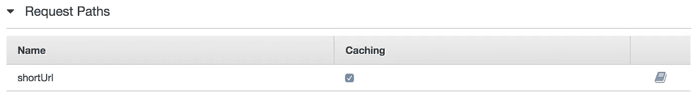
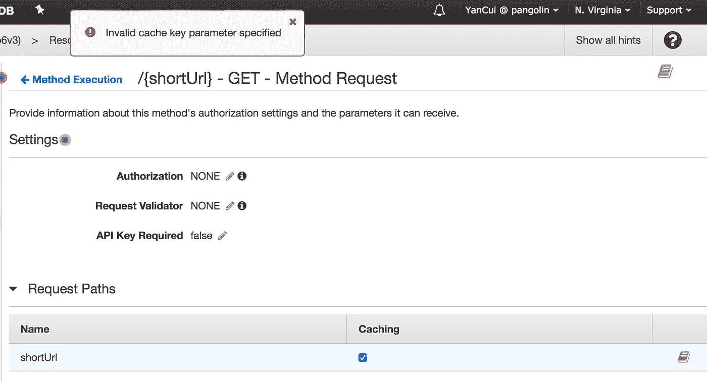
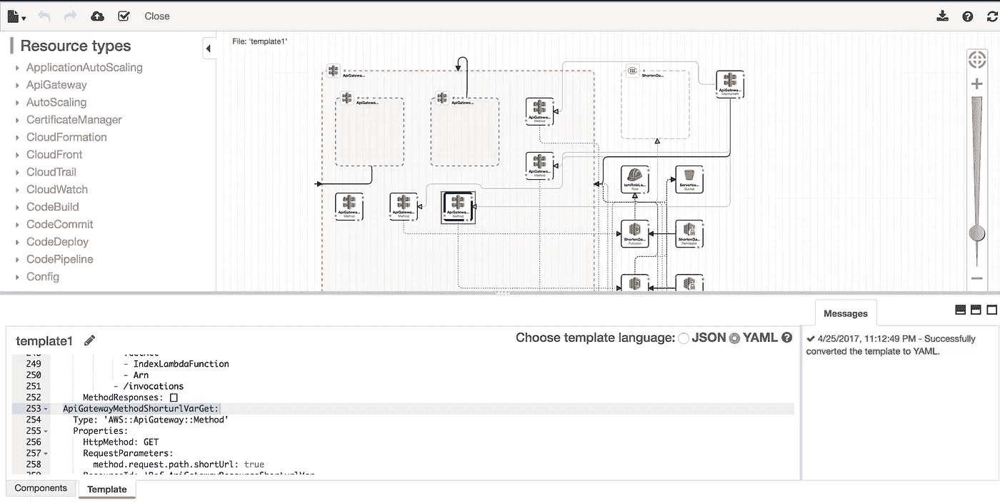
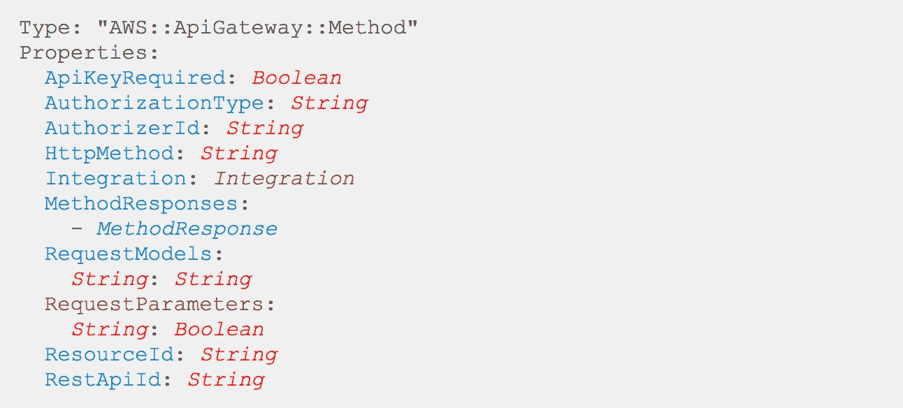
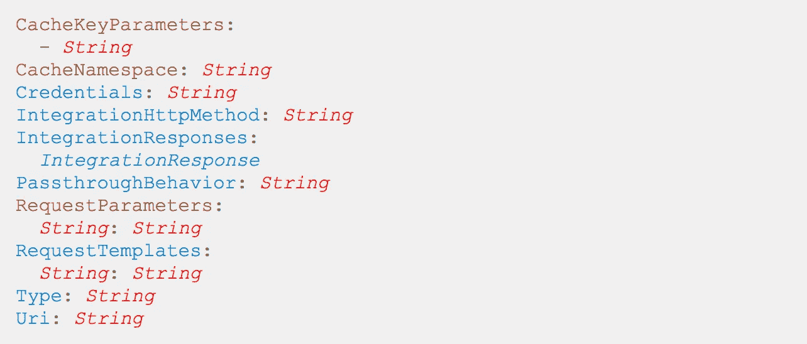
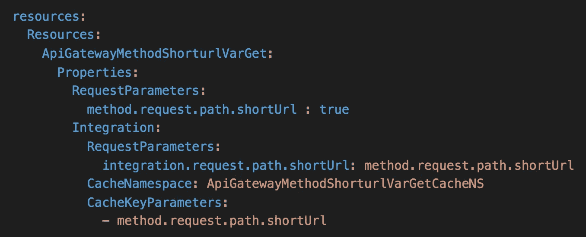

# 无服务器 1。X —对请求参数启用 API 网关缓存

> 原文：<https://medium.com/hackernoon/serverless-1-x-enable-api-gateway-caching-on-request-parameters-894b31762068>

## 如何使用无服务器框架在 API Gateway 中启用路径和查询字符串参数的缓存

之前[在博客](http://theburningmonk.com/2016/04/serverless-enable-caching-on-query-string-parameters-in-api-gateway/)上发表了关于在[无服务器](https://serverless.com/)框架 0.5.X 中启用 API 网关请求参数缓存的未开发路径的文章，令人有点失望的是，它仍然没有在 1.0 中正式修复。x 版本…

# 问题是

问题是双重的:

1.  目前没有办法指定应该为路径和查询字符串参数启用缓存
2.  *云生成*模板*无服务器* 1。为 *API 网关*生成的 x 缺少一些可选字段，这些缺少的字段也阻止您在 *API 网关*管理控制台中手动启用缓存

after you deploy your Lambda function with associated API, if you go to the management console and enable caching on path or request parameters you will get an error saying “Invalid cache key parameter specified”.

# 变通办法

一个朋友给我指了一个[巧妙的技巧](/@nickdenengelsman/modifying-auto-generated-serverless-v1-0-aws-cloudformation-resources-5bb5b55bbdf0)来修改 *CloudFormation* 模板，即 *Serverless 1。X* 自动为您生成。

项目部署完成后，您可以到 *CloudFormation* 查看 *Serverless* 生成的模板。这些模板相当大(并且格式很差)，所以我发现在 *Designer* 视图中打开它们并使用该视图导航到我正在寻找的端点更容易。

When you click on a resource in the Designer, it’ll also highlight it in the YAML, write down the resource name.

找到端点的资源模板后，记下它的名称。现在回到项目中的`serverless.yml`文件，将资源名称添加到底部的`resources`部分。您只需要包含要更新或添加到模板中的字段。

*API 网关*方法的 *CloudFormation* 语法如下:

see [http://amzn.to/2px6ITq](http://amzn.to/2px6ITq) for more detail

我们还需要为`Integration`部分填充一些空白:

see [http://amzn.to/2oJsC1P](http://amzn.to/2oJsC1P) for more detail

经过反复试验，我必须添加的最小字段集是:

使用无服务器重新部署，并且为缓存启用了 path 参数:

# 包裹

我希望这篇文章对你有用，尽管我很惊讶在我的研究中缺乏信息，并且缺乏来自*无服务器*框架的官方支持。

如果你知道更好的方法，请在评论中告诉我。

# 链接

*   [修改自动生成的无服务器 1.0 版 AWS 云信息资源](/@nickdenengelsman/modifying-auto-generated-serverless-v1-0-aws-cloudformation-resources-5bb5b55bbdf0)

喜欢你正在读的东西吗？查看我的视频课程 [**生产就绪无服务器**](https://bit.ly/prod-ready-serverless) ，学习如何在生产中运行无服务器应用。

我们将讨论的主题包括:

*   使用 API 网关和 Cognito 进行身份验证和授权
*   在本地测试和运行功能
*   项目组织策略
*   CI/CD
*   集中伐木
*   监视
*   X 射线分布式跟踪
*   跟踪相关 id
*   性能和成本优化
*   错误处理
*   配置管理
*   金丝雀部署
*   VPC
*   安全
*   Lambda、Kinesis 和 API 网关的最佳实践

并包括在最近的 AWS re:Invent 大会上宣布的所有最新变化！

 [## 生产就绪无服务器

### 看到了。动手吧。学着点！生产就绪无服务器:运营最佳实践向您介绍领先的模式和…

bit.ly](https://bit.ly/prod-ready-serverless)