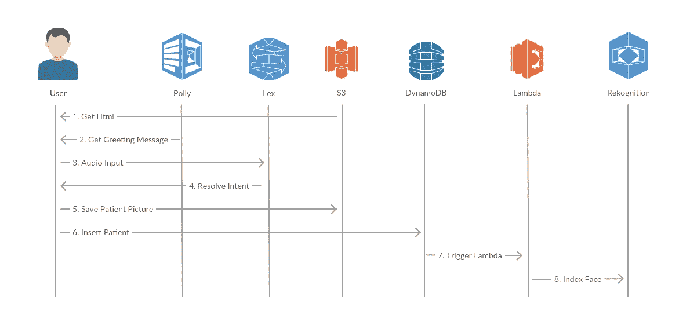
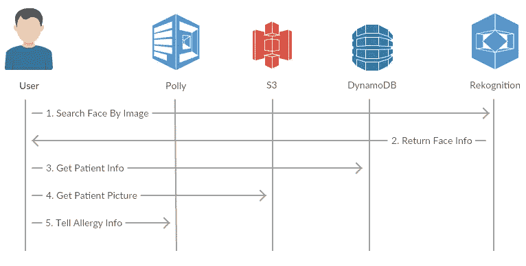
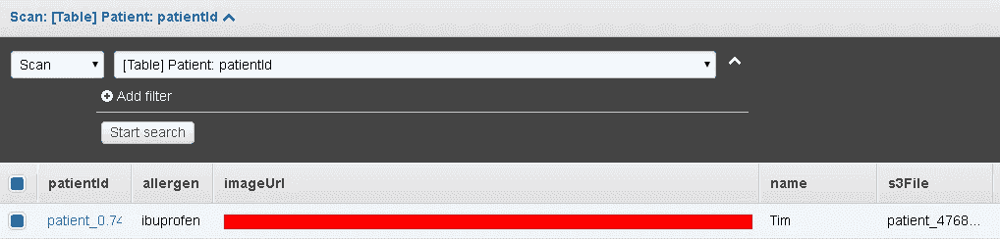
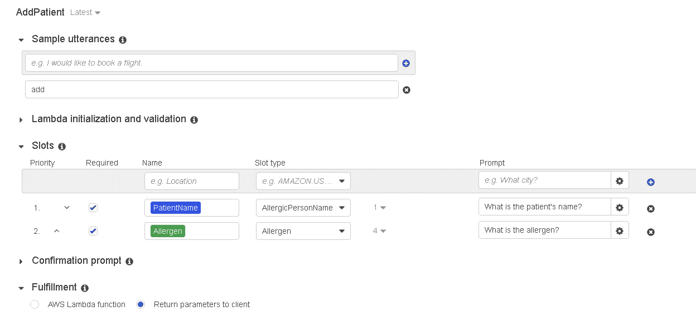
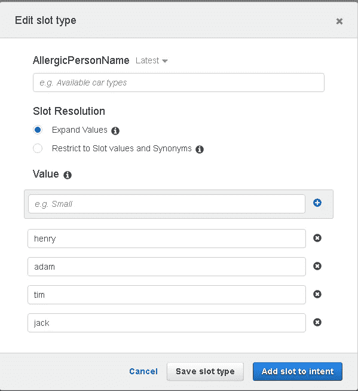
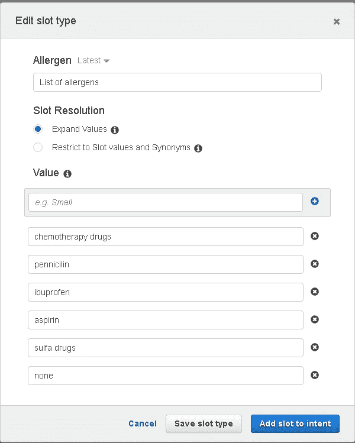
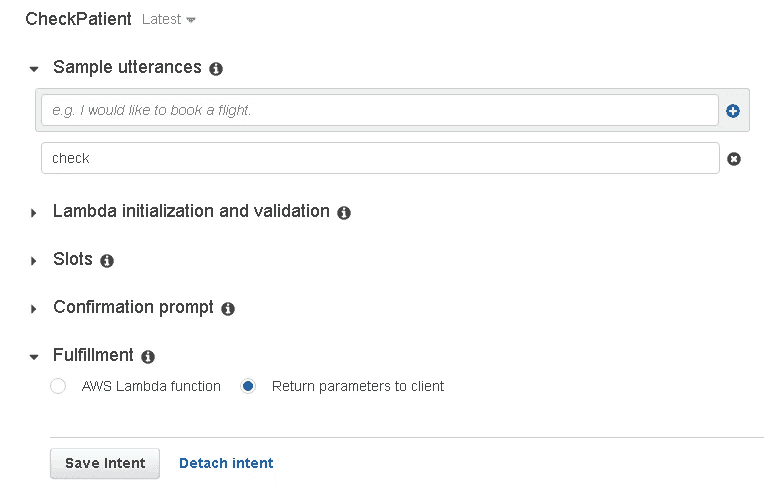

# 无服务器过敏检查与亚马逊 Rekognition，莱克斯，波利，DynamoDB，S3 和λ

> 原文：<https://medium.com/hackernoon/serverless-allergy-checker-with-amazon-rekognition-lex-polly-dynamodb-s3-and-lambda-35fd215b51b0>

*本帖是我之前的博客* *中* [*关于 AWS 服务的一系列帖子的一部分。*](https://ceyhunozgun.blogspot.com.tr)

我们生活在一个软件和移动正在吞噬世界的时代，大公司开始转向人工智能优先。人工智能领域的进步是前所未有的。

在这个快速变化的世界中，我们的责任是提供利用技术帮助人们的解决方案。Pollexy 项目是利用技术帮助人们的一个很好的例子。

看完那个用例，我一直在思考给 [**亚马逊 Rekognition**](https://aws.amazon.com/rekognition/) 找一个好的用例，这是一个使用深度学习技术的图像识别服务。Amazon Rekognition 允许用户检测图片中的对象和场景。它还可以用于索引图像中的人脸和搜索人脸。

我们的双胞胎喜欢在草地上玩耍，但是他们对草过敏，由于他们的过敏，我们不能花太多时间在草地上玩耍。当我在研究过敏时，我了解到在一些极端的情况下， [**药物过敏可能会引起过敏反应**](http://www.aaaai.org/about-aaaai/newsroom/allergy-statistics) 。这对我打击很大。

我决定使用 Amazon Rekognition 来保存和检索药物过敏患者的照片。该系统可用于急救服务，以方便快捷地记录和检查患者过敏信息。

此外，我已经决定使用 Amazon Lex 和 Polly 来允许紧急服务人员通过他们的声音免提使用该应用程序。这样就可以使用像谷歌眼镜这样的可穿戴设备，让人员自由使用双手，用声音记录和搜索患者信息。

**申请**

该应用程序用于保存患者信息和检查患者信息。该应用程序是一个由静态 web 文件组成的无服务器应用程序,没有服务器端组件。web 应用程序的静态文件托管在 S3 上，其他功能使用 [AWS](https://hackernoon.com/tagged/books) 的托管服务实现。使用 AWS JavaScript SDK 直接从浏览器使用 AWS 服务。

使用的服务如下:

*   [T5【S3】T6](https://aws.amazon.com/s3/)用于存储患者的图片和 web 应用程序的静态文件
*   [**DynamoDB**](https://aws.amazon.com/dynamodb/) 用于存储患者信息，包括姓名、过敏和图片网址
*   [**识别**](https://aws.amazon.com/rekognition/) 用于索引和搜索患者面部
*   [**λ**](https://aws.amazon.com/lambda/)用于在 [DynamoDB](https://hackernoon.com/tagged/dynamedb) 中添加患者记录时索引患者面部
*   [**Lex**](https://aws.amazon.com/lex/) 用于允许用户仅通过语音添加和搜索患者
*   [**波利**](https://aws.amazon.com/polly/) 用于给用户语音回复

下图显示了记录新患者信息时将使用的保存患者用例的步骤。一旦 Lex bot 确定了病人的姓名和过敏原，病人的照片就会在浏览器中显示并发送到 S3。然后将患者记录插入 DynamoDB。DynamoDB 触发器获取图片并调用 Rekognition 来索引患者的面部。

Saving patient allergy information use case

当我们想要检查一个病人是否过敏时，我们可以在浏览器中拍摄病人的照片，并在 Rekognition 人脸集合中搜索病人的人脸。检查用例的步骤如下所示。

Checking patient allergy information use case

HTML5 用户界面和相应的 JavaScript 代码，用于记录发送给 Lex 的音频，播放来自 Lex 的响应和聊天界面，使用来自**我的** [**以前的帖子**](https://ceyhunozgun.blogspot.com.tr/2017/07/nobody-understands-you-theres-app-for-that-with-amazon-lex.html) ，可以在 [**我的 GitHub repo**](https://github.com/ceyhunozgun/cardstore9) 找到。该应用程序使用 Java Spring 服务器端处理命令，并使用 Java SDK 调用 AWS 服务，但在该应用程序中，所有 AWS 服务都是使用 JavaScript SDK 从浏览器调用的。

**准备**

您应该有一个 AWS 帐户并[安装 AWS CLI](http://docs.aws.amazon.com/cli/latest/userguide/installing.html) 来创建所需的 AWS 资源。

请记住，并非所有地区都支持所有服务。我将使用 us-east-1，US East (N. Virginia)地区，因为 Amazon Lex 目前仅在该地区受支持。

代码可以在[这里](https://github.com/ceyhunozgun/serverlessAllergyChecker)找到。

**注意:**为了简单起见，使用 JavaScript SDK 访问 AWS 服务所使用的 AWS 访问密钥 id 和秘密密钥放在 HTML 文件中。在生产中，你绝对应该**保密你的 AWS 凭证**。

**步骤**

1.获取代码

2.创建和配置 IAM 策略、角色和用户

3.创建 Rekognition 集合

4.创建并配置 DynamoDB 表

5.创建 Lambda DynamoDB 触发器

6.创建和配置 S3 存储桶

7.创建 Lex 机器人

8.修改并检查应用程序

9.测试应用程序

我们开始吧。

**1。** **获取代码**

克隆自 GitHub repo [此处](https://github.com/ceyhunozgun/serverlessAllergyChecker)。

**2。** **创建和配置 IAM 策略、角色和用户**

为了访问 AWS 服务，我们将创建一个具有访问 AWS 服务的特定权限的角色，以根据最小特权原则提供最小权限集。请不要使用您的 AWS root 帐户或拥有更大权限的其他帐户。

AWS CLI 命令如下。首先，我们创建一个用户，然后创建一个策略并将该策略附加到新用户。请用您的 AWS 帐户 ID 替换 **AWS 帐户 ID** 。

创建访问键后，输出将如下所示。**记下访问密钥 id 和秘密密钥**,因为 JavaScript SDK 将使用这些凭证在浏览器中调用 AWS 服务。我们将把这些凭证放到 HTML 文件中。

**3。** **创建认知集合**

Rekognition 使用人脸集合来存储从图像中提取的人脸信息，并使用该集合来搜索人脸。我们可以使用下面的命令创建集合。

**4。** **创建并配置 DynamoDB 表**

我们将用名为 **patientId** 的分区键将患者信息存储在 **Patient** 表中，如下图所示。其他字段有**名称**、**过敏原**、 **imageUrl、**和**S3 文件**。

Patient table

我们可以创建**患者**表，并使用下面的命令在其上启用流。

注意输出中的 **LatestStreamArn** ，我们将使用该流作为 Lambda 触发器的事件源。会像**arn:AWS:dynamo db:us-east-1:AWS _ ACCOUNT _ ID:table/Patient/stream/2017–10–09t 19:41:06.419**。

**5。**创建 Lambda DynamoDB 触发器

创建了 Patient 表之后，我们将关联一个 Lambda 函数，该函数将在向表中添加记录时执行。首先，我们创建一个 Lambda 执行角色，然后将我们之前创建的策略附加到这个角色。这为 Lambda 函数提供了调用其他 AWS 服务所需的权限，在本例中， *indexFaces* 方法的 *Rekognition* 。

请将 **AWS_ACCOUNT_ID** 替换为您的 AWS 帐户 ID，将**PATIENT _ TABLE _ STREAM _ ARN**替换为上一步创建的流 ARN。同样将**S3 _ 桶 _ 名称**的值设置为您想要使用的 S3 桶名称。

Lambda 函数运行时是 **Node.js** ，代码在**patientfaneindexerlambda . js**文件中。代码如下所示。该代码在加载时创建一个 Rekognition 对象，并在患者被添加到**患者**表时使用该对象来索引面部。患者图片 url 被放入**S3 文件**字段。

代码使用患者图片的 S3 桶名、我们的面部集合 id 和作为 **ExternalImageId** 的 **patientId** 调用 *indexFaces* 方法。当我们用一张图片搜索一张人脸时，Rekognition 将返回带有这个 **ExternalImageId** 的匹配人脸，我们可以用这个 **patientId** 找到其他信息。

**6。** **创建并配置 S3 桶**

我们将创建一个 S3 桶来存储病人的照片。通常情况下，我们不需要存储病人的图像来进行搜索，但是为了显示原始图像，当找到匹配的人脸时，我们将存储原始图片。

我们应该[启用 CORS](http://docs.aws.amazon.com/AmazonS3/latest/dev/cors.html) ，这样我们就可以从不同的域上传。为了简单起见，我启用了所有域，但是您应该限制在生产使用中访问 bucket 的域。CORS 设置在 **s3-bucket-cors.json** 文件中，请相应设置。此外，将 **bucketName** 替换为您想要使用的名称。

上传到 S3 后，该应用程序将图片标记为**公共阅读**，以使它们能够在浏览器中显示。在生产中，由于[**最近的数据泄露**](https://www.theregister.co.uk/2017/08/22/open_aws_s3_bucket_leaked_hotel_booking_service_data_says_kromtech/) 与**错误配置的 S3 桶**相关，请相应设置桶权限。

**7。** **创建 Lex bot**

现在所有资源都准备好了，除了 Lex bot。实际上，要使用 Rekognition、S3 和 DynamoDB，我们不需要创建一个机器人，但 Lex bot 将使用户能够轻松地使用语音系统，同时用手进行其他紧急操作。

创建一个名为 **AllergyChecker** 的 Lex bot，它有两个意图， **AddPatient** 和 **CheckPatient** 。有关创建 Lex bot 的更多信息，您可以查看我在 Lex 上的帖子或 AWS Lex 教程[练习 2:创建自定义亚马逊 Lex Bot](http://docs.aws.amazon.com/lex/latest/dg/getting-started-ex2.html) 。

**AddPatient** intent 将用于向系统中添加患者，包括患者姓名和过敏原。该意向将使用**患者姓名**和**过敏原**插槽。当 Lex 已经引出槽时，web 应用程序将拍摄病人的照片并将该信息保存到**病人**表中。

AddPatient intent

**患者姓名**槽的槽类型为**过敏患者姓名**。我用过内置的亚马逊。人，但我遇到了问题，并创建了一个自定义插槽类型。自定义插槽表现更好。此外，我不得不使用英文名称，因为目前 Lex 只支持英文。

AllergicPersonName custom slot type

另外，**过敏原**槽使用了名为**过敏原**的自定义槽。

Allergen custom slot type

**检查患者**意图将用于通过拍照来检查患者。此意图没有槽。当这一意图准备好实现时，网络应用程序将拍摄患者的照片，并调用 *Rekognition* 来查找具有匹配面部的患者。如果找到患者，过敏原信息将与原始患者照片一起显示。

CheckPatient intent

8。 **修改和审核申请**

现在所有的 AWS 资源都准备好了。我们准备修改我们的应用程序。

在 index.html 中替换如下所示的配置变量。

在我们之前创建的**patient face indexer**Lambda 方法中实现了将患者添加到*recognition*face 集合中。

在**index.html**中的**检查病人**方法中，使用*重新识别*检查病人。**使用面部集合 id、图像和面部匹配阈值调用 searchFacesByImage** 方法。我们希望*重新识别*返回匹配置信度大于 80% 的人脸。如果找到匹配项，**handlecheckpatientorresponse**方法显示患者姓名、过敏原和患者照片。

**9。** **测试应用程序**

在浏览器中打开**index.html**。您应该使用兼容 WebRTC 的浏览器来录制音频和视频。你可以点击查看你的浏览器[。](http://iswebrtcreadyyet.com/)

应用程序加载后，您可以说“**添加**或“**检查**”来使用应用程序，如下图所示。

**接下来的步骤**

首先，我想提醒你删除你为这篇文章创建的资源。请对您创建的资源的安全性非常严格。

我已经完成了 web 应用程序中的意图。在实际应用中，Lambda 函数可用于插槽验证和实现。

同样为了简单起见，音频被记录 4 秒，如果所有记录的数据都是无声的，则音频不被发送到 Lex。在实际应用中，我们可以创建一个`**ScriptProcessorNode**`来实时分析记录的音频数据，如果在特定的持续时间内检测到静音，则停止记录。更多信息，请参见[网络音频 API 文档](https://developer.mozilla.org/en-US/docs/Web/API/Web_Audio_API)。

为了简单起见，我没有使用用户认证和授权机制，但在生产使用中，您绝对应该使用类似于 [**亚马逊认知**](http://docs.aws.amazon.com/cognito/latest/developerguide/using-amazon-cognito-user-identity-pools-javascript-examples.html) 的机制来提供安全性。通过这种方式，您可以保持 AWS 访问密钥和秘密密钥的私密性，而不用将凭证放在 JS 或 HTML 文件中。

目前，Lex 只支持英语语音命令。希望它能支持其他语言和地区。

**总结**

在这篇文章中，我开发了一个过敏检查器应用程序，它使用 **Amazon Rekognition** 来保存和查找患者面部的过敏信息。此外，我还展示了使用 **Amazon Lex** 和 **Amazon Polly** 接受语音命令并以自然语言给出响应。

我已经用 [AWS JavaScript SDK](https://aws.amazon.com/sdk-for-browser/) 调用 AWS 服务。

这里的 可以找到 [**的代码。**](https://github.com/ceyhunozgun/serverlessAllergyChecker)

有关 AWS 服务的更多信息，您可以查看我的帖子:

*   [**直接从浏览器上传图片到亚马逊 S3 使用 S3 直接上传**](https://ceyhunozgun.blogspot.com.tr/2017/04/uploading-images-to-amazon-s3-directly.html)
*   [**用 Amazon DynamoDB**](https://ceyhunozgun.blogspot.com.tr/2017/04/implementing-object-persistence-with-dynamodb.html) 为我们的数字卡实现对象持久性
*   [**具有亚马逊 Lambda、亚马逊 Step 函数和 DynamoDB 触发器的无服务器用户激活机制**](https://ceyhunozgun.blogspot.com.tr/2017/05/serverless-user-activation-mechanism-with-aws-lambda-step-functions-and-dynamodb-triggers.html)
*   [**没人懂你？亚马逊 Lex**](https://ceyhunozgun.blogspot.com.tr/2017/07/nobody-understands-you-theres-app-for-that-with-amazon-lex.html) 有一个应用程序可以做到这一点
*   [**看谁在说话！。创建一个与 Amazon Polly**](https://ceyhunozgun.blogspot.com.tr/2017/05/look-whos-talking-creating-web-application-that-talks-with-amazon-polly.html) 对话的 Web 应用程序
*   [**使用 Amazon ElastiCache 在 Redis 中存储用户会话**](https://ceyhunozgun.blogspot.com.tr/2017/04/storing-user-sessions-in-redis-using-elasticache.html)

我想听听您对*重新识别*的应用和不同用例的意见。

如果你喜欢这篇文章，请分享，喜欢或关注。