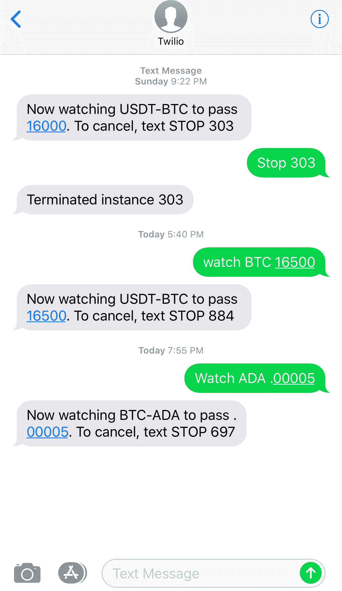

# 无服务器和比特币——动态创造价格观察者

> 原文：<https://medium.com/hackernoon/serverless-and-bitcoin-creating-price-watchers-dynamically-beea36ef194e>

[比特币](https://hackernoon.com/tagged/bitcoin)在上个月达到了一个新的宣传水平。如果你花过时间研究比特币，你就会知道它非常不稳定，价格可以在几分钟内上下波动。我是一个相当厌恶风险的人，所以我没有把太多的个人资金投入比特币，但我很幸运地在 2013 年购买了一小部分，作为一项实验，现在已经有了相当大的增长。我一直在做一点交易和交换，以充分利用它——但考虑到当前价格的巨大可变性，我很难跟上当前价格。

我不需要经常查看比特币基地或 Bittrex，而是希望获得关于我拥有或想要的硬币的提醒。我想要一种方法，当越过正确的阈值时，自动购买或出售硬币。前几天晚上，我开始构建一个无服务器的加密货币观察器——我可以通过从我的手机上发送类似“观察 btc 18000”的文本来指定新的观察器——当硬币超过限制时，它会提醒我。我很高兴地说，这个星期我就做了这个，而且从那以后一直使用得很成功。这是它是如何组合在一起的。

# 无服务器“观看”模式

当您只有一个或静态数量的观察器时，在无服务器中观察事件可以相当简单。例如，前几周我构建了一个 Azure 函数来观察 ring.com 门铃的新事件[。](/@jeffhollan/serverless-doorbell-azure-functions-and-ring-com-f24b44e01645)这种模式在计时器上有一个单一的功能，可以唤醒并检查物品。然而，在这种情况下，我希望有一个动态的观察者“池”。有一天，如果以太币超过 813 美元，我可能会要求一个观察者观察它，三个小时后，我希望一个平行的观察者检查莱特币。虽然任务本身看起来很简单，但在云中构建持久的托管可能很棘手。你如何吸引新的观察者？一个守望者能跑多久？它们耐用吗？可以终止一个观察者吗？另外，当使用无服务器时:**我怎样才能让我的观察者存在的时间比传统的 5-10 分钟更长？**

我考虑了几个选项来在无服务器堆栈上实现这一点:

1.  为每个观察者创建新的 [Azure](https://hackernoon.com/tagged/azure) 函数。将有一个“主”功能，它将接收文本消息请求，然后根据我想要的阈值在计时器触发器上部署完整的 Azure 功能。**缺点:**对于这种类型的场景来说不是“一流”的模式。创建一个全新的函数是一个相对昂贵的操作——特别是对于像我希望这些观察器那样短暂的东西(只观察大约一周，一旦超过阈值，它就应该消失)。使用此选项，处理工人的拆卸和管理可能会变得相当复杂。
2.  [使用 Azure Logic Apps](https://docs.microsoft.com/en-us/azure/logic-apps/logic-apps-what-are-logic-apps) 每当有请求进来时，就触发一个“观察者”的编排。从功能上来说，所有的部分都在那里，这是可行的。**缺点:**比选项 1 好得多，但这意味着我需要将 Azure 功能和逻辑应用作为独立的资源来管理。为诸如“while”循环之类的东西做更复杂的条件通常比仅仅写一个 C#表达式更复杂。
3.  [使用 Azure 持久功能](https://docs.microsoft.com/en-us/azure/azure-functions/durable-functions-overview)在请求到来时编排一个“观察者”。允许我编写可以无限期存在的 Azure 函数。与选项 2 非常相似，但所有编排都存在于具有持久扩展的功能应用程序中。允许我在代码中编写编排逻辑，并在同一个应用程序中编写功能。**缺点:**比逻辑应用程序更难监控活动的观察器，在逻辑应用程序中，我可以看到所有活动的运行，它们处于哪个步骤，以及失败。还需要为这些步骤编写所有代码，而不是在 Logic 应用程序中利用类似“Twilio”的 SMS 连接器。

第 2 条和第 3 条都非常有效，但是因为我想在类似于观察者的“成功条件”这样的事情上有更多的灵活性，所以我选择了持久函数。这是我制作的最复杂的配器，但是它工作起来没有任何问题，并且对我的选择很满意。

# 创建具有持久功能的持久观察器

第一个函数接收开始观察硬币的请求，并启动一个新的观察器进程。我创建了一个 HttpWebhook 函数，它监听一个 Twilio webhook，每当我向一个特定的号码发送文本时，它就会通知我的函数。我解析发送的命令(“watch”或“stop”)，然后为一个观察器创建一个新的编排。

硬币监视器是持久函数的一个实例。在这种情况下，持久函数是一个 while 循环:“当当前价格低于阈值价格时，继续检查价格。”为了确保多年来没有观察器检查，我还对 while 循环进行了限制(可通过应用程序设置进行设置，现在如果没有达到阈值，我会有一个观察器在 1 周后超时)。我还添加了一个延迟，这样我就不会连续快速地检查价格。

以下是硬币观察者持久编制器的代码:

有几个标注值得详述:当一个持久函数运行时，它管理短期函数中运行的长期进程的方式是利用在`context`中检索的状态，并重放该函数以在下一步继续。这意味着你需要在你的持久函数中非常小心，以便重放提供确定的和一致的结果。你会注意到，为了获得当前时间，我实际上利用了表达式`context.CurrentUtcDateTime`的上下文，而不是像`DateTime.Now`这样的东西，因为`context`将在重放时返回相同的值，所以不会丢弃其他条件。

我还在 while 循环中添加了一个延迟，这样我就不会受到 exchange API(在本例中是 Bittrex)的限制。我用下面一行代码添加了 15 分钟的延迟，这一行代码从我的 Azure 应用程序设置中下拉了延迟间隔(这样我就可以自定义而不必重新部署)。

`await context.CreateTimer(context.CurrentUtcDateTime.AddMinutes(double.Parse(Constants.DelayInterval)), CancellationToken.None);`

像“send_message”和“watcher_getticker”这样被调用的动作是什么？这些只是简单的 Azure 函数，如下所示:

现在，每当我发送类似“观看 eth 900”的文本时，一个持久的实例就会旋转起来，并继续检查以太坊的价格，直到它超过 900 美元或 while 循环超时(如果我想续订，它会发送一条友好的文本消息通知我超时)。

# 终止活动实例

构建时最令人惊喜的事情之一是终止一个活动实例是多么容易。你可能从上面的截图中注意到，我提供了一种通过发送“STOP”和一些 ID 来取消观察者的方法。每当持久 orchestrator 启动时，它都会返回一个实例 ID。我可以很容易地回复“停止{instanceId}”并完成。但是实例 ID 是类似于`fe5cb9b39e0445f4b751d95fc6410ade`的 GUID，在电话上键入会很麻烦。所以每当我创建一个实例时，我都会在 Azure 表存储中为它创建一个别名。在我的例子中，我生成一个介于 1-1000 之间的数字。我知道，我知道..这意味着每个电话号码会发生 1/1000 次冲突，但我只计划一次有 4 个左右的观察者活跃，并选择容易打字而不是高熵。如果有人想打开一个拉请求，以生成一个 4 字符大小写敏感的字母数字别名，我会很乐意接受它😀。

一旦接收到 stop 命令，我将它映射到实例 ID，并可以用我的主函数中的一行代码终止实例:

`await starter.TerminateAsync(((Alias)result.Result).Id, “User requested terminate”);`

这正是我所需要的，而且非常容易实现。

# 扩展观察器模型

这真的只是我想要建设的开始。我计划扩展上面的“send_event”函数，也向 Azure Event Grid 发出一个事件。当我用更多的信息来补充我的请求时，它也可以在超过阈值时触发硬币的自动购买或出售。

我无法表达我有多喜欢在云中创建这些小逻辑，让它们“整天、每天”运行，但只为我主动消耗的计算时间付费。

[整个解决方案在这里](https://github.com/jeffhollan/functions-durable-csharp-bittrex-watcher)签入 GitHub，如果你想部署自己的，应该与 Visual Studio 2017 中的 Azure Functions 工具兼容。这是写在。NET Core 也可以跨平台编译和运行。

 [## jeffhollan/functions-durable-cs harp-bittrex-watcher

### Azure 功能可以监控 Bittrex 上的硬币价格，并在超过阈值时通过短信通知。利用 Azure…

github.com](https://github.com/jeffhollan/functions-durable-csharp-bittrex-watcher)