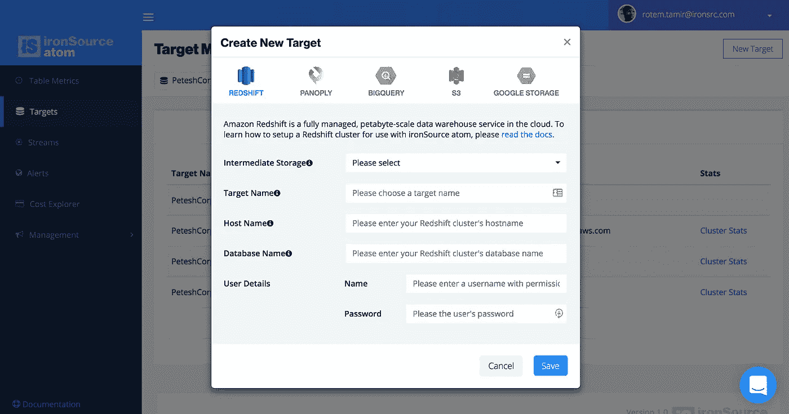

# 无服务器应用程序:使用 AWS Lambda 和 API 网关的连续交付—第 2 部分:部署 Lambda

> 原文：<https://medium.com/hackernoon/serverless-applications-continuous-delivery-with-aws-lambda-and-api-gateway-part-2-deploying-87e3a95236f8>

We built a serverless microservice to manage our customers’ pipeline configuration in [ironSource atom](https://ironsrc.com/atom)

## 概述

在本系列的[前一部分](/@rotemtam/serverless-applications-continuous-delivery-with-aws-lambda-and-api-gateway-part-1-unit-tests-e517aa1cd09e#.3ozw2q6nd)中，我们开始讲述我们在 [ironSource atom](http://ironsrc.com/atom) 中创建的无服务器微服务的故事，以帮助我们管理客户大数据管道的配置。我们讨论了我们从与 [AWS](https://hackernoon.com/tagged/aws) Lambda 和 API Gateway 的合作中获得的巨大收益，以及在我们的生产环境中的普遍安心。但是我们也回顾了开发过程中的一些痛点。这些痛点让我们踏上了构建部署无服务器微服务的自动化流程的道路。

在这个三部曲的第一部分(你现在正在阅读“帝国反击战”)中，我们讨论了在 Node.js 中为我们的 Lambda 函数设置适当的单元测试，因此我们可以在自己的机器上愉快地开发。

在这一部分中，我们将描述一些我们采用的工具和我们开发的与 AWS Lambda 实际交互的实践，因为直接使用 Amazon 的 UI 会很麻烦并且容易出错。

## 引入 Apex

首先，目前市场上有几种工具可以帮助简化 Lambda 的工作流程，从小型实用程序库到成熟的解决方案，如“[无服务器](http://serverless.com/)”(现在处于测试阶段)。评估不同的解决方案时，我们选择了 [Apex](http://apex.run) 。它的简约方式吸引了我们，它有很好的文档记录，并且似乎有一个相当规模的开发者社区(目前 GitHub 上有超过 3.5k 颗星)。

Apex 易于使用，并且有良好的文档记录，因此我不会在这里详细介绍如何设置或开始使用它。相反，我更愿意回顾一下我们在团队中是如何使用它的。Apex 依赖于一些非常简单的 JSON 文件来描述配置，并依赖于项目的预定义结构。在本帖中，我们将致力于一个假设的微服务，它允许其他人在 GitHub 中搜索存储库。该服务将公开一个端点:*“GET/repos”*并接收查询字符串中的输入，如*“/repos？q=rotemtam"* 。使用 Apex，我们的示例项目结构如下所示:

Apex sample project structure (view the source [here](https://github.com/rotemtam/serverless-ci-example))

*   在我们项目的 *"src/"* 目录中，我们有一个 *project.json* 文件，它向 Apex 描述了项目的一般情况
*   我们有一个*函数*目录，每个 Lambda 函数都有一个单独的目录。
*   在每个函数的目录中，我们有一个 *function.json* 文件来描述这个特定函数的配置。
*   我们稍后将进入 Dockerfile 和" *infra/"* 目录。

当我们运行 *"apex deploy"* 时，apex 将在我们的 AWS 帐户中创建新版本的功能并更新配置。

## 共享函数间的依赖关系

TJ Holowaychuk(Apex 的创建者之一)最近发表了一篇关于 Medium 的文章，里面有一些“[AWS Lambda](/@tjholowaychuk/dos-and-don-ts-of-aws-lambda-7dfcab7ad115#.wd4iyh5nz)的该做和不该做的事情”，其中一条与我们的话题非常相关:“不要用编写好的库来代替 FaaS”，这基本上意味着你实际的 Lambda 函数应该非常小。您应该利用您的语言中的包/模块系统，将您需要的任何逻辑封装在普通模块中并使用它。一般的经验法则是:在 Lambda 函数中处理输入和高级流控制，剩下的交给你的库。这样，您可以在其他上下文中轻松地重用它们。

还记得我们假设的搜索 GitHub 的微服务吗？好吧，假设它包含一个 Lambda 函数，该函数接受一个字符串 *q* 作为输入，并使用它在 GitHub 中搜索名称中包含该字符串的存储库。没有理由在我们的 Lambda 函数中包含对 GitHub API 的调用。相反，我们可以这样做:

它依赖于这样一个“存储库”模块:

默认情况下，Apex 将获取函数目录中的任何内容，将其放入 zip 文件并上传到 Lambda。所以基本上，如果你想包括你写的任何模块或来自 NPM 的第三方的东西，你需要把它放在那里。这对于只有一个函数的项目来说很好，但是如果有几个共享模块的函数呢？你会为每个函数创建一个 Node.js *package.json 文件*并管理每个函数的依赖关系吗？将您的自定义模块复制并粘贴到每个文件夹中？

## 使用 Webpack 和 Apex 挂钩创建可部署的工件

幸运的是，Apex 允许您通过指定生命周期挂钩来自定义您的构建过程，即自定义*“构建”*和*“清理”*命令。我们利用这一点来利用 [Webpack](https://webpack.github.io/) 来创建我们可部署的工件。在构建时，webpack 将智能地创建一个 Javascript 文件，apex 将压缩并部署该文件。这里有一个 Apex *project.json* 文件的示例，取自我们的[示例回购](https://github.com/rotemtam/serverless-ci-example):

这种方法的唯一警告是官方的 AWS Javascript SDK 与 Webpack 不兼容。查看[该讨论](https://github.com/apex/apex/issues/217#issuecomment-194240278)以了解更多信息。对我们来说幸运的是，原来 SDK 是预先捆绑在 Lambda 上下文中的(非常感谢[维克托·德尔加多](https://github.com/vdel26)指出了这一点)，所以我们基本上可以告诉 webpack 在我们的 webpack 配置中忽略它:

## 将事物连接到 CI/CD 服务

我们流程的下一部分是将它连接到 CI/CD 服务。我们目前使用 [Jenkins](https://jenkins.io/) 和 [Codefresh](https://codefresh.io/) 来构建我们的版本，但这可以很容易地用任何其他服务来完成。让我们列出微服务构建工作的要求:

*   安装所有必需的软件包，安装 Apex。
*   运行单元测试，如果失败就退出。
*   运行“apex deploy”将我们的 Lambda 函数推向生产。
*   (构建一个描述我们的 API 网关的 Swagger 文件)——我们将在下一篇文章中讨论这个问题
*   (重新部署我们的 API 网关)—即将推出！

## 在 Docker 容器中构建

如果不在某个地方使用 Docker，没有一个真正的 hip 部署过程是完整的，对吗？不过说真的，在构建过程中使用 Docker 有很多好处。

人们通常认为 Docker 容器用于运行生产任务。Docker 容器确实是完全控制代码运行环境的好方法。使用 Docker，您可以拥有生产环境的精确副本。但是同样的好处也适用于任何其他类型的任务，真的。通过在 Docker 中运行 CI/CD 任务，您可以完全控制事情发生的方式，并且可以使用任何您喜欢的工具。我通常发现在 Docker 容器中运行我的构建更容易(也更快)。这里有一个 docker 文件，我会用它来完成我们上面描述的任务:

## 我们最终的构建脚本

我们的构建脚本可能如下所示:

让我们来分解一下:

*   根据构建作业运行的位置，您可能需要设置 AWS 环境变量。例如，如果您从一个 EC2 实例运行，该实例有一个允许它与 Lambda 交互的角色，那么您就不需要它。
*   Apex 需要知道它将部署到哪个区域，这是我们使用 *$AWS_REGION* 环境变量设置的
*   我们首先在我们的容器中运行*“NPM 测试”*，如果所有单元测试都通过了，我们继续。
*   如果一切正常，我们继续在我们的容器中运行*“apex build”*。

我们把这个构建脚本插入到我们用来构建代码的任何系统中，然后砰！我们有一个自动化的 CI/CD 流程来处理 AWS Lambda！

## 包扎

*   在本系列的前一篇文章中，我们讨论了如何为 Lambda 函数设置单元测试。
*   在这篇文章中，我们概述了如何创建一个自动化的工作流来将 Lambda 函数部署到生产环境中。
*   在这个三部曲的第三部也是最后一部(《绝地归来》)中，我们将回顾我们如何设置 API Gateway 来使我们的服务作为 RESTful Web API 可用，以及我们如何用我们编写的一个很酷的工具来自动化持续部署它的繁重工作。

回头见！