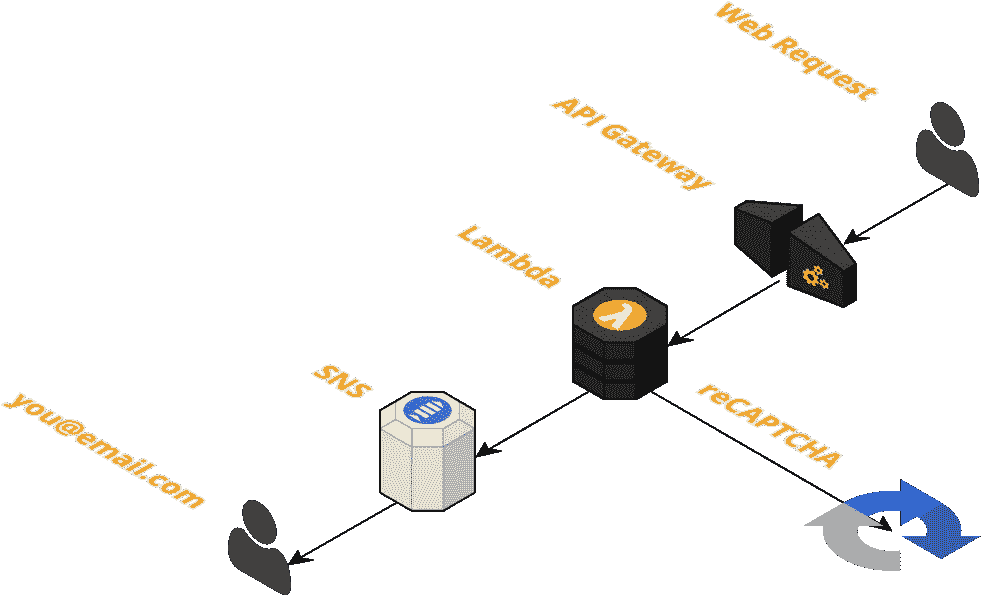

# 静态网站的无服务器“联系我们”表单

> 原文：<https://medium.com/hackernoon/serverless-contact-us-form-for-static-websites-facccb7be27f>

## 启动简单、易于使用、可扩展且价格低廉！



Serverless ‘Contact Us’ Stack

你是否曾想在你的静态网站上添加一个“联系我们”的表单，但又不想花钱买一个全天候运行的后端服务器来处理这些请求？我也是。这就是为什么我建立了这个[便利的云形成栈](https://github.com/thestackshack/serverless-contact-us-form)，它通过 AWS API 网关& Lambda 创建一个单一的 API 端点。

后端验证 Google reCAPTCHA 并通过 SNS 发送电子邮件。

> 只需启动 CloudFormation 堆栈并添加您的“联系我们”表单！就这么简单。

[](https://console.aws.amazon.com/cloudformation/home#/stacks/new?stackName=&templateURL=https://s3.amazonaws.com/thestackshack/serverless-contact-us-form/cloudformation.yml)

click here to launch the stack

# 让我们看看这个堆栈是如何工作的

你可以在这里看到整个筹码。

## 输入参数

有 2 个输入参数:

1.  **电子邮件地址** —您希望“联系我们”表单提交到的电子邮件地址。您必须使用此地址验证 SNS 主题订阅。
2.  **reCAPTCHA secret**——你可以在这里获得你的 reCAPTCHA 秘密:[https://www.google.com/recaptcha/admin](https://www.google.com/recaptcha/admin)

```
**Metadata:
  AWS::CloudFormation::Interface:
    ParameterGroups:** -
        **Label:
          default:** "Configuration"
        **Parameters:** - ToEmailAddress
          - ReCaptchaSecret
**Parameters:
  ToEmailAddress:
    Type:** String
    **Description:** Email address you want contact form submittions to go to
  **ReCaptchaSecret:
    Type:** String
    **Description:** Your Google reCAPTCHA secret
```

*元数据*部分描述了当您使用此模板时，哪些参数将显示在 AWS CloudFormation“创建新堆栈”向导中。这使得用户只需点击上面的按钮就可以轻松创建他们的堆栈。

## 社交网络话题

我们用一个内嵌订阅创建了一个新的 SNS 主题。订阅是您提供的电子邮件地址。我们处理“联系我们”表单提交的 Lambda 会将表单发布到 SNS 主题，然后 SNS 主题会向您发送电子邮件。

```
**ContactUsSNSTopic:
  Type:** AWS::SNS::Topic
  **Properties:
    DisplayName:
      Fn::Join:** - ''
        - - **Ref:** AWS::StackName
          - ' Topic'
    **Subscription:** - **Endpoint:** !Ref ToEmailAddress
        **Protocol:** email
    **TopicName:
      Fn::Join:** - ''
        - - **Ref:** AWS::StackName
          - '-topic'
```

## Lambda IAM 角色

我们需要为 Lambda 创建一个 IAM 角色，赋予 Lambda 访问其他 AWS 资源的权限。

```
*#
# Role that our Lambda will assume to provide access to other AWS resources
#* **IamRoleLambdaExecution:
  Type:** AWS::IAM::Role
  **Properties:
    AssumeRolePolicyDocument:
      Version:** '2012-10-17'
      **Statement:** - **Effect:** Allow
          **Principal:
            Service:** - lambda.amazonaws.com
          **Action:** - sts:AssumeRole
    **Path:** '/'

*#
# Create a Policy and attach it to our Lambda Role.
#* **IamPolicyLambdaExecution:
  Type:** AWS::IAM::Policy
  **Properties:
    PolicyName:** IamPolicyLambdaExecution
    **PolicyDocument:
      Version:** '2012-10-17'
      **Statement:** - **Effect:** Allow
        **Action:** - logs:CreateLogGroup
          - logs:CreateLogStream
        **Resource:** arn:aws:logs:us-east-1:*:*
      - **Effect:** Allow
        **Action:** - logs:PutLogEvents
        **Resource:** arn:aws:logs:us-east-1:*:*
        **Resource:** '*'
      - **Effect:** Allow
        **Action:** - sns:Publish
        **Resource:** !Ref ContactUsSNSTopic
    **Roles:** - **Ref:** IamRoleLambdaExecution
```

我们的 Lambda 需要访问 AWS CloudWatch 日志，这样它才能写日志。它还需要**发布**访问我们的 SNS 主题，这样它就可以发布到主题。

## 希腊字母的第 11 个

我们的 lambda 通过 API Gateway 接收“联系我们”表单提交，然后将表单细节发布到我们的 SNS 主题。

我们在 CloudFormation 模板中内嵌了 Lambda 代码。我们这样做是为了有一个简单的部署过程。用户只需点击上面的按钮即可部署整个堆栈。

我们还想在代码中引用 CloudFormation 参数。参见`${ReCaptchaSecret}`和`${ContactUsSNSTopic}`。

如果 lambda 大于 4096 个字符，你就不能内嵌它，你必须先把 Lambda 上传到 S3，然后包含一个引用。

```
**ContactUsFunction:
  Type:** AWS::Lambda::Function
  **Properties:
    Handler:** index.handler
    **Timeout:** 5
    **Role:
      Fn::GetAtt:** - IamRoleLambdaExecution
        - Arn
    **Code:
      ZipFile:** !Sub | 
        <inline code>
  **Runtime:** nodejs6.10
```

λ代码:

看看我们添加的 CORS 标题。当发布到 API 网关端点时，这些是必需的。

```
headers: {
  "Access-Control-Allow-Origin" : "*", // Required for CORS support to work
  "Access-Control-Allow-Credentials" : true // Required for cookies, authorization headers with HTTPS
},
```

## API 网关

`AWS::ApiGateway::RestApi`资源包含一组 Amazon API 网关资源和方法，可以通过 HTTPS 端点调用。

```
**ApiGatewayContactUs:
  Type:** AWS::ApiGateway::RestApi
  **Properties:
    Name:** ApiGatewayContactUs
```

`AWS::ApiGateway::Resource`资源在 Amazon API Gateway(API Gateway)API 中创建一个资源。

```
**ApiGatewayResource:
  Type:** AWS::ApiGateway::Resource
  **Properties:
    ParentId:
      Fn::GetAtt:** - ApiGatewayContactUs
        - RootResourceId
    **PathPart:** api
    **RestApiId:
      Ref:** ApiGatewayContactUs
```

现在我们需要添加两个方法的`Options`和`Post`。`Options`方法将处理 CORS 标题，而`Post`方法将处理“联系我们”表单提交。

CORS 期权方法:

```
**ApiGatewayMethodOptions:
  Type:** AWS::ApiGateway::Method
  **Properties:
    AuthorizationType:** NONE
    **ResourceId:
      Ref:** ApiGatewayResource
    **RestApiId:
      Ref:** ApiGatewayContactUs
    **HttpMethod:** OPTIONS
    **Integration:
      IntegrationResponses:** - **StatusCode:** 200
        **ResponseParameters:
          method.response.header.Access-Control-Allow-Headers:** "'Content-Type,X-Amz-Date,Authorization,X-Api-Key,X-Amz-Security-Token,X-Amz-User-Agent'"
          **method.response.header.Access-Control-Allow-Methods:** "'POST,OPTIONS'"
          **method.response.header.Access-Control-Allow-Origin:** "'*'"
          **method.response.header.Access-Control-Allow-Credentials:** "'false'"
        **ResponseTemplates:
          application/json:** ''
      **PassthroughBehavior:** WHEN_NO_MATCH
      **RequestTemplates:
        application/json:** '{"statusCode": 200}'
      **Type:** MOCK
    **MethodResponses:** - **StatusCode:** 200
      **ResponseModels:
        application/json:** 'Empty'
      **ResponseParameters:
          method.response.header.Access-Control-Allow-Headers:** false
          **method.response.header.Access-Control-Allow-Methods:** false
          **method.response.header.Access-Control-Allow-Origin:** false
          **method.response.header.Access-Control-Allow-Credentials:** true
```

发布方法:

```
**ApiGatewayMethodPost:
  Type:** AWS::ApiGateway::Method
  **Properties:
    HttpMethod:** POST
    **RequestParameters:** {}
    **ResourceId:
      Ref:** ApiGatewayResource
    **RestApiId:
      Ref:** ApiGatewayContactUs
    **AuthorizationType:** NONE
    **Integration:
      IntegrationHttpMethod:** POST
      **Type:** AWS_PROXY
      **Uri:
        Fn::Join:** - ''
          - - 'arn:aws:apigateway:'
            - **Ref:** AWS::Region
            - ':lambda:path/2015-03-31/functions/'
            - **Fn::GetAtt:** - ContactUsFunction
              - Arn
            - '/invocations'
    **MethodResponses:** []
```

这个方法使用 Api 网关`AWS_PROXY` Lambda 集成类型。

> 在 API Gateway REST API 中用`AWS_PROXY`表示的 Lambda 代理集成用于在后端集成方法请求和 Lambda 函数。使用这种集成类型，API Gateway 应用默认映射模板将整个请求发送到 Lambda 函数，并将 Lambda 函数的输出转换为 HTTP 响应。

`AWS::ApiGateway::Deployment`资源将 Amazon API Gateway(API Gateway)`[RestApi](http://docs.aws.amazon.com/AWSCloudFormation/latest/UserGuide/aws-resource-apigateway-restapi.html)`资源部署到一个阶段，以便客户端可以通过互联网调用 API。舞台就像一个环境。

```
**ApiGatewayDeployment:
  Type:** AWS::ApiGateway::Deployment
  **Properties:
    RestApiId:
      Ref:** ApiGatewayContactUs
    **StageName:** prod
  **DependsOn:** - ApiGatewayMethodPost
  - ApiGatewayMethodOptions
```

最后，我们需要授予 Api 网关端点调用 Lambda 的权限。

```
**ContactUsFunctionPermission:
  Type:** AWS::Lambda::Permission
  **Properties:
    Action:** lambda:invokeFunction
    **FunctionName:
      Ref:** ContactUsFunction
    **Principal:** apigateway.amazonaws.com
    **SourceArn:
      Fn::Join:** - ''
        - - 'arn:aws:execute-api:'
          - **Ref:** AWS::Region
          - ':'
          - **Ref:** AWS::AccountId
          - ':'
          - **Ref:** ApiGatewayContactUs
          - '/*/*'
```

## 输出

我们现在在我们的云形成脚本的末尾。让我们输出新的 API 网关端点，以便在“联系我们”表单中使用它。

```
**Outputs:
  ApiUrl:
    Description:** URL of your API endpoint
    **Value:** !Join
      - ''
      - - https://
        - !Ref ApiGatewayContactUs
        - '.execute-api.'
        - !Ref 'AWS::Region'
        - '.amazonaws.com/prod/api'
```

# 让我们看看“联系我们”表单是如何工作的

## HTML

我们使用 Bootstrap 作为 CSS 框架。在表单操作属性中使用 API 网关 url。

## JavaScript

当我发布 JSON 对象时，我遇到了一个 CORS 问题。当我发布一个 stringified JSON 对象时，它工作了。

这不起作用:

```
$.post(url, {}, function(data) {}, 'json');
```

这确实有效:

```
$.post(url, **JSON.stringify({})**, function(data) {}, 'json');
```

## 一些 CSS

```
.errors {
    color: red;
    display: none;
}.thanks, .sending {
    display: none;
}.grecaptcha-badge {
    float: right;
}
```

# 结论

我希望你喜欢这篇文章，我也希望这个 CloudFormation 模板能让一些开发人员的生活稍微轻松一些。请让我知道你的想法。