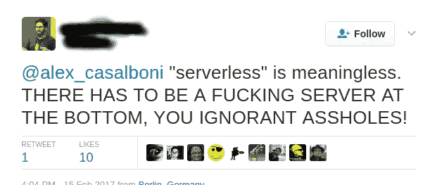

# 三分钟后“无服务器”

> 原文：<https://medium.com/hackernoon/serverless-in-three-minutes-9831d5db7a77>

[想象一下](https://hackernoon.com/tagged/imagine)你正在面试某个 IT 职位的人，她说他不明白“*要上云*，因为大家都知道*的天空*没有数据中心。

大家都知道*云计算*中的 ***云*** 只是一个名字。

然而，令人惊讶的是，有多少人有类似的想法。你和 IT 部门的人聊起“*无服务器*”时，她说“*无服务器*没有任何意义。代码必须在服务器上运行”。

Quite common opinion

我知道[技术](https://hackernoon.com/tagged/technology)变化很大。有时候名字不是很透明。我们不能追逐最新的流行语。当云到来时，许多公司/组织仍在处理虚拟化。然后，毫无停顿地，容器似乎是最热门的东西。

> “我没有时间讨论‘无服务器’，不管那是什么意思”。

接下来是关于这个话题的三分钟阅读。

## 什么是无服务器？

无服务器没有简单的定义。

但你很忙，所以我就开门见山了。

你开发功能。小小的**独立的**代码块。

我们不是在谈论静态页面或仅移动或单页应用程序。你为后端开发代码。

是的，你的代码将在服务器上运行。但是您不需要安装或配置这些服务器。对你来说，就好像没有服务器一样。

> 你的代码将在服务器上运行。
> 
> 但是你看不到他们

事实上，[你的函数将会在容器](https://aws.amazon.com/blogs/compute/container-reuse-in-lambda/)中运行，而容器可能会在服务器上运行。但是你不关心服务器，也不关心容器。

你部署**功能**。

## 那么，为什么嗡嗡声？

我们部署打包应用程序已经有 15 年或更长时间了。现在我们有了容器，部署容器没有问题。

为什么要从功能上发展？为什么这么吵？

Pancakes…

原因有三:

1.  使用无服务器，您“几乎”拥有无限的可扩展性。您不再需要决定将多少台服务器专用于某项工作。您的提供者会根据您的需要创建尽可能多的“函数实例”，并在不需要时销毁它们。
2.  使用无服务器，您需要按使用付费。真正的用途。而不是服务器启动和空闲。你为每一个被执行的代码付费。
3.  有了无服务器，我们鼓励你从小处着眼，独立思考。

## 我的节目不是“你好世界”！！！

是的，我听到你在尖叫。

> “如果我只创建函数，我该怎么做有用的事情呢？"

您知道如何创建应用程序，甚至微服务。你应该如何从函数中创建一个完整的应用程序？

有[多种选择](http://www.allthingsdistributed.com/2016/06/aws-lambda-serverless-reference-architectures.html)。

但是您应该知道无服务器在两种边缘情况下都很有效:

*   对参数进行操作、查询数据库和返回内容的 API 端点。特别好的搭配[其他祭品](https://aws.amazon.com/api-gateway/)。
*   大数据的事件驱动或消息驱动[应用](https://youtu.be/VFLKOy4GKXQ?t=1456)。

## 我不想被困在 AWS 里

你没必要这么做。

所有主要供应商都有类似的技术: [AWS](http://docs.aws.amazon.com/lambda/latest/dg/welcome.html) 、 [Google](https://cloud.google.com/functions/docs/) 、 [Microsoft](https://azure.microsoft.com/en-gb/services/functions/) 、 [IBM](https://console.ng.bluemix.net/openwhisk/) 。

甚至有一个名为[Open 晶须](https://github.com/openwhisk/openwhisk)的 Apache 项目(基于 IBM 的代码)

## 好吧，这可能很有趣。现在怎么办？

无服务器仍在发展。您可能需要等待。

它将是巨大的。你可能想做一些小项目。[玩耍](https://serverless.com/framework/docs/)。

*如果你喜欢这个条目，你也可以喜欢* [*关闭你的服务器*](/@gonfva/shut-down-your-servers-15a7b3f6fe20#.xkftkpisf) *。*

> [黑客中午](http://bit.ly/Hackernoon)是黑客们开始他们下午生活的方式。我们是 [@AMI](http://bit.ly/atAMIatAMI) 家族的一员。我们现在[接受提交](http://bit.ly/hackernoonsubmission)并很高兴[讨论广告&赞助](mailto:partners@amipublications.com)的机会。
> 
> 如果你喜欢这个故事，我们推荐你阅读我们的[最新科技故事](http://bit.ly/hackernoonlatestt)和[趋势科技故事](https://hackernoon.com/trending)。直到下一次，不要把世界的现实想当然！

