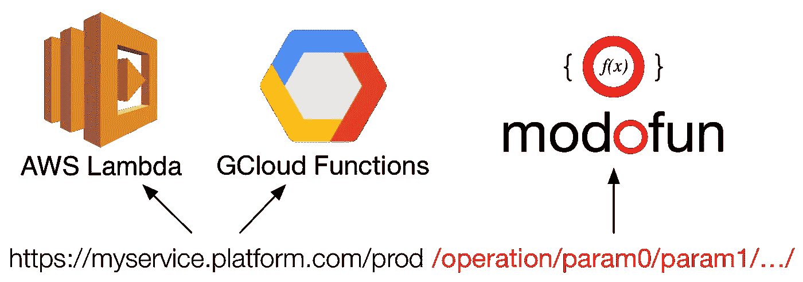
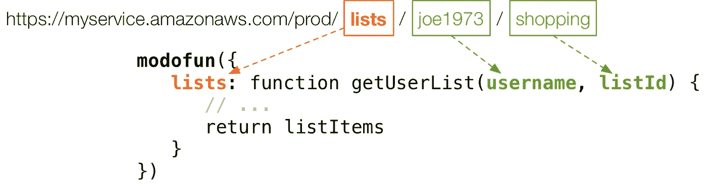

# 无服务器:Node.js 中模块化功能的适度乐趣

> 原文：<https://medium.com/hackernoon/serverless-moderate-fun-with-modular-functions-df98ca6cb981>

## 以纯功能和可组合的方式，高效地构建和部署 Javascript 模块到无服务器云。


我爱 [Node.js](https://nodejs.org) 。通过它我重新发现了 [Javascript](https://hackernoon.com/tagged/javascript) ，我再也不会回去了。我也爱[快车](http://expressjs.com)。它使编写服务器应用程序变得如此简单，并且其基于 [Connect](https://github.com/senchalabs/connect) 的中间件堆栈方法使扩展和编写应用程序变得简单而有趣。 [Node.js](https://hackernoon.com/tagged/nodejs) ，结合 Express 这样的框架，对于微服务来说非常棒。由于它的轻量级特性、非阻塞特性和快速开发经验，它击败了(imho)其他微服务技术，如 Spring Boot。将它与 Docker 结合起来，就没有限制了(…只要您为您的容器集群分配足够的资源)。

# 比小更小

首先，他们给了我们*服务器*，所以我们构建了*面向服务的架构*。
然后他们给了我们*容器*，于是我们建立了*微服务*。

现在他们给了我们**事件处理程序**，所以我们将构建**云函数**。

随着我们使我们的托管平台更适合于部署更小的单元，我们的应用程序也被分解成更小的软件包。这有很多原因，是否是好事众说纷纭。但是，如果我们回头看看云计算背后的最初概念，人们曾梦想让代码无限分布在一个由连接的计算节点组成的网络中。随着无服务器平台的出现，我们离成功越来越近了。

# 但不要太小

我们不能太小，因为我们有由计算步骤序列组成的块(过程),这些计算步骤需要共享内存来有效地执行。然后，我们将它们包装在一个函数定义中，该定义为其输入和输出定义了一个契约，这允许它与其他这样的函数组合在一起。

这种方法在 Unix 架构中非常成功，这也是它经久不衰和无处不在的原因之一。我并不是说 Web 应用程序应该遵循类似的基于云的共享生态系统(尽管[有些](https://stdlib.com)正在尝试)，但是我确实相信我们可以从构建 Web 应用程序时应用类似的原则中受益。

除了函数定义，我们还将密切相关的函数分组到模块中。一个例子是给定域内数据的 CRUD 操作(例如用户管理)。那些倾向于共享代码，例如公共对象模型、解析逻辑、格式等。因此，如果我们在无服务器环境中部署单独的功能，我们最终会得到一堆重复的代码。

但是让我们假设我们不介意重复的代码部署。毕竟，我们仍然可以在我们的代码库中适当地管理它。但是，我们可能仍然希望共享临时资源，比如数据库连接。我们可能还希望确保同一个域的所有操作都作为一个单元进行部署和管理。

这非常符合[单一责任原则](http://programmer.97things.oreilly.com/wiki/index.php/The_Single_Responsibility_Principle):

> 把那些因同一原因而改变的东西集合在一起，把那些因不同原因而改变的东西分开。

# 走向无服务器

所以，Node.js 非常适合微服务。而且对于编写更小的功能模块也很棒。Express 非常适合在 Node.js 中构建 Web 应用程序。

然而，大多数无服务器环境(AWS Lambda、Google Cloud Functions 等)已经提供了许多现成的工具来处理 Web 服务器的常见功能。对于这些*纳米服务*，不应该有太多的功能，我们真的不应该被复杂的网络服务器逻辑的开销所困扰。我们当然应该利用 HTTP，因为它是在 Web 服务之间传输消息的无处不在的传输机制，但是我们应该以一种更像 RPC 的方式来做。

这是大多数当前框架为我们正在寻找的小足迹提供太大工具的地方。如果有什么不同的话，我认为无服务器化应该让我们从框架中解放出来，转而专注于构建更纯粹的 T2 功能。然而，在*纳米服务*中仍然需要基本的路由，以便将传入的请求映射到适当的处理函数。此外，由于这些商业无服务器环境的专有性质，有必要进行一定程度的抽象，以便我们的功能可以与执行它们的平台的细节分离。

我认为，更多的应用程序将很快出现，这些应用程序专注于支持应用于无服务器部署的函数式编程，我对此充满希望，因为这感觉像是朝着正确方向迈出的一步。当然，还有许多现实世界的问题需要解决，比如延迟、性能、内存使用等。但就像微服务一样，我相信我们会找到一套正确的工具和实践来实现这一点，不仅实用，而且在现实世界的应用中具有高性能。

# 模块化功能

当我开始部署无服务器应用程序时，我编写了一个小的包来解决这些需求: [modofun](https://modofun.js.org) 。



它没有额外的依赖性，因为我们希望我们的部署尽可能小，并且它被限制在大约 100 行代码。它的目标是添加足够的(而不是更多的)功能，使在无服务器平台上部署功能模块更容易，并利用为现有框架(如 Express)构建的现有中间件的额外好处。以下是它的一些特点:

*   功能的基本路由
*   参数解析
*   自动 HTTP 响应构建
*   支持 ES6 承诺(或任何其他当时可能的承诺)
*   类似连接/快速的中间件支持
*   **谷歌云功能**
*   **AWS Lambda** (带有 AWS API 网关事件)
*   自动错误处理

将现有模块公开为无服务器云功能很容易:



一个*有意地*简化的路由器将传入的请求映射到函数，并将 URL 路径的附加部分作为函数参数传递。额外的请求数据也可以作为函数调用的上下文(this)使用。

将 modofun 应用于功能模块时，您还可以重复使用现有的中间件组件，每次都可以执行，或者只用于某些功能(更多详细信息请参见[文档](https://modofun.js.org/#configuration))。然后，它返回由无服务器平台(目前支持 AWS 和 Google Cloud)生成的事件的处理程序。

用 [npm](https://www.npmjs.com/package/modofun) 得到它:

```
npm install modofun
```

你可以在官方网站找到更多的例子和详细的文档:【https://modofun.js.org[。你也可以在 GitHub 上找到完整的源代码:【https://github.com/modofunjs/modofun](https://modofun.js.org)[。](https://github.com/modofunjs/modofun)

还有一个[真实世界的例子](https://github.com/fptavares/record-scrobbler)，包括暴露[一个 GraphQL 端点](https://github.com/fptavares/record-scrobbler/tree/master/web-api)、[一个使用类似 Express 的请求/响应模式的 Google Cloud Functions 部署](https://github.com/fptavares/record-scrobbler/tree/master/lastfm-service)，以及[一个 AWS Lambda 部署](https://github.com/fptavares/record-scrobbler/tree/master/discogs-service)。全部采用[魔多芬](https://github.com/fptavares/modofun)，结合[巴别塔](https://babeljs.io)等炫酷技术。