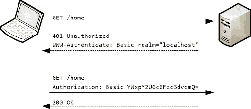
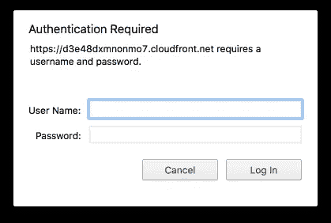
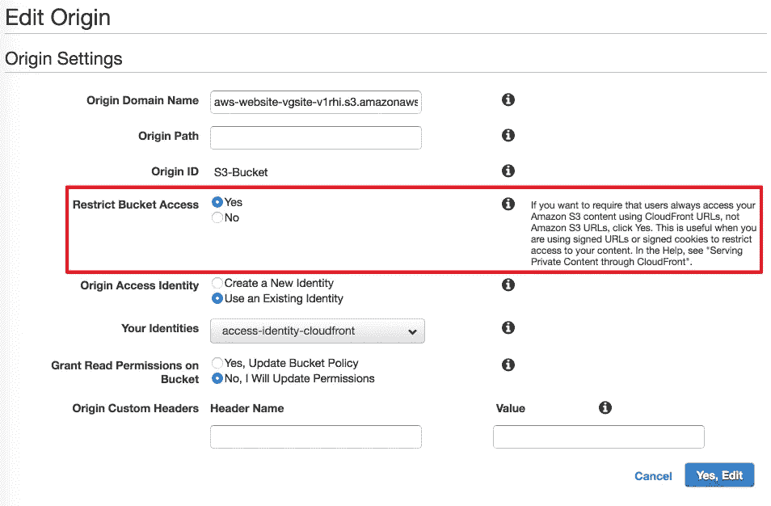

# 无服务器:AWS S3 桶中静态网站的密码保护

> 原文：<https://medium.com/hackernoon/serverless-password-protecting-a-static-website-in-an-aws-s3-bucket-bfaaa01b8666>

## 使用 Lambda@Edge 对 S3 和 CloudFront 进行基本 HTTP 身份验证

几个月来，我一直在寻找一个解决方案，为亚马逊上的 S3 桶添加基本的 HTTP 认证。有一些选项包括[预先签名的 URL](http://docs.aws.amazon.com/cli/latest/reference/s3/presign.html)(仅单个对象)，使用第三方[免费的](http://www.s3auth.com/)或[商业](https://storagemadeeasy.com/)服务(隐私问题)，创建 EC2/Heroku/等等。使用[中间件](https://www.npmjs.com/package/s3-basic-auth)代理请求(复杂且非无服务器)，使用[页面重定向和桶策略](http://xingdig.com/blog/password-protecting-an-s3-website/)(不安全)。它们都有一个共同的问题—都是解决方法。

我几乎走上了在 ECS 上构建 Apache 或 Nginx 容器来充当 S3 代理的道路。然后，我偶然看到了一篇关于 [Lambda@Edge](http://docs.aws.amazon.com/lambda/latest/dg/lambda-edge.html) 在美国东部(N. Virginia)地区(us-east-1)普遍发售的[博文。](https://aws.amazon.com/blogs/aws/lambdaedge-intelligent-processing-of-http-requests-at-the-edge/)

简而言之，Lambda@Edge 允许您将 AWS Lambda 函数附加到 CloudFront 行为。CloudFront 是亚马逊的 CDN 解决方案，可以坐在 S3 桶前，提供低延迟响应、高传输速度，支持使用亚马逊免费 SSL 证书的自定义域，并与其他 AWS 服务集成，现在包括 Lambda。

我浏览了公告中提到的用例，事情开始看起来很有希望:

> 您可以使用它:
> -检查 cookies 并重写 URL 以执行 A/B 测试。
> -根据用户代理头向用户发送特定对象。
> -在将请求传递给源之前，通过查找特定的报头来实施访问控制。
> -添加、删除或修改标题，将用户导向不同的缓存对象。
> -生成新的 HTTP 响应。
> -干净地支持传统 URL。
> -修改或压缩标题或 URL 以提高缓存利用率。
> -向其他互联网资源发出 HTTP 请求，并使用结果定制响应。

拦截请求头并生成新的 HTTP 响应正是我们实现基本 HTTP 认证所需要的！

# 基本 HTTP 身份验证概述

让我们快速了解一下基本的 HTTP 认证是如何工作的。



Basic HTTP Authentication flow diagram ([src](https://docs.microsoft.com/en-us/aspnet/web-api/overview/security/basic-authentication/_static/image1.png))

在引擎盖下，这是一个简单的客户端-服务器握手。如果客户端请求受保护的资源，但没有通过`Authorization`请求头提供有效的 auth 字符串，服务器会回复一个`401 Unauthorized`状态和一个`WWW-Authenticate: Basic`响应头。该响应会在浏览器中触发用户名和密码提示。



Basic HTTP Auth prompt in Chrome

用户输入凭证后，浏览器会创建一个 base64 编码的 auth 字符串，并在对同一领域的所有后续请求的`Authorization`请求头中使用它。因为后续请求在`Authorization`头中带有有效的 auth 字符串，所以服务器用`200 OK`代码响应并照常提供内容。

下面是生成验证字符串的伪代码:

```
authString = "Basic base64('username:password')"
```

从技术上讲，基本 HTTP Auth 中使用的加密方法和认证握手并不比以纯文本形式传递凭证更安全。这就是为什么您应该在任何通过网络传递敏感信息的地方使用 HTTPS。

# 在 Lambda 函数中实现基本的 HTTP 认证

这里有一个 Lambda 函数，它实现了基本的 HTTP Auth 握手:

Lambda function implementing Basic HTTP Auth handshake

您在 CloudFront 行为设置中将该函数附加到**查看器请求**事件类型。用户名和密码在函数中分别被硬编码为`authUser`和`authPass`。必要时进行调整。

附加到查看器响应/请求事件的 Lambda 函数不允许进行网络调用，因此不可能在函数外部存储或验证凭证(例如，在 DynamoDB 中)。

***更新:*** *现在已经不是这样了。Lambda@Edge 现* [*正式支持*](https://docs.aws.amazon.com/AmazonCloudFront/latest/DeveloperGuide/lambda-requirements-limits.html#lambda-requirements-network-access) *网络访问查看器请求/响应事件。现在完全可以在 DynamoDB 表中管理凭证或使用任何外部 API/提供者来验证用户，只要网络调用花费* [*不到 5s 就可以完成*](https://docs.aws.amazon.com/AmazonCloudFront/latest/DeveloperGuide/cloudfront-limits.html#limits-lambda-at-edge) *。*

查看我之前提到的关于如何将 Lambda 函数附加到 CloudFront 行为的博文。我将会写一篇关于整个链设置的更详细的文章，但是你应该已经明白了要点，并且能够把这些片段放在一起。

***更新:*** *戴夫·谢泼德写了一个* [*分步教程*](http://kynatro.com/blog/2018/01/03/a-step-by-step-guide-to-creating-a-password-protected-s3-bucket/) *和多米尼克·杜姆拉夫拼凑了一个* [*CloudFormation 模板*](https://github.com/dumrauf/serverless_static_website_with_basic_auth) *来启动整个设置。看看他们。*

这里有一个 S3 桶中的静态网站示例，由 CloudFront 和 Lamda@Edge 处理基本的认证密码保护。无服务器。

```
[https://d3e48dxmnonmo7.cloudfront.net/](https://d3e48dxmnonmo7.cloudfront.net/)username: user
password: pass
```

***更新*** *:关于绕过 CloudFront 直接访问 S3 的资源，评论中提出了一个问题。*

对[原点 S3 桶](https://aws-website-vgsite-v1rhi.s3.amazonaws.com)的访问仅限于 CloudFront 发行版。用户不能绕过 CloudFront 直接访问 bucket 中的资源(即使他们知道 bucket 中的[直接 URL](https://aws-website-vgsite-v1rhi.s3.amazonaws.com/index.html) )。

这可以在 CloudFront 中的 Origin Settings 下轻松配置，无需手动编写 S3 存储桶策略:



S3 bucket origin settings

我希望你喜欢阅读，并发现这篇文章很有用。
如果是这样全部鼓掌 50 次！这有助于其他人发现媒体上的内容。