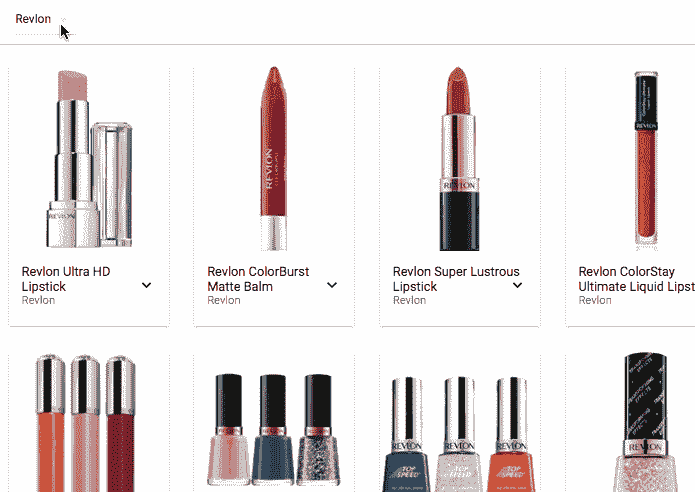
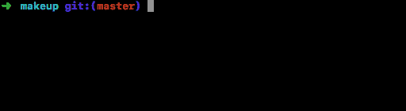

# 使用 Redux 或 MobX 的 React 的无服务器服务器端渲染

> 原文：<https://medium.com/hackernoon/serverless-server-side-rendering-with-react-using-redux-or-mobx-ce32a121ce08>

大约两年前，我开始使用 React，我一直对做服务器端渲染很好奇，但从来没有烦恼过。部分原因是我正在开发的最大的应用程序的大部分内容都在登录之后，不需要在每个页面上都进行大规模的搜索引擎优化(SEO )( T1 ),但也因为这看起来是一个巨大的麻烦，而且工具，比如说，发展得非常快。

因此，当我的朋友[乔纳森](https://twitter.com/jotto)告诉我他正在开发[烤肉。io](https://www.roast.io/) 时，我认为这将是一个很好的方式来满足我的好奇心和用 React 进行服务器端渲染的懒惰。

switch . io 是一个前端主机，在部署到 CDN 之前使用 headless Chrome 渲染页面。换句话说，它为您完成所有的服务器端渲染，而不必有一个“前端服务器”，它知道如何做所有的事情，“预加载您的根组件，用 props 注入它，渲染到字符串，注入模板，等等。”假设它是一个 CDN，(即它是一个缓存！)对于需要 SEO，但不需要登录的页面来说非常好用。所以它不会解决所有的服务器端渲染问题，但是确实解决了一些高价值的问题。

好，好，所以不是小计算功能意义上的 capital-S 无服务器，而是我不用运行服务器意义上的无服务器。这对于只想玩玩服务器端渲染的我来说很有帮助，但是对于那些拥有单页面应用程序的人来说却很难运行节点服务器。

所以我开始创建一个项目来部署 scatter . io，并想分享一下我的经验。剧透:它非常简单，只需要 0-10 行代码就可以实现服务器端渲染。除了加载速度更快之外，我还将客户端请求数量中的 API 调用数量从 O(n)更改为 O(1)。我探索了如何使用组件状态、 [Redux](https://hackernoon.com/tagged/redux) 和 MobX，所以我想看看不同的状态管理方案如何与 scatter . io 一起工作

*免责声明:烘焙. io 的创作者乔纳森是我的朋友。他让我去试一下 bake . io，然后写博客，但是他没有付钱给我。我们最后一次出去的时候，他确实提议给我买咖啡，但是那天太晚了，我没时间喝咖啡。相反，我抓住了机会，写了一篇标题中有着令人难以置信的高流行词密度的文章，我们都在这里。*

# 让我们化妆吧

为了充分利用 scatter . io，我需要一个 API 来加载一些数据。浏览[这个令人敬畏的公共 API 列表](https://github.com/toddmotto/public-apis)，我发现了[化妆 API](http://makeup-api.herokuapp.com/) ，它非常完美——它在 JSON 中开放了大量细节和图片链接。我开始制作一个非常简单的 React 应用程序，按品牌显示化妆品。(我最喜欢的 API 数据是，它为许多产品的不同颜色选项提供了十六进制代码。那是一个[好玩的反应组件](https://github.com/emilong/makeup/blob/master/src/ProductColors.js)。💅)

The makeup app

好吧，所以化妆比我的应用程序好看多了，但它应该有助于我们测试服务器端的渲染。你可以去查看应用程序的[源代码和部署的应用程序](https://github.com/emilong/makeup)的[，但是你会发现它看起来更像是一个(粗糙的)反应应用程序。换句话说，我变得懒惰，在让服务器端渲染工作时几乎什么都不做。我会在下面描述我做了什么。](https://broken-apparel-8185.roast.io/revlon)

F 首先，我尝试使用[组件状态](https://github.com/emilong/makeup/tree/component-state)按品牌加载数据，因为应用程序并不太复杂。换句话说，当 React 路由器加载一个品牌时，品牌组件会查看路径，从 API 请求该品牌的数据，然后使用 setState()将其保存在本地。

Saving data in component state

当我部署时，我需要创建一个名为 [_ssr.json](https://github.com/emilong/makeup/blob/master/_ssr.json) 的小文件，其中包含我希望在服务器上呈现的路径列表。许多应用程序可能不需要这样做，因为 scatter . io 会抓取你的网站，但我必须特别做一个没有默认登陆页面的应用程序。幸运的是，我喜欢雪花。❄️

除此之外，我什么也没做。该应用程序已部署，所有标记都在第一次下载时呈现。万岁。

这种方法的唯一问题是，尽管页面可以快速加载所有呈现的标记，但当每个用户访问时，它仍然会进行额外的获取，因为应用程序无法知道它是在服务器端呈现的。虽然我们可以使用组件状态来处理这个问题，但是 Redux 社区有很多关于状态“再水化”的文档。所以我试着把应用程序转换成 Redux…

唱 Redux " [鸭子](https://github.com/erikras/ducks-modular-redux)"风格，我创建了一个减速器与行动和行动的创造者如下所示。(你可以浏览代码，我在后面总结了重要的部分。)

Reducer, actions, and action creators for the API

我在这里使用了 [redux-thunk](https://github.com/gaearon/redux-thunk) 来实现异步，因为我们只有一个调用。基本的获取是相同的，但是有一些显著的变化:

*   它是可还原的，也就是说，它不需要对任何结构进行修改，reducer 将所有东西集成到一个状态树中。
*   状态树保存了我们遇到的任何品牌的所有数据，因此切换回我们已经见过的品牌会更快。
*   该组件现在检查它所呈现的品牌是否在状态树中可用，如果不可用，则只获取。
*   状态树还保存了一个“进行中”的品牌列表，所以如果我们想要的话，我们可以显示一个微调器，这样我们就不会获取一个已经在进行中的品牌。

不过最重要的是，注意我们从 __PRELOADED_STATE__ 获取初始 Redux 状态，如果它可用的话。如果你的应用程序使用这个变量的话，它可以作为保存和加载预加载状态的句柄。在 reducer 中，我们机会性地使用它，但是如果它不在那里，就退回到空状态。

如果它是可用的，并且具有我们试图呈现的品牌的数据，则组件不会获取。它只会使用预加载状态下的内容。此外，如果已经呈现了标记，React 不需要更改 DOM，因为它会意识到它只是呈现了与服务器端由 soat . io 呈现的一样的东西，因为[校验和](https://stackoverflow.com/questions/34311221/what-is-checksum-in-react-and-how-to-use-it)在缓存的页面上是完整的。

那么它是如何到达那里的呢？好吧，因为在它的服务器渲染阶段结束时，scatter . io 只是序列化 __PRELOADED_STATE__ 指向的任何东西，所以我们可以将 __PRELOADED_STATE__ 设置为等于 reducer 每次更新它时的状态。Redux 为我们提供了一个优秀的中间件框架来相对容易地做到这一点。

Configuring the store to use our preloaded state-saving middleware

因此，如果我们用上面附加的中间件来设置我们的商店，那么 scatter . io 将保存整个 Redux 商店，并将其“脱水”到缓存页面中。当我们再次创建我们的存储时，我们将从 __PRELOADED_STATE__ 开始对其进行“再水合”。

概括地说，当页面加载时，标记已经就位，因此浏览器可以立即开始呈现，Redux 存储的状态将被加载，因此在第一个页面视图上没有 API 调用。我们正在有机会地使用 __PRELOADED_STATE__，因此我们不必在我们的开发环境中对我们的 soat . io 部署做任何不同的事情。(另外，如果你想退出 switch . io，你不需要修改任何代码，但是不要告诉 Jonathan 是我说的。)

> 这个页面只需要一个 API 调用**就可以搜索到任意数量的客户端。**

**这样，对于通过搜索到达的任意数量的客户端，该页面只需要一次 API 调用。虽然这个例子中的 API 是免费的，但是 Firebase 和您自己的自托管 API 却不是，所以这个架构可以为您节省相当多的后端成本。**

**虽然 Redux 是我第一次进入 React state，但我最近也开始关注 MobX。我知道 Redux 有很多使用预加载状态的基础设施，但是我不太熟悉 MobX 的服务器端渲染功能。我非常惊讶地发现，它不仅真的很容易做到，而且它与 scatter . io 的 __PRELOADED_STATE__ 变量设置方法配合得非常好。我将项目转换为在这个[分支](https://github.com/emilong/makeup/tree/mobx)上使用 MobX。**

**如果您不熟悉 MobX，那么对于本文，您需要知道的主要区别是，它就地修改状态，并使用反应式架构发布更改。*到位*的事情才是重要的事情。下面是我们州对于化妆 app 的样子:**

**MobX store for brand data**

**除了特殊的装饰者，它实际上只是一个 ES6 类。我们保留的数据与 Redux 方法相同，只是在 ES6 集合和 MobX 可观察地图中(就我们的目的而言，这与 ES6 地图非常相似)。在初始化时，我们获取一些预加载的状态，并将其设置为可被 MobX 观察到，做一些定制工作，但不是太多。这个类类似于我们在上面用 Redux reducer 所做的。**

**那么我们如何让预加载的状态保存和加载呢？因为存储是就地修改的，所以我们只需在创建时设置 __PRELOADED_STATE__ 一次。**

**Initializing and saving the MobX store**

**就是这样！🎉我们甚至不需要用每个动作更新 __PRELOADED_STATE__。我们获得了服务器端呈现标记的所有好处，并且没有 API 调用。**

# **去试试吧**

****

**所以我不知道这次体验算不算我在做设置服务器端渲染，但是我*得到了*服务器端渲染，所以我要把它算作一次胜利。所以试一试吧——这里有一个免费层，你所要做的就是启动 NPM install-g bake，然后运行 roast deploy。**

**我希望尽快尝试 Vue，看看效果如何。如果有人尝试用 bake . io，请在回复中告诉我！**

***你知道为什么灵媒要用绿心吗💚而不是红色或其他颜色？我也是，但我真的很感激喜欢我帖子的人点击💚。接下来也很棒。:)谢谢！***

************

> **[黑客中午](http://bit.ly/Hackernoon)是黑客如何开始他们的下午。我们是 [@AMI](http://bit.ly/atAMIatAMI) 家庭的一员。我们现在[接受投稿](http://bit.ly/hackernoonsubmission)并乐意[讨论广告&赞助](mailto:partners@amipublications.com)机会。**
> 
> **如果你喜欢这个故事，我们推荐你阅读我们的[最新科技故事](http://bit.ly/hackernoonlatestt)和[趋势科技故事](https://hackernoon.com/trending)。直到下一次，不要把世界的现实想当然！**

****