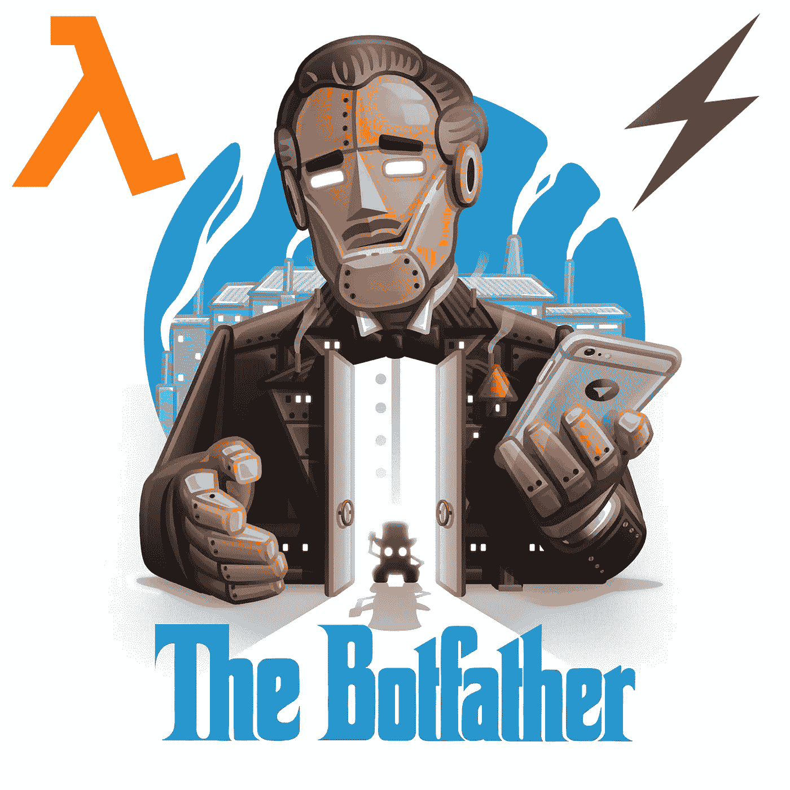

# AWS Lambda 上的无服务器电报机器人

> 原文：<https://medium.com/hackernoon/serverless-telegram-bot-on-aws-lambda-851204d4236c>



Serverless Telegram bot on AWS Lambda and Python 3

在本文中，我将向您展示如何在用 Python 3 编写的 webhooks 上创建简单的 echo [Telegram](https://hackernoon.com/tagged/telegram) bot，并使用无服务器框架将其部署到 [AWS](https://hackernoon.com/tagged/aws) Lambda。

我叫 Andrii Dvoiak，是 preply.com[公司的团队领导和全栈工程师。](https://preply.com/en/)

我们已经在生产中使用了 AWS Lambda，所以我决定展示一下它可以有多简单。放松，坐下来享受。

## 这是一个计划

*   设置服务器框架
*   获取 AWS 凭据
*   在 Python 3 上编写电报机器人的后端
*   将后端部署到 Lambda
*   将你的后端连接到电报机器人
*   启动

## 开始之前

为了完成本教程，请确保您已经:

*   已安装 Python 3
*   已安装的 Node.js `v6.5.0`或更高版本
*   拥有管理员权限的 AWS 帐户(*您可以免费创建一个* [*就在这里*](https://portal.aws.amazon.com/gp/aws/developer/registration/index.html) )

## 步骤 1:无服务器框架

让我们从头开始。为了轻松编写和部署我们的 lambda，我们将使用这个名为[无服务器](https://serverless.com)的令人敬畏的框架。它写在 NodeJS 上，所以我们需要`npm`来安装它。我们走吧:

```
npm install -g serverless
```

之后，让我们从模板创建一个新项目:

```
serverless create --template aws-python3 --path my-telegram-bot
```

它将创建一个包含两个文件的新文件夹 *my-telegram-bot* :

1.  *handler . py*—Python 代码的模板
2.  *serverless.yml* —配置文件

## 步骤 2: AWS 凭证

这是这个过程中最好的部分，因为一旦你获得了证书，你就再也不用和 AWS 打交道了。这非常简单:

*   登录到您的 AWS 控制台，转到我的安全凭证>用户，然后单击“添加用户”蓝色按钮。
*   指定用户名(类似“无服务器管理”)并只选择“编程访问”复选框。
*   在第二页上，选择“直接附加现有策略”并查找“管理员访问”。
*   创建用户后，复制您的“访问密钥 ID”和“秘密访问密钥”。这才是你真正需要继续下去的。

恭喜你。你已经拿到钥匙了。打开您的终端并执行:

```
export AWS_ACCESS_KEY_ID=<Access key ID>export AWS_SECRET_ACCESS_KEY=<Secret access key>
```

## 第三步:在 Python 3 上编写电报机器人

我不打算教你如何用 Python 编写，所以只需复制这段代码并粘贴到您的` *handler.py* '文件中:

```
**import** json
**import** os
**import** syshere = os.path.dirname(os.path.realpath(__file__))
sys.path.append(os.path.join(here, "./vendored"))

**import** requests

TOKEN = os.environ['TELEGRAM_TOKEN']
BASE_URL = "https://api.telegram.org/bot{}".format(TOKEN)

**def hello**(event, context):
    **try**:
        data = json.loads(event["body"])
        message = str(data["message"]["text"])
        chat_id = data["message"]["chat"]["id"]
        first_name = data["message"]["chat"]["first_name"]

        response = "Please /start, {}".format(first_name)

        **if** "start" **in** message:
            response = "Hello {}".format(first_name)

        data = {"text": response.encode("utf8"), "chat_id": chat_id}
        url = BASE_URL + "/sendMessage"
        requests.post(url, data)

    **except** Exception **as** e:
        **print**(e)

    **return** {"statusCode": 200}
```

如果你够懒，就从我的 GitHub [repo](https://github.com/Andrii-D/serverless-telegram-bot) 中派生或克隆它。

此外，您需要创建一个只有一行的文件`requirements.txt`:“requests ”,并执行以下命令在本地安装它:

```
pip install -r requirements.txt -t vendored
```

## 步骤 4:部署到 AWS Lambda

就像在 Heroku 上一样，你只需要一个配置文件“serverless.yml”。继续编辑您的，使它看起来像这样:

```
**service:** my-telegram-bot

**provider:
  name:** aws
  **runtime:** python3.6
  **stage:** dev
  **region:** us-east-1
  **environment:
    TELEGRAM_TOKEN:** ${env:TELEGRAM_TOKEN}

**functions:
  post:
    handler:** handler.hello
    **events:** - **http:
          path:** my-custom-url
          **method:** post
          **cors:** true
```

当您在终端中执行这个命令时，神奇的事情发生了:

```
serverless deploy
```

它会把你所有的文件打包到。zip 存档并上传到 AWS，然后它将为您创建 AWS API 网关并返回 API 端点。您将收到类似这样的内容:

```
endpoints:POST - https://u3ir5tjcsf.execute-api.us-east-1.amazonaws.com/dev/my-custom-url
```

你的机器人的无服务器后端已经可以使用了。在下一步中，您将需要此 URL。

## 第五步:连接你的后端到电报机器人

让我们创建新的电报机器人，当然，使用另一个机器人。去 web.telegram.org 的[给这个家伙](https://web.telegram.org) [@BotFather](https://web.telegram.org/#/im?p=@BotFather) 写信。他会指导你完成整个过程，你会得到这样的结果:

```
Use this token to access the HTTP API:
459903168:APHruyw7ZFj5qOJmJGeYEmfFJxil-z5uLS8
```

首先，将其设置为您的环境变量:

```
export TELEGRAM_TOKEN="459903168:APHruyw7ZFj5qOJmJGeYEmfFJxil-z5uLS8"
```

然后，我们需要设置 webhook(注册你后端的 API url)。为此，您需要发送这个有效载荷:

```
{
    "url": "<Your API Gateway endpoint>"
}
```

到此 url:

```
https://api.telegram.org/bot<Your Telegram TOKEN>/setWebhook
```

再次转到您的终端，执行以下代码行(输入您的 url 和令牌):

```
curl --request POST --url [https://api.telegram.org/bot](https://api.telegram.org/botAPHruyw7ZFj5qOJmJGeYEmfFJxil-z5uLS8/setWebhook)459903168:[APHruyw7ZFj5qOJmJGeYEmfFJxil-z5uLS8](https://api.telegram.org/botAPHruyw7ZFj5qOJmJGeYEmfFJxil-z5uLS8/setWebhook)[/setWebhook](https://api.telegram.org/botAPHruyw7ZFj5qOJmJGeYEmfFJxil-z5uLS8/setWebhook) --header 'content-type: application/json' --data '{"url": "https://u3ir5tjcsf.execute-api.us-east-1.amazonaws.com/dev/my-custom-url"}'
```

如果你做的一切都是正确的，你会收到这样的东西:

```
{
  "ok": true,
  "result": true,
  "description": "Webhook was set"
}
```

## 第六步:上线

我们差不多完成了，让我们再部署一次，将您的秘密电报令牌传播到 lambda:

```
serverless deploy
```

现在直播了！恭喜你。你可以开始和你的机器人聊天了。

## 附言

1.  不要忘记将所有导出的变量保存在`~/.bash_profile`中
2.  永远不要将任何 api 密钥提交到您的存储库中
3.  开始时，它不会花费你什么，因为 AWS Lambda 有每月 100，00 0 次调用的免费层，API Gateway 每月免费给你 1 百万次 API 调用
4.  您可以从 GitHub [库](https://github.com/Andrii-D/serverless-telegram-bot)派生这个例子
5.  你可以在这里找到 lambdas [的很多例子](https://github.com/serverless/examples)

## 结论

无服务器方法在某些情况下非常方便，因为它允许您构建非常可伸缩的解决方案。它还会改变您对服务器管理和付费的思维模式。

无服务器框架为您提供了非常简单的工具来部署您的功能，无需了解 AWS 或任何其他云提供商。

AWS 给你很好的免费服务期，所以你可以完全免费建立你的 MVP，只有当你达到一定数量的用户时才开始付费。

## 下一步是什么

下一篇文章将讲述如何使用 AWS Step 函数链接多个 lambdas，并将其连接到 AWS DynamoDB。