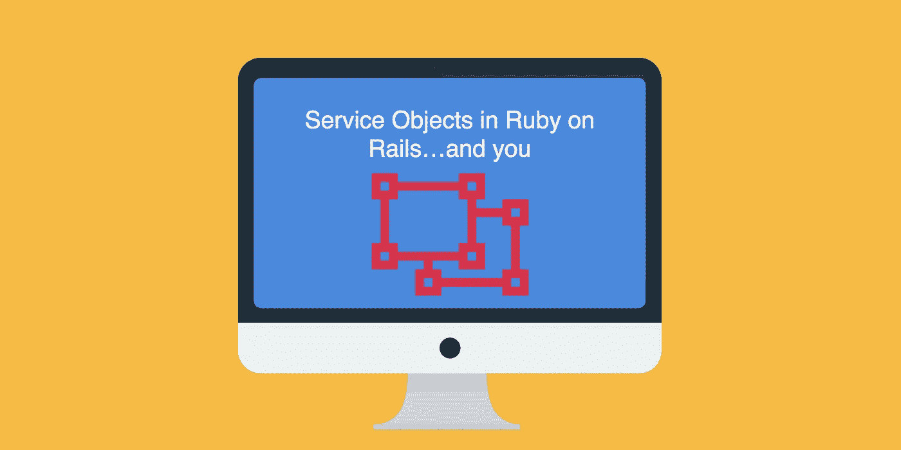

# Ruby on Rails 中的服务对象…还有你

> 原文：<https://medium.com/hackernoon/service-objects-in-ruby-on-rails-and-you-79ca8a1c946e>



# 我把这些东西放在哪里？

注意:本教程是我的书[构建 SaaS Ruby on Rails 5](https://BuildASaaSAppinRails.com) 中服务对象章节的摘录。这本书将通过将应用程序部署到生产中来指导你从卑微的开始。如果你发现这种类型的内容有价值，这本书现在正在出售！

此外，我的新项目[拉动式管理器](https://pullmanager.com)的测试版也差不多准备好了。如果你失去了对拉取请求的跟踪，让旧的请求留在身边，或者只是喜欢一个通过多个服务(Github、Gitlab 和 Bitbucket)聚集这些请求的仪表板，[看看](https://pullmanager.com)。

当你看到你的控制器动作变得太长，拥有太多的业务逻辑时，我们都有过这样的经历。你知道你需要给用户发电子邮件，调整账户，也许提交给 Stripe，最后 ping 一个 Slack Webhook。那么，它应该去哪里呢？这段代码需要存在，而且似乎不适合模型。我的朋友，这就是服务对象出现的地方！

一个服务对象有什么了不起的？我发现在大多数项目中，没有什么比 POO(普通旧对象)更容易推理或测试的了，在我们的例子中，POO 是 PORO(普通旧 Ruby 对象)。也就是说，服务对象将是一个独立的类，不会从 Ruby 或 Rails 继承或扩展任何其他类。

注意:我会继续这篇文章，重构

# 我们开始吧！

默认情况下，Rails 不会创建服务文件夹，所以创建一个是我们的工作。不过，有一点需要注意的是，根据应用程序的规模或业务逻辑的复杂性，您可能需要按照域、类型或其他限定符进一步细分服务。在这篇文章中，你可以在你的应用文件夹`mkdir app/services`中创建一个服务文件夹

重启你的 rails 服务器来获取新的文件夹，因为 Rails 会自动加载 app 目录中的目录。现在我们可以为用户注册服务`new_registration_service.rb`创建一个文件，并用我们的业务逻辑填充它。

```
class NewRegistrationService
  def initialize(params)
    @user = params[:user]
    @organization = params[:organization]
  enddef perform
    organization_create
    send_welcome_email
    notify_slack
  endprivatedef organization_create
    post_organization_setup if @organization.save
enddef post_organization_setup
    @user.organization_id = @organization.id
    @user.save
    @user.add_role :admin, @organization
 enddef send_welcome_email
    WelcomeEmailMailer.welcome_email(@user).deliver_later
enddef notify_slack
    notifier = Slack::Notifier.new "https://hooks.slack.com/services/89ypfhuiwquhfwfwef908wefoij"
    notifier.ping "A New User has appeared! #{@organization.name} -   #{@user.name} || ENV: #{Rails.env}"
endend
```

好吧！让我们一节一节地检查服务对象！

```
class NewRegistrationService
  def initialize(params)
    @user = params[:user]
    @organization = params[:organization]
  end
```

这里我们创建类，然后添加 initialize 方法，在实例化对象时创建所需的实例变量。在这种情况下，我们将传递先前在新用户注册控制器中创建的对象用户模型记录对象和组织记录对象。

```
def perform
    organization_create
    send_welcome_email
    notify_slack
  end
```

就个人而言，我喜欢将整套业务逻辑的功能包装在一个执行方法中。我也看到一些支持者从控制器手动调用不同的方法。真的是你的喜好问题。

```
def organization_create
    post_organization_setup if @organization.save
enddef post_organization_setup
    @user.organization_id = @organization.id
    @user.save
    @user.add_role :admin, @organization
 end
```

在这里，我们创建组织(之前在实例化该服务对象的控制器中验证过)，然后对用户进行必要的更新，例如添加 belongs_to 关系所需的 organization_id，并为授权系统分配一个角色，该角色的范围是之前创建的组织。

```
def send_welcome_email
    WelcomeEmailMailer.welcome_email(@user).deliver_later
end
```

使用用户对象快速调用 Rail 的 ActionMailer

```
def notify_slack
    notifier = Slack::Notifier.new "https://hooks.slack.com/services/89ypfhuiwquhfwfwef908wefoij"
    notifier.ping "A New User has appeared! #{@organization.name} -   #{@user.name} || ENV: #{Rails.env}"
end
```

…最后通知我用于注册通知的 Slack Webhook。

现在，您可能会对自己说，这很有意义，但是您如何以及在哪里调用这个服务对象呢？以下是从我的设计注册控制器中提取的代码，该控制器处理输入的注册表单及其所有的设计优点:

```
NewRegistrationService.new({user: resource, organization: @org}).perform
```

一些读者可能会开始质疑这篇文章中服务对象的某些方面。我发现服务对象没有很强的约定，我已经调整了这个来满足我的需求。前面，当我说您可以单独调用公共方法，而不是使用执行方法时，将允许您包装一些错误处理逻辑。比如这个:

```
class NewRegistrationService
  def initialize(params)
    @user = params[:user]
    @organization = params[:organization]
  enddef organization_create
  begin
    post_organization_setup if @organization.save
  rescue
    false
  end
end....
```

..在控制器中，类似于:

```
if NewRegistrationService.new({user: resource, organization: @org}).organization_create
  **success logic**
else
  ** redirect_to last_path, notice: 'Error saving record'
end
```

不管您的服务对象结构如何，简单地将您的业务逻辑从您的控制器中提取出来并放入服务对象中，将有助于保持您的控制器“精简”并且您的应用程序代码易于理解。

[注意:在这篇文章之后，我将发布这个服务的重构版本](https://hackernoon.com/going-further-with-service-objects-in-ruby-on-rails-b8aac13a7271)

[](http://bit.ly/HackernoonFB)[](https://goo.gl/k7XYbx)[](https://goo.gl/4ofytp)

> [黑客中午](http://bit.ly/Hackernoon)是黑客如何开始他们的下午。我们是 [@AMI](http://bit.ly/atAMIatAMI) 家庭的一员。我们现在[接受投稿](http://bit.ly/hackernoonsubmission)并乐意[讨论广告&赞助](mailto:partners@amipublications.com)机会。
> 
> 如果你喜欢这个故事，我们推荐你阅读我们的[最新科技故事](http://bit.ly/hackernoonlatestt)和[趋势科技故事](https://hackernoon.com/trending)。直到下一次，不要把世界的现实想当然！

