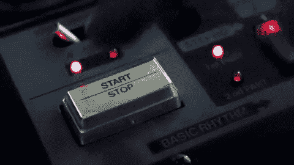
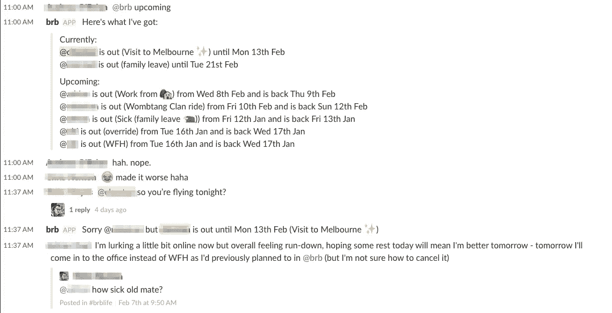

# 一劳永逸:我们遗忘的产品

> 原文：<https://medium.com/hackernoon/set-and-forget-the-product-we-forgot-about-29fba3385bb7>

三个月前，我制作并发布了一个 Slackbot，但很快就把它忘了。上周，我发现人们真的在使用它，并且喜欢它。哎呦。

Whoops.

这到底是怎么回事？

2016 年 11 月，我和我的合作伙伴 PJ·默里做了一次[黑客周末](/brb-life/startup-weekend-tendernob-7d69dc580b31#.95563nsxc)，试图看看我们是否还能从头开始建造和推出一些东西。

在 48 小时内，我们构建了一个 Slack bot，通过处理外出通知来帮助人们花更多的时间离开办公室。它叫做 [brb.life](https://brb.life/?utm_source=nedwin&utm_medium=Medium&utm_campaign=v2-launch) 。

我们并不是没有努力让它成功。我们把它写在 Medium 上，建立了一个很小的邮件列表，并通过电子邮件发给我们认为会使用它的朋友。

然后我们遇到了障碍。

我们发给的朋友甚至不能自己安装我们的产品。

权限太繁重了:我们需要能够读写他们的直接消息，以便在你外出时，如果有人在 Slack 上给你发了 DM，我们可以设置一个自动回复。

最糟糕的部分？这些人不仅是我们的好朋友(他们可能会放过我们)，而且还是他们公司的创始人(他们可以推翻任何组织上的阻力)。

这是一个残酷的现实，我们找不到简单的方法来解决它。因此，在反复考虑之后，我们决定停止这个项目，找点别的事情做。

我们放弃了。我们停止了所有的营销活动和功能开发。

有趣的是，我们的一个朋友对我们采取了一种更漫不经心的方式，可能会阅读他的 DM，安装产品并立即与他的团队分享。然后，令他惊讶的是，团队真的使用了它。

[Brb.life](https://brb.life/?utm_source=nedwin&utm_medium=Medium&utm_campaign=v2-launch) 现在已经成为 Vero 团队保持联系的默认方式，了解谁在进出，人们在哪里工作。

Sample of activity from the Vero team on an average weekday.

你认为我们会兴奋吗？但我有点不好意思说我们不知道。这个应用程序是如此的有价值，我们没有任何使用或注册的提醒，我们也没有跟踪日志，因为我们认为它正在某个 Heroku 服务器上积灰。

我们发现他实际使用该产品的唯一原因是，他有一些功能请求和一个 bug 提交，希望我们看一看。

## 并非所有的顾客都是平等的

每个顾客都是一片独特的雪花:你需要找到适合你的产品的雪花。

最先告诉我们由于安全问题他们不能使用该产品的两个人是我多年的好朋友。两人都是自己公司的创始人——一个在种子阶段的 SAAS 初创公司有 6 个人，一个在 B 轮阶段的人力资源科技公司有 150 个人。无论我们对彼此有多了解，两人都无法回避让任何应用程序访问其团队的私人直接消息所带来的风险。

## 转换率很重要

大多数人不会“理解”你的产品。你展示给越多的人看，你就越有可能找到愿意看的人。

假设你像我们一样向 6 个人展示你的产品。你依赖于至少 16%的人不仅需要你的产品，甚至了解它是什么并注册。这是一个非常高的标准。

想增加找到合适客户并转化他们的机会吗？增加你的营销对象的数量。

## 坚持是关键

找到开始做某事的动力是很难的，但是几乎每个人都有。坚持是开始和结束的区别。

我们遇到了一个障碍，在很大程度上扼杀了直接消息功能，但我们仍然有能力管理团队外出频道、团队即将到来的日程安排以及如果外出用户不在时的自动回复。基于有限的客户反馈，我们将直接消息传递合理化为杀手级功能，而没有尝试测试其他假设。

至少我们应该继续推出该产品，并试图让更多的用户使用它，以找出:
-百分之多少的用户会给我们 dm 访问权限
-百分之多少的用户会使用 OOO 功能
-什么额外的功能或集成会使该产品工作

## 获胜是最终的动力

虽然我们都忙于日常工作和工作之外的生活，但知道人们使用我们的产品并喜欢它，这是令人难以置信的激励。

## 现在怎么办？

考虑到我们已经有一些人实际上在使用和喜爱这个产品，我们决定投入更多的时间来让它更上一层楼。它不会成为一份全职工作，但它会成为我们展示肌肉和建立我们引以为豪的东西的一个很好的方式。谁知道它会去哪里？

有没有建立并启动了一个项目，但很快就忘记了？

我很想听听它是什么以及你为什么放弃它。

并且查看 [brb.life](https://www.brb.life) 为你的懈怠团队管理你的外出信息！

> [黑客中午](http://bit.ly/Hackernoon)是黑客如何开始他们的下午。我们是 [@AMI](http://bit.ly/atAMIatAMI) 家庭的一员。我们现在[接受投稿](http://bit.ly/hackernoonsubmission)，并乐意[讨论广告&赞助](mailto:partners@amipublications.com)机会。
> 
> 如果你喜欢这个故事，我们推荐你阅读我们的[最新科技故事](http://bit.ly/hackernoonlatestt)和[趋势科技故事](https://hackernoon.com/trending)。直到下一次，不要把世界的现实想当然！

