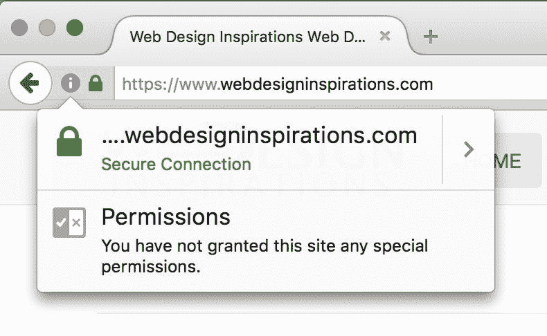
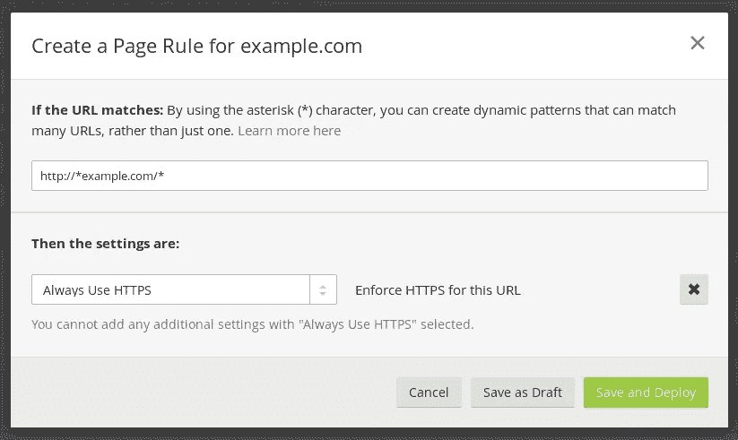
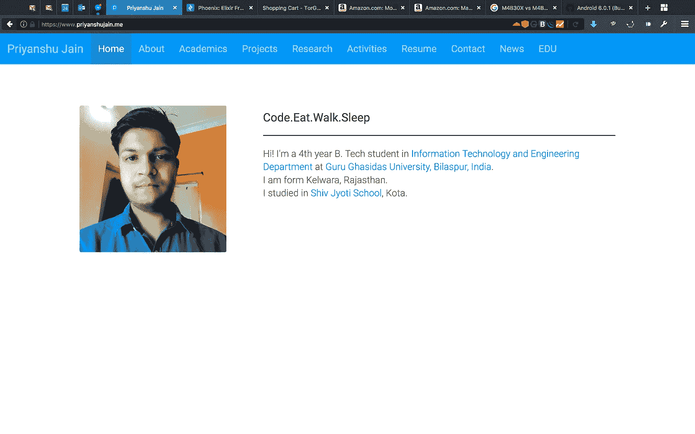

# 免费在带有自定义域的 Github 页面上设置 SSL

> 原文：<https://medium.com/hackernoon/set-up-ssl-on-github-pages-with-custom-domains-for-free-a576bdf51bc>

# 指令 **:**

1.  如果您还没有帐户，请注册 Cloudflare 。
2.  添加您的网站，并确保所有自动生成的记录与您的注册商网站上的记录相匹配。

3.如果你已经有一个 gh-pages 网站，并且只是简单地转移到`https`，你不需要做任何其他事情。

4.如果没有，并且试图在 apex 上建立你的站点，创建一个指向 Github 的 IP 地址的 A 记录，或者一个指向你的-username.github.io 的 CNAME

5.确保在你的 gh-pages repo 的根目录下有一个带有你的域名的 CNAME 文件。

6.确保在你的 gh-pages repo 的根目录下有一个带有你的域名的`CNAME`文件。

7.转到您的域注册商网站，将域名服务器更改为 Cloudflare 为您提供的域名服务器。

8.完成在 Cloudflare 上设置您的域，然后转到域控制面板。

9.打开您的域的“Cloudflare 设置”,并将 SSL 设置更改为“灵活 SSL”。

10.使用 [*页面规则*](https://support.cloudflare.com/hc/en-us/articles/200170536-How-do-I-redirect-all-visitors-to-HTTPS-SSL-) 将所有访问者重定向到 HTTPS/SSL。

11.几个小时后，你就可以用`https`打开`yoursite.com`。

# 缺点:

值得注意的是，这种设置并不完全安全 CloudFlare 和 [GitHub](https://hackernoon.com/tagged/github) 页面之间的连接并不安全。因为 GitHub 没有你的域的 SSL 证书，所以自定义域不可能有完整的 SSL。然而，这种设置确实为您的用户提供了一些保护(例如，在同一个不安全的 Wi-Fi [网络](https://hackernoon.com/tagged/network)上免受黑客攻击)，并且它允许您的站点表现得好像它有 SSL(例如，用于网络爬虫、API)。

> [黑客中午](http://bit.ly/Hackernoon)是黑客如何开始他们的下午。我们是 T21 家庭的一员。我们现在[接受投稿](http://bit.ly/hackernoonsubmission)并乐意[讨论广告&赞助](mailto:partners@amipublications.com)机会。
> 
> 如果你喜欢这个故事，我们推荐你阅读我们的[最新科技故事](http://bit.ly/hackernoonlatestt)和[趋势科技故事](https://hackernoon.com/trending)。直到下一次，不要把世界的现实想当然！

