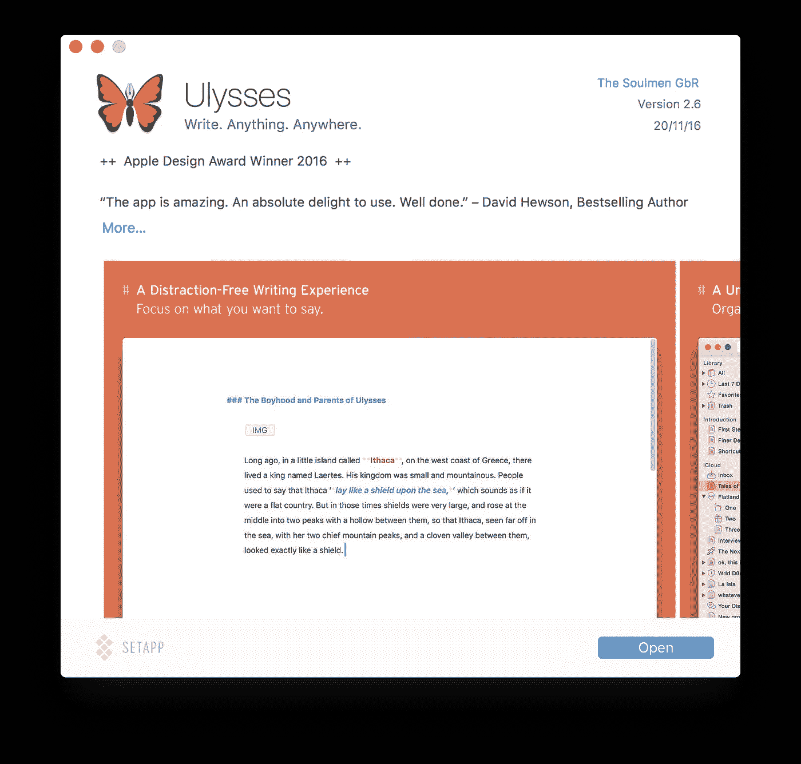
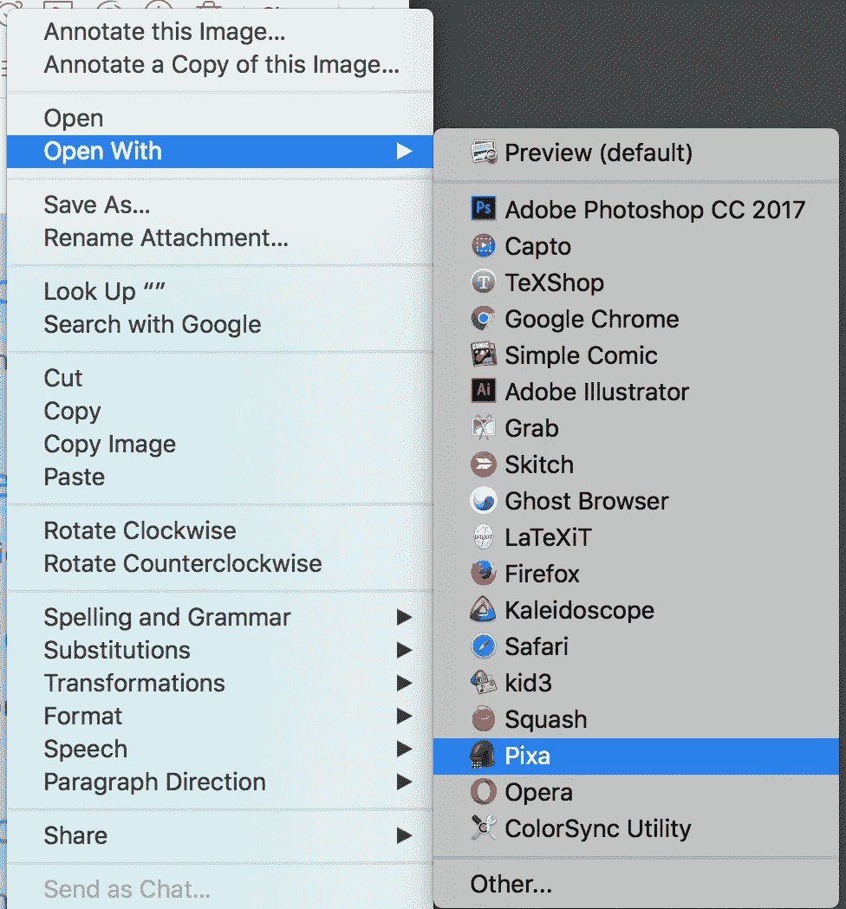
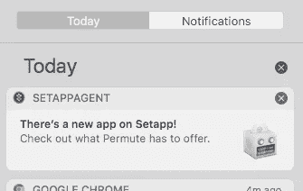
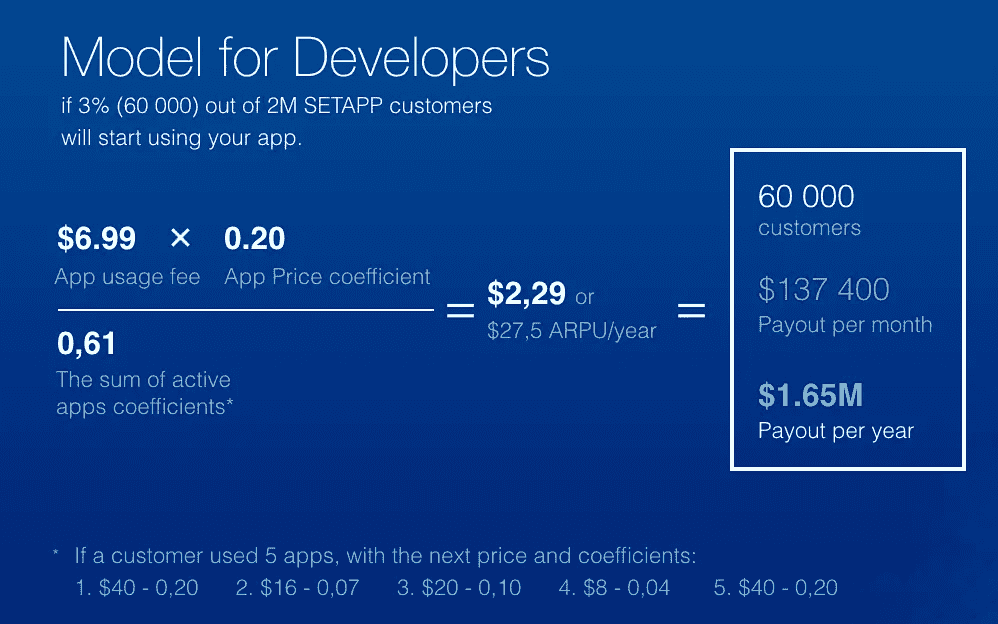
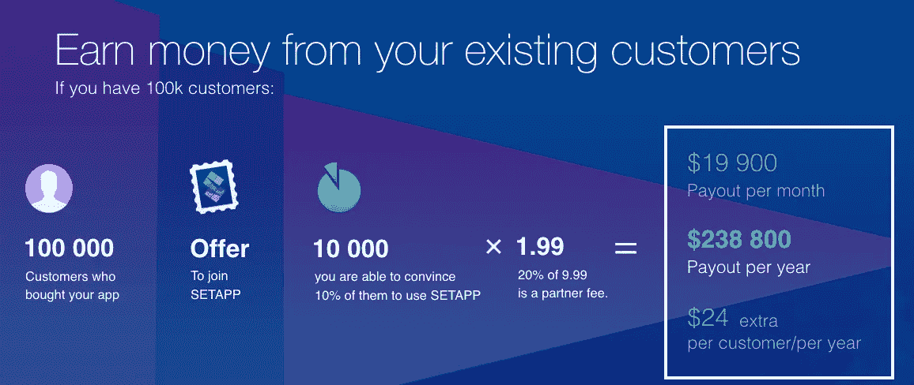

# Setapp 旨在解决 MAC 电脑的应用问题

> 原文：<https://medium.com/hackernoon/setapp-aims-to-solve-the-app-problem-for-macs-f6cde7739e2e>

目前应用程序开发有两个主要问题和趋势。一个是用户发现你的努力，另一个是当他们发现时赚钱。

像微软、Adobe 和 JetBrains 这样的主要软件供应商已经能够通过软件的重复计费模式来实现成功的收入模式，但这对较小的开发者来说是一个挑战。他们如何维持足够的发布量来证明月费的合理性呢？像[huble Bundle](https://www.humblebundle.com)这样的服务在某种程度上有所帮助，但通常是一次性的营销推广，而不是定期的持续收入。

除了他们自己的 Mac 实用程序， [MacPaw](http://macpaw.com/) 在 2015 年 5 月发布了 [Devmate](http://devmate.com/) ，作为一个管理应用程序分发、更新、订阅、许可和报告的平台。最初只针对 Mac 应用，[现在有了 Windows beta 程序](http://devmate.com/windows-beta)。

基于从 Devmate 获得的经验， [Setapp](https://setapp.com/) 旨在为用户和开发者提供另一个应用分发渠道，有望解决困扰苹果官方应用商店的许多问题。这项服务是每月 9.99 美元(第一个月免费)的固定费用订阅服务，即将推出。所有应用程序都是无广告的全功能版本。Setapp 并不是第一次尝试(Mac App store 也不是)在一个更集中的位置寻找和更新 Mac 应用程序，它与更多以开发者为中心的软件解决方案一起取代了它的位置，如 [Homebrew](http://brew.sh/) 和 [Cask](https://caskroom.github.io/) 。

Setapp 努力从其他解决方案的早期错误中学习，通过使用(和增强)原生 Mac 体验，而不是取代它，整个体验是一种使用乐趣。在最初启动时，它感觉像是 DropBox 和 Steam 的结合体，在你的*应用程序*文件夹中的 *Setapp* 文件夹中有应用程序别名。

The Setapp folder

在文件夹内，选择一个应用别名，并双击它，这将显示一个信息屏幕，您可以在其中单击*打开*开始下载应用。

Application info screen

因为这些是标准的 Mac 应用程序，所以你可以访问任何标准的 OS X 功能，如 Spotlight 和 Services，即使你还没有安装应用程序，这真的很酷。

Share to application

Notifications for new application

删除应用程序将立即重新创建“别名”文件，以备将来重新下载。

Setapp 旨在使体验尽可能无缝和“类似 Mac ”,但也添加了统一的更新程序，这是 Mac 应用商店的目标，但也对开发者施加了太多限制。

我发现的一个小问题是，在下载任何东西之前，文件夹都超过了 100mb(对于当前的应用程序选择，这是计划数量的一小部分)。这不是一个主要问题，但我想知道在你下载任何“真正的”应用程序之前，这个文件夹会变得多大。

## 提交您的应用

MacPaw 在选择应用程序时关注的是质量，而不是数量，当前的选择表明，包括我很兴奋终于可以完全访问的应用程序，如[尤利西斯](https://ulyssesapp.com/)和[双子座](http://macpaw.com/gemini)。如果你想让你的应用被考虑，[联系 MacPaw](https://setapp.com/developers) 。

MacPaw 将 Setapp 的收入模型建立在两种收入流的基础上，这两种收入流在这两张图片中得到了最好的解释。

首先，根据您的原始应用价格和用户数量进行收入分成:

Funding model

不过，让新用户注册 Setapp 也要收取介绍费:

Referral income

Setapp 收取的比例约为 10%，包括为您处理账单、隐私保护和更新，以及管理和基础设施费用。

我想知道这种模式对于人们不经常使用的应用程序会有多好，比如目前的应用程序之一“CleanMyMac”，因为我可能一个月只运行一次。

## App，app，走！

我发现 Setapp 的体验完美无瑕，没有任何问题，所以就像 Mac 一样，我几乎没有注意到获得我需要的应用程序的短暂延迟。希望 MacPaw 能够说服足够多的开发者注册他们的应用程序，以证明价格的合理性，并帮助解决 Mac 开发者和用户的问题。

*想注册这项服务吗？* [*使用此邀请链接，对你们 50 个可爱的人有效*](https://setapp.com/?inviteRef=060480c1-ba5b-11e6-ae4b-080027c363c3) 。

> [黑客中午](http://bit.ly/Hackernoon)是黑客如何开始他们的下午。我们是 AMI 家庭的一员。我们现在[接受投稿](http://bit.ly/hackernoonsubmission)并乐意[讨论广告&赞助](mailto:partners@amipublications.com)机会。
> 
> 如果你喜欢这个故事，我们推荐你阅读我们的[最新科技故事](http://bit.ly/hackernoonlatestt)和[趋势科技故事](https://hackernoon.com/trending)。直到下一次，不要把世界的现实想当然！

