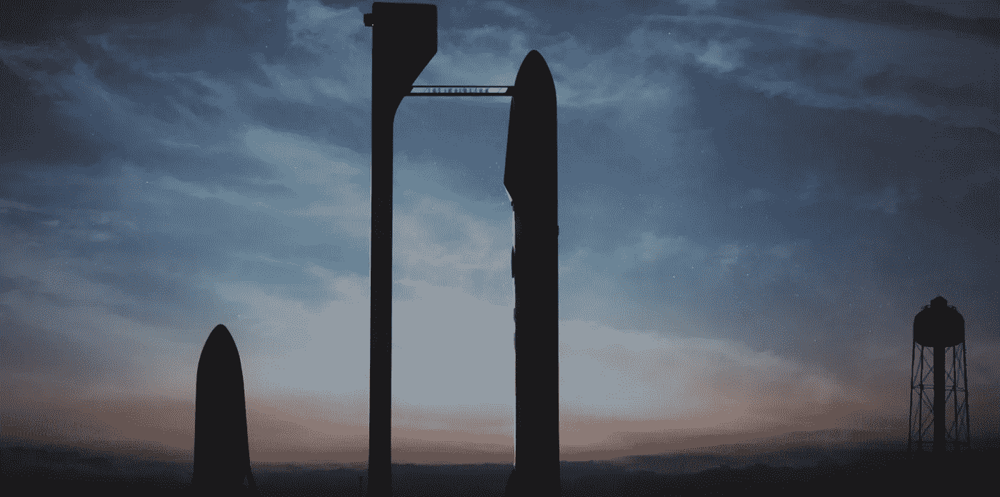

# 设定可笑的大目标

> 原文：<https://medium.com/hackernoon/setting-comically-huge-goals-68c362957daa>

今天在澳大利亚，Elon Musk 谈到了他的火星宏伟计划，SpaceX 将带我们去那里的新火箭的规格和经济性，以及新火箭如何在 30-60 分钟内将乘客带到世界任何地方。

可以预见的是，热接受市场现在已经白热化，纸上谈兵的工程师们揭穿了最后一点。成本不可能算出来！碳足迹呢？这不是 30 分钟——大都市地区永远不会让一个巨大的火箭在一个小时内到达城市界限，所以它不比 Hyperloop 好多少！

有趣的是，我们显然都接受了接下来的谈话。他要带我们去火星。SpaceX 的新火箭在每个方面都彻底击败了其他所有人:有效载荷尺寸，有效载荷质量，每公斤有效载荷的成本，以及可靠性。哦，他们想让它在五年内完成所有这些。

我并不是说我认为 SpaceX 会失败。我认为他们成功的可能性很大，我很高兴能帮助建立我们在火星上安家所需的[技术](https://hackernoon.com/tagged/technology)。但是，我认为绝对搞笑的是，[伊隆](https://hackernoon.com/tagged/elon)抛出了完全疯狂的“乘客运输亚轨道火箭”的想法，现在狼群正在撕扯*那个*而忽视他真正的孩子。我想知道这是不是他策划的…