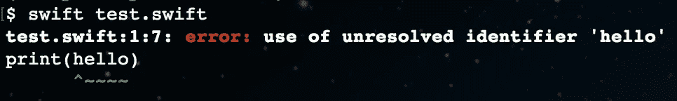
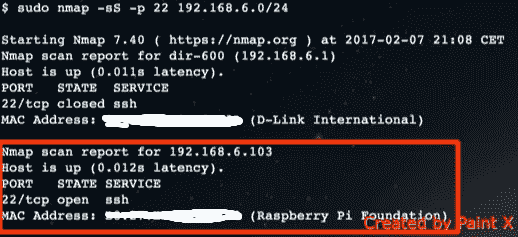

# 在 Raspberry Pi 上搭建快速开发环境

> 原文：<https://medium.com/hackernoon/setting-up-a-swift-development-environment-on-raspberry-pi-c7af7fceac1e>


Image taken from raspberrypi.org

在我的[上一篇文章](/@piotr.gorzelany/the-state-of-swift-on-raspberry-pi-f23445418ee2#.4drnxi3pp)中，我概述了 Swift 在 Raspberry Pi 平台上的现状。在这篇文章中，我将尝试强调如何建立一个愉快的开发环境来在 Pi 上编写 Swift 代码。

在任何 Linux 平台上编写 Swift 代码时，目前最大的痛苦之一是缺乏真正的 IDE。当然，你可能讨厌 Xcode，但是开始在命令行上用 Nano 输入你的程序，你会看到真正的痛苦是什么感觉。



You get a lot of these since you do not have compiler warnings at write time

良好开发体验的第一步是一个好的 IDE，目前最好的 Swift IDE 是…Xcode。

什么！？但是 Xcode 不能在 Linux 上运行。我如何在 Pi 上安装它？嗯，你不知道，坦白地说，你不会想在 Pi 上写代码。这是一台很慢的电脑，用显示器和键盘运行它是不必要的。那么我在哪里写我的代码呢？当然是在你的苹果电脑上，不然还能在哪儿呢，笨蛋。

您需要做的第一件事是设置一个无头 Pi。在[树莓论坛](https://www.raspberrypi.org/forums/viewtopic.php?t=74176)上有一个关于如何做到这一点的非常好的教程。本教程是为 Raspian 编写的，我推荐使用 Ubuntu 作为 Pi，因为 SPM 在那里工作。我首先用键盘和显示器运行我的 Pi，进行初始设置，并将其连接到我的 WiFi [网络](https://hackernoon.com/tagged/network)。一旦您将 Pi 连接到您的路由器，您就可以从 mac 通过 [SSH](https://en.wikipedia.org/wiki/Secure_Shell) 开始控制它。首先，您需要在网络上找到您的 Pi 的 IP 地址。我使用 nmap 来扫描网络中端口 22 (ssh 端口)上列出的设备。



要找到您的 Pi，您需要用本地地址空间替换 192.168.6.0 部分。一旦你有了它，通过 ssh 连接你的 mac。

```
ssh {your-pi-username}@{you-pi-ip-address}
```

就这样，天空现在是极限了。尝试在 Pi 上远程构建并运行您的第一个 Swift 脚本。

```
// Create the script
echo "print(\"hello from swift\")" >> hello.swift// Run it
swift hello.swift
```

这一切都很好，但是你还在命令行上做什么？去启动 Xcode，开始一些严肃的开发吧！

我们将创建一个程序，如果您在 Mac 上按下 return 键，它将打开和关闭连接到 Pi 的 LED。为了在两种环境之间很好地切换，我们将使用 [Swift 包管理器](https://www.raywenderlich.com/148832/introduction-swift-package-manager)，它是 Swift 的一个与系统无关的依赖管理器。它在 OS X 和 Linux 上都运行良好，它将是一个重要的部分，使我们能够在 Mac 上开发代码并在 Pi 上运行。

```
// create the project folder
mkdir led-blink
// go to the folder
cd led-blink
// initialize the swift project using SPM
swift package init --type executable
```

您现在应该有了 SPM 生成的目录结构和 main.swift 文件。编辑 Package.swift 以包含 [GPIO swift 库](https://github.com/uraimo/SwiftyGPIO)。

```
import PackageDescriptionlet package = Package(
    name: "led-blink",
    dependencies: [
        .Package(url: "https://github.com/uraimo/SwiftyGPIO.git", majorVersion: 0)
    ]
)
```

现在使用以下命令获取库:

```
swift package update
```

您现在可以使用 SPM 为您生成一个 Xcode 项目了！使用以下命令执行此操作:

```
swift package generate-xcodeproj
```

打开生成的 Xcode 项目并构建它(cmd+B)，这样编译器就知道 SwiftyGPIO 库了。瞧，你现在可以使用 Xcode 开发你的程序了，可以使用所有这些可爱的[工具](https://hackernoon.com/tagged/tools)，比如代码完成、语法高亮、编译器错误、文档等等。

打开 main.swift 文件并添加以下代码:

```
import SwiftyGPIO
import Foundation// Get a dictionary of all the gpio pins
let gpios = SwiftyGPIO.GPIOs(for: .RaspberryPi2)// Get the pin that you connected the LED to. Remember to set the right pin number, for me it was 27
guard let ledGpio = gpios[GPIOName.P27] else {
    fatalError("Could not initialize the gpio")
}// Set the pin direction to .OUT and turn it off
ledGpio.direction = .OUT
ledGpio.value = 0// Read user input from keyboard and switch the LED on/off each time the user presses the return keyprint("Press return to switch the LED on/off. To quit type exit")
while let userInput = readLine(strippingNewline: true), userInput != "exit" {
    print("Switching LED")
    ledGpio.value = ledGpio.value == 0 ? 1 : 0
}
```

好了，程序完成了。剩下唯一要做的事情就是在 Pi 上构建并运行它。为此，您需要将您在 mac 上创建的项目复制到 Pi。有几个解决方案可以帮助你做到这一点。首先，您可以创建一个 GIT 存储库并将其托管在 Github 上。然后，您可以从 mac 上推送更改，并在 Pi 上拉动它们。另一种选择是使用 SCP 来复制文件夹。

```
scp -r {path-to-project-folder-on-mac} {your-pi-username}@{you-pi-ip-address}:{path-to-folder-on-pi}
```

一旦您复制了项目，您就可以 ssh 到 Pi 并转到项目文件夹。文件夹中有所有的文件，但是你仍然需要使用树莓上的编译器来构建它。

```
swift build
```

应该创建一个可执行文件，然后你可以运行，并惊叹于你的工作！这是我在行动中创造的杰作。

Raspberry Pi controlled by a MacBook Pro

## 结论:

一旦你能在 Mac 上使用你熟悉的环境，为 Pi 开发就没那么痛苦了。使用这种技术，您可以使用 Xcode 更快地开发您的程序。

工作流程大致是这样的:在 Mac 上编写代码->复制到 Pi ->在 Pi 上构建并运行

这个过程可以很容易地完全自动化，但我就是没有时间去做。

使用这个设置，我计划使用 Xcode 开发一个服务器应用程序，在 p I 上运行它，并用我的 iPhone 控制 led。手指交叉。

[](http://bit.ly/HackernoonFB)[](https://goo.gl/k7XYbx)[](https://goo.gl/4ofytp)

> [黑客中午](http://bit.ly/Hackernoon)是黑客如何开始他们的下午。我们是 [@AMI](http://bit.ly/atAMIatAMI) 家庭的一员。我们现在[接受投稿](http://bit.ly/hackernoonsubmission)并乐意[讨论广告&赞助](mailto:partners@amipublications.com)机会。
> 
> 如果你喜欢这个故事，我们推荐你阅读我们的[最新科技故事](http://bit.ly/hackernoonlatestt)和[趋势科技故事](https://hackernoon.com/trending)。直到下一次，不要把世界的现实想当然！

