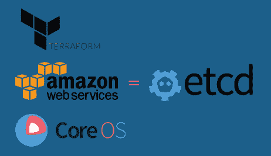
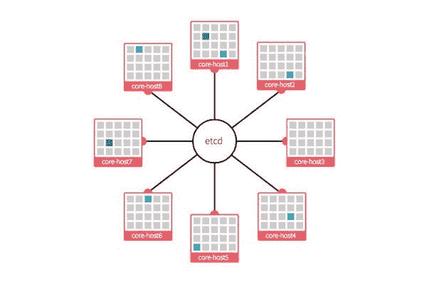
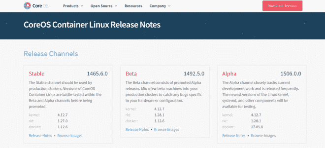
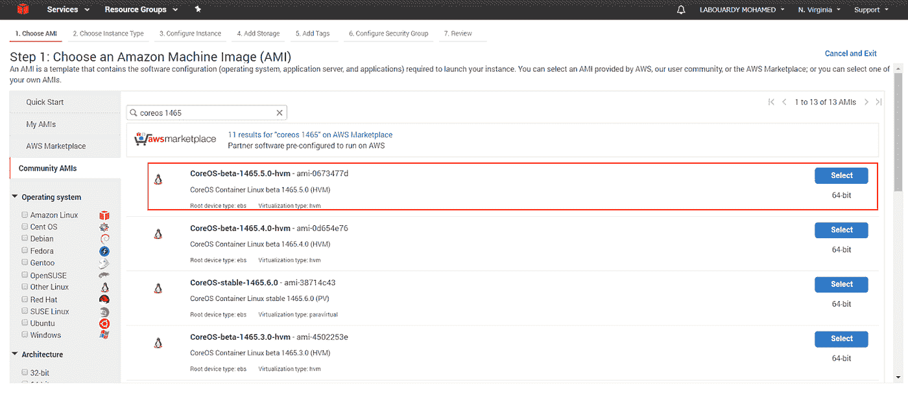
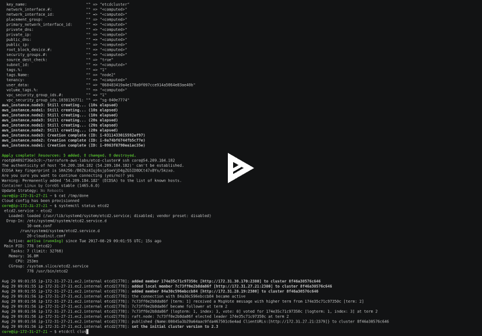
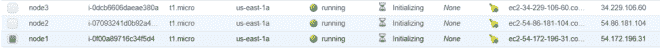
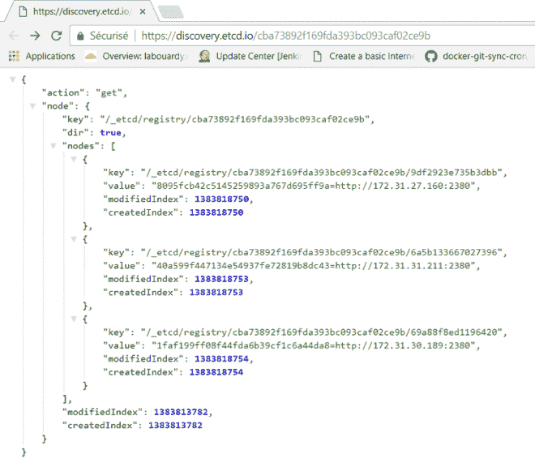
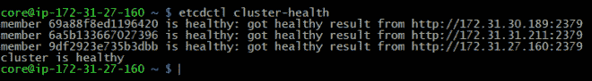
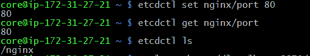
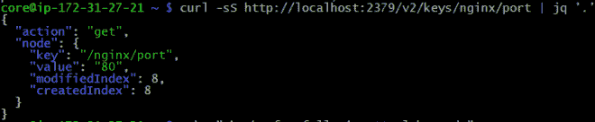

# 使用 CoreOS & Terraform 在 AWS 上设置 etcd 集群

> 原文：<https://medium.com/hackernoon/setting-up-an-etcd-cluster-on-aws-using-coreos-terraform-bc7ad7e8175b>

这篇文章是“ [**IaC**](http://www.blog.labouardy.com/manage-aws-vpc-as-infrastructure-as-code-with-terraform/) ”系列的一部分，解释如何使用**基础设施作为代码**概念与**地形**。在这一部分，我将向您展示如何使用**CoreOS**&**terra form**在 **AWS** 上设置 **etcd** 集群，如下图所示:

本演示使用的所有模板都可以在我的 [**Github**](https://github.com/mlabouardy/terraform-aws-labs/tree/master/etcd-cluster) 上找到。

因此，让我们从“ **variables.tf** ”文件开始，该文件包含 AWS 区域、集群实例类型等全局变量

注:截至本文撰写时，最新稳定的 **CoreOS** 版本为 **1465.6.0** 。

所以一定要找到一个尽可能接近最新版本的 **AMI** 。

接下来，我们需要为集群定义一个**安全组**。为了简单起见，我将使这个**安全组**对全世界开放。尽管安全性很重要，但本教程是出于教育目的，您不应该在生产中打开所有端口。

最后，我们将定义由 **3 个节点**组成的**集群**:

为了调出一个 **etcd 集群**，我使用了一个**云配置**文件，并将其作为参数传递给 **user_data** attribut:

注意:确保获取**发现令牌**，并将其放入发现参数:

> $ curl[https://discovery.etcd.io/new?size=3](https://discovery.etcd.io/new?size=3)
> 
> [https://discovery . etcd . io/3e 86 b 59982 e 49066 C5 d 813 a f1 C2 e 2579 CBF 573 de](https://discovery.etcd.io/3e86b59982e49066c5d813af1c2e2579cbf573de)

一旦定义了所有需要的模板，只需输入以下命令即可调出 **etcd 集群**:

> 地形应用

注意:不要忘记将 **AWS** **凭证**设置为**环境变量**之前:

> 导出 AWS_ACCESS_KEY_ID= "您的访问密钥 ID "
> 
> 导出 AWS_SECRET_ACCESS_KEY= "您的秘密访问密钥"

设置一个 **etcd 集群**如下所示:

完成后，转到您的 [**AWS 管理控制台**](https://console.aws.amazon.com/) ，然后导航到您的 **EC2 仪表盘**:

恭喜你！你有你的 **CoreOS 集群**。

要验证 c **luster health** ，您可以将浏览器指向您之前生成的发现 url:

或者使用以下命令将 SSH 连接到您的一个集群节点:

> ssh 核心@

然后，使用 **etcd 命令行**获取**集群状态**:

现在我们有一个 **etcd 集群**可以使用了。让我们看看我们能做些什么:

*   通过 **etcdctl:**

> etcdctl 设置 nginx/端口 80
> 
> etcdctl 获取 nginx/端口 80
> 
> etcdctl ls nginx
> 
> etc dctl RM nginx/端口

*   通过 **HTTP API:**

> ' curl-sS-X PUT-d value = " 80 "[http://localhost:2379/v2/keys/nginx/port](http://localhost:2379/v2/keys/nginx/port)| jq ' . '#创建
> 
> ' curl-sS[http://localhost:2379/v2/keys/nginx/port](http://localhost:2379/v2/keys/nginx/port)| jq ' . '#获得
> 
> curl-sS-X DELETE[http://localhost:2379/v2/keys/nginx/port](http://localhost:2379/v2/keys/nginx/port)| jq ' . '#删除

