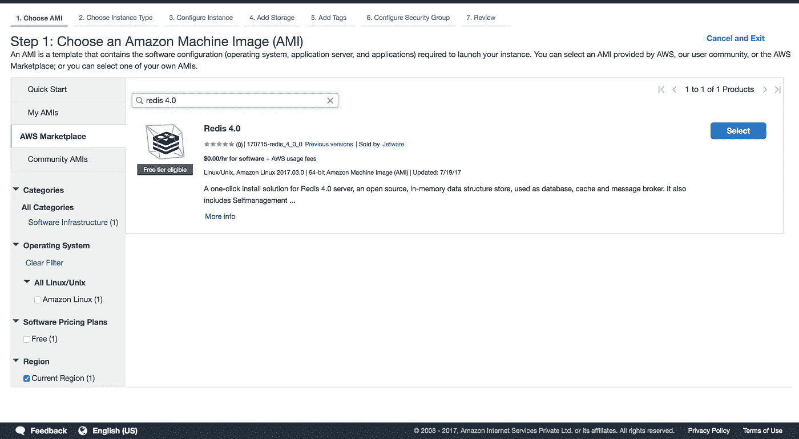

# 在 AWS 弹性豆茎上设置 Django 通道

> 原文：<https://medium.com/hackernoon/setting-up-django-channels-on-aws-elastic-beanstalk-716fd5a49c4a>

**TL；博士**

**更新:本教程是针对频道 1 的。如果你们想看第二频道的教程，请给我留言。**

Django 一直是现代实时、异步框架和库的异类之一。例如，如果您想构建一个聊天应用程序，Django 可能不是您的首选。然而，对于那些讨厌 JavaScript 的人，或者如果你是一个“有期限的完美主义者”，Django Channels 为你提供了一个很好的选择。

Django Channels 是一个库，它为 Django 带来了异步 web 的力量。如果你不熟悉 Django 频道，我强烈建议你在进一步阅读之前先熟悉一下。有很好的文章解释了 Django 频道是什么，以及它如何改变你使用 Django 的方式。[https://real python . com/blog/python/getting-started-with-django-channels/](https://realpython.com/blog/python/getting-started-with-django-channels/)和[https://blog . heroku . com/in _ deep _ with _ django _ channels _ the _ future _ of _ real _ time _ apps _ in _ django](https://blog.heroku.com/in_deep_with_django_channels_the_future_of_real_time_apps_in_django)就是两个很好的例子。它还向您展示了如何使用通道构建一个基本的聊天应用程序。这是相当简单的设置，并会让你在几分钟内！

**托管 Django 通道应用程序的问题**

在传统的 Django 中，请求由 Django 应用程序本身处理。它查看请求和 URL，确定要执行的正确视图函数，执行它，生成响应，并将响应发送回用户。相当简单。然而，Django Channels 在两者之间引入了一个接口服务器(Daphne)。这意味着接口服务器现在与外界通信。接口服务器查看请求和 URL，确定正确的“通道”，处理请求并创建供工作进程使用的“消息”，然后将消息放入该通道。像 Redis 这样的消息代理监听这些通道，并将消息传递给工作进程。工作进程监听消息队列，处理消息(很像一个视图函数),产生响应并将其发送回接口服务器，然后接口服务器将响应返回给用户。(请随意花一分钟来理解这一点，我花了很多时间:'))

这意味着现在，不仅仅是一个进程在运行，您将开始使用:

`python manage.py runserver`

你会跑:

`daphne -p 8000 your_app.asgi:channel_layer`

和

`python manage.py runworker`

这使得 Django 通道能够支持多种类型的请求(HTTP、Websockets 等)。但是很明显，它比标准的 Django 应用程序需要更多的资源。首先，它需要一个消息代理。您可以使用内存中的消息代理，但是不建议将其用于生产目的。在本例中，我们将在 EC2 实例中设置 Redis，并将其用作消息代理。

如果您使用的是 Elastic Beanstalk，默认情况下它被配置为监听端口 80，这通常是您的工作进程运行的地方。但是我们希望应用程序监听 Daphne，所以这需要配置负载平衡器将请求转发到 Daphne 正在监听的端口。

但是在这之前，我们首先需要托管 Django 应用程序本身。如果您不熟悉如何操作，请遵循以下步骤:

[](https://realpython.com/blog/python/deploying-a-django-app-and-postgresql-to-aws-elastic-beanstalk/) [## 将 Django + Python 3 + PostgreSQL 部署到 AWS Elastic Beanstalk

### 下面是如何设置和部署一个 Django 应用程序的简单介绍，它由 Python 3 提供支持，并且…

realpython.com](https://realpython.com/blog/python/deploying-a-django-app-and-postgresql-to-aws-elastic-beanstalk/) 

## 唯一的变化是您应该**选择应用负载平衡器，而不是传统负载平衡器，因为 WebSockets 仅由应用负载平衡器**提供本地支持。

**下一步:**

现在，我们需要为通道层提供 Redis。我们可以通过两种方式做到这一点:

1.A .从 EC2 提供 Redis 实例

1.B .使用 ElastiCache

你可以选择任何一个，但是请注意**elastic cache 包含了一个** **自由层**。**你只需要做其中一个。a 或 1。B** 。

# **1.A .为消息代理提供 Redis 实例**

登录您的 AWS 控制台并转到 EC2。单击顶部的“启动实例”,并在侧边菜单中选择 AWS Marketplace。

搜索 Redis 4.0



Selecting Redis from AWS Marketplace

在这之后，按照接下来的步骤。请确保存储实例的 ssh-key (pem 文件)。之后，点击“查看并启动”。这将使您的 Redis 实例启动并运行。

现在 ssh 进入 Redis 实例并打开`redis.conf`文件。

`sudo nano /jet/etc/redis/redis.conf`

将地址从`127.0.0.1`更改为`0.0.0.0`，将端口从`1999`更改为`6379`

使用以下命令保存并重启:

`sudo service restart redis`

您可以通过运行`netstat -antpl`来检查所有配置是否正确

这个命令应该显示 Redis 运行在 0.0.0.0:6379。

之后，从 EC2 Dashboard 中选择实例，并在下面的菜单中选择它的安全组(这应该类似于 Redis 4–0–170715-Redis _ 4 _ 0 _ 0-AutogenByAWSMP)。使用以下信息添加新的入站规则:

类型:自定义 TCP 规则，协议:TCP，端口范围:6379，来源:0.0.0.0/0

如果它已经存在，您不需要添加上面的内容，或者如果端口号不同，您可以只修改现有的行。现在，从 EC2 Dashboard 获取 Redis 实例的公共 DNS，并保存它以供参考。

# 1.B. **用 Redis 实例设置 ElastiCache】**

**本节演职员表:** [**查德凡德嘿**](/@cpvandehey)

登录到您的 AWS 控制台并转到 ElastiCache 服务。单击创建一个新的 ElastiCache 集群，或者如果您之前没有创建任何东西，请单击“开始”。我们将建立一个 EC Redis 集群。

a.单击 Redis 作为您的集群引擎

b.输入名称、描述并选择可用的最新引擎版本。

c.确保端口设置为 6379。

d.将节点类型设置为最小的可用类型

e.选择顶部的 T2->选择 cache.t2.micro(用于空闲层)

f.为副本数量选择“无”，并取消选择“带自动故障切换的多 az”。

g.从现有选项中选择一个现有子网，或者选择与 EC2s 相同的 AZ 创建一个新子网。

h.选择您在 Elastic Beanstalk 中创建的 ec2 的安全组。

I .取消选择“启用自动备份”并单击“创建”

您将被重定向到您的 ElastiCache 集群/实例。在这里，您将看到您的实例已经启动和配置。这个过程完成后，一定要记下 ElastiCache 实例的 url，因为稍后需要用它来配置 Django 应用程序。

# 2.编辑 Django 配置

现在，在用于生产的`settings.py`文件中，更改 redis 主机和端口以使用新创建的 Redis 实例。

```
CHANNEL_LAYERS = { "default": { "BACKEND": "asgi_redis.RedisChannelLayer", "CONFIG": { "hosts": ["redis://(<The Public DNS of the Redis instance>, 6379)"], }, "ROUTING": "<your_app>.routing.channel_routing", }}
```

请将<your app="">更改为您的应用程序名称。这将配置您的 Django 应用程序来使用我们创建的 Redis 实例。</your>

# **3。将 Daphne 服务器和工作进程作为守护进程运行**

在你的 app 目录下，打开`.ebextensions`文件夹，新建一个名为`daemon.config`的文件，内容如下:

请将<your_project>更改为您的 django 应用的名称。这基本上创建了一个脚本并将其放入`/opt/elasticbeanstalk/hooks/appdeploy/post/`</your_project>

以便它在应用程序部署后执行。现在，这个脚本又创建了一个超级用户配置脚本，它负责运行守护进程和管理超级用户。(同样，请随意花一分钟来理解这一点:') )

# **4。最后一步:配置 ALB**

现在我们已经设置了 Redis，daphne 和 worker 进程正在运行，现在我们需要做的就是配置我们的应用程序负载平衡器，将请求转发到我们的 Daphne 服务器，该服务器正在侦听端口 5000(请检查守护进程的配置脚本)。

在你的`.ebextensions`文件夹中创建一个名为`alb_listener.config`的新文件，并放入下面的代码。

```
option_settings:
  aws:elbv2:listener:80:
    DefaultProcess: http
    ListenerEnabled: 'true'
    Protocol: HTTP
  aws:elasticbeanstalk:environment:process:http:
    Port: '5000'
    Protocol: HTTP
```

请小心空格，因为这是 YAML 语法。

重新部署您的应用程序和 Viola！你的 Django Channels 应用已经在 AWS Elastic Beanstalk 上运行了。

如果你有什么问题，欢迎在评论中提问！如果你喜欢这篇博文，欢迎对以后的博文提出任何建议。:')

感谢阅读！