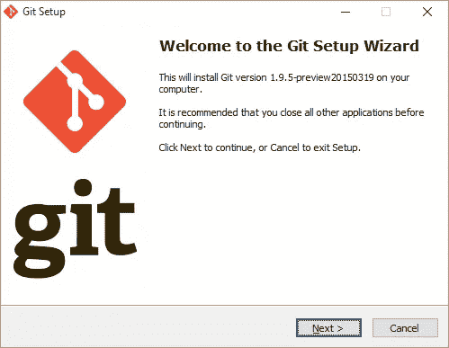
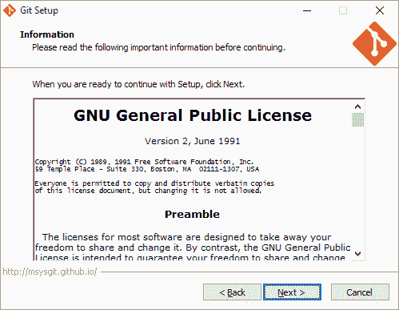
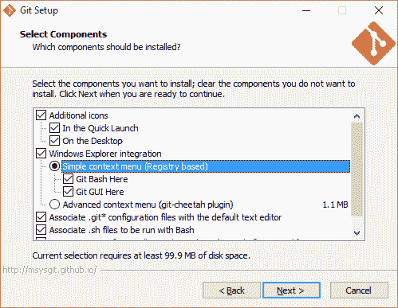
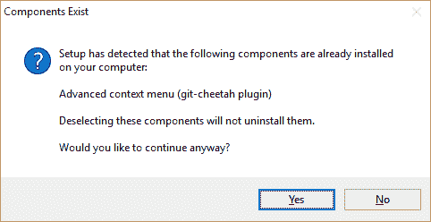
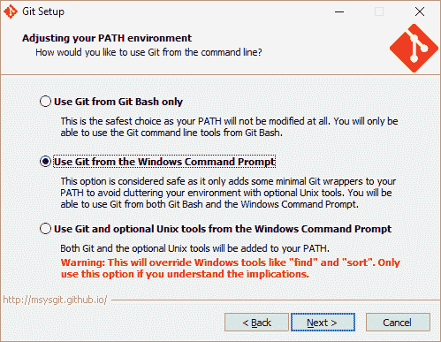
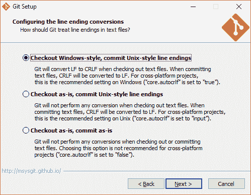
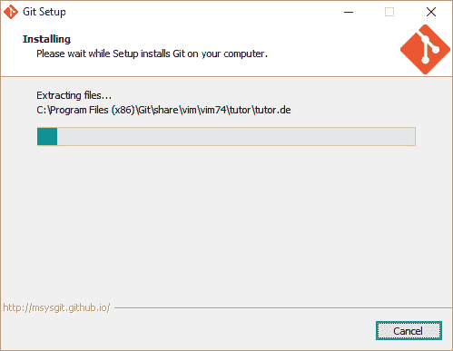
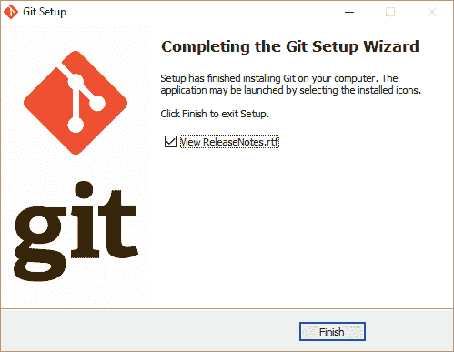
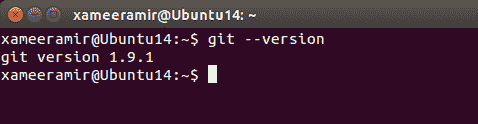

# 在 Windows 和 Ubuntu linux 上设置 git

> 原文：<https://medium.com/hackernoon/setting-up-git-on-windows-and-ubuntu-linux-f4a71d8afc0f>

[礼貌](https://git-for-windows.github.io/)

[DevOps](https://en.wikipedia.org/wiki/DevOps) 不仅编码而且负责配置的工程师知道**系统管理**比开发更痛苦。我记得[在运行](http://xameeramir.github.io/site-pre-requisites/) [Windows](https://hackernoon.com/tagged/windows) server 2012 R2 的[谷歌计算引擎](https://cloud.google.com/compute/)实例上配置 ASP.NET MVC 5 网站。

为了避免这种痛苦，我更喜欢使用 [*检查表*](http://atulgawande.com/book/the-checklist-manifesto/) 和 [*备忘单*](http://xameeramir.github.io/seo-cheat-sheet/) 。人们可以回头查阅它们以备后用。

这篇文章是一篇非常简短的关于在 Windows 10 和 linux 上安装的直观指南。

没错，这正是我需要[以后做](http://ionicframework.com/docs/guide/installation.html)的方向！

[顺便说一下](http://xameeramir.github.io/install-git-windows-ubuntu-linux/www.google.com/?q=by%20the%20way)、[离子](http://ionicframework.com/)可以通过 Windows 上的 [CLI](https://en.wikipedia.org/wiki/Command-line_interface) 来控制。有两个选项可供选择:

*   [控制台 2](http://sourceforge.net/projects/console/)
*   [Git 客户端](http://git-scm.com/download/win)

# 在 Windows 上设置`git`(并忽略控制台 2)

从[http://git-scm.com/download/win](http://git-scm.com/download/win)下载最新的`git`客户端

打开下载的安装文件:

在第三个屏幕上，询问是否提供桌面快捷方式和快速启动等启动点的图标。

在预配置上下文的情况下，将显示一条警告:

作为 windows 用户，在 windows 的命令提示符下使用`git`是合理的。

决定`line endings`的行为

# 在 Ubuntu linux 上设置`git`

使用`sudo apt-get install git`命令并输入 **root** 密码。

成功认证后，系统会负责安装。

在 Ubuntu 上检查`git`版本

所以，现在事情准备好了一些`[git-init](https://try.github.io/)`

[照片](https://goo.gl/photos/9DymJoWNntaW85Ez7)