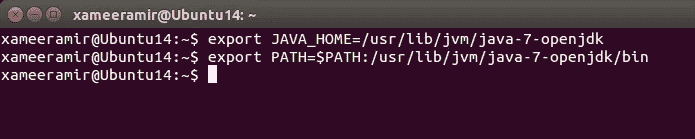
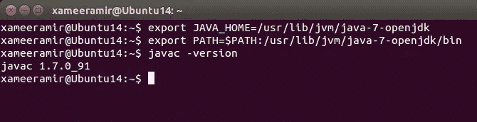
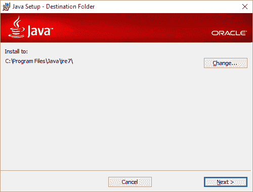
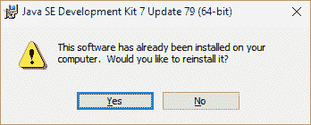
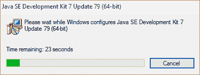
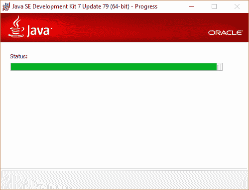

# 在 Ubuntu linux 和 Windows 上设置 Java

> 原文：<https://medium.com/hackernoon/setting-up-java-on-ubuntu-linux-and-windows-f60c910d39e3>

在设置好 [Git](http://xameeramir.github.io/install-git-windows-ubuntu-linux/) 、 [node](http://xameeramir.github.io/install-node/) 和 [Cordova](http://xameeramir.github.io/installing-cordova/) 之后，需要完成 [Java](https://www.oracle.com/java/index.html) 设置，以便在 [Ubuntu linux](http://www.ubuntu.com/) 上准备好[Ionic](http://ionicframework.com/docs/guide/installation.html)。

# 在 Ubuntu Linux 上设置 Java

输入命令`sudo apt-get install openjdk-7-jdk`。输入 [root](https://hackernoon.com/tagged/root) 密码，让系统执行它的任务。

输入`apt-cache search jdk`

设置“JAVA_HOME”和“PATH”环境变量:

`export JAVA_HOME=/usr/lib/jvm/java-7-openjdk`

完成，现在只需通过检查安装的版本来验证安装:

`javac -version`

# 在 Windows 上安装 Java

在这里打开从[下载的设置文件](https://www.java.com/en/download/manual.jsp)

按照所示说明进行操作:

选择安装组件—对于需要特定配置的服务器，这可能是必需的

选择安装路径

如果你已经安装了 [Java](https://hackernoon.com/tagged/java) ，将会显示一个警告

现在，[我们只需要设置环境变量](http://www.computerhope.com/issues/ch000549.htm)。

[照片](https://goo.gl/photos/caGGuZ1UnVGxhBaq6)