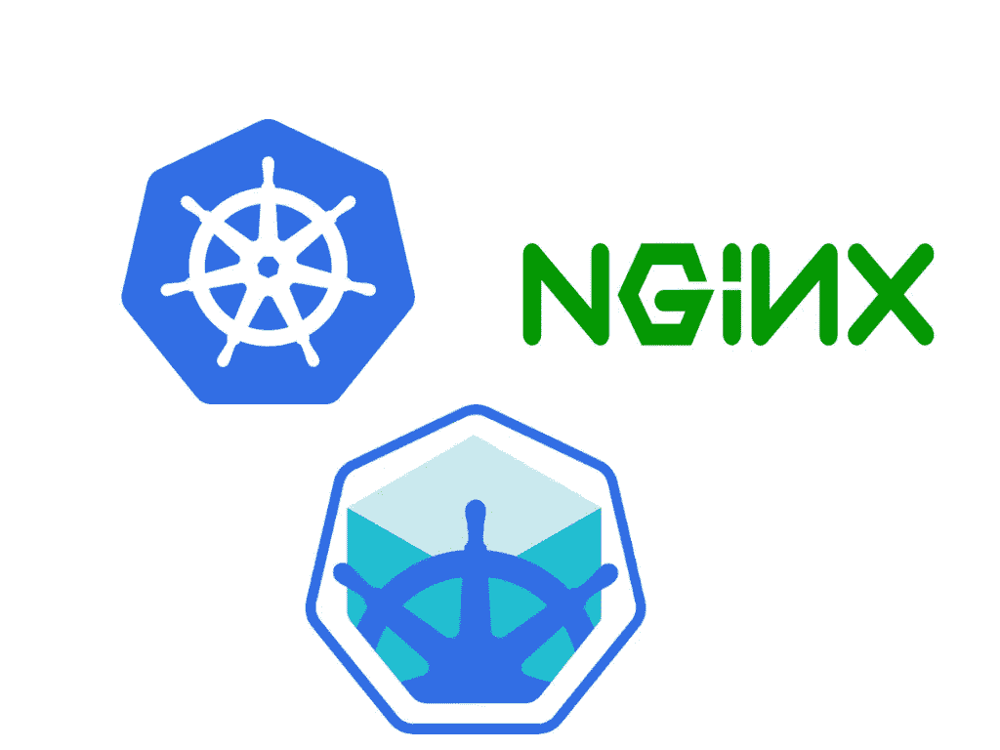

# 在 Kubernetes 上设置 Nginx 入口

> 原文：<https://medium.com/hackernoon/setting-up-nginx-ingress-on-kubernetes-2b733d8d2f45>



嘿，在你的 Kubernetes 集群上设置入口控制器？在阅读了许多文章和官方文档后，我仍然很难设置入口。但是经过无数次尝试，我设法设置了一个***nginx-ingress-controller***来将外部流量转发到我的集群内服务，处理 HTTP 和 HTTPS。这篇文章一步一步地指导你做到这一点。

psst…如果你像我一样是 Kubernetes 的新手，这里有一篇很好的文章解释了入口。

[](/@cashisclay/kubernetes-ingress-82aa960f658e) [## Kubernetes 入口

### 很多人似乎对 Kubernetes 中 Ingress 的工作方式感到困惑，Slack 中几乎每天都会出现问题。这是…

medium.com](/@cashisclay/kubernetes-ingress-82aa960f658e) 

# 现场

我们将设置一个简单的“hello-world”api，并在使用 [*Minikube*](https://kubernetes.io/docs/getting-started-guides/minikube/) 的本地集群上使用***nginx-ingress-controller***公开该 API。

> TL；DR — [这里的](https://github.com/gokulchandra/k8s-ingress-setup)是一个样板文件，反映了所解释的内容。

# 步伐

## 步骤 1:创建要公开的服务

假设您已经设置了 Kubectl 和 Minikube，让我们部署我们的`hello-world` api，并在我们的集群中将其公开为 [*节点端口服务*](https://kubernetes.io/docs/concepts/services-networking/service/#type-nodeport) 。出于演示的目的，我们将使用一个简单的 api。源代码可以在 [*这里找到*](https://github.com/gokulchandra/hello-world-api) 。

配置文件由部署和服务组成。通常我们把它们分成单独的文件。

```
kubectl create -f hello-world.yaml
```

现在，您应该能够在运行时看到创建的资源

```
kubectl get all | grep hello-world
```

## 步骤 2:创建 nginx-ingress-controller 使用的默认后端

我们需要为入口控制器提供一个默认的后端。如果 Nginx 不能成功地路由请求，那么`default backend`是默认的服务。`default backend`需要满足以下两个要求:

*   在/
*   在 a/health 上服务 200 人 z

nginx-ingress-controller 项目有一个默认后端的例子。

```
kubectl create -f default-backend.yaml
```

## 步骤 3:创建秘密来为 Nginx 指定 SSL 证书

[使用 OpenSSL](https://www.digitalocean.com/community/tutorials/how-to-create-a-self-signed-ssl-certificate-for-nginx-on-centos-7) 创建自签名证书。生成 SSL 证书时指定的 ***通用名*** 应该作为入口配置中的 ***主机*** 。我们为给定的密钥、证书和 dhparam 文件创建秘密。为密钥、证书和 dhparam 使用相应的文件名。

```
kubectl create secret tls tls-certificate --key <key-file>.key --cert <certificate-file>.crtkubectl create secret generic tls-dhparam --from-file=<dhparam-file>.pem
```

## 步骤 4:在 Minikube 上启用入口

Minikube 版本> [*v0.14.0*](https://github.com/kubernetes/minikube/blob/v0.14.0/CHANGELOG.md) 附带 Nginx 入口设置作为附件。只需运行以下命令即可启用:

```
minikube addons enable ingress
```

启用附加设备提供以下内容:

*   Nginx 负载平衡器的 [*配置图*](https://github.com/kubernetes/minikube/blob/master/deploy/addons/ingress/ingress-configmap.yaml) 。
*   [nginx- *入口控制器*](https://github.com/kubernetes/minikube/blob/master/deploy/addons/ingress/ingress-rc.yaml) 。
*   一个[服务](https://github.com/kubernetes/minikube/blob/master/deploy/addons/ingress/ingress-svc.yaml)，它公开了一个默认的 Nginx 后端 pod 来处理未映射的请求。

## 步骤 5:设置 nginx 入口控制器

现在我们为控制器创建一个服务。该服务属于类型 [*负载平衡器*](https://kubernetes.io/docs/concepts/services-networking/service/#type-loadbalancer) ，因此它在集群外部公开。

配置包括 nginx-ingress 的部署和服务。从配置中可以观察到以下内容:

*   ***默认 SSL 证书*** 和 ***默认后端服务*** 的秘密作为参数传递。
*   镜像**nginx-ingress-controller:0 . 9 . 0-beta 5**使用。我已经尝试了更高的测试版本。这似乎是一个更稳定的用例。
*   ***tls-dhparam*** 秘密被安装在控制器要使用的卷上。

通过运行以下命令创建控制器:

```
kubectl create -f nginx-controller.yaml
```

几秒钟后，我们应该能够看到创建的带有公开 IP 地址的资源。得到迷你库贝的 IP 地址。

```
minikube service nginx-ingress --url
```

对暴露的端点运行一个 *Curl* 请求应该会给我们一个来自**默认后端**的响应，因为我们还没有配置我们的入口来指向我们的 hello-world api。

```
curl [http://<nginx-service-IP>:](http://192.168.99.100:30567)<port>default backend - 404%
```

## 步骤 6:配置入口规则

接下来我们会花大部分时间。我们向入口提供转发规则。

我们在这里使用注释将配置参数传递给底层入口控制器，在我们的例子中是 Nginx。你可以在这里 找到更多关于 [*的注解。*](https://github.com/kubernetes/ingress/blob/master/docs/annotations.md)

*   [***【nginx.org/ssl-services】***](https://github.com/nginxinc/kubernetes-ingress/tree/master/examples/ssl-services)**用于指定使用 HTTPS 进行负载均衡的服务**
*   *我们指定主机、路径及其相应的服务处理程序。*

```
*kubectl create -f ingress.yaml*
```

*我们现在已经配置了一个 Nginx web 服务器，它将*的流量路由到我们配置的***hello-world-SVC***。对于未处理的请求，它会退回到 ***默认-后端服务*** 。**

**此外，您可能希望更新`/etc/hosts`文件，以将您的主机解析为您的 minikube IP。假设你的 Minikube IP 是`192.168.99.101`，你的条目应该是这样的。**

```
**192.168.99.101 api.sample.com**
```

**您应该能够通过 https 访问公开的端点。**

```
**GET api.sample.com/:name
POST api.sample.com/:name
PUT api.sample.com/:name**
```

**将注释`ingress.kubernetes.io/ssl-redirect: “true”`添加到`ingress.yaml`配置中，可以使流量通过 HTTP 和 HTTPS。**

# ****结论****

**Ingress 允许您配置多个虚拟主机、粘性会话、路径重写以及自定义配置，为 Kubernetes 提供了一个强大、灵活的路由机制。**

**有关 nginx 入口控制器的更多信息，请访问[*https://github.com/nginxinc/kubernetes-ingress*](https://github.com/nginxinc/kubernetes-ingress/blob/master/examples/proxy-protocol/README.md)**

**类似的程序可用于部署到 GKE 的 AWS，而不是 Minikube。**

> **尤其是 Kubernetes 和 Ingress 在不断发展，我会尽力保持更新。**童子军誓言。****

# **好的读物**

*   **[https://medium . com/@ oskar R3/setting-up-ingress-on-minikube-6ae 825 e 98 f 82](/@Oskarr3/setting-up-ingress-on-minikube-6ae825e98f82)**
*   **[http://danielfm.me/posts/painless-nginx-ingress.html](http://danielfm.me/posts/painless-nginx-ingress.html)**
*   **[https://daemonza . github . io/2017/02/13/kubernetes-nginx-ingress-controller/](https://daemonza.github.io/2017/02/13/kubernetes-nginx-ingress-controller/)**

***希望你喜欢读这篇文章，就像我喜欢写它一样。*
*你是否认为这样会对某人有所帮助？不要犹豫分享。如果你喜欢它，点击下面的* ***拍手*** *，这样其他人会在这里的媒体上看到它。不要忘了在博客后用* ***表达爱意！*****

> ****** 2018 年 11 月 11 日更新**** 在示例设置中增加了 RBAC。感谢[延斯·麦德森](https://medium.com/u/1c0929523f89?source=post_page-----2b733d8d2f45--------------------------------)的贡献。**