# 教程:使用数据库设置 Node.js

> 原文：<https://medium.com/hackernoon/setting-up-node-js-with-a-database-part-1-3f2461bdd77f>

我本可以将本教程命名为“用 MySQL 设置 Node.js ”,但是我想让这个名称更具包容性，因为我认为对于大多数应用程序来说，MySQL 是 Node.js 的最佳选择

MySQL 已经存在了 21 年，所以在早期的 Node.js 应用中，它经常被一些新的闪亮的 NoSQL 选择所忽略，比如 MongoDB。然而，事后看来，MongoDB 更多的是炒作，而不是实质，并且因为一些主要的安全问题和性能问题而众所周知。不信的话，[搜索“MongoDB”](https://hn.algolia.com/?query=mongodb&sort=byPopularity&prefix&page=0&dateRange=all&type=story)黑客新闻。

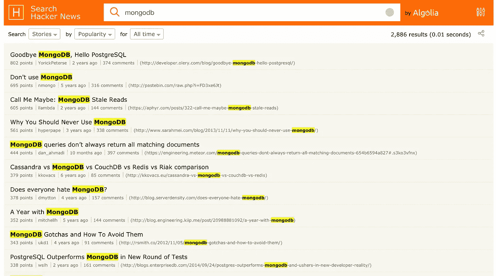

如果你想要一个数据库，[甚至 NoSQL](http://blog.wix.engineering/2015/12/10/scaling-to-100m-mysql-is-a-better-nosql/) ，MySQL 是一个很好的选择。它有强大的支持，体面的性能，并有一些伟大的 NPM 模块接口。此外，几乎所有东西都有 MySQL 适配器。

在本教程中，我将展示如何使用 [Knex](http://knexjs.org/) 设置 MySQL 和 Node，以便创建一个用于创建和登录用户的粗糙应用程序。

我们将

*   安装 Node.js
*   安装 MySQL
*   创建一个 HTTP API 来写入数据库
*   创建一些 HTML 和 JS 来发布到 API
*   使用 Knex 迁移来创建用户数据库模式(类似于 Rails 迁移的过程)
*   使用迁移来设置密码哈希
*   创建一个登录路由来检查哈希工作

在下一个教程中，我们将为应用程序添加更多功能，并探索一些更复杂的查询。最终我们会在某个地方部署这个应用程序。

# 安装 Node.js

如果您已经完成了前面的教程，您可能已经安装了 Node，因此可以跳过这一节。

我们将使用 NVM 来管理节点，以便我们可以轻松地安装和切换不同的版本。

在安装 NVM 之前，确保您的主目录中有一个`.bashrc`文件(即使该文件是空的)。

```
touch ~/.bashrc
```

要安装 NVM，只需运行此命令(与 NVM 安装说明相同)。

```
curl -o- [https://raw.githubusercontent.com/creationix/nvm/v0.32.1/install.sh](https://raw.githubusercontent.com/creationix/nvm/v0.32.1/install.sh) | bash
```

这个命令从远程 URL 下载一个脚本并运行它。

你现在有 NVM 了！但是如果你运行`nvm ls`，你会发现它没有被找到。这是因为 NVM 给你的`~/.bashrc`增加了一些代码。这个文件是一个特殊的文件，在您每次登录到您的实例时都会运行，因此要让 NVM 运行，您可以注销并再次登录。然而，您可以使用`source`命令手动运行该文件。

```
source ~/.bashrc
```

现在运行`nvm ls`工作了！但是没有安装任何节点版本！要获得最新版本，只需`nvm install <latest version number>`。

```
nvm install 7
```

您已经安装了节点！通过查看版本来检查它是否存在

```
node --version
```

# 安装 MySQL

如果你用的是 Mac，应该用[自制](http://brew.sh/)安装 MySQL。如果你使用的是另一个平台，只需谷歌一下类似“在我的平台上安装 MySQL”的说明。

在 mac 上安装家酿软件，在终端上运行

```
/usr/bin/ruby -e "$(curl -fsSL https://raw.githubusercontent.com/Homebrew/install/master/install)"
```

一旦安装，更新家酿和安装 MySQL

```
brew update
brew install mysql
```

运行 MySQL 守护进程

```
brew services start mysql
```

在本地为 MySQL 设置一个基本的密码，没有必要担心安全性，因为它只能从您的机器上访问(我使用的是“密码”)。

```
mysqladmin -u root password 'password'
```

一旦安装并运行，MySQL 就可以被本地运行的任何应用程序访问。

在本教程中，我们将使用 [Sequel Pro](https://www.sequelpro.com/) 来管理我们的数据库。[下载安装 Sequel Pro](https://sequelpro.com/download#auto-start) 并打开。要连接的数据库位于本地主机上，因此将“主机”设置为“127.0.0.1”。用户名是“root ”,密码与上一步选择的相同，对我来说是“密码”。

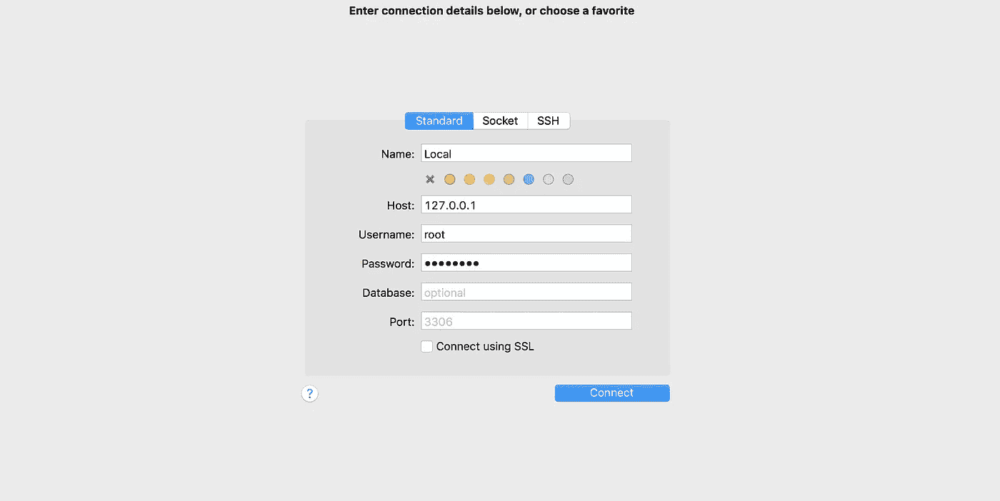

连接，你会看到一个空的 MySQL。如果连接不成功，请确保您在上一步中正确修改了密码，并且`mysql`服务仍在运行。

成功连接后，点击数据库>添加数据库并命名，我选择的名字是“tutorial _ node _ Database”(MySQL 命名约定是 snake_case)。

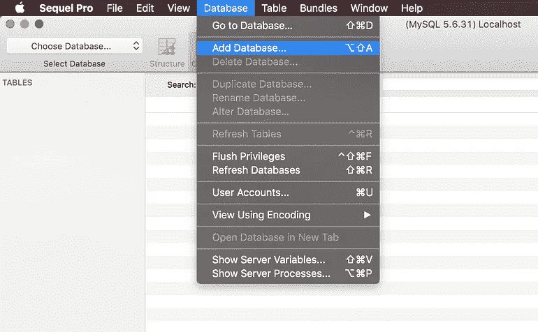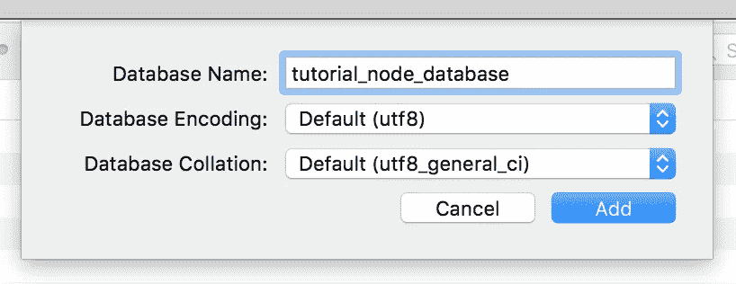

太好了，MySQL 已经准备好了！

# 项目设置

我已经将整个项目添加到[一个公共的 github repo](https://github.com/roberttod/tutorial-node-database) 中，并且我已经将每个步骤分解为一个提交，所以应该很容易理解。这只是作为一种帮助，我们将从头开始创建项目，所以没有必要克隆代码。

让我们从一个新的目录开始，我将这个项目命名为`tutorial-node-database`。运行以下命令创建文件结构。

```
mkdir tutorial-node-database
cd tutorial-node-databasetouch knexfile.js
touch index.js
touch store.jsmkdir public
touch public/index.html
touch public/app.js# choose all defaults when prompted
npm init
```

我们正在使用 Knex 和 MySQL，并使用 express 创建一个小 API，所以你需要安装`knex`和`express`。我们还将使用`body-parser`模块。

```
npm i knex mysql express body-parser --save
```

`knex`也应该全球安装

```
npm i knex -g
```

当创建一个新的项目，我喜欢添加一个最小的。gitignore file，这样我可以轻松地检查所有内容，而不包括 MacOS 喜欢创建的`node_modules`文件夹或`.DS_Store`文件。

```
printf "node_modules\n.DS_Store" > .gitignore
```

如果您不理解上面的 bash 代码，也不用担心。它所做的就是将`node_modules`后接换行符`\n`后接`.DS_Store`放入一个名为`.gitignore`的文件中。如果对你来说更简单的话，使用编辑器来做这种事情是完全合理的。

# HTTP API

我们将从一个简单的 express 应用程序开始，服务于公共目录，用一个`/createUser`端点将一些数据写入数据库。

```
const express = require('express')
const bodyParser = require('body-parser')const store = require('./store')const app = express()
app.use(express.static('public'))
app.use(bodyParser.json())
app.post('/createUser', (req, res) => {
  store
    .createUser({
      username: req.body.username,
      password: req.body.password
    })
    .then(() => res.sendStatus(200))
})app.listen(7555, () => {
  console.log('Server running on [http://localhost:7555')](http://localhost:7555'))
})
```

将此保存到`index.js`。当我们运行这个文件时，服务器将在 [http://localhost:7555](http://localhost:7555')) 上监听对`/createUser`的 POST 请求，并将这些请求传递给存储文件。然后，服务器将使用 200 状态代码进行响应(200 是每个 HTTP 服务器用来表示请求成功的代码)。

目前，我们将模拟商店，以检查我们的 API 是否有效。

```
module.exports = {
  createUser ({ username, password }) {
    console.log(`Add user ${username} with password ${password}`)
    return Promise.resolve()
  }
}
```

将此保存到`store.js`。请注意，`addLog`函数返回一个承诺，这样您就知道什么时候完成了。如果这里承诺的使用有点令人困惑，可能值得查看一些承诺教程，它们是现代 Javascript 中的一个基本概念。

现在，让我们写一个简单的`index.html`，包括`app.js`。我们在 HTML 的底部添加了`app.js`而不是`head`，这样我们就可以轻松地查询脚本上面的元素，而不需要使用像`jQuery.ready`或`DOMContentLoaded`事件这样的东西来等待它们加载。

```
<!DOCTYPE html>
<html>
<head>
  <title>Node database tutorial</title>
</head>
<body>
  <form class="CreateUser">
    <h1>Create a new user</h1>
    <input type="text" class="username" placeholder="username">
    <input type="password" class="password" placeholder="password">
    <input type="submit" value="Create user">
  </form>
  <script src="/app.js"></script>
</body>
</html>
```

`app.js`脚本应该看起来像下面这样，并且将用于命中服务器的`/createUser`端点。

```
const CreateUser = document.querySelector('.CreateUser')
CreateUser.addEventListener('submit', (e) => {
  e.preventDefault()
  const username = CreateUser.querySelector('.username').value
  const password = CreateUser.querySelector('.password').value
  post('/createUser', { username, password })
})function post (path, data) {
  return window.fetch(path, {
    method: 'POST',
    headers: {
      'Accept': 'application/json',
      'Content-Type': 'application/json'
    },
    body: JSON.stringify(data)
  })
}
```

将此保存到`public/app.js`并启动您的服务器。

```
node .
```

您的服务器应该在 [http://localhost:7555/](http://localhost:7555/) 上启动。转到此链接，当您单击“创建用户”时，您将能够在网络面板中看到创建用户请求。


检查你的终端是否有来自`store.js`的`console.log`。


如果使用 git，这是提交代码的好时机。

```
# An empty first commit is nice
git commit --allow-empty -m "( ͡° ͜ʖ ͡°)"git add .
git commit -m "Setup server with mock store"
```

# 设置 knex

让我们设置`knexfile.js`来连接数据库。

```
module.exports = {
  client: 'mysql',
  connection: {
    user: 'root',
    password: 'password',
    database: 'tutorial_node_database'
  }
}
```

我已经使用默认凭证本地连接到 MySQL，如果您的凭证不同，您可能需要更改它。

对于本教程，我们需要一个带有用户名和密码的用户表。这些都需要在 schema 中定义。为了创建或修改模式，我们将使用 Knex 迁移。

创建一个新的迁移，并将其命名为有意义的名称

```
knex migrate:make create_user_table
```

这将创建一个类似于`migrations/20170504155313_create_user_table.js`的文件。文件名是当前日期时间，后跟您指定的名称。datetime 使文件系统中的迁移文件保持有序，便于您按时间顺序阅读。

每当我们需要添加、删除或修改一个表或列来改变数据的表示方式时，我们都会编写一个新的迁移文件。这使我们能够

*   以编程的方式进行模式更改，可以签入 git 并进行检查(比直接使用 MySQL 更新模式好得多)
*   创建模式更新的历史记录
*   使用 JS 而不是 SQL 来转换值(能够使用项目内部的 NPM 模块和函数)
*   让所有项目协作者的数据库模式保持最新，他们可以运行最新的迁移来获得最新的更改
*   部署代码更改时更新临时数据库和生产数据库
*   回滚架构更改

创建的文件包含导出一个`up`方法和`down`方法的代码。我们将在`down`方法(迁移时使用)中创建我们的表模式，并在`up`方法(回滚时)中删除它。

```
exports.up = function (knex) {
  return knex.schema.createTable('user', function (t) {
    t.increments('id').primary()
    t.string('username').notNullable()
    t.string('password').notNullable()
    t.timestamps(false, true)
  })
}exports.down = function (knex) {
  return knex.schema.dropTableIfExists('user')
}
```

Knex 的 API 非常简单，[文档也非常容易阅读](http://knexjs.org/)。认识到 Knex 实际上是从您发出的调用中构造 SQL 是很重要的。尽管您使用的是 JavaScript API，但是许多查询都是在考虑底层 SQL 的情况下构建的，这对于查询性能和优化非常重要。

注意，我们在这里添加了一个会自动递增的`id`字段，以及使用`t.timestamps`方法的`updated_at`和`created_at`字段。

要运行此迁移

```
knex migrate:latest
```

检查 SequelPro 以查看具有指定模式的新表

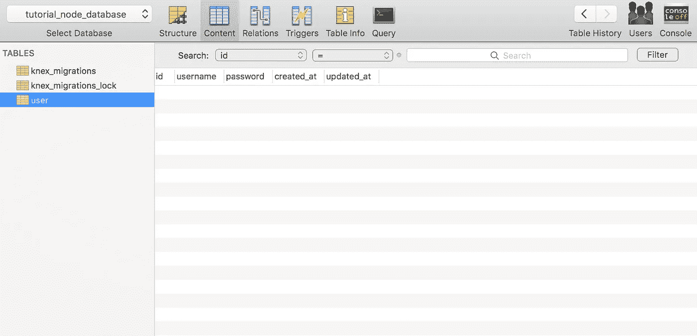

现在我们有了一个表，我们可以编辑 store.js，以便它将数据写入表中。

# 使用 Knex.js 写入数据

我们需要我们的商店做的就是使用`knexfile.js`配置加载 knex，然后每当发出`createUser`请求时将数据写入`user`表。

```
const knex = require('knex')(require('./knexfile'))module.exports = {
  createUser ({ username, password }) {
    console.log(`Add user ${username} with password ${password}`)
    return knex('user').insert({
      username,
      password
    })
  }
}
```

重启你的服务器，浏览到 [http://localhost:7555/](http://localhost:7555/) 创建一个用户。如果你去 Sequel Pro，你应该看到新用户出现在数据库中。

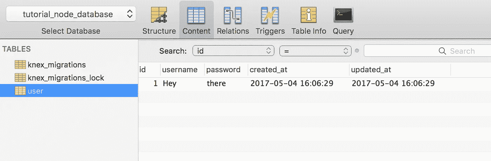

```
git add .
git commit -m "Setup knex"
```

# 安全存储密码

在继续下一步之前，让我们确保密码在数据库中是加密的。使用数据库迁移的灵活性非常方便。

为了安全地存储密码，您希望为每个新用户创建一个随机的 salt，并使用 crypto 来加密密码(这是标准的做法，可以防止在数据库受损的情况下泄露用户的密码)。

在迁移之前，让我们将加密逻辑添加到 store.js 文件中

```
const crypto = require('crypto')
const knex = require('knex')(require('./knexfile'))module.exports = {
  saltHashPassword,
  createUser ({ username, password }) {
    console.log(`Add user ${username}`)
    const { salt, hash } = saltHashPassword(password)
    return knex('user').insert({
      salt,
      encrypted_password: hash,
      username
    })
  }
}function saltHashPassword (password) {
  const salt = randomString()
  const hash = crypto
    .createHmac('sha512', salt)
    .update(password)
  return {
    salt,
    hash: hash.digest('hex')
  }
}function randomString () {
  return crypto.randomBytes(4).toString('hex')
}
```

注意`crypto`是一个本地节点模块，不需要使用`npm`安装。

让我们创建一个迁移文件

```
knex migrate:make encrypt_user_password
```

对于迁移，我们将添加`encrypted_password`和`salt`列，然后我们将借用从`store.js`导出的`saltHashPassword`方法来迁移数据库中已经存在的用户。最后，我们将删除`password`列。

```
const { saltHashPassword } = require('../store')exports.up = function up (knex) {
  return knex.schema
    .table('user', t => {
      t.string('salt').notNullable()
      t.string('encrypted_password').notNullable()
    })
    .then(() => knex('user'))
    .then(users => Promise.all(users.map(convertPassword)))
    .then(() => {
      return knex.schema.table('user', t => {
        t.dropColumn('password')
      })
    }) function convertPassword (user) {
    const { salt, hash } = saltHashPassword(user.password)
    return knex('user')
      .where({ id: user.id })
      .update({
        salt,
        encrypted_password: hash
      })
  }
}exports.down = function down (knex) {
  return knex.schema.table('user', t => {
    t.dropColumn('salt')
    t.dropColumn('encrypted_password')
    t.string('password').notNullable()
  })
}
```

我们无法在 down 函数中恢复原来的密码，因为它是加密的，因此我们只能尽最大努力将模式恢复原样。

这里使用了大量的承诺，这在编写迁移时很常见。使用 async/await，我们可以大大简化这段代码。

```
const { saltHashPassword } = require('../store')exports.up = async function up (knex) {
  await knex.schema.table('user', t => {
    t.string('salt').notNullable()
    t.string('encrypted_password').notNullable()
  })
  const users = await knex('user')
  await Promise.all(users.map(convertPassword))
  await knex.schema.table('user', t => {
    t.dropColumn('password')
  }) function convertPassword (user) {
    const { salt, hash } = saltHashPassword(user.password)
    return knex('user')
      .where({ id: user.id })
      .update({
        salt,
        encrypted_password: hash
      })
  }
}exports.down = function down (knex) {
  return knex.schema.table('user', t => {
    t.dropColumn('salt')
    t.dropColumn('encrypted_password')
    t.string('password').notNullable()
  })
}
```

如果您想使用 async await，请确保您拥有最新的节点版本(它最近才得到支持)

```
nvm i 7
```

安装新的节点版本时，请注意需要重新安装全局软件包。

```
npm i knex -g
```

让我们运行迁移并检查它是否工作。

```
knex migrate:latest
```

如果一切顺利，你的密码应该已经加密了。

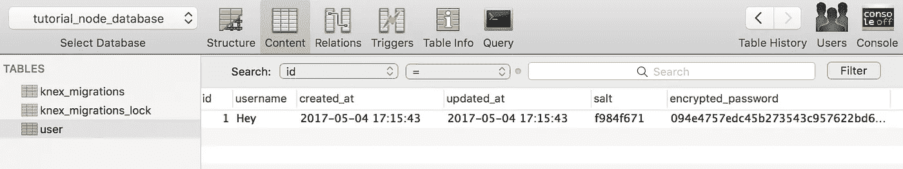

重新启动服务器和创建新用户应该加密密码。转到 [http://localhost:7555/](http://localhost:7555/) 并创建更多用户来检查它的工作情况。

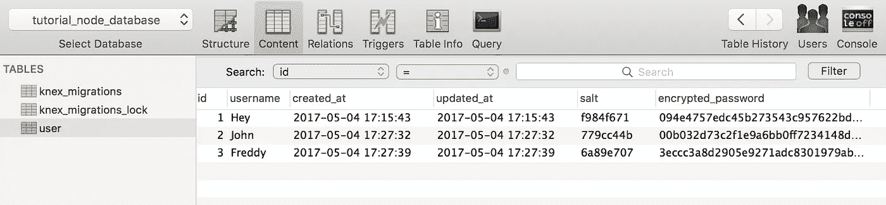

```
git add .
git commit -m "Encrypt passwords"
```

# 添加登录路径

此时，让我们安装`nodemon`以便在我们进行更改时自动重启服务器。

```
npm i -g nodemon
```

现在使用 nodemon 而不是 node 运行服务器

```
nodemon .
```

下次我们进行更改时，服务器将为我们重新启动。通常您会让它运行，然后在新的终端选项卡中运行 bash 操作。

为了对用户进行身份验证，我们创建了一个`/login`路由，它使用用户名和密码调用商店的`authenticate`方法。

```
const express = require('express')
const bodyParser = require('body-parser')
const store = require('./store')
const app = express()app.use(express.static('public'))
app.use(bodyParser.json())app.post('/createUser', (req, res) => {
  store
    .createUser({
      username: req.body.username,
      password: req.body.password
    })
    .then(() => res.sendStatus(200))
})
app.post('/login', (req, res) => {
  store
    .authenticate({
      username: req.body.username,
      password: req.body.password
    })
    .then(({ success }) => {
      if (success) res.sendStatus(200)
      else res.sendStatus(401)
    })
})app.listen(7555, () => {
  console.log('Server running on [http://localhost:7555'](http://localhost:7555'))
})
```

如果认证成功，我们用 200 响应，否则我们用 401(未授权)响应。

在商店中，我们需要获取用户的 salt，用它来加密密码，然后对照数据库中的`encrypted_password`进行检查。

```
const crypto = require('crypto')
const knex = require('knex')(require('./knexfile'))module.exports = {
  createUser ({ username, password }) {
    console.log(`Add user ${username}`)
    const { salt, hash } = saltHashPassword({ password })
    return knex('user').insert({
      salt,
      encrypted_password: hash,
      username
    })
  },
  authenticate ({ username, password }) {
    console.log(`Authenticating user ${username}`)
    return knex('user').where({ username })
      .then(([user]) => {
        if (!user) return { success: false }
        const { hash } = saltHashPassword({
          password,
          salt: user.salt
        })
        return { success: hash === user.encrypted_password }
      })
  }
}function saltHashPassword ({
  password,
  salt = randomString()
}) {
  const hash = crypto
    .createHmac('sha512', salt)
    .update(password)
  return {
    salt,
    hash: hash.digest('hex')
  }
}function randomString () {
  return crypto.randomBytes(4).toString('hex')
}
```

我们还修改了`saltHashPassword`函数来接受 salt，如果没有提供 salt，就只生成一个。

请注意，我们在这里更改了函数声明，因此第一个参数现在是一个对象。我们可以很容易地将 hash 作为第二个参数传入，但是传递 options 对象是一个很好的做法，因为这样可以更清楚地看到函数调用中发生了什么。

例如，考虑一下如果`saltHashPassword`出现在文件的底部，或者被抽象到另一个文件中。哪个称呼更容易理解？

```
// using two arguments
saltHashPassword('some password', '239ab09')// using an options argument
saltHashPassword({
  password: 'some password',
  salt: '239ab09'
})
```

在调用中包含参数名称是很好的。

为了调用`/login`，让我们向`index.html`文件添加一个登录表单。

```
<!DOCTYPE html>
<html>
<head>
  <title>Node database tutorial</title>
</head>
<body>
  <form class="Login">
    <h1>Login</h1>
    <input type="text" class="username" placeholder="username">
    <input type="password" class="password" placeholder="password">
    <input type="submit" value="Login">
  </form>
  <form class="CreateUser">
    <h1>Create account</h1>
    <input type="text" class="username" placeholder="username">
    <input type="password" class="password" placeholder="password">
    <input type="submit" value="Create">
  </form>
  <script src="/app.js"></script>
</body>
</html>
```

让我们向`app.js`添加逻辑来调用登录端点

```
const CreateUser = document.querySelector('.CreateUser')
CreateUser.addEventListener('submit', (e) => {
  e.preventDefault()
  const username = CreateUser.querySelector('.username').value
  const password = CreateUser.querySelector('.password').value
  post('/createUser', { username, password })
})const Login = document.querySelector('.Login')
Login.addEventListener('submit', (e) => {
  e.preventDefault()
  const username = Login.querySelector('.username').value
  const password = Login.querySelector('.password').value
  post('/login', { username, password })
    .then(({ status }) => {
      if (status === 200) alert('login success')
      else alert('login failed')
    })
})function post (path, data) {
  return window.fetch(path, {
    method: 'POST',
    headers: {
      'Accept': 'application/json',
      'Content-Type': 'application/json'
    },
    body: JSON.stringify(data)
  })
}
```

通过检查状态，我们现在能够判断用户是否通过了身份验证。

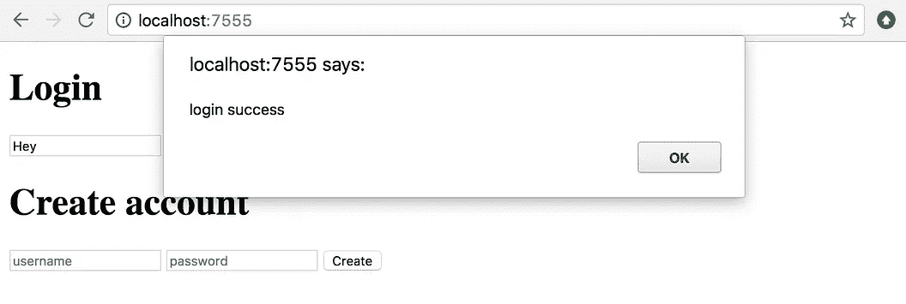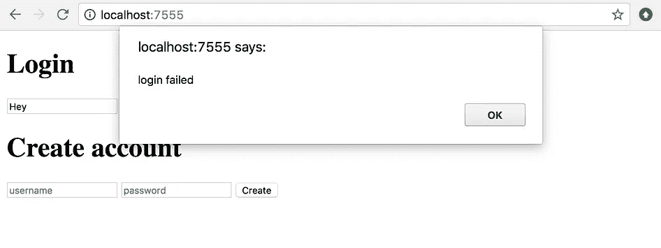

不错！

```
git add .
git commit -m "Login route"
```

# 检查 SQL

在结束之前，让我们先来看看一些正在运行的 SQL 查询。为了将 Knex 查询记录到控制台，只需在查询链中添加一个`.debug()`。

例如，在`store.js`中，您可以将它添加到`createUser`

```
knex('user').insert({
  salt,
  encrypted_password: hash,
  username
}).debug()
```

现在，当调用这个方法时，您将看到控制台的 SQL 输出。

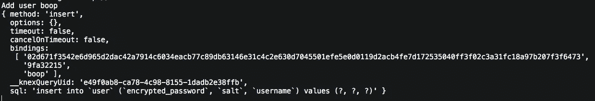

通过查看 sql 键并用 bindings 数组中的值替换`?`值，您可以重建 Knex 为添加用户而运行的底层 SQL 查询。

# 结论

在本教程中，我们创建了一个使用 Node + Knex + MySQL 创建和登录用户的粗糙应用程序。在下一个教程中，我们将为应用程序添加更多功能，并探索一些更复杂的查询。

最后，我希望展示我们如何通过远程数据库将应用程序部署到 EC2。

如果你喜欢这个教程，那么你可能想看看我以前的几个教程

*   [https://hacker noon . com/tutorial-creating-and-managing-a-node-js-server-on-AWS-part-1-d 67367 AC 5171](https://hackernoon.com/tutorial-creating-and-managing-a-node-js-server-on-aws-part-1-d67367ac5171)
*   [https://hacker noon . com/tutorial-creating-and-managing-a-node-js-server-on-AWS-part-2-5 fbde a95 F8 a 1](https://hackernoon.com/tutorial-creating-and-managing-a-node-js-server-on-aws-part-2-5fbdea95f8a1)

[](http://bit.ly/HackernoonFB)[](https://goo.gl/k7XYbx)[](https://goo.gl/4ofytp)

> [黑客中午](http://bit.ly/Hackernoon)是黑客如何开始他们的下午。我们是 [@AMI](http://bit.ly/atAMIatAMI) 家庭的一员。我们现在[接受投稿](http://bit.ly/hackernoonsubmission)，并乐意[讨论广告&赞助](mailto:partners@amipublications.com)机会。
> 
> 如果你喜欢这个故事，我们推荐你阅读我们的[最新科技故事](http://bit.ly/hackernoonlatestt)和[趋势科技故事](https://hackernoon.com/trending)。直到下一次，不要把世界的现实想当然！

