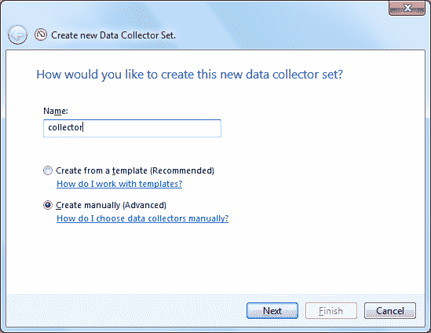
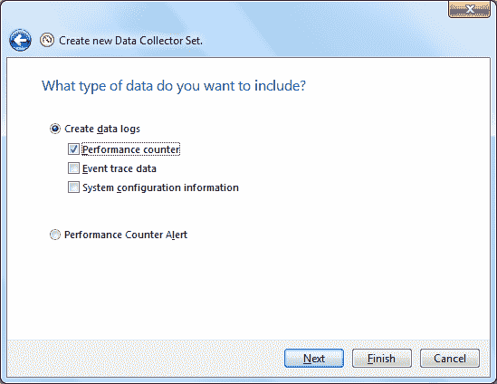
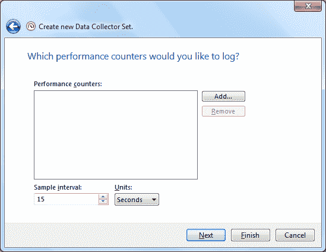

# 为 SQL Server 优化设置 Perfmon

> 原文：<https://medium.com/hackernoon/setting-up-perfmon-for-sql-server-tuning-6ea188bf9b88>

[credit](https://geek.hr/znanost/clanak/fibonaccijev-niz-u-prirodi/)

性能监视器，或称 [Perfmon](https://hackernoon.com/tagged/perfmon) ，定期测量性能统计数据，并将这些统计数据保存在一个文件中。

要为 [SQL](https://hackernoon.com/tagged/sql) 服务器进行设置，请执行以下步骤:

*   从运行中打开 perfmon
*   展开数据收集器集
*   右键**用户自定义**
*   点击**新建**->-**数据采集器设置**
*   给它一个名字
*   单击手动创建

*   单击下一步->创建数据日志->性能计数器->下一步

*   在下一个屏幕中单击添加

*   在内存下添加可用字节、可用兆字节、每秒页面错误数、每秒页面数
*   在物理磁盘下添加%磁盘时间、每次读取的平均磁盘秒数、每次写入的平均磁盘秒数、当前磁盘队列长度、每秒磁盘字节数、每秒磁盘传输次数
*   %特权时间，%处理器下的处理器时间
*   在 SQL Server 访问方法下添加每秒空闲空间扫描、每秒全扫描
*   添加 SQL Server 缓冲区管理器下的缓冲区缓存命中率、每秒检查点页数、可用页数、每秒延迟写入数、页面预期寿命
*   在 SQL Server 常规统计信息下添加用户连接
*   在 SQL Server 闩锁下添加总闩锁等待时间
*   在 SQL Server 锁下添加锁超时/秒、锁等待时间、死锁数/秒
*   在 SQL Server 内存管理器下，添加内存授予挂起、目标服务器内存和总服务器内存
*   在 SQL Server SQL 统计信息下，添加每秒批处理请求数、每秒 SQL 编译数、每秒 SQL 重新编译数
*   在“系统”下，添加“每秒上下文切换，处理器队列长度”
*   单击确定->下一步->下一步->完成
*   右键单击用户定义下的新收集器集，然后选择启动

当需要查看报告时，停止该收集器，打开收集器文件并以报告形式查看。

[来源](https://www.youtube.com/watch?v=E7QIoHj1FeI)

[照片](https://goo.gl/photos/Wt5gdCP11Y3AfyiX6)

*最初发布于*[*xameeramir . github . io*](http://xameeramir.github.io/Setting-Up-Perfmon-for-SQL-Server-Tuning/)*。*