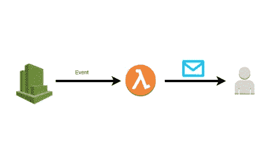
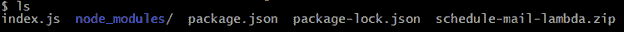
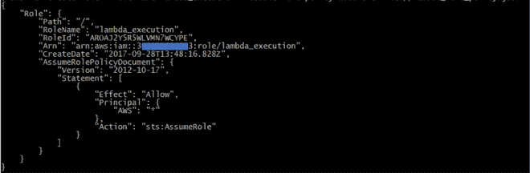
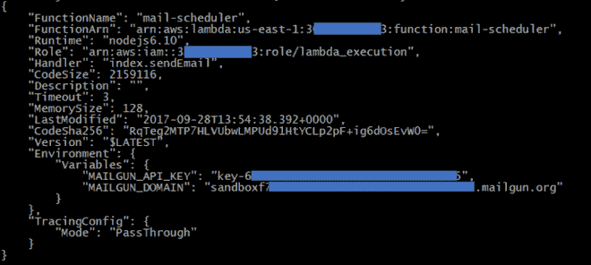
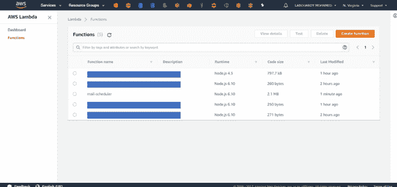
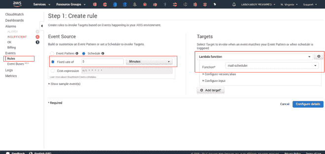
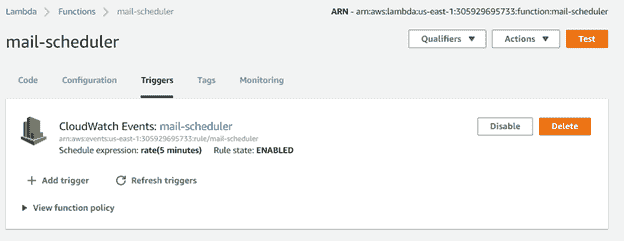
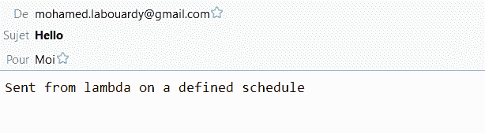

# 使用预定事件设置 AWS Lambda

> 原文：<https://medium.com/hackernoon/setup-aws-lambda-with-scheduled-events-2840824ed1ad>

这篇文章是我的“**无服务器**系列文章的一部分。在这一部分中，我将向您展示如何设置一个**λ**函数来从 **CloudWatch** 发送关于一个定义好的预定事件的邮件。

**1 —创建 Lambda 函数**

因此，从克隆项目开始:

|git 克隆[https://github.com/mlabouardy/schedule-mail-lambda.git](https://github.com/mlabouardy/schedule-mail-lambda.git)

我在 **NodeJS** 中实现了一个简单的 Lambda 函数，使用 [MailGun 库](https://www.mailgun.com/)发送电子邮件

注意:你可以使用另一个服务，比如 **AWS SES** 或者你自己的 **SMTP 服务器**

然后，创建一个 zip 文件:

接下来，我们需要为我们的函数创建一个**执行角色**:

| AWS iam create-role-role-name lambda _ execution-assume-role-policy-document file://lambda _ role _ policy . JSON

执行下面的 **Lambda CLI** 命令，创建一个 **Lambda 函数**。我们需要提供 **zip** 文件，我们之前创建的 **IAM 角色 ARN** 设置 **MAILGUN_API_KEY** 和 **MAILGUN_DOMAIN** 为参数。

| AWS lambda create-function-region us-east-1-function-name mail-scheduler-zip-file file b://schedule-mail-lambda . zip-role arn:AWS:iam::3 xxxxxxx 3:role/lambda _ execution-handler index . send email-runtime nodejs 6.10-environment Variables = " { MAILGUN _ API _ KEY = KEY-6 xxxxxxxxxxxxxxxxxxxxxxxxxxxxxxxxxx 5，MAILGUN _ DOMAIN = sandboxcxxxxxxxxxxxxxxxxx . MAILGUN . org } "

注意:*–运行时*参数使用**节点。JS 6.10** 但是你也可以指定**节点。JS 4.3**

创建后， **AWS Lambda** 返回函数配置信息，如下例所示:

现在，如果我们返回到 [AWS Lambda 仪表板](https://console.aws.amazon.com/lambda)，我们应该会看到我们的函数已经成功创建:

**2 —配置云监控规则**

创建一个每隔 **5 分钟**触发 lambda 函数的新规则:

注意:您可以将该值指定为*比率*或 *cron* 表达式格式。所有计划都使用 UTC 时区，计划的最小精度是一分钟

如果您现在返回到**λ功能控制台**并导航到**触发器**选项卡，您应该会看到 **CloudWatch** 已被添加:

5 分钟后， **CloudWatch** 将触发 **Lambda 功能**，您应该会收到一封电子邮件通知:

