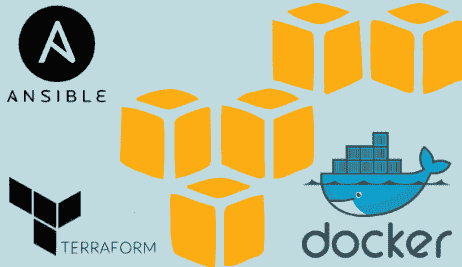
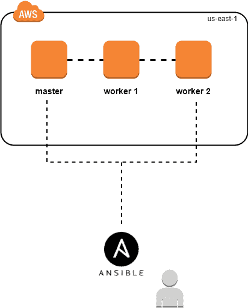
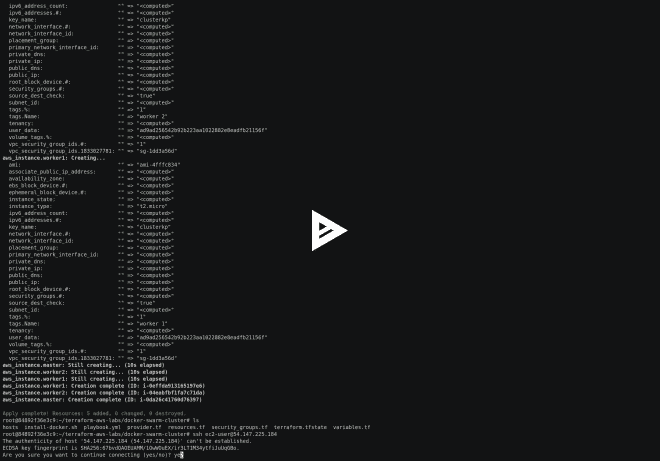

# 使用 Ansible & Terraform 在 AWS 上设置 Docker Swarm

> 原文：<https://medium.com/hackernoon/setup-docker-swarm-on-aws-using-ansible-terraform-daa1eabbc27d>

这篇文章是“ [**IaC**](http://www.blog.labouardy.com/manage-aws-vpc-as-infrastructure-as-code-with-terraform/) ”系列的一部分，解释如何使用**基础设施作为代码**概念与**地形**。在这一部分中，我将向您展示如何在不到 **1 分钟**的时间内使用**Ansible**&**terra form**在 **AWS** 上设置 **Swarm** 集群，如下图所示(1 个 **Master** 和 2 个 **Workers** ):

本教程中使用的所有模板和剧本都可以在我的 [**Github**](https://github.com/mlabouardy/terraform-aws-labs/tree/master/docker-swarm-cluster) 上找到。

注意:我做了一些关于如何在 **AWS** 上开始使用 **Terraform** 的教程，所以请确保在你阅读这篇文章之前阅读它。

**1 —使用 Terraform** 设置 EC2 集群

**1.1 —全局变量**

该文件包含特定于环境的配置，如区域名称、实例类型…

**1.2 —将 AWS 配置为提供商**

**1.3 —安全组**

此 **SG** 允许所有**入站/出站**流量:

**1.4 — EC2 实例**

**引导**脚本安装最新版本的 **Docker** :

**2 —用 Ansible 转换为 Swarm 集群**

**行动手册**一目了然:

现在我们定义了所有需要的模板和行动手册，我们只需要键入 2 个命令来启动 swarm 集群:

适用于地形

|ansible -i hosts playbook.yml

注意:确保用每个 **EC2** 实例的**公共 ip** 更新 ***主机*** 文件。

设置**蜂群**的操作如下所示:

