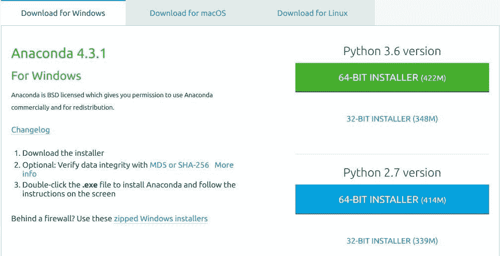
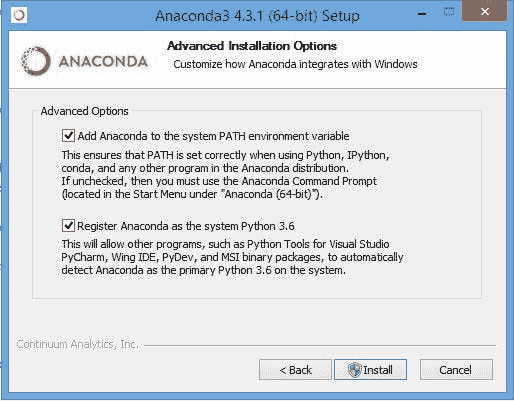
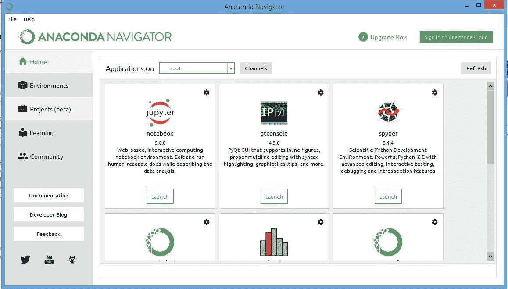
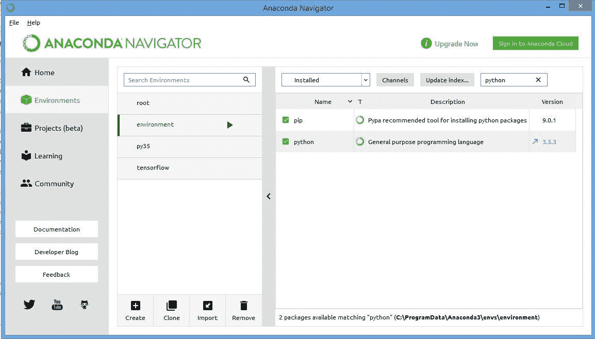
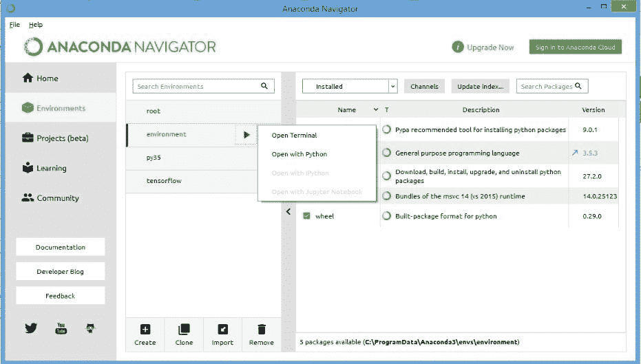
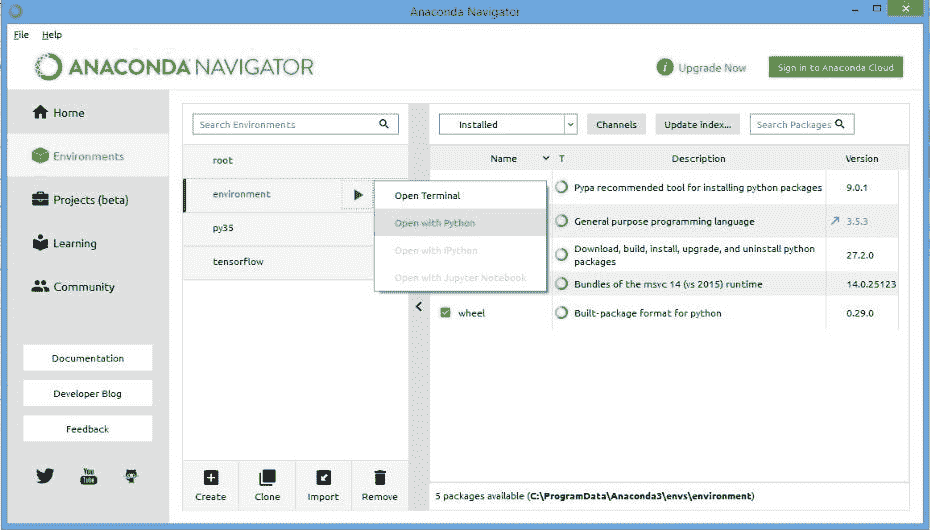
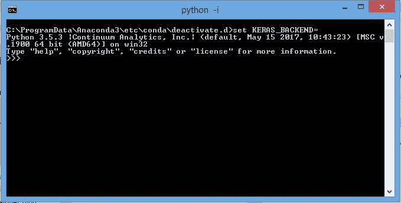

# 为 ml 和深度学习设置 Python 环境

> 原文：<https://medium.com/hackernoon/setup-python-environment-for-ml-and-deep-learning-c57ea54818ec>

> 最初发布于 2017 年 5 月 12 日

> *本页给出了设置机器进行机器学习和深度学习的快速简单的步骤。*

嗨，伙计们，python 中有许多预建的库，可用于机器学习和深度[学习](https://hackernoon.com/tagged/learning)。但是一个主要问题在于使用这些库建立开发环境(特别是对于基于 Windows 的机器)。

因为这些库大部分是为在 Linux (Ubuntu 等)上使用而构建的，所以在 Linux[中设置工作环境更容易。同时，在 Windows 机器上这是一个非常混乱和冗长的过程。](https://hackernoon.com/tagged/linux)

因此，下面是让您在 Windows 上启动和运行 ml 和深度学习开发的步骤:

# 步骤 1:下载 Anaconda 发行版

对于您的系统版本 32 位或 64 位从[这里](https://www.continuum.io/downloads)最好选择 Python 3.6 或 3.5.x 的版本，因为 Tensorflow 目前仅适用于 Python 3.5。

Fig 1\. Anaconda Navigator download page

# 步骤 2:安装 Anaconda

按照屏幕上的说明进行下一步->下一步->下一步，然后:

*   选中复选框将 python 添加到环境变量路径。
*   还要将 Anaconda 作为默认的 python 复选框，以保持一致性。

Fig 2\. Installation step for Anaconda 3

导航器中将预安装以下软件包:

*   Spyder(首选 IDE)
*   Jupyter 笔记本(用于交互式编程)
*   Qt 控制台(用于内嵌数字和图形)

Fig 3\. Initial view of the Anaconda Navigator Panel

# 步骤 4:现在转到环境选项卡

在导航器的左侧

*   这里点击**创建**新环境按钮，并
*   键入您想要的环境名称(比如环境)
*   仅选中 Python 复选框(取消选中 R)
*   在 Python 版本选项卡中，选择 Python 3.5，因为 Tensorflow 目前仅适用于 3.5

Fig 4\. Environment selection and creation page

一旦创建了 Python 3.5 的新环境，它将如下所示

Fig 5\. Installed packages in a given environment

现在，在“搜索软件包”框中，键入并下载以下软件包:

1.  朱皮特
2.  sci kit-学习
3.  Qt 控制台
4.  matplotlib
5.  numpy
6.  熊猫
7.  点
8.  scipy

# 第五步:

一旦安装了以上所有包，从您新创建的环境中打开一个终端。

Fig 6\. Steps to open a terminal in given environment

终端打开后，键入以下内容以安装 no:

`conda install theano pygpu`

让下载和安装完成。在安装 Tensorflow 时，请键入以下内容:

对于 CPU

`pip install --ignore-installed --upgrade [https://storage.googleapis.com/tensorflow/windows/cpu/tensorflow-1.1.0-cp35-cp35m-win_amd64.whl](https://storage.googleapis.com/tensorflow/windows/cpu/tensorflow-1.1.0-cp35-cp35m-win_amd64.whl)`

对于 GPU

`pip install --ignore-installed --upgrade [https://storage.googleapis.com/tensorflow/windows/gpu/tensorflow_gpu-1.1.0-cp35-cp35m-win_amd64.whl](https://storage.googleapis.com/tensorflow/windows/gpu/tensorflow_gpu-1.1.0-cp35-cp35m-win_amd64.whl)`

成功安装 tensorflow 后，键入以下内容以安装 Keras:

`pip install git+git://github.com/fchollet/keras.git`

一旦所有东西都安装好了，进入下一步。如果不在 Google 上搜索你的具体错误，你会在 StackOverflow 上找到无数的讨论和答案。否则 ping 我。

# 第六步:测试

现在来测试 scikit-learn、Theano、Tensorflow 和 Keras 是否正常工作；像上一步一样打开一个终端，但是使用 python

Fig 7\. Opening a python shell in a given environment

终端打开后，应该是这样的。

Fig 8\. Python Shell showing the installed version 3.5.3

现在键入以下命令来测试它们的工作情况

`import tensorflow as tf import theano import keras`

如果没有错误，那么恭喜你已经成功地为机器学习和深度学习设置了环境。

如果弹出一些错误，将错误内容复制为在 Google 上搜索解决方案和堆栈溢出。这只会帮助你以后解决其他类似的小问题。

> *否则平我:D*

*原载于 2017 年 5 月 12 日*[*mandroid 6 . github . io*](https://mandroid6.github.io/2017/05/12/Environment-Setup/)*。*

在推特上关注我:[https://twitter.com/mandroid_6](https://twitter.com/mandroid_6)

## 查看我关于机器学习和深度学习的其他帖子:[https://medium.com/@razzormandar](/@razzormandar)