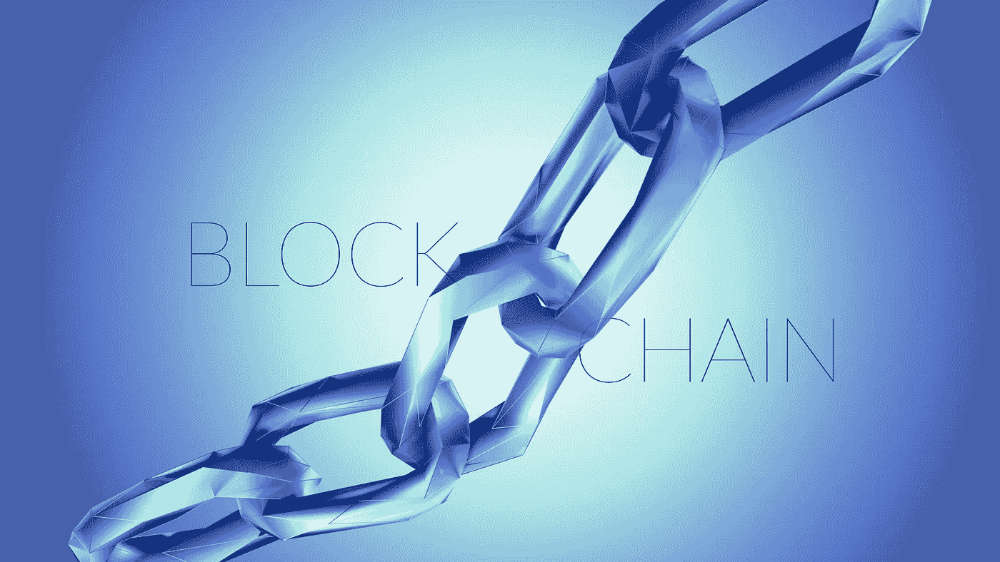

# 七个理由 2017 年是区块链成败的一年

> 原文：<https://medium.com/hackernoon/seven-reasons-2017-is-a-make-or-break-year-for-blockchain-5487c7e8dcfe>

虽然现在说区块链是否会实现其潜力还为时过早，但 2017 年将是我们应该找到答案的一年。至少，这将是主要企业级区块链开始被使用的一年。在全球区块链社区中，已经有一种突破时刻即将到来的真实感觉，这种技术已经成熟，并在现实世界场景中展示了用例。

考虑到这一点，可以在区块链空间内确定七个全球发展和挑战，这些发展和挑战使 2017 年成为它走出概念验证并投入生产的一年，并使由此产生的问题凸显出来。

# 企业应用

在过去两年中，各大企业一直在探索区块链这一潜在技术。我们已经看到了来自多家公司的概念证明，现在企业级区块链正在积极生产中。包括主要银行和金融机构以及 IBM 等全球科技公司在内的公司正在采取专门措施，而不仅仅是概念验证。

最近，微软更进一步，开始开发区块链服务。他们将很快提供对基于云的区块链的访问。这将允许其他公司登录微软已经活跃的平台，而不是建立自己的平台。如果微软能够增加其平台的用户基础，较小的公司将有机会进入这个开放的区块链。企业只需下载一个应用程序，就可以使用已经在运行的区块链，而不是分配资源来开发。

# 超越金融服务

近年来，人们主要谈论区块链的金融服务，这一技术的大部分发展都在这一领域。现在，变化正在发生。

其他行业的早期采用者开始开发区块链。虽然通常来说，金融服务领域的技术往往比其他行业领先五年，但就区块链而言，多个行业正在快速赶上。

例如，汉莎航空的技术子公司汉莎工业解决方案公司(Lufthansa Industry Solutions)最近推出了针对航空的倡议*区块链。该项目旨在汇集技术专长，开发区块链在航空领域的潜在用途。能源供应商和多个部门正在开发类似的项目。尽管金融业仍处于领先地位，但这种情况很快就会改变。*

# 隐私问题解决方案

区块链本质上倾向于开放技术；链上的每个参与者验证对其采取的每个动作。随着区块链越来越多地用于企业应用，这种开放性与商业机密发生了冲突。通常，由于法律要求、保护知识产权的需要或仅仅是项目尚未准备好供公众使用等原因，企业行为必须保密。在许多情况下，机密性和隐私是金融和其他企业应用程序必须具备的特性。

为了纠正这些问题，但保持区块链不变的性质，开发正在进行中，以集成零知识证明到区块链。这项技术允许区块链的共识算法模型继续，但满足了保密的需要。零知识证明允许一方向另一方证明给定的陈述是真实的，而不泄露所述陈述背后的机密信息。

# 财团继续存在

随着区块链在多个行业中的发展及其在行业中的应用越来越多，已经进行了多种尝试来将公司联合体聚集在一起以共同开发区块链技术。虽然 R3 继续存在重大问题，高调的支持者退出，但其他公司正在不断壮大。

Hyperledger 和以太坊联盟预计今年都将在全球范围内增长，这些财团正在推动区块链成为一个独立的行业。

# 区块链的一个社区

随着区块链发展成为一个独立的产业，围绕这项技术的全球社区已经开始形成。2016 年，约有 5 亿美元通过传统投资方式投资到区块链。区块链社区正在寻求并可能在未来几年实现这一水平的大幅增长，但不是通过传统的投资。

在区块链社区，多家公司正在使用首次公开募股(ICO)为他们的区块链项目提供资金。在这个系统中，投资者可以在区块链上购买一种加密货币，实际上是用区块链为区块链提供资金。在这个系统中，区块链周围的社区可以被用来大规模增加对区块链项目的支持和资助。社区可以通过使用自己的工具和流程来帮助支持区块链行业的发展。

# 民营区块链的成长

随着财团和区块链社区以不同程度的开放性开发这一技术，随着这些发展，私人区块链正在生产。

与向所有区块链人开放的标准相反，这些是封闭的系统。这种供内部使用的优点是，数据保留了不可变和可证明的性质，但只有选定的个人可以访问。例如，银行正在开发这种专用区块链，以实现内部合规功能的自动化。

# 性能问题

2017 年已经过去一半，区块链的未来是美好的。随着它作为一项技术的大部分潜力开始实现和问题得到解决。然而，仍然存在性能问题，这可能会阻碍这项技术的发展。对于金融服务和资本市场中的许多最终用户解决方案来说，区块链的交易速度根本不够快。虽然许多公司都在寻求解决这个问题，有些公司使用混合动力区块链，但事实仍然是:除非业绩能够提高，否则区块链不会像许多人预期的那样在市场上爆发。

现在说区块链是否会实现科技界许多人怀疑的潜力还为时过早。然而，2017 年将是这项技术的关键一年。随着多家公司从 POC 转向生产，区块链正处于成为一项广泛应用的技术或失败的边缘。

*由* [*吴彤*](https://www.linkedin.com/in/denis-baranov-8b381623/) *首席顾问* [*数据艺术*](http://www.dataart.com/)

*原载于*[*www.idgconnect.com*](http://www.idgconnect.com/blog-abstract/27782/seven-reasons-2017-break-blockchain)*。*