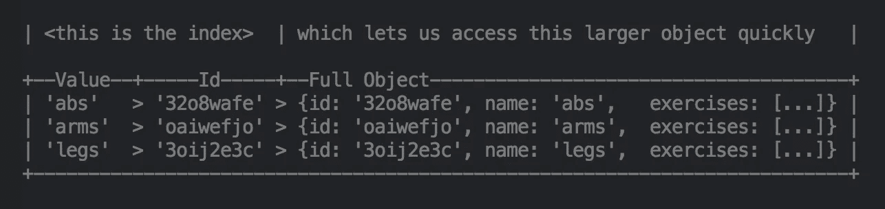

# 像使用数据库一样使用 Redux 存储

> 原文：<https://medium.com/hackernoon/shape-your-redux-store-like-your-database-98faa4754fd5>

Translations: [中文](http://it.uu01.me/p/ovdfze.html)


Your store data can be viewed from many angles by using indexes.

最近我浏览了一些关于 RC 聊天系统的 Javascript 讨论，我注意到了 Kate Ray 提出的一个很好的问题:

> 我们应该如何组织 redux 存储中的数据？

这是使用 redux 时的一个常见问题，当然也是我问过自己很多次的问题。我发现答案通常取决于我打算如何处理我的数据。

有许多事情需要考虑:我是否会像一个行列表一样频繁地迭代存储数据？我需要快速 O(1)访问单个项目吗？

我在实践中见过很多方法，通常在访问时间和迭代的容易程度之间有一些折衷。

# 常见方法

如果你存储一些数据，其中每一项都有一个 id，你可以把你的存储设计成一个`Object`或者一个`Objects`的`Array`。

**扁平物体阵列** `**[{values}]**` **:** 这是我见过的最常见的一种。这使得迭代变得容易，你可以按照特定的顺序存储数据，但是如果不进行迭代和过滤，你就不能通过`id`或`name`来访问特定的条目。

```
categories: [
  {name: 'abs',  id: '32o8wafe', exercises: ['crunches', 'plank']},
  {name: 'arms', id: 'oaiwefjo', exercises: [...]},
  {name: 'legs', id: 'aoijwfeo', exercises: [...]},
]
```

**id 为** `**{id: {values}}**` **的对象:** 这给了你快速 O(1)访问每个条目的方法，但是当你使用`Object.values()`进行迭代时，你不容易访问给定条目的`id`。

```
categories: {
  '32o8wafe': {name: 'abs',  exercises: ['crunches', 'plank']},
  'oaiwefjo': {name: 'arms', exercises: [...]},
  '3oij2e3c': {name: 'legs', exercises: [...]},
}Object.values(categories).map(row => // cant access id here)
// it's possible to use Object.entries, but you still cant do row.id
```

> **引人深思:**
> `Array` s 和`Object` s 是 JS 里的[同一个东西。
> (V8 使用不同的内部表示来存储它们)](https://developer.mozilla.org/en-US/docs/Web/JavaScript/Reference/Global_Objects/Array#Description)

# 将它构建成一个由`id`索引的行组成的数据库

在我们在 [Monadical](https://monadical.com) 实现一个大型 redux 应用的过程中，我们偶然发现了一种不同的方法，这种方法使我们既可以轻松地与`Object.values(state.categories)`进行迭代，又可以快速 O(1)访问单个项目:

```
categories: {
  '32o8wafe': {id: '32o8wafe', name: 'abs',  exercises: [...]},
  'oaiwefjo': {id: 'oaiwefjo', name: 'arms', exercises: [...]},
  '3oij2e3c': {id: '3oij2e3c', name: 'legs', exercises: [...]},
}
```

注意`id`既是行的键，也是行本身的属性。这一点点重复在访问时为我们提供了极大的灵活性。它还兼容 redux docs 推荐的[标准化](http://redux.js.org/docs/recipes/reducers/NormalizingStateShape.html) ( *又名*扁平)形状。

现在您可以遍历数据，并在迭代时访问`id`!

`Object.values(categories).map(cat => ({id: cat.id, name: cat.name}))`

或者通过`id`即时访问任何单个项目！

`categories[‘32o8wafe’].name // 'abs'`

我们向前端发送的数据已经是这样的了，所以前端不需要做任何处理来产生`id: values`的映射。这很容易从后端实现，因为您可能会从数据库中提取数据，而数据库中已经有一个可以用作键的`id`字段。

# 索引的力量

我们上面介绍的新形状是一个微不足道的变化，团队在设计 redux 商店时可能不会花太多时间仔细考虑。当我们使用除了`id`之外的不同键访问存储数据时，真正的魔力就来了。

请注意，我们上面介绍的形状只是一个行列表，用一个键唯一地标识每一行。有了这样的商店，您可以生成索引，让您使用任何其他键进行`O(1)`访问:

**按名称索引类别:**

为了创建索引，我们编写了一个函数，它获取商店数据，并返回一个映射`name`->-。

```
const index_by_name = (categories) =>
    Object.values(categories)
          .reduce((obj, row) => (obj[row.name] = row.id, obj), {})// {abs: '32o8wafe', arms: 'oaiwefjo', legs: '3oij2e3c'}
```



```
const ids_by_name = index_by_name(categories)categories[ids_by_name['abs']] // {id: '32o8wafe', name: 'abs', ...}
```

您可以为相同的数据构建任意多的索引，这就为您提供了基于任意列的 O(1)访问，就像在数据库中一样。

如果你的数据没有变化，你的索引只需要计算一次，否则应该用记忆函数重新计算。

> **思考的问题:**
> 如何为非惟一的键建立索引？


Trippy photo break. Rest your eyes for a second, then read on :)

# 分类数据

如果您的`categories`有一个固有的顺序(比如在一个数组中)，并且您需要能够在迭代您的数据时将它们按顺序排列，那该怎么办？

你可能会想这样做:

```
const category_order = ['32o8wafe', 'oaiwefjo', '3oij2e3c']
category_order.map(id => categories[id])
```

这是一个很好的方法，但是，它需要将一个数组与我们的数据分开来存储顺序，这是次优的。让我们用索引正确地做这件事。

我们用一个指定每行位置的`order`(或`idx`)键从后端发送数据，然后我们**为** `**order**` **创建一个索引，就像我们为任何其他键**创建索引一样:

```
const ids_by_order =
      Object.values(categories)
            .reduce((ordered_ids, category) => {
                        ordered_ids[category.order] = category.id
                        return ordered_ids
                    }, [])// ['32o8wafe', 'oaiwefjo', '3oij2e3c']
```

注意这个归约操作是如何产生一个索引`Array`而不是一个`Object`。在 JS 中，数组实际上只是一个带有键 0、1、2…的对象，所以现在我们有 O(1)个通过`order`访问特定`id`的方法，并且我们可以在有序列表中使用`map`、`filter`和`reduce`进行迭代:

```
const second_category = categories[ids_by_order[1]]
// {id: 'oaiwefjo', name: 'arms', order: '1'}const ordered_names = ids_by_order.map(id => categories[id].name)
// ['abs', 'arms', 'legs']
```

> **思考:**
> 为什么即使您的订单号[有缺口](http://www.htmlgoodies.com/beyond/javascript/dont-fear-sparse-arrays-in-javascript.html)也能工作？例如 0，2，41，399

# 记忆化

如果您的数据从不改变，您可以在启动时调用一次`ids_by_key`,并在此后每次使用产生的索引作为静态对象。但是，如果您正在处理经常被访问的变化数据，内存化对于避免每次访问都重新计算索引(即 O(n))是非常重要的。

记忆索引选择器可以通过[重新选择](https://github.com/reactjs/reselect)来完成，或者通过编写一个[自定义记忆器函数](https://www.sitepoint.com/implementing-memoization-in-javascript/)(根据您的数据，这并不太难)。

内存化索引意味着您可以在每次读取时调用 index 函数，而不是必须将索引存储在 redux 中。

我上面描述的带索引的平面数据模式也符合库 [Normalizr](https://github.com/paularmstrong/normalizr) 使用的模式。如果您对存储数据感兴趣(按类型分隔)，并且喜欢本文中介绍的索引概念，那么不妨读一下 Normalizr 上的[Redux with promise docs](https://tonyhb.gitbooks.io/redux-without-profanity/content/normalizer.html)。

作为记忆化的替代方法，您可以在添加或删除键时改变现有的索引。您最终使用什么样的设计取决于您的数据访问模式。

> **引人深思:**
> Memoizing 在不可变. js 对象上使用的`.hash()`是 [**快速**](https://egghead.io/lessons/javascript-lightning-fast-immutable-js-equality-checks-with-hash-codes) 。

# 高阶指数函数

**所有的索引都是我们的数据的纯结果，**所以我们也可以创建很酷的高阶索引函数(*又名*返回函数的函数)，例如:

```
const ids_by_key = (key) => (data) =>  // make index(data) for key
      Object.values(data)
            .reduce((index, row) => {
                        index[row[key]] = row.id
                        return index
                    }, {})const ids_by_name = ids_by_key('name')  // returns an index function
const abs_id = ids_by_name(categories)['abs']
// '32o8wafe'
```

> **思考的食粮:**
> 编写一个索引生成器函数，使索引基于两个键的元组:``${row[key1]}-${row[key2]}` -> id`

# 这些有什么关系呢？

> React 和 Flux/Redux 解决了[…]渲染和状态管理。现在有可能构建真正高级的 web 应用程序，专注于实际领域，而不是挣扎于底层实现。
> 
> 然而，问题是系统在不断增长。我们正在构建更多的用户界面，加载和转换更多的数据…

— Roman Liutikov: [关于网络应用和数据库](/@roman01la/on-web-apps-and-databases-c026f77b93f4)

随着前端开始接近后端的复杂性，我们最终会手动重新实现已经在后端存在了几十年的东西:数据库、消息队列和其他典型的仅服务器基础设施。许多被认为是现代的前端模式——比如函数式反应式编程——从 Windows 3.1 开始就已经存在了。

我们已经从 90 年代的 SQL 数据库中学到的状态管理经验可以应用到我们的前端，帮助我们保持数据的清晰、优雅和一致性。使用索引来避免重复和跳转到一个集中的、一致的数据集的特定部分就是这样一个例子，我相信还有更多这样的例子我还没有发现。

# 进一步阅读

如果你想在浏览器中获得更多类似数据库的特性，请查看: [redux-orm](https://github.com/tommikaikkonen/redux-orm) 、[indexed db](https://developer.mozilla.org/en-US/docs/Glossary/IndexedDB)(Web SQL 的替代品)和 [GraphQL](http://graphql.org/) 。但是请记住，不要开始安装库，直到您确切知道为什么需要它们。

*   [http://redux . js . org/docs/basics/reducers . html # design-the-state-shape](http://redux.js.org/docs/basics/Reducers.html#designing-the-state-shape)
*   [http://redux . js . org/docs/recipes/reducers/normalizingstateshape . html](http://redux.js.org/docs/recipes/reducers/NormalizingStateShape.html)
*   [https://egghead . io/lessons/JavaScript-redux-normalizing-the-state-shape](https://egghead.io/lessons/javascript-redux-normalizing-the-state-shape)
*   [https://stack overflow . com/questions/33940015/how-to-choose-the-redux-state-shape for-a-app-with-list-detail-views-and-pagina](https://stackoverflow.com/questions/33940015/how-to-choose-the-redux-state-shape-for-an-app-with-list-detail-views-and-pagina)
*   [https://stack overflow . com/questions/34995822/how-to-get-best-practice-react-redux-nested-array-data](https://stackoverflow.com/questions/34995822/how-to-get-best-practice-react-redux-nested-array-data?noredirect=1&lq=1)
*   [https://code burst . io/how-to-store-your-state-data-f17 ceca 37 aa](https://codeburst.io/how-to-store-your-state-data-f17ceca37aa)
*   [https://tonyhb . git books . io/redux-without-profanity/content/normalizer . html](https://tonyhb.gitbooks.io/redux-without-profanity/content/normalizer.html)
*   [https://github.com/tommikaikkonen/redux-orm](https://github.com/tommikaikkonen/redux-orm)

—

> **TL；**
> 博士——以规范化形式`{id: {id, attr1, attr2, attr3}}`
> 存储您的冗余数据——创建`{attr: id}`索引，以便其他关键字(如`ids_by_name`
> )快速进行 O(1)次访问——使用`Array`索引`*ids_by_order.map(id => data[id])*` *-* 迭代排序后的数据——使用纯索引函数，如果您的数据频繁更改，请记住它们

# —

希望你觉得这有用！如果有，给这篇文章一个💚，或者在 twitter 上 ping 我 [@theSquashSH](https://twitter.com/theSquashSH) 。

如果你对涉及以太坊的很酷的 Django + React/Redux 项目感兴趣， [Monadical 正在招聘](https://monadical.com)远程&本地开发人员(第一个月我们会带你去阳光明媚的麦德林)！

