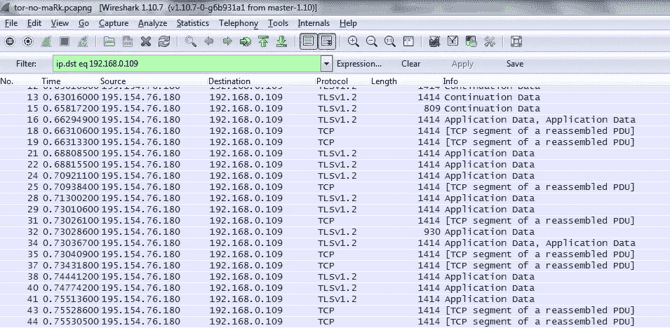
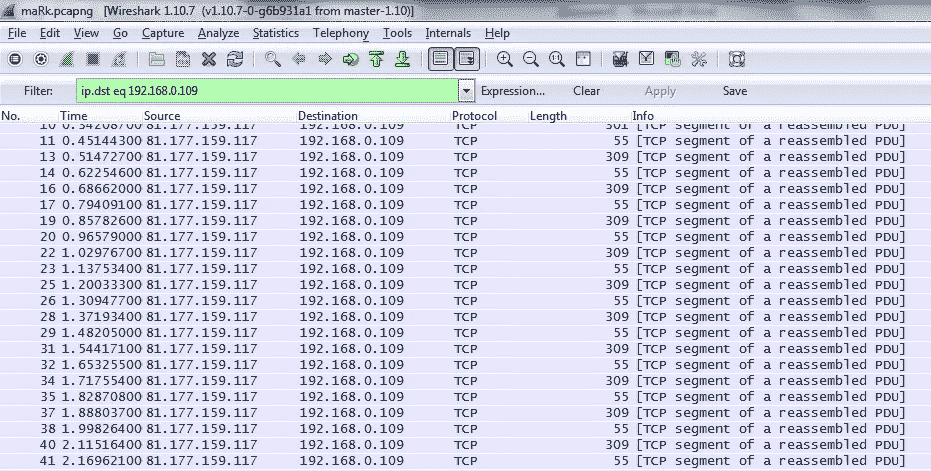

# 在低延迟网络中塑造攻击，或者为什么 Tor 不会阻止政府机构

> 原文：<https://medium.com/hackernoon/shaping-attacks-in-low-latency-networks-or-why-tor-wont-stop-government-agencies-6be6d5d1d963>

因为 Tor 用户的潜在去匿名化正在互联网上被广泛讨论，我将发布我在 PHDays(积极黑客日)2014 会议上的演讲摘要的“印刷”版本。下面描述的[攻击](https://hackernoon.com/tagged/attack)并不新鲜，也不是针对 Tor 的，可以用来攻击任何其他低延迟的源隐藏工具，如 VPN、代理链，甚至许多工具的组合。由于 3 年多过去了，一些实现细节可能会改变，但一般攻击概念并不依赖于实现。

对定时攻击的敏感性是 Tor [网络](https://hackernoon.com/tagged/network)的一个已知漏洞，并且已经被广泛讨论，你可以找到大约 12 篇文章单独讨论这个问题。那么为什么要再写一个呢？有一种普遍的误解，认为这种攻击总是需要统计分析，很难实现，而且是理论上的。目前的文章特别关注这类攻击(统计分析)。今天，我们将检查一个真实的场景，在这个场景中，您可能只需要一个查询就可以对访问资源的网络用户进行去匿名化，或者发现一个隐藏的服务。

我们将回顾一个基于满足以下条件的可能实施 Tor 的场景:

1.  有机会干预出口节点和目的服务器之间的流量。这可以通过访问终端服务器、出口节点或流量在它们之间传递的任何其他点来完成。换句话说，任何已经安排了足够数量的他们自己的出口节点的人都可以满足这个条件，或者例如，它可以是能够监控所有跨境业务并与之交互或者控制来自足够数量的出口节点的业务的机构。
2.  在网络客户端和入口节点之间存在对流量的被动访问。也就是说，有人能够被动地嗅探大量宽带连接或足够数量的入口节点上的流量，或者再次嗅探跨境流量。

那么政府机构和这一切有什么关系呢？大多数国家有法规，如美国 CALEA 或俄罗斯 SORM，要求宽带和其他 ISP 安装能够拦截宽带流量和执行深度数据包检查的硬件。已知此设备用于大规模互联网流量监控的案例，例如在 *Hepting v. AT & T* 案例中，NSA 使用 Narus(目前是赛门铁克的一部分)硬件和软件用于所有宽带流量 DPI。目前，美国自由法案和俄罗斯立法*限制机构执行大规模监控的能力，但是，像任何立法一样，它有像 FISC 这样的后门。FISC 可以授权大规模监控，以前也这么做过。在包括英国和中国在内的 20 多个国家，政府机构允许并实施大规模监控.

(* 2016 年，俄罗斯出台了 Yarovaya 法。Yarovaya low 要求服务提供商收集大量数据，尽管它没有直接授权政府机构使用这些数据进行大规模监控，但这一过程不能由任何独立方控制。)

“从外部”跟踪监控硬件的存在几乎是不可能的，因为它不会生成本地流量，也不会影响被监控的流量。

政府机构对监控硬件的访问满足攻击实施的第二个条件(或者有时两个条件都满足，如果该设备是活动的)。这意味着访问硬件并能够在 Tor 中安排多个出口节点或以其他方式修改流量的情报服务拥有所有必需的工具，包括这样做的愿望。

# 攻击的原理

出口节点在流量中实施预定义的更改，这些更改不会修改任何正在传输的数据，但会影响流量的“形状”，即发送数据包的大小以及数据包之间的延迟会发生变化。低延迟网络的定时规范仅被稍微修改，这是定时攻击通常利用的事实。正如我们将在后面看到的，包的大小以一种完全可预测的方式变化。这意味着，通过重新解析具有预定大小序列和延迟序列的数据包的流量，您可以标记来自出口节点端的流量，以便能够从入口节点端检测这种标记。因此，寻址到服务器的连接或查询可以与 Tor 用户相匹配。

此外，连同流量一起，你可以传送给监听器的信息，例如，客户机查询的唯一标识符。这意味着，如果您有两个可识别的数据包大小和两个可识别的时间延迟，您可以将两位信息秘密地传递给用户和入口节点之间加密流量的监听器，方法是将这些位添加到从第二个数据包开始的每个数据包中。事实上，您可以添加更多可识别的状态，但仍有一些额外的限制，我们将在下面进行检查。

# 执行起来难吗，如何切实执行？

我通过将出口节点流量重定向到一个代理服务器来实施攻击，该代理服务器之前稍作修改，以便我们可以根据预先确定的模式来安排流量整形。

那么“普通”Tor 流量是什么样子的呢？这是从入口节点到客户端的流量片段，与发送 HTTP 查询结果相关，但没有向流量添加任何标记。

pic.1 — how tor connection is seen to observer

Tor 使用 512 字节的信元来减轻数据包大小攻击。这些细胞被包裹在 TLS 中。TLS 本身使用相同的方法，但是 TLS 数据部分内部通常被称为“blob”。

TLS 流量包含主要大小为 3，648 个八位字节的数据块(数据包)。斑点大小是基于斑点所包含的具有固定大小的 Tor 业务信元的数量来确定的。在 TCP 层，blobs 被解析成典型大小为 1，414 个八位字节的 IP 数据包，这是由路径 MTU 决定的。TCP 包可以包含单个 blob 的片段，或者前一个 blob 的结束和下一个 blob 的开始。然而，可能存在大小为 560 个八位字节(1 个小区)的 blobs。如何将数据打包到 tor 信元中，如何将 tor 信元打包到 blob 中，以及如何将 blob 打包到 TCP 数据包中，取决于各种参数，如服务器计时、用于传递数据的缓冲区大小、Nagle 算法和网络延迟。重新发送查询时，图片可能会略有不同。但是，从统计的角度来看，发送到同一服务器的查询会有一个清晰的图像。当加载网站时，相当大量的查询传输基本相同的请求和回复，也就是说，具有典型延迟的标准数据量。这支持数据匹配，以便发现用户正在查询的特定资源，尤其是在他们定期访问资源的情况下。这就是经典定时攻击的基础。但是我们会用我们自己的方式去做。不是被动地测量定时，而是可以将整形标签(标记)(因为俄语单词“маяк”的意思是“信标”)从出口节点侧添加到源流量。绕过 Tor 网络的干净、未加密的流量现在看起来如下:

pic.2 — maRk inserted into unencrypted traffic

如何进行标记？这里我们传输两种不同大小的小数据包。在这种情况下，几百字节的大小差异不会产生任何影响，但可以直观地区分一系列中的两种不同的数据包类型。两种类型的包之间的 60 和 110 毫秒的延迟被专门设置为呈现最容易注意到的输出图像。

当相同的流量通过 Tor 网络时，在入口节点和用户之间传输时看起来如下:

pic.3 — Tor traffic between entry node and client with maRk inserted on exit node

那么，我们看到了什么？从入口节点到客户端的 TCP 数据包遵循 1414–389–619 八位字节(链路层)模式和大约 60–60–220 毫秒的延迟模式，有一些微小的波动。TLS 中的所有 blobs 现在都具有 560 个八位字节的大小(单个 tor 单元)。我们在开放网络中发送的每个数据包在 TLS 中都是一个单独的 blob。同时，大小为 1，414 个八位字节的 IP 分组包含两个完整的 blob/信元和第三 blob/信元的开始，389 个八位字节的分组携带第三 blob/信元的结束，619 个八位字节的分组包含单独的第四 blob/信元。也就是说，源流量的四个 IP 数据包作为 Tor 流量中的三个 IP 数据包进入。这是好是坏？我们刚刚丢失了初始大小和时间信息。但是，仔细观察流量，我们可以清楚地看到流量大小和流量特征，最令人印象深刻的是，我们可以预测它，并且它在大多数 tor 链上都是相同的。

那么发生了什么，为什么这个序列如此奇怪？这是由于 TCP 堆栈的工作方式，即 Nagle 算法和 TCP 延迟确认之间的协作。然而，分组组之间以及组内分组之间的间隔保持不变。因此，我们仍在检索 50%以上的计时信息。在与 Nagle 算法相关联的等待和分组的“对抗”中，为了创建不同的模式，我们可以发送这样的流量量，使得所传输的 blob 的大小大于 MTU 的大小(但是不足以大到产生 3648 字节的“大”blob)；发送 1 个数据包(用于 Nagle 延迟)或 2 个数据包以避免延迟；使用高于和低于 Nagle 超时的计时。

这种攻击几乎可以针对任何加密或未加密的连接实施，包括服务器-客户端和客户端-服务器方向，也就是说，它可以用于检测隐藏的洋葱服务。

# 存在哪些限制？

由于 Nagle 算法的使用和网络波动，非线性流量行为会导致部分定时信息丢失。然而，这种丢失可以在接收器侧被检测到，并通过传输冗余数据来补偿。要实现流量整形，流量必须足够大。对于 SSH 连接来说，这种类型的标记似乎相当困难，例如，bash 已经初始化，并且有常规的命令输出。这是因为传输的数据量不足以创建具有所需标记签名的分组。

事实上，你甚至可以标记一个根本没有数据传输的连接。眼前的问题是，即使在客户端应用程序关闭了 TCP 连接之后，通过 Tor 网络发送到客户端的数据传递仍将继续，因为这是 TCP 的有效状态(所谓的“半关闭连接”)。这使得在作为连接的一部分从客户端接收到 FIN+ACK 之后，能够向客户端发送随机数据的标记部分。客户端应用程序永远不会读取这些数据，但是这些数据仍然会到达客户端，从而暴露客户端的身份。因此，攻击可能完全从客户端秘密实施，并且可用于标记连接的数据量绰绰有余。类似的方法可以应用于大多数 VPN。幸运的是，它对代理或任何其他应用级网关都不起作用。

# 有可靠的解决方案吗？

客户端的当前活动可以阻止攻击，因为您必须检测与同一链相关联的数据包，并且旁流量噪声会屏蔽签名。您还可以在 Tor 网络中充当中继，这将进一步阻碍对标记流量的检测。还有一些其他方法来阻止攻击:Tor、VPN 和代理链的组合使得猜测流量的最终形状变得困难，并且可以通过半封闭连接来部分阻止攻击。您还可以通过使用某些非标准的 TCP 堆栈参数破坏已知签名来阻碍检测。然而，在 Tor 网络或其他流行的 VPN 中，没有可靠的方法来完全消除这种威胁。将攻击整形为一种定时攻击超出了这些网络的现有安全配置。

唯一可靠的解决方案是在固定带宽的加密连接内部使用虚拟链路，在这里传输固定长度信元的稳定流。例如，ATM(异步传输模式)网络就是这样工作的。您还应该记住，加密必须在没有数据压缩的情况下进行，这意味着消耗的带宽必须保持不变。这些技术仍然不适合日常操作，因为即使在停机期间，使用带宽也会产生额外的额外成本。