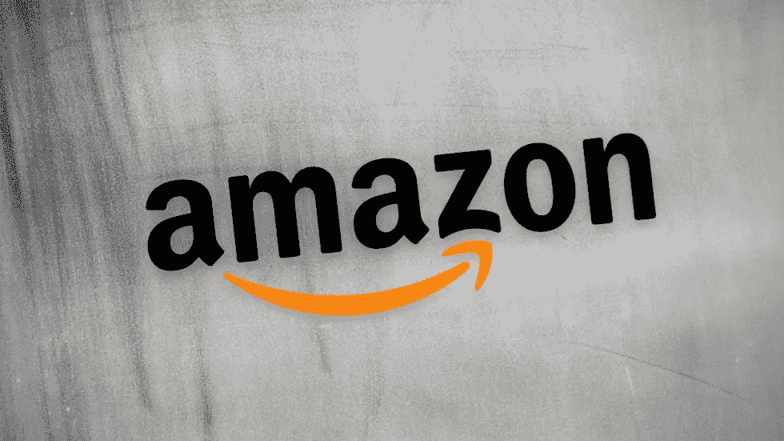
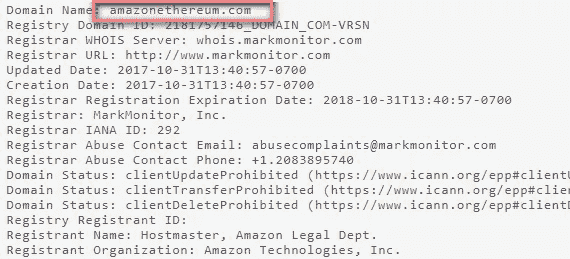

# 塑造未来:亚马逊购买与加密货币相关的域名

> 原文：<https://medium.com/hackernoon/shaping-its-future-amazon-purchases-domains-related-to-cryptocurrency-8f05448e296>

Amazon

2014 年年中，亚马逊申请并获得了一项专利，这表明这家电子商务和云计算巨头打算接受比特币作为其一项服务的支付方式。

自那以来，亚马逊一直在继续塑造其不断扩张的业务的未来，然而，它并没有巧妙地将加密货币考虑在内。

就在最近，根据 Whois 的数据，亚马逊子公司亚马逊技术公司(Amazon Technologies Inc .)在 10 月 31 日注册了[amazoncryptocurrencies.com](https://www.whois.com/whois/amazoncryptocurrencies.com)、[amazoncryptocurrency.com](https://www.whois.com/whois/amazoncryptocurrency.com)、[amazonethereum.com](https://www.whois.com/whois/amazonethereum.com)。

Whois Data

此外，据透露，亚马逊在 2013 年的某个时候购买了[amazonbitcoin.com](https://www.amazon.com/ref=as_li_ss_tl?_encoding=UTF8&camp=1789&creative=390957&linkCode=ur2&tag=amznipops-20&linkId=VETEOIMPO7O4WRWZ)，现在你可以直接进入亚马逊的电子商务网站。

目前，亚马逊购买这些域名的目的尚不清楚。

然而，最先报道亚马逊域名注册的 [DomainNameWire](https://domainnamewire.com) 表示，亚马逊可能只是在购买域名，这样就没有其他人可以从与他们品牌的模拟关联中获利。

或者，亚马逊也可能试图避免将加密货币与亚马逊币混淆，亚马逊币是 2013 年推出的虚拟货币产品，在 Kindle Fire 上作为游戏和应用程序的在线支付方式。

## 结论

感谢你花时间阅读这篇文章，我希望你真的喜欢它。如果您发现这很有价值，请不要忘记点击👏按钮！也可以随时分享我的内容！

在所有社交媒体平台上关注@ TheCoinEconomy，了解加密货币市场和区块链科技发展的最新动态。( [TradingView](https://www.tradingview.com/u/thecoineconomy/) ， [Twitter](https://twitter.com/thecoineconomy) ， [Instagram](https://www.instagram.com/thecoineconomy/) ，[脸书](https://www.facebook.com/Thecoineconomy-353316841786257/)，[stock wit](https://stocktwits.com/TheCoinEconomy)s)