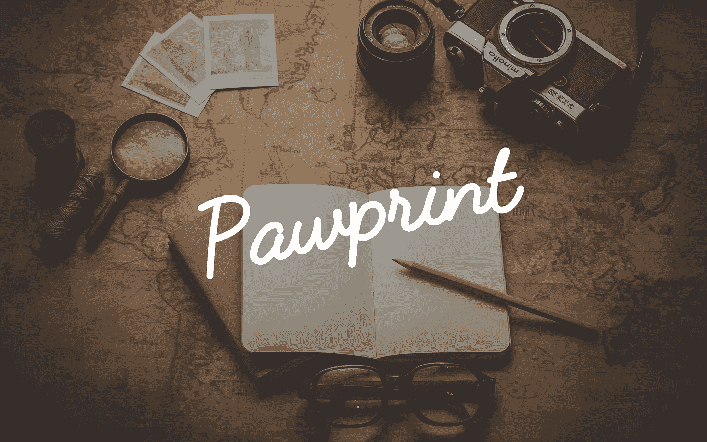

# 与 Pawprint 共享 HTTP 快照

> 原文：<https://medium.com/hackernoon/share-http-snapshots-with-pawprint-9d42a09e33ce>

## 去年我们发布了 Pawprint，这是一种在线分享 HTTP 请求/响应跟踪的简单方法。今天，我们非常兴奋地宣布一个改进的开放版本:一个全新的 UI，一个公共的 REST API，curl 集成和 iframe 支持…

