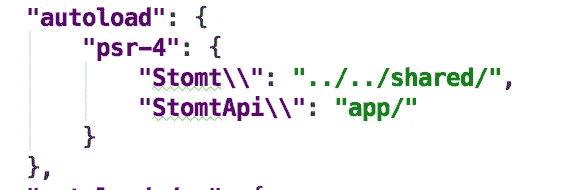
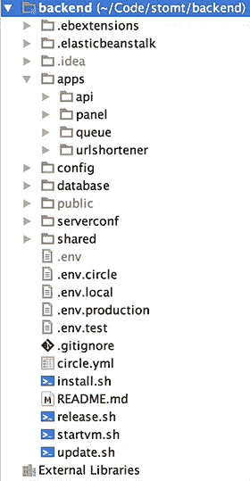
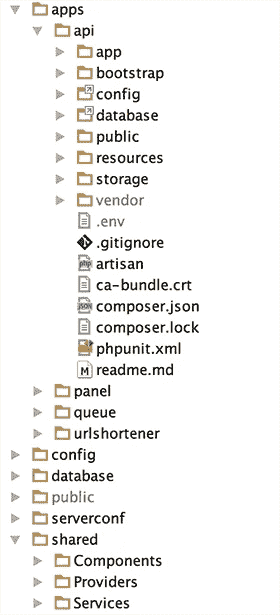
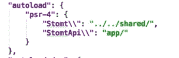

# 跨多个 Laravel/Lumen 微服务的共享组件

> 原文：<https://medium.com/hackernoon/shared-components-across-multiple-laravel-lumen-micro-services-44ebee128fa1>

在 [stomt](https://www.stomt.com) 我们收集建设性的反馈，归结为单一的论点，识别重复的，并将它们合并到运动中。

在这篇博文中，我们展示了一种将大型 Laravel 应用程序拆分成较小的微服务的方法，在我们的例子中是 Laravel & Lumen 应用程序，以及它带来的优点和缺陷。结果，我们将应用程序的速度提高了 30%以上，并且获得了更好的可维护性。当然，这些原则可以很容易地应用于其他框架。

## 为什么我们要在 Laravel 和 Lumen 实例之间共享组件？

我们的后端是一个巨大的 Laravel 应用程序。我们有一个服务器端呈现的管理界面，一个为我们的客户提供的 [REST API](https://rest.stomt.com) ，一个 OAuth 2.0 服务器，以及我们自己的 URL 缩短器(stomt.co)。此外，我们有一个队列后端，用于调整图像大小和其他不应该打扰我们的客户的密集型任务。我不想说 Laravel 很慢，但我们正在寻找更好的性能，当 Lumen 出现时，我们决定将我们的后端分成多个微服务。这将使它更容易在几个 Amazon Web 服务之间扩展，也允许给某些特性更好和更个性化的可维护性。

我们的 REST API 和管理面板中都需要很多函数。但是，尽管 REST API 结果有时是不够的，并且有时需要特殊的行为，但我们不能 100%依赖于只是从一个服务到另一个服务进行 API 调用。此时，我们需要能够从 Laravel(由我们的管理面板使用)以及 Lumen(我们的 REST API)调用命令/作业。

虽然我们仍然有一个“单一的”代码库，但我们有多个完全独立的后端应用程序。你可能想称它们为“微服务”(因为它太时髦了)。

## 拆分应用程序时的要求

当每个服务都有自己的名称空间时，如何确保组件，尤其是命令、配置和服务提供者可以跨不同的服务使用？

1.  开始使用组件(我们将在后面讨论)
2.  [利用事件订阅者类](https://laravel.com/docs/5.3/events#writing-event-subscribers)和[注册它们](https://laravel.com/docs/5.3/events#registering-event-subscribers)(因此每个组件应该有自己的事件订阅者类)
3.  确保在[命令(现在称为“作业”)](https://laravel.com/docs/5.3/queues#creating-jobs)或类似的东西中有所有的业务逻辑。将所有业务逻辑封装在组件中是很重要的。您的命令无法从外部访问数据。您在您的 HTTP 层[(在控制器中)](https://laravel.com/docs/5.3/controllers)中这样做，并传递数据。
4.  根据你的文件夹结构在任何地方使用名称空间。(推荐 PSR-4)
5.  确保所有的事情都有一个单一的责任。这样做得越多，共享组件的灵活性就越大。

## 拆分应用程序

软件随着时间而发展。你不会开始为你的后端开发一个[领域驱动的设计](https://en.wikipedia.org/wiki/Domain-driven_design)。你从一个原型开始，让你的架构进化或者重写。然后，你应该不断记住保持你的技术债务低。从一开始，我们至少决定基于。一种模块化结构，采用[坚实](https://en.wikipedia.org/wiki/SOLID_(object-oriented_design))原则的低层次方法。

## 让我们来看看组件是什么样子的:

斯托特组件

当路由和控制器停留在 HTTP 层时，组件包括所有的业务逻辑，这些逻辑被分离在[命令](https://laravel.com/docs/5.3/queues#creating-jobs)(同时在 Laravels 语言中称为“作业”)中，产生[事件](https://laravel.com/docs/5.3/events)及其处理程序以及实体/模型/存储库。组件文件夹也可以有子组件。组件之间也可以相互通信。

我们网络平台上的帖子被称为“定制”。假设客户可以有评论。您将创建一个名为“Comment”的子组件，并将其放入自定义组件文件夹中。注释文件夹将具有相同的子文件夹结构。

## 如何构建新的后端

基本思想: *apps* 文件夹包含多个 Laravel/Lumen 实例。

任何与部署相关的东西:ElasticBeanstalk 文件、配置、迁移和种子、环境——文件和脚本都基于后端的根目录。共享文件夹包含我们的共享组件和服务提供商。我们将很快对此进行深入研究。

例如， *Release.sh* 通过 [aglio](https://github.com/danielgtaylor/aglio) 自动创建一个新的 git 流版本，包括语义版本化和重新生成我们的 API 文档。

*Update.sh* 调用所有服务/应用中的依赖关系更新编写器命令。

现在让我们再深入一步。

仔细看看*API*-应用程序文件夹。我们总是引用词根*。env* -file，同时使用符号链接引用根文件夹中的*配置*和*数据库*文件夹。这样，由于每个配置文件允许多种配置，因此可以轻松地跨所有服务维护配置。这可能是 Laravel 特有的。您还可以看到我们在共享文件夹中存储了什么:组件、提供者和服务。稍后我们将探讨如何使服务提供者可共享。让我们先来看看如何通过正确使用[名称空间](http://www.php-fig.org/psr/psr-4/)和[编写器](https://getcomposer.org/)来使*共享*-文件夹可访问。

## 为共享组件自动加载多个名称空间

现在，我们该如何处理名称空间呢？Composer 使得定义 PSR-4 名称空间变得非常容易。虽然我们的每个应用程序都有自己的名称空间(例如 REST API 的 *StomtApi* )并且配置文件不需要它们，但是我们的 Components 文件夹有自己的名称空间 *Stomt。*

我们通过使用 composers 自动加载配置使这些文件可访问:

很简单，是吧？现在，我们总是部署完整的单片代码库，同时具有应用程序精简和更易维护的优势。需要时，可以将 Lumen 用于我们的 REST API 和成熟的 Laravel 框架，从而获得更高的性能。

## 如何在 Lumen 和 Laravel 应用程序之间共享服务提供者

如果想让服务提供者在 Laravel 和 Lumen 应用程序之间可访问，有一个小陷阱。它们都扩展了不同的*事件服务提供者*。

Lumen 延伸自:
*Laravel \ Lumen \ Providers \ EventServiceProvider*
而 Laravel 延伸自:
*Illuminate \ Foundation \ Support \ Providers \ EventServiceProvider*

但是如果你看看里面，两者都在做完全一样的事情。Laravel 使用事件 facade，而 Lumen 使用*app(‘events’)*来获取事件实例，因为在 Lumen 中，facade 是默认禁用的。为了确保服务提供商系统仍然工作，Lumen 使用了*应用程序(‘事件’)*。由于 Lumen 方式也适用于 Laravel，解决方案是显而易见的。我们将把 Lumens EventServiceProvider 复制到共享的*Providers*-文件夹中，并将该文件重命名为“ServiceProvider”。然后，我们让所有服务提供商扩展我们新的*服务提供商*。(您不能称它为“EventServiceProvider ”,因为您通常使用 *EventServiceProvider* 在您的应用程序中注册[事件订阅者](https://laravel.com/docs/5.3/events#registering-event-subscribers))

总的来说:共享服务提供商是否有意义完全取决于你的应用程序。对我们来说确实如此，因此我们想分享如何做到这一点。

## 未来的步骤

长期目标是让组件越来越与框架无关。关于 Laravel 特定立面的讨论:我们不再使用它们了。

我们接下来将把应用程序的哪些部分转换成自己的服务？授权和搜索。

请随时在这里或在 [HN](https://news.ycombinator.com/item?id=12719496) 上提出建议和问题！

*最初发表于* [*斯托特博客*](https://www.stomt.com/blog/shared-components-across-multiple-laravel-lumen-micro-services/) *。*

> [黑客中午](http://bit.ly/Hackernoon)是黑客如何开始他们的下午。我们是这个家庭的一员。我们现在[接受投稿](http://bit.ly/hackernoonsubmission)并乐意[讨论广告&赞助](mailto:partners@amipublications.com)机会。
> 
> 如果你喜欢这个故事，我们推荐你阅读我们的[最新科技故事](http://bit.ly/hackernoonlatestt)和[趋势科技故事](https://hackernoon.com/trending)。直到下一次，不要把世界的现实想当然！

