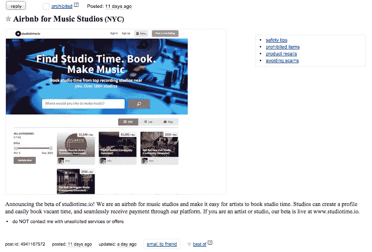
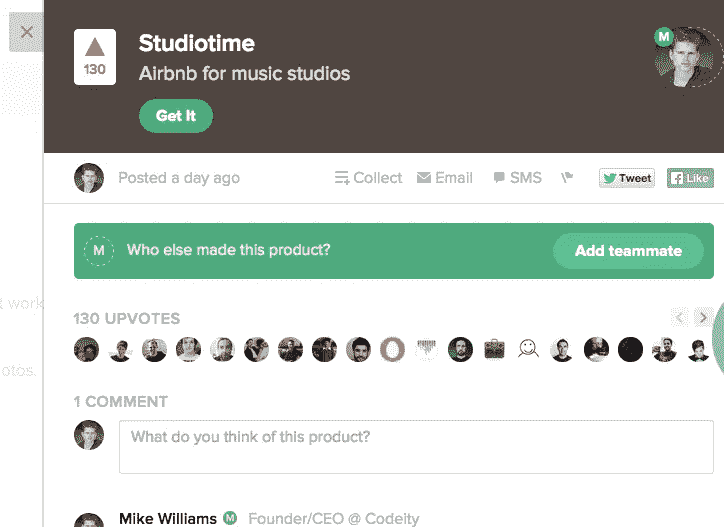
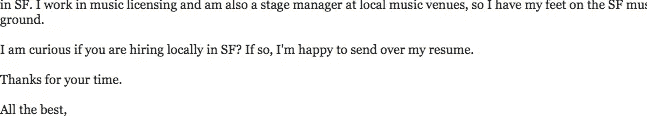
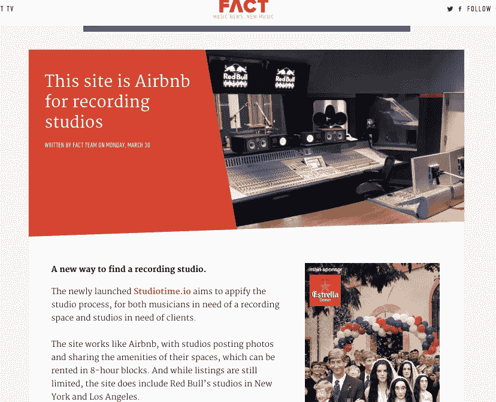

# Marketplace 在数小时内扩展到数千用户

> 原文：<https://medium.com/hackernoon/sharing-economy-scaled-to-hundreds-of-users-in-hours-70e4b8cc72eb>

工作室时间开始于一个晚上我的一个非常简单的想法，现在它是世界上最大的音乐工作室在线市场！

An example of one of the 1,200+ studios part of [Studiotime](http://www.studiotime.io).

一天晚上，我想到了[工作室](http://www.studiotime.io)的想法，我立即开始搜索[产品搜索](http://www.producthunt.com/posts/studiotime)和“ [Airbnb for x](http://www.producthunt.com/producthunt/collections/airbnb-for-x) 系列”，以为我会发现这个想法已经形成了。然而令我惊讶的是，我找不到任何类似的东西，这就是我致力于建立 Studiotime 的时刻。有时候，你有一个想法，你知道必须建立或别人会。这就是[工作室](https://hackernoon.com/tagged/studiotime)的情况。

# 我是如何开始的

作为一名连续创客和企业家，当我开始项目时，我试图有一个过程和工作流程，以便我可以优化时间和资源。在这种情况下，我几乎没有资源或帮助，因此我为创建 [Studiotime](http://www.studiotime.io) 设置了以下规则:

1.  在几分钟内想出一个朗朗上口的名字和标志。不要探索 MVP 的设计/品牌计划。
2.  尽可能使用现有的技术/代码，不要在技术方面重新发明共享经济市场(我使用了 [Sharetribe](http://bit.ly/2wD5cTG) )。
3.  从想法到功能原型不应超过一个晚上，这将是截止日期。一旦我投入到建设中，我就取消了晚餐计划。到晚上结束时，我会有一个工作室的 MVP，或者我会把这个想法放在一边，这样我就可以在工作周期间专注于我的日常工作。
4.  在 [Studiotime](http://www.studiotime.io) 的晚间建设结束后，第二天我会试图说服几个业内朋友注册，这样我就可以证实这个概念的必要性。

# 最初的 MVP 构建

在我在白板上写下这些规则之后(为了说明责任)，我还绘制了用户帐户创建的基本流程，列出工作室，请求和预订工作室，以及其他需要定义的流程，以便我可以在修改 [Sharetribe](http://bit.ly/2wD5cTG) 平台时使用它们作为指南。一旦我有了这些流，大部分时间都花在了配置列表和信息上，这些都是满足我对 Studiotime 的需求所需要的。 [Sharetribe](http://bit.ly/2wD5cTG) 从一开始就没有针对特定用例中的预订或租赁进行配置，但也允许销售商品和服务，因此我需要删除任何功能，并针对 Studiotime 的用例进行优化。

除了最初的设置、修改和测试，我忍住了进一步定制的冲动，并在那天晚上凌晨 1 点左右完成了最初的 MVP。

# 获得第一批用户并建立初始市场供应

第二天，我向音乐行业的几个朋友提到了 Studiotime，他们震惊地发现没有其他人已经建立了它(像我第一次那样)，并且不相信我是真正建立它的人，这进一步证实了它的实际需求。有几个也报名了，所以是第一批 Studiotime 用户！

由于这是一个周五，我正忙于运行 [Thinkbox](http://www.thinkbox.io) ，我只能挤出时间在我的社交网站上发布关于 Studiotime 的消息，继续与我之前联系过的几个朋友交谈，但实际上并没有在营销计划上花太多时间。那天晚上，我确实在 Craigslist 上发了一些帖子。我周六开始继续在 Craigslist 上发帖，找到在 Craigslist 上发帖的工作室，然后打电话或发短信给他们，试图让他们注册 Studiotime 作为第一个工作室(库存)。

Original posting on Craigslist for Studiotime. This generated a few users the Sunday before our Product Hunt launch.

除了这个 Craigslist 计划之外，我还使用了 [Twitter](http://www.twitter.com/studiotimeio) ，在那里我向行业影响者和媒体发布推文，让他们了解 [Studiotime](http://www.studiotime.io) ，试图在第二天启动产品搜索之前建立意识并引起一些兴趣，我希望我能真正引起他们的注意。结果并不令人印象深刻，但我现在在 Studiotime 上有了最初的几个工作室和用户，所以我可以在网站上至少有几个工作室。

此时，该网站仍在测试 URL 上，但我决定购买 [www.studiotime.io](http://www.studiotime.io.) 并在周日晚上提交给[产品搜索](http://www.producthunt.com/posts/studiotime)。由于这不是我从零开始构建的，而是使用了 [Sharetribe](http://bit.ly/2wD5cTG) 和很少甚至没有编码，我并不急于分享，我已经将它提交给 Product Hunt，其他制造商通常会在那里提交定制版本。那天晚上，我在产品搜索发布会的兴奋中入睡。

# 产品搜寻发布会

周一早上开始检查[产品搜索](http://www.producthunt.com/posts/studiotime)，令我惊讶的是，有一些支持票和一点初始牵引力！到午餐时间，我开始收到数百名新用户的电子邮件通知，甚至有人在欧洲要求将他们的工作室添加到网站上。因为我只考虑过把洛杉矶和纽约作为开始的城市，所以我为当时没有预料到的城市的工作室建立了一个等候名单。

We received 130 upvotes on Product Hunt!

快进到 [Product Hunt](http://www.producthunt.com/posts/studiotime) 发布当天的下午 6 点，Studiotime 已经有超过 1k 的用户了！我们有工作室签约，有一个不断增长的艺术家社区，甚至有一个在我们没有服务的市场上的工作室的等候名单。我们甚至有人给我发邮件，要求成为 Studiotime 的形象大使，还问我们(我)是否在招人！

Just one of the emails I received asking if we were hiring from music industry professionals.

# 当媒体报道你的时候

到了周一晚上，我在想，这一周我的副业有了一个很好的开始，它可能会在未来产生进一步的兴趣。让我惊讶的是(再次！)[事实杂志](http://www.factmag.com/2015/03/30/this-site-is-airbnb-for-recording-studios/)找到了我们，写了一篇关于 Studiotime 的文章，为网站带来了巨大的流量。

我知道，仅 Product Hunt 上的 130 次投票并不属于第一批 1000 名用户，这篇文章只是一系列媒体报道、博客和音乐行业其他人注意到 Studiotime 的开始。周末的推广努力，产品搜寻意识，以及口口相传都让我们成为音乐行业的焦点。BBC、[hypebest、](https://hypebeast.com/2015/4/theres-an-airbnb-for-recording-studios-now)、Forbes 以及 [50 多家媒体和博客跟随](https://listings.studiotime.io/en/infos/about)报道了我们。

在几乎没有资源的情况下，但利用流程、策略和速度，我能够在一个晚上将 Studiotime 从一个想法变成 MVP，然后在几个小时内产生成千上万的用户和初始牵引力。

# 2017 年 10 月 31 日更新！观看这段 12 分钟的视频，我将分享更多细节:

## 在[推特](https://twitter.com/Yoroomie)上关注我，了解我分享的关于所有创业公司(通常是市场)的最新见解。你也可以和我一起了解更多关于&工作的，或者在这里看到一些我分享的[热门资源。](https://www.iammikewilliams.com/#resources)