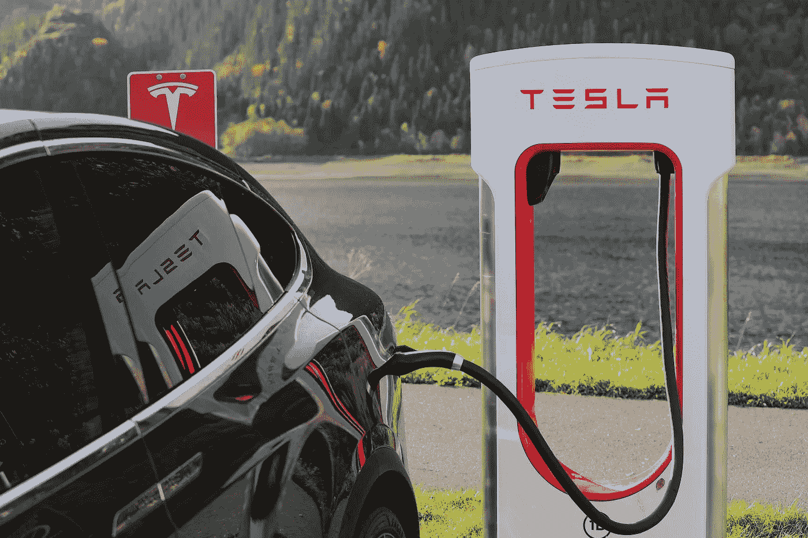
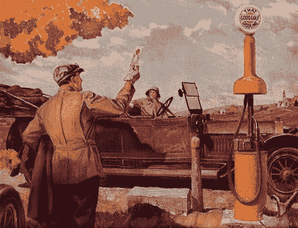
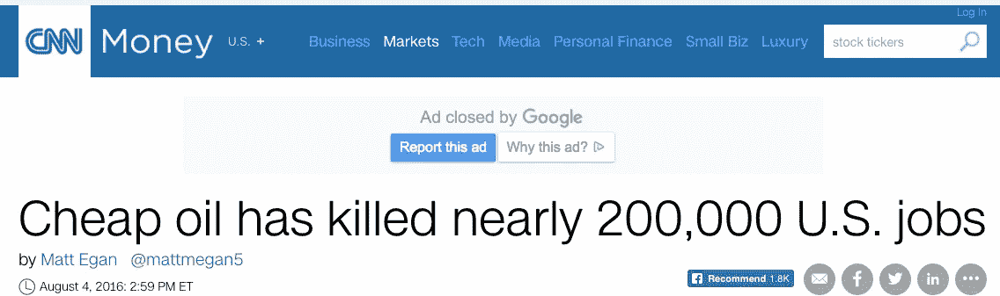
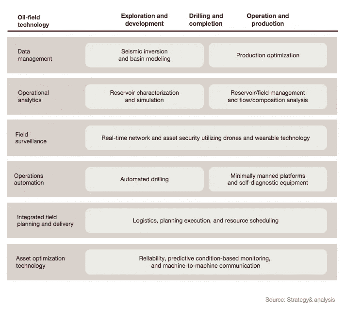
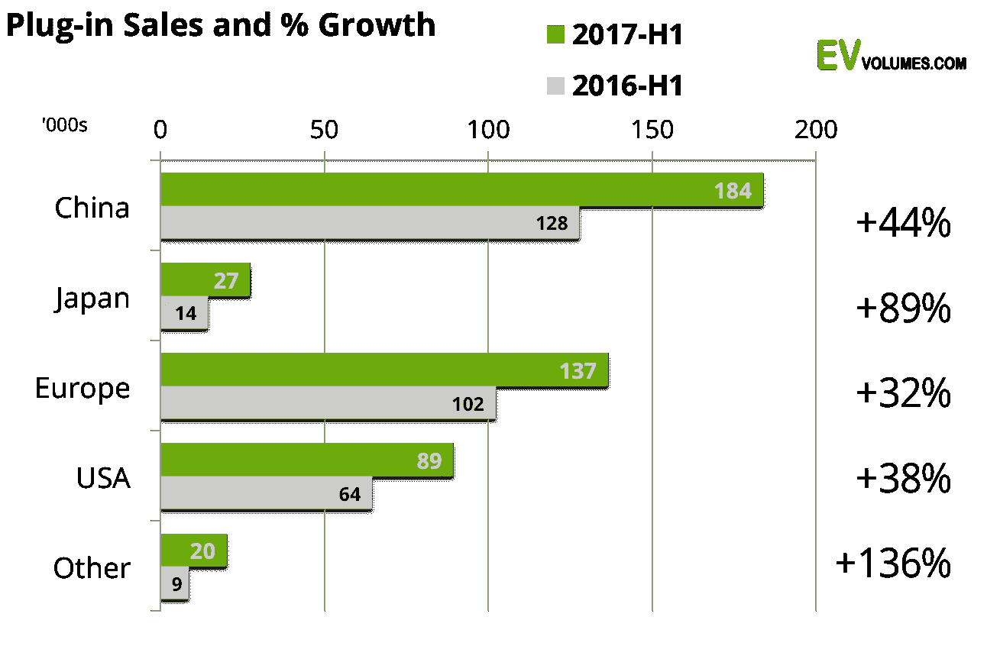
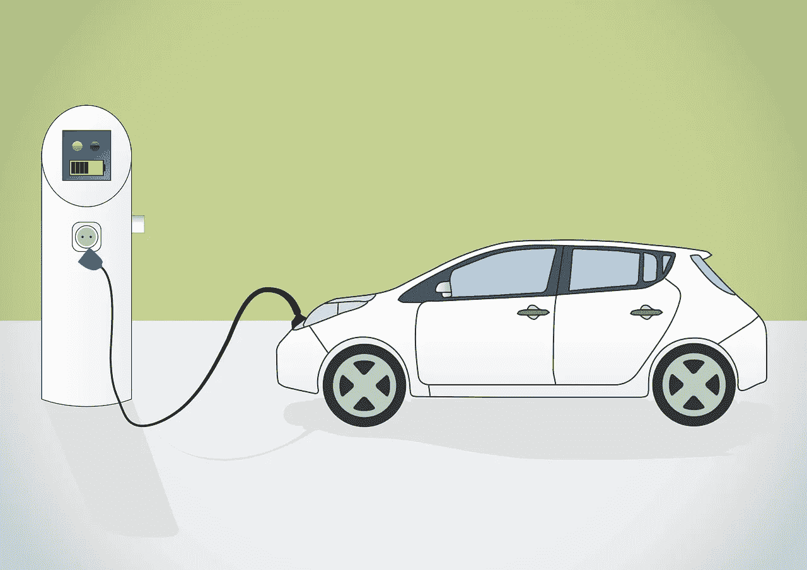

# 壳牌收购了一家电动汽车充电初创公司。这是一件大事。

> 原文：<https://medium.com/hackernoon/shell-oil-bought-the-biggest-electric-vehicle-charging-startup-thats-a-big-deal-800c3b218c15>

## **第一加油站**

1885 年，西尔凡纳斯·弗里洛夫·布瑟发明了煤油泵，并把它卖给了印第安纳州韦恩堡的一家杂货店。18 年后[海湾石油公司在圣路易斯](https://aoghs.org/transportation/first-gas-pump-and-service-stations/)开设了“好海湾汽油”加油站。两年后，第一家专门建造的免下车加油站在宾夕法尼亚州的匹兹堡开张了。

虽然最初版本的泵分配煤油，但在 1905 年，**看到汽车的趋势和采用，布瑟连接了一根软管，用于将汽油直接分配到车内**。这种对耗油量大的汽车的燃料需求为布瑟公司带来了巨大的增长(也为布瑟带来了财富)。

https-//aoghs.org/wp-content/uploads/2014/03/Penn-Oil-pump-AOGHS

## 石油行业的持续相关性(以及复苏)

2014—2016 年价格暴跌后，我们都看到了成千上万的人失去了石油和天然气工作。然后，就在复苏开始的时候，我们都不再注意了。

就像布瑟意识到钱是在汽油而不是煤油中一样，石油公司正在接受这样的事实:随着趋势从汽油转向其他行业，他们的传统商业模式可能会衰落。[随着人们疯狂预测每桶石油的价格将跌至 10 美元](http://www.marketwatch.com/story/oil-headed-to-10-china-may-be-in-the-drivers-seat-2017-10-16))这些公司必须迅速采取措施，并采取屡试不爽的方法来避免中断:

1.  **通过数字化一切来采用新技术**:石油行业还没有招回去年这个时候价格暴跌时流失的员工。这个行业不需要这样做，因为我们现在都在大声疾呼；物联网。 [**过去 20 年来，工业物联网(IIoT)一直是古老的&天然气行业的主要竞争对手。这就是石油行业如何管理离岸 60 英里的石油钻井平台**](https://www.strategyand.pwc.com/media/file/Not-your-fathers-oil-and-gas-business.pdf) 以及控制全球偏远地区的重型资产。这就是沿着数千英里管道追踪爆炸的方法。一些数字化用例(如下图)都指向一件事，在快速变化的行业中，需要更少的员工来提高利润率。
2.  **在风险变得明显之前收购存在风险的公司**:很少有什么事情像加油站一样无处不在，像你的油表告诉你是时候给汽车加油了一样突出。美国目前有~[12.2 万个加油站](http://www.statisticbrain.com/gas-station-statistics/)。随着越来越多的人转向购买电动汽车，人们预计美国电动汽车充电站将会增长。[美国目前约有 2 万辆电动汽车，但预计这将呈指数级增长](https://electrek.co/2017/06/19/us-electric-vehicle-charging-stations/)。考虑到汽车行业(最后一个电气化的行业)正在进行的电气化**，荷兰皇家壳牌公司([世界第六大石油公司](http://www.worldatlas.com/articles/biggest-oil-companies-in-the-world.html))刚刚收购了 [Newmotion](https://www.reuters.com/article/us-newmotion-m-a-shell/shell-buys-newmotion-charging-network-in-first-electric-vehicle-deal-idUSKBN1CH1QV?utm_source=Benedict%27s+newsletter&utm_campaign=869e427e4d-Benedict%27s+Newsletter&utm_medium=email&utm_term=0_4999ca107f-869e427e4d-70311893) ，一家拥有 3 万个充电站的充电公司。这比美国所有的充电站都多。这不应该让任何人感到惊讶，因为我们都认为我们很快就不需要石油来驱动我们的汽车了？未来看起来很像过去，因为我们将像过去一样，进入一个壳牌加油站，为我们的电动汽车充电。**

## **石油行业是颠覆者吗？**

随着我们越来越适应油价的周期性下跌，随着电动汽车越来越成为一种身份象征(谢谢，[特斯拉](https://hackernoon.com/tagged/tesla)！)，石油公司正在其他市场寻找新的商业模式。最简单的选择是关注那些颠覆性地替代旧模式的市场。在应对这种破坏的过程中，石油行业无意中通过其最值得信赖的资产侵犯了模拟行业——电力公司——的商业模式；**加油站**。这是不可避免的[，因为我们的车辆变得电气化，我们汽车里的电池也作为我们在家里用电的储能单元](https://hackernoon.com/teslas-astronomical-stock-price-it-has-little-to-do-with-cars-c828187f9084)。

我认为石油公司将赢得这场与电力公司的斗争。石油公司将赢得这场战斗，因为他们已经与客户建立了关系。**传统公用事业公司不具备的关系(并且愿意为此而死)；我们开车和给汽车加油的频率是任何电力公司都无法比拟的。**

根据 [EVvolumes](http://www.ev-volumes.com/) 的数据，如下图所示，“自 2013 年以来，*插电式汽车销量增加了两倍多，继续保持去年 42 %的增长率，这意味着 2030 年售出的汽车中，十分之八将是插电式汽车”。*壳牌公司深知这一趋势，并与业内其他公司一起，非常关注这一采用周期。尤其是像 RMI 这样的实体认为汽车的增长将会落后于充电站的增长。

每个主要街道拐角处的充电站也将受益于燃料价格的上涨，这是加油站的一种抑制效应。这种效应解释了为什么我们都多开几个街区，只是为了在油价上省几分钱，我们每次经过加油站都会看到油价。这种效果为我们的电力体验增加了一个非常需要的参与层。

## 汽车会停下来加油…

上周末，我和儿子一起用另一种石油副产品——蜡笔画画。考虑到科技发展的速度有多快，他将成长在一个可能并非如此的世界里。他自己的孩子(如果他选择有孩子的话)很可能会在数字显示器上画画，这些显示器会将艺术作品存储在某个云服务器上。

> **他的无人驾驶汽车将从他车顶的可再生能源或从壳牌**旗下的*good ol’电动充电站*购买的能源充电。

他也会知道电费是多少。

就像移动电话公司吸引了我们的注意力，并在这个过程中扼杀了固定电话一样，石油公司可能会通过吸引我们的注意力来扼杀电力公司……而且**他们会认识到，你最好的机会来自于驾驭流行趋势的浪潮**。

就像布瑟用煤油和汽油意识到的那样…

*请点赞，分享，让我知道你的想法。注册我的* [*博学月刊*](https://www.getrevue.co/profile/seyifabo?utm_campaign=Issue&utm_content=forwarded&utm_medium=email&utm_source=Seyi+Fabode)*——如果你已经读到这里，我打赌你会爱上它。* [***你可以在亚马逊上买我的书***](https://www.amazon.com/dp/B072875DFJ) *。*