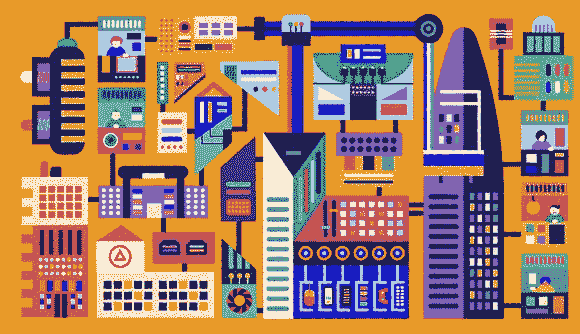
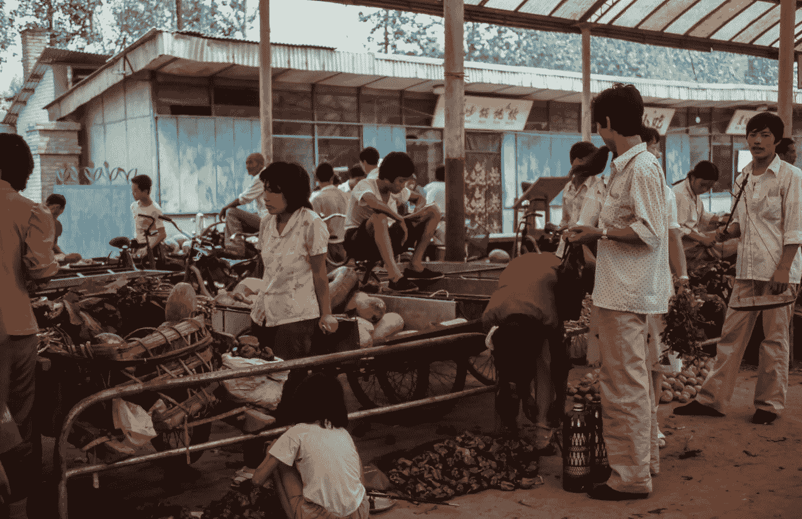
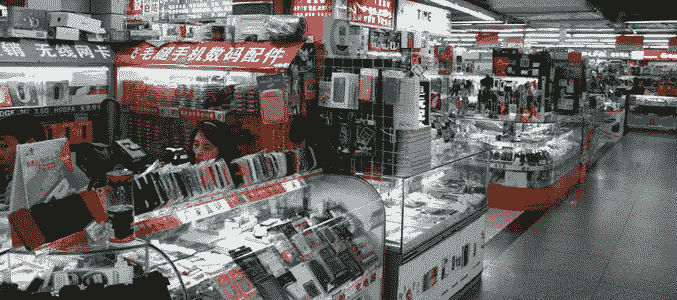
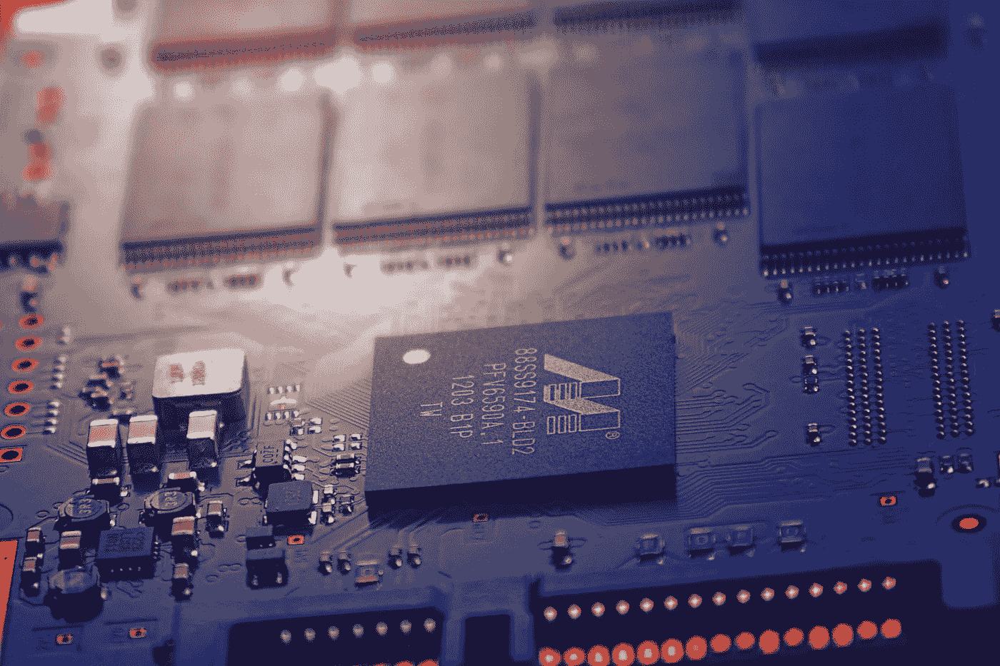
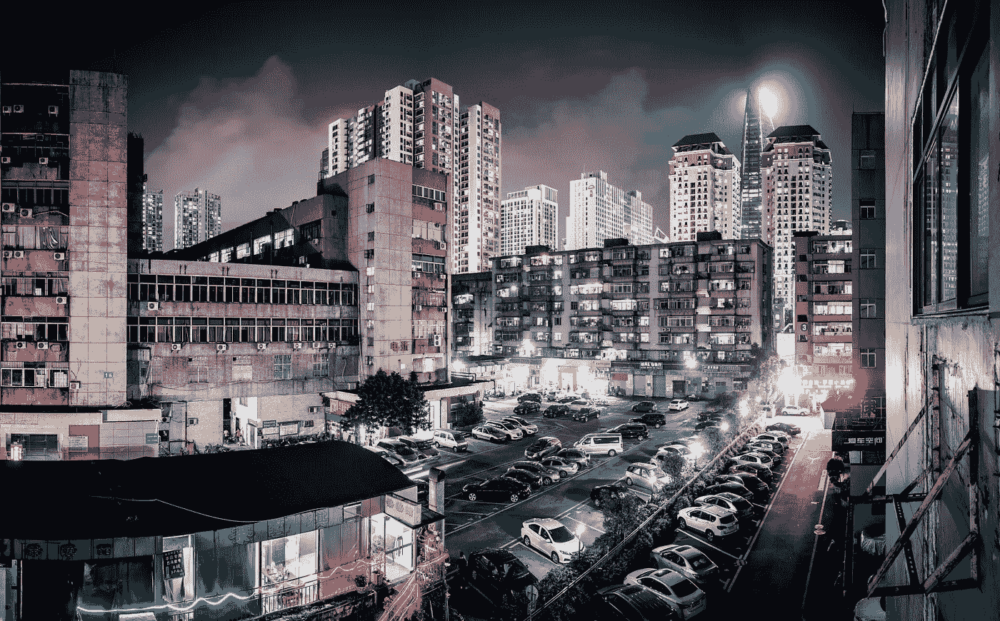

# 中国深圳:科技梦想成真的地方

> 原文：<https://medium.com/hackernoon/shenzhen-china-where-tech-dreams-come-true-718cf13a6913>

Credit: [http://www.eurogamer.net/articles/2017-10-08-decoding-shenzhen-the-chinese-city-that-makes-the-worlds-tech](http://www.eurogamer.net/articles/2017-10-08-decoding-shenzhen-the-chinese-city-that-makes-the-worlds-tech)

被称为“硬件硅谷”的深圳已经从一个小渔村变成了一个科技和经济都蓬勃发展的大都市。如今，以深圳为家的科技巨头包括腾讯、华为、中兴和 BGI。深圳位于中国南部，紧邻香港，其快速发展的电子文化正在成为全球创新的领导者。

# 从赤贫到巨富

今天，全世界的企业家、程序员和工程师都对深圳提供的大量资源垂涎三尺。然而，纽约科技文化的吸引力只是最近才出现的。历史上，深圳只是一个小渔村，30 万人口长期生活在极度贫困之中。今天，人口已经攀升到大约 1200 万。

20 世纪 80 年代之前，中国人口面临极端贫困，几乎没有创业雄心或自由的回旋余地。由于工业停滞不前，许多人只能在地里干活，靠食品券生活。为了带领中国走出这种糟糕的经济状态，北京的领导人决定通过所谓的中国四个经济特区进行经济改革:深圳、汕头、珠海、广东省和厦门，每一个经济特区都毗邻一个经济发达的城市。

这些经济区的目的是创造就业机会和刺激经济。中国总理邓小平在中国推行经济改革，导致了我们今天看到的深圳。这座城市发展背后的历史使命是引进和吸收来自世界各地的知识、思想和技术。快速的创新吸引了世界各地想要更多自由的人:企业家、创客(深圳对发明家的称呼)、工程师、程序员，应有尽有。因此，深圳的发展速度远远超出了任何深圳开发商和规划者的预期。现在，它是全球科技的领导者之一。

# 极度活跃的创业场景:科技天堂

深圳的科技场景不同于世界上任何其他地方。没时间磨蹭了。这座城市的每一个制造商都决心以最便宜、最快的方式生产出最好的产品或原型。在世界其他地方，一个产品从构思到上市可能需要八个月到一年的时间，而在深圳，同样的过程只需要大约三个月。现在这很快…

> 但是到底是什么让深圳与世界上其他科技中心区别开来呢？

位于深圳福田区的华强北电子市场。这里有一百多家商店和供应商为其他发明者和消费者销售、修理和改装电子元件和设备。这是每个技术人员的天堂。忘记排队等待几个小时或不耐烦地坐着等待一批硬件供应品到达你的家门口。在这里，你能想象到的每一件硬件都由你支配。通过从市场上挑选零部件并对其进行调整，几天之内就可以制造出新的改良型手机；通过搜索市场上的大量资源，可以找到原型的特定硬件并进行测试；破裂的手机屏幕可以在几分钟内修复。因此，华强北市场现在是制造商、工程师和消费者灵感和发现的源泉。

Credit: [http://www.wholesalesz.com/2017/08/13/huaqiangbei-electronics-gadgets-fashion/](http://www.wholesalesz.com/2017/08/13/huaqiangbei-electronics-gadgets-fashion/)

# 快速创新的文化

然而，让深圳与众不同的不仅仅是任何人都能轻易获得的技术供应。这是一个社区，一个科技产业运行的生态系统。

深圳是工程师的天堂:看似无限的电子零件资源可供初创公司和发明家以便宜的价格轻松批量购买。因此，这些制造商可以以非常快的速度投入生产，而在美国、欧洲或世界其他任何地方制造完全相同的原型可能需要几个月的时间。

熟练的电气工程师遍布整个城市:在街道上，在创业公司，在大公司，在学校。深圳的文化鼓励年轻一代去发明，去创新，最重要的是去创造。这些才华横溢的工程师中，许多都是深圳学徒计划的产物:学生从导师那里学习必要的技能，最终成为广受欢迎的华强北市场的业主或商贩。

作为创新和发明的中心，华强北市场每天都有新发明诞生。制造商看一看目前市场上的产品，并找到改进的方法。他们经常通过组合他们找到的各种零件和产品来创建自己的原型，以创建一项全新的技术。这种渴望创新的心态是深圳的驱动力。这是深圳区别于世界其他地方的地方，在世界其他地方，创新被知识产权的法律战所压倒。

# 这叫“分享”还是“窃取”创意？

在深圳，人们坚信自由创造、探索和发明的原则。深圳的制造商依靠开源硬件和软件生存，人们在网上分享如何开发他们在市场上发布的发明的信息。该信息随后被社区的其他成员用来修改和改进。整个目的是每个人都可以访问信息，每个人和任何人都可以修改它。这就是所谓的“创客运动”

现在，把这个想法丢到世界上任何一个科技中心:他们对这个理念的理解不会与深圳的一致。这些城市和科技社区面临的主要问题是:我们如何保护创意的知识产权，同时从这些创意中获利？

虽然深圳并不区分那些纯粹出于好奇和兴趣而发明产品的人和那些将产品作为业务来创造的人，但世界其他地方是这样的。任何其他城市的思维模式都是创造一个没人想到的想法，获得专利来保护他们的想法，并起诉任何试图以任何方式复制他们的公司或工程师，并以他们的产品主导市场。因此，通过专利系统和版权，雇佣律师来保护他们的知识产权，花费了大量的金钱。但是，最后往往连产品都做不出来。仅仅是一个想法被创造出来并受到法律保护。许多人保护自己的设计和想法，不对外公开，而不是分享想法来创造创新文化。这就造成了垄断。现在只有一家公司拥有在全球销售和制造特定技术的合法权利。但这究竟如何刺激创新呢？这如何鼓励现代技术的发展？

在深圳，没人有时间钻法律的空子。带着开源的心态，城市的创造者们在发明时期望他们的项目是开源的，因此可以被社区的其他人复制和修改——正如他们所说的“越多越好”。他们相信产品的改进和创新，而不是对他们的创造的法律依附。开源哲学不支持也不相信垄断；它相信建立网络和与其他发明者合作。因此，深圳强大的协作和分享思想的网络创造了行业独特的思想和创新生态系统。

## 山寨——模仿商标品牌或电子产品

Shanzhai are knock-off consumer goods, which look very similar to those created by trademark brands, but are produced at a lower price and quality for the public. The term “Shanzhai” is written as 山寨, which literally translates to “mountain village”, where so-called outlaws were far from any acting authority or government control. These Shanzhai products began when workers quit their jobs at manufacturing factories and created and sold a very similar product faster and cheaper on the streets or markets of Shenzhen. As a result, it has led to the empowerment of the lower classes to take part in the development of technology’s latest advancements.

深圳社区不会把修改产品的人称为“山寨”，因为改进技术是驱动这座城市及其人民的哲学。他们期望创造和创新的速度比那些拥有相似或相同产品的人更快:这是一个不断创新的循环。这不是窃取想法，这是分享想法。那么他们如何回答这个问题:你如何阻止人们抄袭你？他们说，“让你的产品更好。”

# 接下来呢？

深圳快速增长的科技产业和推动该产业发展的人才是这座城市走在时代前列的原因，它比世界其他地方领先大约一年。最有可能的是，在未来几年，“中国制造”一词将成为深圳科技实力的证明。但是，以深圳的发展速度，世界其他地方将如何跟上它呢？

# 深圳创业指南

以下是一份创业加速器指南，面向希望加入深圳不断发展的创业领域的技术人员:

 [## 首页-深圳谷创投

### 一个硬件加速器，为初创企业提供独家工程和硬件测试设备

svv.io](http://svv.io)  [## 世界上第一个也是最大的硬件加速器——HAX

### 在世界上第一个和最多产的硬件的帮助下，以超快的速度构建、推出和运送您的产品…

hax.co](https://hax.co)